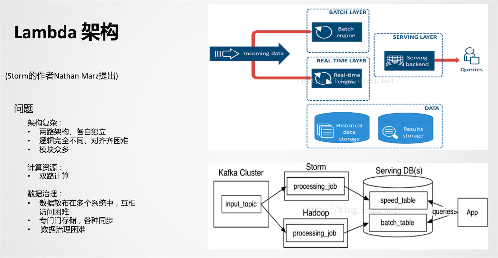
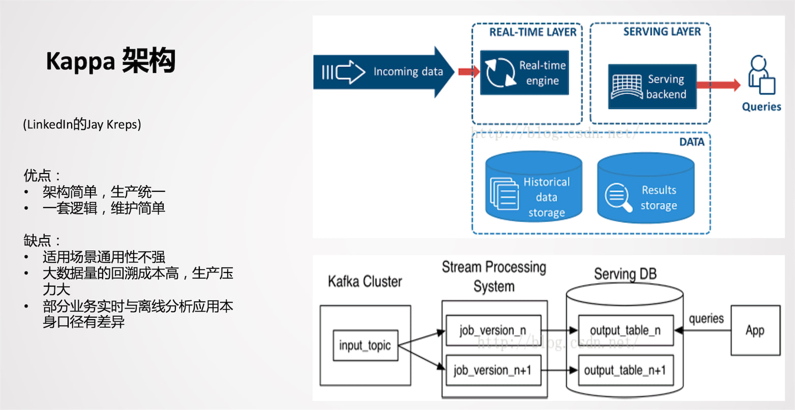
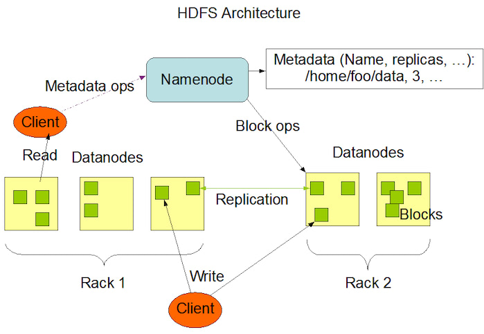
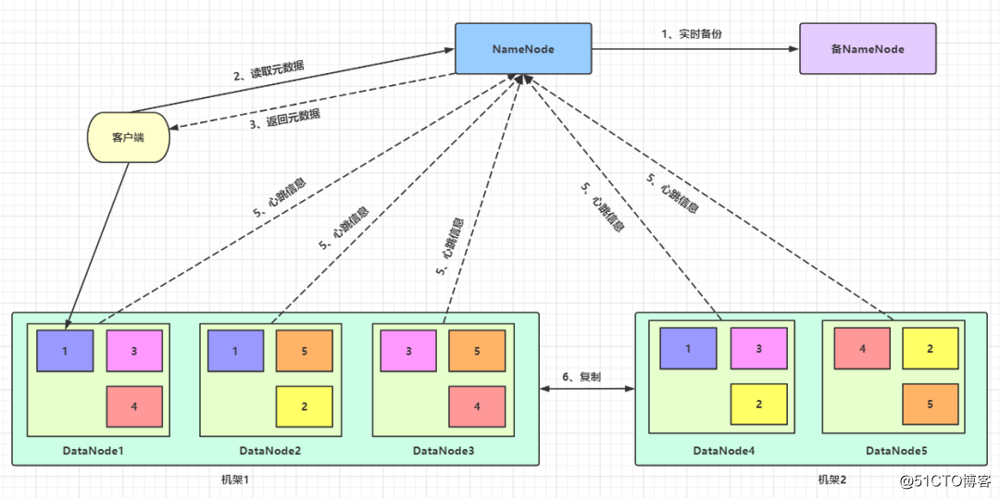
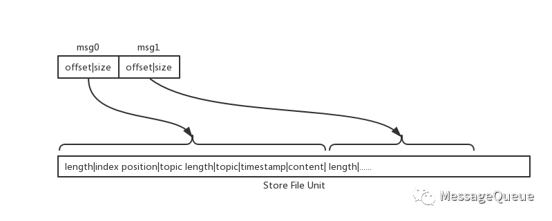
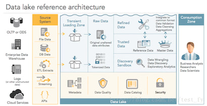
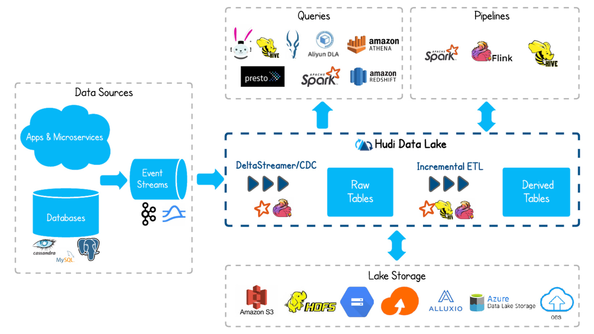
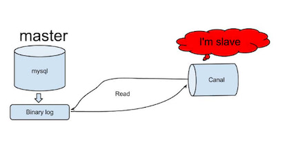
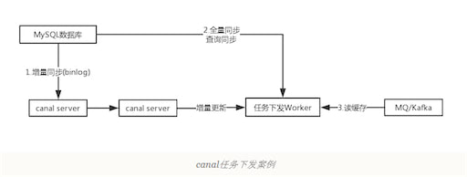
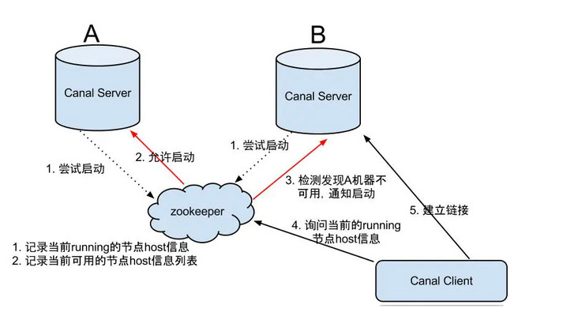

资料

https://blog.csdn.net/qq_26803795/category_9271568.html

[美团外卖实时数仓建设实践](https://tech.meituan.com/2021/08/26/data-warehouse-in-meituan-waimai.html)

## 编程语言

### Scala

### Python

## 理论基础

### 基本概念

#### 什么是“大数据”什么是“小数据”

### 常见算法

#### 如何实现一个布隆过滤器

#### LSM-Tree

### 常见计算架构

#### Lambda



Lambda是比较经典的一款架构，以前实时的场景不是很多，以离线为主，当附加了实时场景后，由于离线和实时的时效性不同，导致技术生态是不一样的。而Lambda架构相当于附加了一条实时生产链路，在应用层面进行一个整合，双路生产，各自独立。在业务应用中，顺理成章成为了一种被采用的方式。

双路生产会存在一些问题，比如加工逻辑Double，开发运维也会Double，资源同样会变成两个资源链路。因为存在以上问题，所以又演进了一个Kappa架构。

#### Kappa



Kappa从架构设计来讲，比较简单，生产统一，一套逻辑同时生产离线和实时。但是在实际应用场景有比较大的局限性，在业内直接用Kappa架构生产落地的案例不多见，且场景比较单一。这些问题在美团外卖这边同样会遇到，我们也会有自己的一些思考，将会在后面的章节进行阐述。

### 编程模型

#### MapReduce

### 存储架构

#### OLAP数据库为什么要列式存储

#### 说一说HDFS

### 运筹学

## 人工智能

### 未归类

#### 贝叶斯公式是什么

#### 对特征的细粒度划分是怎么做的，有什么依据吗；

#### LSTM 讲一下，为什么比 RNN 效果更好

#### 对特征的细粒度划分是怎么做的，有什么依据吗

#### 特征对于结果的贡献怎么衡量

#### LR 和 SVM 对比

#### 数据预处理流程，建模过程

#### RF 随机森林随机性体现在哪里

#### 假设检验原理是啥，怎么做假设

#### XGBoost、GBDT、RF异同点

### OpenCV

### Web侧AI

### 推荐引擎

### 十大经典算法

#### KNN近邻

#### 线性回归

#### 逻辑回归

#### 凸优化

#### 朴素贝叶斯

#### 支持向量机

#### 决策树

#### 随机森林

#### GBDT

#### XGBoost

#### 神经网络

#### K-Means

#### 层次聚类

#### 主题模型

#### Word2Vec

#### PCA

## 分布式存储系统

### HDFS

#### HDFS技术架构

**HDFS** （**Hadoop Distributed File System**）是 Hadoop 下的分布式文件系统，具有高容错、高吞吐量等特性，可以部署在低成本的硬件上。HDFS 遵循主/从架构，由单个 NameNode(NN) 和多个 DataNode(DN) 组成：

- **客户端**：
- **NameNode（主节点）** : 负责执行有关 `文件系统命名空间` 的操作，例如打开，关闭、重命名文件和目录等。它同时还负责集群元数据的存储，记录着文件中各个数据块的位置信息。
- **DataNode（数据节点）**：负责提供来自文件系统客户端的读写请求，执行块的创建，删除等操作。



#### HDFS写数据原理


#### NameNode（NN）高可用实现原理

- Zookeeper 分布式协调

  > HDFS中NameNode等的HA是基于ZooKeeper实现的。它应用了ZooKeeper集群的如下功能或特性：
  >
  > 1. 只要半数以上节点还存活，就继续能对外提供服务；
  > 2. ZooKeeper通过Paxos算法提供了leader选举功能，其它follower learn leader；
  > 3. ZooKeeper提供了watcher机制，只要ZooKeeper上znode增减，或内容发生变化，或其子znode有增减，客户端都可以通过注册的watcher获得通知；
  > 4. ZooKeeper提供了持久化节点和临时节点，尤其是临时节点EPHEMERAL，其在ZooKeeper客户端连接断掉后，会自动删除。
  >
  > 正是基于ZooKeeper的上述特性，HDFS的NameNode实现了HA，NameNode的状态大致可分为Active和Standby两种，NameNode竞争在ZooKeeper指定路径上注册临时节点，将自己的host、port、nameserviceId、namenodeId等数据写入节点，哪个NameNode争先写入成功，哪个就成为Active NameNode。然后，会有后台工作线程周期性检查NameNode状态，并在一定条件下（比如Active NameNode节点发生故障等）发生竞选，由NameNode再去竞争，实现故障转移和状态切换。
  >
  > 
  >

- 隔离（Fencing）- 预防脑裂

  > 预防脑裂的常见方案就是 Fencing（隔离），思路是把旧的 Active NameNode 隔离起来，使它不能对外提供服务，保证集群在任何时候都只有一个 Active NameNode。
  >
  > HDFS 提供了 3 个级别的隔离（Fencing）：
  >
  > 1）共享存储隔离：同一时间只允许一个 NameNode 向 JournalNode 写入 EditLog 数据。
  >
  > 2）客户端隔离：同一时间只允许一个 NameNode 响应客户端的请求。
  >
  > 3）DataNode 隔离：同一时间只允许一个 NameNode 向 DataNode 下发命名空间相关的命令，例如删除、复制数据块等。

- Qurom Journal Manager 共享存储

  > 在 HDFS 的 HA 架构中还有一个非常重要的部分：Active NameNode 和 Standby NameNode 之间如何共享 EditLog 文件。
  >
  > 思路是：**Active NameNode 将日志文件写到共享存储上，Standby NameNode 实时地从共享存储读取 EditLog 文件，然后合并到 Standby NameNode 的命名空间中。一旦 Active NameNode 发生错误，Standby NameNode 就可以立即切换到 Active 状态。**
  >
  > Hadoop 2.0.3 版本开始，社区接收了由 Cloudera 公司提供基于 Qurom Journal Manager（QJM）共享存储的高可用方案，来解决 HA 架构中元数据的共享存储问题：
  >
  > http://hadoop.apache.org/docs/r2.4.1/hadoop-project-dist/hadoop-hdfs/HDFSHighAvailabilityWithQJM.html
  >
  > > QJM 基于 Paxos 算法实现，基本原理是：HDFS 集群中有 2n+1 台 JournalNode，EditLog 保存在 JN 的本地磁盘上；
  > >
  > > 每个 JournalNode 都允许 NmaeNode 通过它的 RPC 接口读写 EditLog 文件；
  > >
  > > 当 NmaeNode 需要写 EditLog 文件时，它会通过 QJM 向集群中所有的 JournalNode 并行发送写 EditLog 文件的请求；
  > >
  > > 每次写数据操作只要有超过一半（>=n+1）的 JournalNode 返回成功，就认为这次写操作成功了。
  >
  > 由此我们可以知道，这个 QJM 必须也是高可用的，否则 HDFS 的高可用就无法保障。
  >
  > QJM 实现 HA 的主要好处：
  >
  > > - 不存在单点故障问题；
  > > - 不需要配置额外的共享存储，降低了复杂度和维护成本；
  > > - 不需要单独配置 Fencing 实现（见文末#5.1节），因为 QJM 本身就内置了 Fencing 的功能；
  > > - 系统的鲁棒性程度是可配置的（ QJM 基于 Paxos 算法，配置 2n+1 台 JournalNode，最多能容忍 n 台机器同时挂掉）；
  > > - QJM 中存储日志的 JournalNode 不会因为其中一台的延迟而影响整体的延迟，而且也不会因为 JournalNode 的数量增多而影响性能（因为 NameNode 向 JournalNode 发送日志是并行的）。
  >
  > 关于 QJM 的具体工作原理，后面有机会了专门讲讲。

#### HDFS如何实现容错

文件系统的容错可以通过 NameNode 高可用、SecondaryNameNode 机制、数据块副本机制和心跳机制来实现。

注意：当以本地模式或者伪集群模式部署 Hadoop 时，会存在 SeconddayNameNode；当以集群模式部署 Hadoop 时，如果配置了 NameNode 的 HA 机制，则不会存在 SecondaryNameNode，此时会存在备 NameNode。

在这里重点说下集群模式下 HDFS 的容错，有关 SecondaryNameNode 机制可参见上一篇文章《前方高能 | HDFS 的架构，你吃透了吗？》的说明：

HDFS 的容错机制如图所示：



具体的流程如下：

> 1. 备 NameNode 实时备份 主 NameNode 上的元数据信息，一旦主 NameNode 发生故障不可用，则备 NameNode 迅速接管主 NameNode 的工作。
>
> 2. 客户端向 NameNode 读取元数据信息。
>
> 3. NameNode 向客户端返回元数据信息。
>
> 4. 客户端向 DataNode 读取/写入 数据，此时会分为读取数据和写入数据两种情况。
>
>    > 读取数据：HDFS 会检测文件块的完整性，确认文件块的检验和是否一致，如果不一致，则从其他的 DataNode 上获取相应的副本。
>    >
>    > 写入数据：HDFS 会检测文件块的完整性，同时记录新创建的文件的所有文件块的校验和。
>
> 5. DataNode 会定期向 NameNode 发送心跳信息，将自身节点的状态告知 NameNode；NameNode 会将 DataNode 需要执行的命令放入心跳信息的返回结果中，返回给 DataNode 执行。
>
>    > 当 DataNode 发生故障没有正常发送心跳信息时，NameNode 会检测文件块的副本数是否小于 系统设置值，如果小于设置值，则自动复制新的副本并分发到其他的 DataNode 上。
>
> 6. 集群中有数据关联的 DataNode 之间复制数据副本。

当集群中的 DataNode 发生故障而失效，或者在集群中添加新的 DataNode 时，可能会导致数据分布不均匀。当某个 DataNode 上的空闲空间资源大于系统设置的临界值时，HDFS 就会从 其他的 DataNode 上将数据迁移过来。相对地，如果某个 DataNode 上的资源出现超负荷运载，HDFS 就会根据一定的规则寻找有空闲资源的 DataNode，将数据迁移过去。

还有一种从侧面说明 HDFS 支持容错的机制，即当从 HDFS 中删除数据时，数据并不是马上就会从 HDFS 中被删除，而是会将这些数据放到“回收站”目录中，随时可以恢复，直到超过了一定的时间才会真正删除这些数据。
#### Hadoop Federation（联邦）

Federation即为“联邦”，该特性允许一个HDFS集群中存在多个NameNode同时对外提供服务，这些NameNode分管一部分目录（水平切分），彼此之间相互隔离，但共享底层的DataNode存储资源。

### GFS

### Ceph

### TFS

### GridFS

### Bookkeeper

#### Bookkeeper适合哪些场景

- WAL（write-ahead logging）：bookkeeper可作为wal方案

  > 消息中间件最最基础也是最核心的部分：write-ahead logging(WAL)。
  >
  > 在计算机科学中，**「预写式日志」**（Write-ahead logging，缩写 WAL）是关系数据库系统中用于提供原子性和持久性（ACID 属性中的两个）的一系列技术。在使用 WAL 的系统中，所有的修改在提交之前都要先写入 log 文件中。
  >
  > log 文件中通常包括 redo 和 undo 信息。这样做的目的可以通过一个例子来说明。假设一个程序在执行某些操作的过程中机器掉电了。在重新启动时，程序可能需要知道当时执行的操作是成功了还是部分成功或者是失败了。如果使用了 WAL，程序就可以检查 log 文件，并对突然掉电时计划执行的操作内容跟实际上执行的操作内容进行比较。在这个比较的基础上，程序就可以决定是撤销已做的操作还是继续完成已做的操作，或者是保持原样。
  >
  > WAL 允许用 in-place 方式更新数据库。另一种用来实现原子更新的方法是 shadow paging，它并不是 in-place 方式。用 in-place 方式做更新的主要优点是减少索引和块列表的修改。ARIES 是 WAL 系列技术常用的算法。在文件系统中，WAL 通常称为 journaling。PostgreSQL 也是用 WAL 来提供 point-in-time 恢复和数据库复制特性。
  >
  > **「修改并不直接写入到数据库文件中，而是写入到另外一个称为 WAL 的文件中；如果事务失败，WAL 中的记录会被忽略，撤销修改；如果事务成功，它将在随后的某个时间被写回到数据库文件中，提交修改。」**
  >
  > 1. 读和写可以完全地并发执行，不会互相阻塞（但是写之间仍然不能并发）。
  > 2. WAL 在大多数情况下，拥有更好的性能（因为无需每次写入时都要写两个文件）。
  > 3. 磁盘 I/O 行为更容易被预测。
  > 4. 使用更少的 fsync()操作，减少系统脆弱的问题。

- 流存储：比如pulsar通过bookkeeper存储消息

- 对象/Blob存储

#### WAL在消息中间件中的应用

WAL可以说是消息中间件的基础，也是所有存储类系统的基础。在消息中间件中，WAL没有MySQL中那么复杂，我们只需要记redo log。消息直接存储在redo log中，只要写redo log完成了，那么消息就写入完成了：

1. 消息写入redo log就表明持久化了
2. 且不会出现原子性的问题，消息写入即成功，没写入即失败

- 存储结构

使用WAL存储数据，就需要去组织存储文件，比如MySQL的binlog文件。在消息中间件中也需要类似的形式去组织redo log，即消息的存储文件。

我们采用固定大小的存储文件，这样在索引消息的时候，只要知道偏移量，就能找到对应的存储文件。比如下面是文件大小为1024的存储文件示例：

消息被不断的追加到最新的存储文件中。


消息在文件中的存储格式大致如上：

- 采用二进制的格式存储消息
- 消息是不定长的

所以这里会需要一个结构来索引消息。索引到一条完整的消息只需要两个元素：偏移量、大小。只要有这两个元素就可以从存储日志中读取一段完整的数据（一条完整的消息）。



以上的结构是最简单的消息中间件存储的模型，虽然离真正应用到实践中还有一些距离，但是核心思想是一致的。

考虑这几个问题：

1. 消息具体的存储协议，即存储文件中消息需要包含哪些内容
2. 如何优化索引结构，支持消息回溯、消息过滤等功能

## 数据仓库&数据湖

### 数据湖

#### 什么是数据湖

数据湖是在系统或者存储库中以原生格式存储数据的方法，通常使用对象块或者文件来存储各种模式和结构化的数据。目前对数据湖没有一个标准的定义，主要思想是对企业中所有数据进行统一存储，从原始数据到用于可视化、分析和机器学习等各种任务的转换数据，这些数据包括关系数据库中的结构化数据、半结构化数据（CSV、XML、JSON等）、非结构化数据（电子邮件、文件）和二进制数据（图像、音频、视频等），从而形成一个集中化数据存储系统来容纳所有形式的数据。DataLake的参考架构。



数据湖下面的几个特征：

- 集中的数据共享存储系统，代表性的是使用分布式文件系统（DFS）,Hadoop数据湖保存原生数据，通过数据生命周期管理来感知数据的变化，这个方法对内部的使用规则和内部审计很有用。与传统仓库相比，当需要时再讲数据进行转换、聚合和更新操作，数据管理机构对数据进行监管。

- 具有任务调度和协作能力，例如Hadoop YARN，对计算资源具有管理能力，提供Hadoop集群的持续性任务提交、安全和数据监管工具，保证用户能够获取其需要的数据和计算资源来保证分析流程的正常执行。

- 提供基于数据的一系列的应用和工作流程，由于数据以原生方式保存在数据湖中，因此要提供应用保证用户能够方便的使用数据。数据拥有者能够与数据消费者、提供者和数据操作者之间相互协调，解决共享数据遇到的技术和规则问题。

#### 数据湖和数据仓库的区别


#### Apache Calcite SQL解析为物理执行

#### 数据湖的实现有哪些技术方案



Apache Hudi (pronounced Hoodie) stands for `Hadoop Upserts Deletes and Incrementals`. Hudi manages the storage of large analytical datasets on DFS (Cloud stores, HDFS or any Hadoop FileSystem compatible storage).

### Druid

#### Druid有什么特点

Druid 支持将多种外部数据系统作为数据源，进行数据摄入，包括 [Hadoop](https://yuzhouwan.com/tags/Apache-Hadoop/)、[Spark](https://yuzhouwan.com/posts/4735/)、[Storm](https://yuzhouwan.com/tags/Apache-Storm/) 和 [Kafka](https://yuzhouwan.com/posts/26002/) 等

### ClickHouse

### HIVE

#### 什么是HIVE

**Hive的本质是将 SQL 语句转换为 MapReduce 任务运行

####  hive默认执行引擎是什么

HR(MapReduce)，

可替换为Tez：

```shell
set hive.execution.engine=mr;
set hive.execution.engine=spark;
```

### Sqoop

### HBase

#### HBase有什么特点

Hbase是一种NoSQL数据库，这意味着它不像传统的RDBMS数据库那样支持SQL作为查询语言。Hbase是一种分布式存储的数据库，技术上来讲，它更像是分布式存储而不是分布式数据库，它缺少很多RDBMS系统的特性，比如列类型，辅助索引，触发器，和高级查询语言等待。那Hbase有什么特性呢？如下：

- 强读写一致，但是不是“最终一致性”的数据存储，这使得它非常适合高速的计算聚合
- 自动分片，通过Region分散在集群中，当行数增长的时候，Region也会自动的切分和再分配
- 自动的故障转移
- Hadoop/HDFS集成，和HDFS开箱即用，不用太麻烦的衔接
- 丰富的“简洁，高效”API，Thrift/REST API，Java API
- 块缓存，布隆过滤器，可以高效的列查询优化
- 操作管理，Hbase提供了内置的web界面来操作，还可以监控JMX指标

#### HBase架构体系


- Zookeeper，作为分布式的协调。RegionServer也会把自己的信息写到ZooKeeper中。
- HDFS是Hbase运行的底层文件系统
- RegionServer，理解为数据节点，存储数据的。
- Master RegionServer要实时的向Master报告信息。Master知道全局的RegionServer运行情况，可以控制RegionServer的故障转移和Region的切分。

### F1 Spanner

### TiDB

https://docs.pingcap.com/zh/tidb/stable

#### 存储引擎TiKV：整体架构


RocksDB 作为 TiKV 的核心存储引擎，用于存储 Raft 日志以及用户数据。每个 TiKV 实例中有两个 RocksDB 实例，一个用于存储 Raft 日志（通常被称为 raftdb），另一个用于存储用户数据以及 MVCC 信息（通常被称为 kvdb）。kvdb 中有四个 ColumnFamily：raft、lock、default 和 write：

- raft 列：用于存储各个 Region 的元信息。仅占极少量空间，用户可以不必关注。
- lock 列：用于存储悲观事务的悲观锁以及分布式事务的一阶段 Prewrite 锁。当用户的事务提交之后，lock cf 中对应的数据会很快删除掉，因此大部分情况下 lock cf 中的数据也很少（少于 1GB）。如果 lock cf 中的数据大量增加，说明有大量事务等待提交，系统出现了 bug 或者故障。
- write 列：用于存储用户真实的写入数据以及 MVCC 信息（该数据所属事务的开始时间以及提交时间）。当用户写入了一行数据时，如果该行数据长度小于 255 字节，那么会被存储 write 列中，否则的话该行数据会被存入到 default 列中。由于 TiDB 的非 unique 索引存储的 value 为空，unique 索引存储的 value 为主键索引，因此二级索引只会占用 writecf 的空间。
- default 列：用于存储超过 255 字节长度的数据。

与传统的整节点备份方式不同，TiKV 参考 Spanner 设计了 multi-raft-group 的副本机制。将数据按照 key 的范围划分成大致相等的切片（下文统称为 Region），每一个切片会有多个副本（通常是 3 个），其中一个副本是 Leader，提供读写服务。TiKV 通过 PD 对这些 Region 以及副本进行调度，以保证数据和读写负载都均匀地分散在各个 TiKV 上，这样的设计保证了整个集群资源的充分利用并且可以随着机器数量的增加水平扩展。


#### 存储引擎TiKV：Region与RocksDB

虽然 TiKV 将数据按照范围切割成了多个 Region，但是同一个节点的所有 Region 数据仍然是不加区分地存储于同一个 RocksDB 实例上，而用于 Raft 协议复制所需要的日志则存储于另一个 RocksDB 实例。这样设计的原因是因为随机 I/O 的性能远低于顺序 I/O，所以 TiKV 使用同一个 RocksDB 实例来存储这些数据，以便不同 Region 的写入可以合并在一次 I/O 中。

#### 存储引擎TiKV：Region与Raft

Region 与副本之间通过 Raft 协议来维持数据一致性，任何写请求都只能在 Leader 上写入，并且需要写入多数副本后（默认配置为 3 副本，即所有请求必须至少写入两个副本成功）才会返回客户端写入成功。

当某个 Region 的大小超过一定限制（默认是 144MB）后，TiKV 会将它分裂为两个或者更多个 Region，以保证各个 Region 的大小是大致接近的，这样更有利于 PD 进行调度决策。同样，当某个 Region 因为大量的删除请求导致 Region 的大小变得更小时，TiKV 会将比较小的两个相邻 Region 合并为一个。

当 PD 需要把某个 Region 的一个副本从一个 TiKV 节点调度到另一个上面时，PD 会先为这个 Raft Group 在目标节点上增加一个 Learner 副本（虽然会复制 Leader 的数据，但是不会计入写请求的多数副本中）。当这个 Learner 副本的进度大致追上 Leader 副本时，Leader 会将它变更为 Follower，之后再移除操作节点的 Follower 副本，这样就完成了 Region 副本的一次调度。

Leader 副本的调度原理也类似，不过需要在目标节点的 Learner 副本变为 Follower 副本后，再执行一次 Leader Transfer，让该 Follower 主动发起一次选举成为新 Leader，之后新 Leader 负责删除旧 Leader 这个副本。

### RocksDB

[RocksDB](https://github.com/facebook/rocksdb) 是由 Facebook 基于 LevelDB 开发的一款提供键值存储与读写功能的 LSM-tree 架构引擎。用户写入的键值对会先写入磁盘上的 WAL (Write Ahead Log)，然后再写入内存中的跳表（SkipList，这部分结构又被称作 MemTable）。LSM-tree 引擎由于将用户的随机修改（插入）转化为了对 WAL 文件的顺序写，因此具有比 B 树类存储引擎更高的写吞吐。

#### 索引机制

RocksDB采用的内存结构memtable和外存结构SST，决定了RocksDB能够支持点查和范围查询。

1. Memtable

> 内存中的数据结构，在数据flush到SST之前用来保存数据的，可用于读写。写入数据时首先插入memtable，写满后转为immutable memtable，等待flush到SST中。读取数据时也是优先读取memtable中，数据相对于SST比较新。支持如下两类数据结构：
>
> - Skiplist MemTable：基于skiplist的memtable为读写、随机访问和顺序扫描提供了良好的性能，支持范围查询
> - HashSkiplist MemTable：hash和skiplist的结合，按照key的前缀做hash，每个hash桶中都是一个skiplist。单独访问一个key时性能更好，相对于skiplist减少了比较次数，夸多个前缀进行扫描需要复制和排序，范围查询性能也会差一些。

2. SST

SST是Sorted Sequence Table（排序队列表），是排好序的数据文件。在这些文件里，所有键都按照排序好的顺序组织，一个键或者一个迭代位置可以通过二分查找进行定位，支持两种结构：

- Block-based Table格式：该方式是RocksDB的默认SST格式。内部结构按照块的方式组织，详情见[github wiki](https://github.com/facebook/rocksdb/wiki/Rocksdb-BlockBasedTable-Format)。

```
<文件开始>
[data block 1]                                (排好序的KV，二分查找)
[data block 2]
...
[data block N]
[meta block 1: filter block]                  (过滤器)
[meta block 2: stats block]                   (属性)
[meta block 3: compression dictionary block]  (压缩字典)
[meta block 4: range deletion block]          (see section: "range deletion" Meta Block)
...
[meta block K: future extended block]  (后期会添加更多的元数据块)
[metaindex block]                      (元数据索引块，指向多个元数据块位置)
[index block]                          (数据索引块)
    [index block - partition 1]        (按照Key的范围创建的索引)
    [index block - partition 2]
    ...
    [index block - partition N]
    [index block - top-level index]    (先将顶级索引加载到内存，然后按需加载对应分区索引)
[Footer]                               (固定大小; 指定数据索引块的top-level index和元数据索引块)
<文件结束>
```

- PlainTable格式：RocksDB针对纯内存或低延迟介质上的低查询延迟进行了优化。[详情见github wiki](https://github.com/facebook/rocksdb/wiki/PlainTable-Format)。

## ETL工具

### Flume

### Canal

#### 说说Canal的工作原理

`Canal`是阿里开源的一款基于Mysql数据库binlog的增量订阅和消费组件，通过它可以订阅数据库的binlog日志，然后进行一些数据消费，如数据镜像、数据异构、数据索引、缓存更新等。相对于消息队列，通过这种机制可以实现数据的有序化和一致性。



- canal 模拟 MySQL slave 的交互协议，伪装自己为 MySQL slave ，向 MySQL master 发送dump 协议
- MySQL master 收到 dump 请求，开始推送 binary log 给 slave (即 canal )
- canal 解析 binary log 对象(原始为 byte 流)

#### Canal有哪些应用场景

1. 同步缓存redis/全文搜索ES

   > canal一个常见应用场景是同步缓存/全文搜索，当数据库变更后通过binlog进行缓存/ES的增量更新。当缓存/ES更新出现问题时，应该回退binlog到过去某个位置进行重新同步，并提供全量刷新缓存/ES的方法，如下图所示。
   >
   > 

2. 下发任务

   > 另一种常见应用场景是下发任务，当数据变更时需要通知其他依赖系统。其原理是任务系统监听数据库变更，然后将变更的数据写入MQ/kafka进行任务下发，比如商品数据变更后需要通知商品详情页、列表页、搜索页等先关系统。这种方式可以保证数据下发的精确性，通过MQ发送消息通知变更缓存是无法做到这一点的，而且业务系统中不会散落着各种下发MQ的代码，从而实现了下发归集，如下图所示。
   >
   > 

3. 数据异构

   > 在大型网站架构中，DB都会采用分库分表来解决容量和性能问题，但分库分表之后带来的新问题。比如不同维度的查询或者聚合查询，此时就会非常棘手。一般我们会通过数据异构机制来解决此问题。所谓的数据异构，那就是将需要join查询的多表按照某一个维度又聚合在一个DB中。让你去查询。canal就是实现数据异构的手段之一。
   >
   > 

#### Canal的HA机制

HA机制依赖基于zookeeper实现，用到的特性有watcher和EPHEMERAL节点(和session生命周期绑定)，与HDFS的HA类似。canal server和canal client分别有对应的ha实现：

- canal server: 为了减少对mysql dump的请求，*不同*server上的instance(*不同server上的相同instance*)要求同一时间只能有一个处于running，其他的处于standby状态(standby是instance的状态)。
- *canal client*: 为了保证有序性，一份instance同一时间只能由一个canal client进行get/ack/rollback操作，否则客户端接收无法保证有序。

server ha的架构图如下：



大致步骤：

1. canal server要启动某个*canal instance*时都先向zookeeper_进行一次尝试启动判断_(实现：创建EPHEMERAL节点，谁创建成功就允许谁启动)
2. 创建zookeeper节点成功后，对应的canal server就启动对应的canal instance，*没有创建成功的canal instance就会处于standby状态*。
3. 一旦zookeeper发现canal server A创建的*instance节点*消失后，立即通知其他的canal server再次进行步骤1的操作，重新选出一个canal server启动instance。
4. canal client每次进行connect时，会首先向zookeeper询问当前是谁启动了canal instance，然后和其建立链接，一旦链接不可用，会重新尝试connect。

Canal Client的方式和canal server方式类似，也是利用zookeeper的抢占EPHEMERAL节点的方式进行控制.

### Kettle

### FileBeat

### Logstash

## 计算引擎

### 对比

#### Storm、Flink、Spark实时计算方案比较

**实时计算方案列表如下：**

| 计算引擎 | Storm                                       | Flink                                                        | spark-streaming                                              |
| :------- | :------------------------------------------ | :----------------------------------------------------------- | :----------------------------------------------------------- |
| API      | 灵活的底层 API 和具有事务保证的 Trident API | 流 API 和更加适合数据开发的 Table API 和 Flink SQL 支持      | 流 API 和 Structured-Streaming API<br/>同时也可以使用更适合数据开发的 Spark SQL |
| 容错机制 | ACK 机制                                    | State 分布式快照保存点                                       | RDD 保存点                                                   |
| 状态管理 | Trident State状态管理                       | Key State 和 Operator State两种 State 可以使用，支持多种持久化方案 | 有 UpdateStateByKey 等 API 进行带状态的变更，支持多种持久化方案 |
| 处理模式 | 单条流式处理                                | 单条流式处理                                                 | Mic batch处理                                                |
| 延迟     | 毫秒级                                      | 毫秒级（事件驱动）                                           | 秒级（Micro-batch）                                          |
| 语义保障 | At Least Once，Exactly Once                 | Exactly Once，At Least Once                                  | At Least Once                                                |

从调研结果来看，Flink 和 Spark Streaming 的 API 、容错机制与状态持久化机制都可以解决一部分我们目前使用 Storm 中遇到的问题。但 Flink 在数据延迟上和 Storm 更接近，对现有应用影响最小。而且在公司内部的测试中 Flink 的吞吐性能对比 Storm 有十倍左右提升。综合考量可以选定 Flink 引擎作为实时数仓的开发引擎。

划重点：**Flink 是标准的实时处理引擎，基于事件驱动。而 Spark Streaming 是微批（Micro-Batch）的模型。**

## 其它

### Zeppelin

Web-based notebook that enables data-driven, interactive data analytics and collaborative documents with SQL, Scala, Python, R and more.

### Apache Calcite

### 场景题

#### 1亿个正整数,范围是0-42亿。求出现次数是2的数字，空间复杂度

#### 有一个IP地址库，假设有几十万条ip，如何判断某个ip地址是否在这个库中？

思路1：Bitmap：将每一条ip对应位图中的一个位，2^32次方(42亿多)个数据只需要512M空间。可以实现O(1)的查询复杂度

思路2：布隆过滤器

#### 在一个文件中有 10G 个整数,乱序排列,要求找出中位数(内存限制为 2G)

平衡二叉树，二叉堆？内存不足时两侧同时丢弃相同数量元素，平衡后的roott节点为中位数

#### 一个5T的文件，里面全是id，1-10^9 ，如何计算不同id的个数？

#### 海量日志数据，提取出某日访问百度次数最多的那个IP

#### 有一个1G大小的一个文件，里面每一行是一个词，词的大小不超过16字节，内存限制大小是1M。返回频数最高的100个词

#### 在2.5亿个整数中找出不重复的整数，注，内存不足以容纳这2.5亿个整数

#### 怎么在海量数据中找出重复次数最多的一个？

#### 100w个数中找出最大的100个数

1. 最小堆，找最大100个数
2. 快速排序
3. 选取前100个元素，排序，然后扫描剩余的元素，与排好序的元素中最小的相比，如果比它大，替换，重排前面，这跟堆排序思路一样

#### 40亿个不重复无序的unsigned int的整数，然后再给一个数，如何快速判断这个数是否在那40亿个数当中？

思路1：位图，40亿个不重复的数，每个数用1bit表示，出现或不出现，40\*10^8*1 = 0.5G大小。遍历这40亿个数，如果出现将对应位置为1，对于给定的数直接判断位图中对应的值。

思路2：将每个整数都看成32位的二进制数，从最高位，依次按位来分，按最高位0，1分成两个文件，每个文件数字个数小于20亿，与所要判断的数的最高为进行比较，从而知道去哪个文件继续比较，然后对于选定的文件再按照次高位比较再分成2个文件，再比较判断数对应的位数，依次循环，直到最后一位，就可以找到或判断没有该数了。时间复杂度O（log2n）,因为每次都将数据减少一半，直到最后一个。

#### 5亿个整数找他们的中位数

中位数的定义：一个给定排序好的序列，奇数个的话，我们就取中间的一个；偶数个的话，我们一般取中间两个数的平均值；因此对于本题，我们需得到中间的第50亿和第50亿+1这两个数；

#### 给定a、b两个文件各存50亿个url（每个占64字节）内存限制是4G，让你找出a、b文件共同的url

思路：每个文件的大小5G*64 = 32G，远远大于内存，需要对a，b分别分成小文件

利用一个hash(url)00，分别将a，b文件分别映射成1000个小文件，因为通过相同的映射函数，所以对于a，b，相同的url都在对应的文件中，（a0 vs b0, a1 vs b1等等）分别比对这1000个对应的小文件，可以通过先将a映射到一个hash表中，然后依次遍历b，判断是否在a中出现，出现过则说明重复。

#### ForkJoin实现大型浮点数组排序


