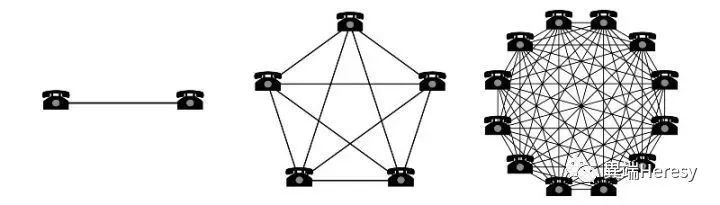

思维模型为我们提供了思考的工具。至于思考为什么需要工具，这是一个哲学问题。

<!--more-->

## 个人成长

### 学习要产生价值，就必须能将学习内容转为自己的行为

转化的方法一点都不神秘，就是多练多用。

但最难的地方在于，练习过程中我们会随时想放弃。

10多年前，我太太练习瑜伽的经历就是一个很好的例子。

当时，我太太还只是我认识的一位朋友，那段时间她对瑜伽产生了兴趣

一开始是自学，1个月下来，对各种上莲花肩倒立式、双角式、单腿轮式等等体位如数家珍，但动作却一个都做不出来。

自学这条路走不通后，她就报了健身房的瑜伽课，晚上7:30，20多个人一起上。上了两次课后，就半途而废不想再练了。问其原因，答曰：学不会，而且经常要加班赶不过去。

为什么才练了两次就想放弃呢？

因为没能一开始就看到进步，畏难情绪上来了。

不过，现在我太太的瑜伽动作非常标准，甚至一些难度很高的体式也不在话下。

这又是如何做到的呢？

原因很简单。

 当年看到她这个情况，我花5000元在市中心的一家高档瑜伽馆买了10节私教课送给了她。

虽然2008年的5000元对20多岁的我而言确实有点贵，但直到现在我都挺得意自己的这次投资。

一是她成了我太太；

二是因为常年练瑜伽，这些年她身材一直保持得很好，哪怕生了两个小孩后依然如此。

瑜伽私教之所以能让她坚持下来，**根源在于从一开始就让她看到了进步。**

 自学和上大课，遇到不会的动作，教练也只能按标准教学流程往下走，她掌握起来就觉得很难。

 而私教老师完全针对她的身体特点，将体式按呼吸、进入、退出做了更细节的分解，并亲身示范，她一下子就掌握了。

**看到效果了，坚持练习的动力也就更足了。**

 而且，高档瑜伽馆的私教，相较于健身房的瑜伽教练，对瑜伽的内涵理解更深入，给她指导的方法更贴切规律。掌握方法之后，她后来完全可以自己在家练习，坚持下来就更容易了。

## 做决策

### 第一性原理

第一原理（英语：First principle），哲学与逻辑名词，是一个最基本的命题或假设，不能被省略或删除，也不能被违反。第一原理相当于是在数学中的公理。最早由亚里士多德提出。

两千多年前， 亚里士多德🗽对于第一性原理是这样表述的：在每一系统的探索中，存在第一原理，是一个最基本的命题或假设，不能被省略或删除，也不能被违反。

物理学中，第一性原理，或称从头算，指从基本的物理学定律出发，不外加假设与经验拟合的推导与计算。例如利用薛定谔方程在一些近似方法下解电子结构，但不从实验数据得到拟合参数的从头计算法。

### 双目标清单系统（Two-List System）

Mike Flint 做了巴菲特的私人飞行员十年之久，还曾为美国四任总统开过飞机，但他在事业上依然有更多追求。有一次，他和巴菲特在探讨他的职业生涯目标时，巴菲特让他去做这么一件事：

> 首先，巴菲特让Flint写下他职业生涯最重要的25个目标来。于是Flint花了一些时间把这些目标写了下来。
>
> 然后，巴菲特让他审视一下这个清单，然后圈出他认为最重要的5个。Flint也照做了。

Flint现在有了2个清单：

一个是他认为自己职业生涯最重要的5个目标；

另一个是另外20个他也觉得比较重要的目标。

巴菲特问 Flint：你现在知道该怎么做了么？Flint回答道：

> 知道了。我现在会马上开始着手实现这5个目标。至于另外20个，并没有那么紧急，所以可以放在闲暇的时间去做，然后慢慢把它们实现。

巴菲特听完后说到：

> 不，Flint，你搞错了。那些你并没有圈出来的目标，不是你应该在闲暇时间慢慢完成的事，而是你应该尽全力避免去做的事，你应该像躲避瘟疫一样躲避它们，不去花任何的时间和注意力在它们上面。

这让我想到了三件事：

**第一、 有目标是非常重要的。**

当有了具体的目标，你才能反复地推演实现这个目标的方法和路径，才能在每天早上睁眼之后明白自己应该围绕什么东西优化和努力。

我听过的另外的一个很好的表述方法是：将开放式的问题变成封闭式的问题。而「什么都能做」或者「所有方向都可以是方向」是最可怕的，对于个人或是企业都是如此。

**第二、专注很有力量。**

在一个人的认知资源有限的情况下，一段时间如果有太多目标，那么很可能哪个都无法完成。

尽管「专注」和「聚焦」的概念已经被现代人提及的太多，但真正能做到准确地辨识自己的欲念，去除自己不真正需要的东西的人，还是少数的。

**第三、比起「有所为」，「有所而不为」可能更关键。**

这可能和芒格说的「Invert, always invert」 有相通之处。没有被选中的那20个目标，其实也是你感兴趣的或者有意义的，所以就很容易找到各种合理的理由去在那些目标上花时间。

但它们才是默默消耗掉时间，转移你的注意力，又不能真正产出成果的事情，这种目标比看起来明显就很愚蠢的东西更加危险。

### 10/10/10原则 

我们大多数人做决策时都会存在一个问题：不考虑这个决策可能带来的长远影响。

这时，你可以根据10/10/10原则来考虑所做的决策可能带来的长远影响。这个原则就是：

> 这个决策在10分钟后，会产生什么影响？
>
> 这个决策在10个月后，会产生什么影响？
>
> 这个决策在10年后，会产生什么影响？

在做决策时如果能践行10/10/10原则，这将有助于你在决策时免受感性因素的影响，迫使你考虑到这个决策可能会带来的长远影响，从而做出更加明智的决策。

### 忽略结果（不依结果判断决策正确性）

被誉为‘扑克女公爵’的顶尖扑克选手Annie Duke这样说道：

“很多人陷入的最大陷阱是，他们根据结果来判断表现。如果他们赢了，他们就会因为他们做了正确的决策。如果他们输了，他们就会认为他们运气不好。

在我的前半生，我是一个非常有竞争力的扑克玩家。这是我学到的有关做决策的最重要的经验之一，现在我把它带到了商业世界。”

在你做决策时，你是不可能掌握所有的信息的，即便如此，你依然是可以掌控决策流程的。

每当我要做一些重大决策时，我都会向周围的人咨询意见并得到反馈，包括我的管理团队、董事会、员工和客户等。这样我就能够了解每一个人的看法，我采用的这套决策流程能让我及时地降低决策风险。

不管事情进展得是特别顺利还是特别不顺利，你都要保持稳定，这一点很重要，这能让你避免归因偏差。

用“忽略结果”的方法来看待决策，它能够提高你做出高质量决策的几率。

### 正确与非共识

全球殿堂级对冲基金Bridgewater Associates的创始人、当世名列前端的金融超级巨头Ray Dalio认为：

每个人每天都会做很多决策，而这些决策都会产生一定的影响。从本质上说，你的生活质量取决于你做的所有这些决策的质量。

要想在市场上获得成功，你必须成为一个独立思考者，因为**共识通常都是错误的**。

你必须要有与众不同的观点和视角。要想在股市或创业中获得成功，你就不能与共识为伍，而是要做出正确的决策。

要想获得指数级的增长成果，你必须要做到既不要循规蹈矩，还要做出正确的决策。

这说起来容易做起来难，因为大多数时候你的决策都是错误的。然而，一旦你做出了正确的决策，那么市场给你的回报将是呈幂律分布的，即少数的正确决策将带来巨大回报。

### “3”的法则

我从麦肯锡的一位导师那里学到了一个建议：“3”的法则。

即当你试图说服一个比较资深的人去做某件事的时候，一定要给出3个原因。

不是两个，也不是4个，要正正好好给出3个原因。

我非常喜欢这个法则。不管是进行优先级排序还是提建议，我都会将这个法则作为一个指导框架。

## 战略

### 有竞争力的护城河

在古代，城堡通常都被护城河环绕着，护城河起到保护城堡的作用。

护城河越宽，城堡就能得到越安全地保护，因为这样敌人就很难攻破城堡；如果护城河太窄，便起不到太大的保护作用，因为敌人很容易就能穿越护城河攻破城堡。

在巴菲特看来，城堡就好比公司，而护城河就好比这家公司拥有的竞争优势。他希望自己手下的经理们都能不断地加宽城堡周围的护城河。

我非常喜欢上面那张图，因为它很清楚地解释了一家公司的护城河都有哪些。你会发现，Facebook在自己周围几乎构建起了图中所示的所有这些护城河：

高转换成本、网络效应和有效规模等。

在考虑竞争优势和策略的时候，一定要考虑你未来将构建起什么样的护城河，这一点很重要。因为它能让你的公司抵御住任何竞争者的入侵，从而获得长久性的胜利。

### 网络效应和临界规模

网络效应是指，当一个产品的用户数越多，该产品对用户的价值就越大，这反过来又能吸引更多用户使用该产品。

同时，该产品的价值跟用户数的增长成二次方关系，即著名的“梅特卡夫定律Metcalfe's law”，产品的价值等于用户数量的平方。

没有什么业务的规模化扩张速度能比软件业务还快，也没有什么能比网络效应能更高效地为公司业务构建起安全的护城河。

网络效应已经成为了任何策略的一个筹码。通常情况下，公司用户数一旦达到临界规模，触发网络效应，公司就能通过规模经济赢得巨大的成本优势。

由于网络效应显著，先发创新者可能会实现赢家通吃。这是所有创业者梦寐以求的事。

### 集中式、分散式和分布式

> “区块链在政治上是分散式的（没有人控制它们），在架构上的分散式的（没有基础设施中心店)，但它们在逻辑上是集中式的（有一个普遍的认同状态，它的系统表现得就像一台电脑)”。
>
> **——以太坊联合创始人Vitalik Buterin**

要想实现网络效应，其中的一个关键要素就是建立一个分布式和分散式模型，将权力移交给个人。

理解了集中式、分散式和分布式之间的区别后，你就能更好地理解比特币以及其底层技术区块链究竟是如何运作的了。

### 博弈论

> “博弈论研究的是人们在战略情景下的行为方式。这里的‘战略’是指，对弈双方在平等的对局中各自利用对方的策略变换自己的对抗策略，从而达到取胜的目的。
>
> 战略思维不仅在跳棋、象棋和棋牌上至关重要，在许多商业决策中也是至关重要的。”
>
> **——经济学家Greg Mankiw**

用一句话简单概括博弈论：选择一种能够让你的竞争对手的最大优势最小化的策略。

### 规模经济

规模经济是指，在成本或管理费用不变的情况下，能够让公司业务实现指数级增长。

软件行业的创业公司是规模经济的最大受益者之一。像Google、Facebook、Twitter这样的公司都能够在不增加任何固定成本的情况下获取更多的用户。相比而言，服务类的公司更难实现规模化扩张。

下面以Amazon为例，看看规模经济是如何在它身上发挥效果的：

**Amazon AWS的“飞轮”**

## 领导力

### 金字塔原理

根据金字塔原理：要将思想组织成金字塔结构。

金字塔原理中的三个核心思想是：

> 先从答案开始。
>
> 分组总结你的支撑论点。
>
> 有逻辑地对你的支撑论点进行排序。

在思考沟通的时候，我都会参考金字塔原理。先把答案快速摆出来，而不是慢慢揭示答案，这样有助于更快地得出结论，让每个人都能保持一致，从而进行坦诚的交流。

### 99/50/1框架

你可以根据这个框架方法来决定该在什么时间点去和你的产品团队检查工作进展。我在自己的公司就在使用这个方法。

如果你也想使用这个方法，你应该在这几个关键时间点与你的产品团队检查工作进展：

> 在项目刚开始的时候，即还有99%的工作没有做完的时候。
>
> 在项目进行到一半的时候，即还有大概50%的工作没做完的时候。
>
> 在项目即将完成的时候，即还有1%的工作没做完的时候。

我最喜欢的一句话就是，“尽早同步工作进展、经常同步工作进展。”

也就是说，当项目刚开始执行的时候要多参与，随着项目的执行，要越来越少地参与进去。

### 直接责任人（DRI）

苹果公司公司发明了这样一个管理概念：直接责任人（Directly Responsible Individual，简称DRI）。DRI遍布于公司各个层级。

在苹果，谁负责什么，永远不会搞混。DRI的名字经常出现在会议进程表上，每个人都知道谁是直接负责人。

如此公开透明的责任制，使得每一个员工没有互相推诿和偷懒的机会，一旦项目出现问题，很容易找到出现问题的环节予以纠正，并追究相关责任。

而且，一个项目只能有一个DRI，如果超过一个DRI，那就等于没有直接责任人。DRI能够有效加速决策流程，也可以减少很多不必要的会议。

### 团队中的团队

团队中的团队是一种将不同的团队及团队成员聚集在一起、从而形成一个无缝的组织网络的运营模式。

在团队中的团队，决策权被授予每一个团队的负责人，而不是集中在一个组织最高层的领导人手里。

这时，最高层领导的角色就发生了转变。从负责一个组织中的所有决策，转变为为每一个团队提供所需的信息和背景，让他们都与一个共同的目标相联系并拥有最好的信息来帮他们做决策。

### 彻底坦诚

Kim Scott 的整个职业生涯都围绕一个目标：营造一个员工热爱、团队协作良好的工作环境和氛围。

后来长期在 Google 担任团队顾问的过程中，她了解了 Google 公司领导营造一个员工能从工作中感受到快乐的方法，那种快乐的氛围是那么浓厚，甚至一眼就能看到。

而在担任苹果大学资深教员的过程中，Scott 了解了苹果是不同作风，但是初衷一样：营造一个人们能发挥自己所有潜能，并享受工作的环境。

现在作为 Twitter、Shyp、Rolltape 和 Qualtrics 的资深顾问，Scott 将自己多年的经历心得凝练成了简单的几个字：彻底坦诚。所有公司创始人都可以利用它，来帮助员工喜欢上自己的工作，并发挥出自己最大的潜能将工作做好。

上面的横轴就代表 “直接挑战”，用 Scott 的话说，就是 “敢惹怒对方”。

直接挑战他人对很多人来说都是很难做到的，因为说不好听的话就会显得没礼貌。然而一旦你成为老板，你就必须要清楚哪些员工作做得好，哪些出问题了，这是你的职责所在。

从上图可以看出 “彻底的坦率” 源于 “个人关心” 和 “直接挑战” 的结合。彻底的坦率是非常有好处的，它对事不对人。

> “在我看来，当员工工作做砸了的时候，批评员工不光是你的职责所在，它也是你的道德义务。” Scott说道。

### 倾听、决策、交流

当你是以管理者、CEO或任何级别领导的身份做决策的时候，那么倾听、决策、交流的顺序就非常重要。最好按照这个顺利去做：

> 首先倾听；
>
> 然后决策；
>
> 最后交流；
>
> 而且不能让它们之间间隔太长时间。

这是Twitter的前CEO Dick Costolo提出的一个沟通模型。

关键是要始终先倾听，不要乱了顺序，而且尽量缩短每一步之间的时间差。

文章来源于金枫股经，版权归作者所有。