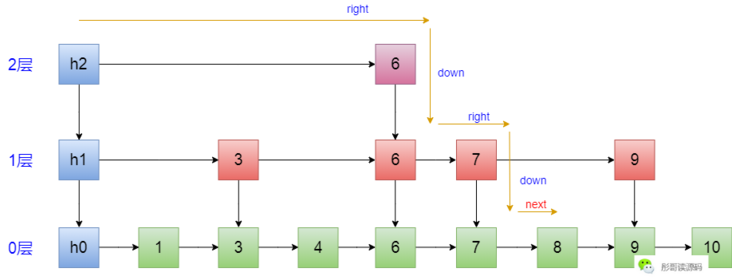

## 算法与数据结构

### 做题思路

1. 先画图分析
2. 写算法（递归？）
3. 对数器验算（使用系统提供的算法，或实现一个简单的算法）

### 数据结构

#### 单向链表

#### 双向链表

#### 栈

- 如何用两个栈实现队列？

#### 队列

- 数组实现（RingBuffer）：记住数组limit和size，putindex/pollindex

- 链表实现：
- 两个队列实现栈？

#### 双端队列

#### 单调栈

#### 线性表

线性表，全名为线性存储结构。使用线性表存储数据的方式可以这样理解，即“把所有数据用一根线儿[串](http://data.biancheng.net/view/175.html)起来，再存储到物理空间中”。

#### 最大堆最小堆

#### 哈希表

所有操作的时间复杂度都是O(1)

TreeMap所有的操作时间复杂度为O(logN)

基础类型按值传递（拷贝一份数据），非基础类型按引用传递

#### 跳表

1. skiplist的复杂度和红黑树一样，而且实现起来更简单。
2. 在并发环境下skiplist有另外一个优势，红黑树在插入和删除的时候可能需要做一些rebalance的操作，这样的操作可能会涉及到整个树的其他部分，而skiplist的操作显然更加局部性一些，锁需要盯住的节点更少，因此在这样的情况下性能好一些。
3. JDK中ConcurrentSkipListMap是基于跳表实现的有序、线程安全的

跳表在redis的set中被使用。

- 查找

  > 查找元素，是通过头节点，先尽最大努力往右，再往下，再往右，每一层都要尽最大努力往右，直到右边的索引比目标值大为止，到达0层的时候再按照链表的方式来遍历，用图来表示如下（这里的指针，在索引中叫作right，在链表中叫作next，是不一样的）
  >
  > 
  >
  > 所以，整个过程分成两大步：
  >
  > 1. 寻找目标节点前面最接近的索引对应的节点；
  > 2. 按链表的方式往后遍历；

### 算法思想

#### 分治思想

分治算法的基本思想是将一个规模为N的问题分解为K个规模较小的子问题，这些子问题相互独立且与原问题性质相同。 求出子问题的解，就可得到原问题的解。 即一种分目标完成程序算法，简单问题可用二分法完成。

1. 二分法

   > - 二分搜索
   > - 快速排序
   > - 线性时间选择
   > - 汉诺塔
   > - 棋盘覆盖
   > - 循环赛日程表

2. N分法

3. 哈希分治

> - 两个记录着url的16g文件，如何找到在两个文件中都有的URL

3. 递归

   > 

#### 贪心算法

#### 动态规划

> 动态规划也是一种分治思想（比如其状态转移方程就是一种分治），但与分治算法不同的是，分治算法是把原问题分解为若干个子问题，自顶向下求解子问题，合并子问题的解，从而得到原问题的解。动态规划也是把原始问题分解为若干个子问题，然后自底向上，**先求解最小的子问题，把结果存在表格中**，在求解大的子问题时，直接从表格中查询小的子问题的解，避免重复计算，从而提高算法效率。
>
> 所有的暴力递归，都可以改写为动态规划，先写dp数组，基于递归算法改写（所以要先），从小问题。
>
> 我们区分动态规划和分支的关键在于，是否有重复子问题！

- 滚动数组思想
- 

#### 递归

BaseCase

如果是严格的非条件状态转移，可以使用斐波那契数列

如果每次计算是有条件的，使用动态规划

所有的递归都可以改写为迭代

#### 回溯

#### 分枝界定（Branch and Bound）

分支定界法（branch and bound）是一种求解整数规划问题的最常用算法。 这种方法不但可以求解纯整数规划，还可以求解混合整数规划问题。 分支定界法是一种搜索与迭代的方法，选择不同的分支变量和子问题进行分支。 对于两个变量的整数规划问题，使用网格的方法有时更为简单。

- 基本思想

  > **求解目标**：分支限界法的求解目标则是找出满足约束条件的一个解，或是在满足约束条件的解中找出在某种意义下的最优解。
  >
  > **搜索方式**：以广度优先或以最小耗费优先的方式搜索解空间树。分支限界法常以广度优先或以最小耗费（最大效益）优先的方式搜索问题的解空间树。
  >
  > 在分支限界法中，每一个活结点只有一次机会成为扩展结点。活结点一旦成为扩展结点，就一次性产生其所有儿子结点。在这些儿子结点中，导致不可行解或导致非最优解的儿子结点被舍弃，其余儿子结点被加入活结点表中。
  >
  > 此后，从活结点表中取下一结点成为当前扩展结点，并重复上述结点扩展过程。这个过程一直持续到找到所需的解或活结点表为空时为止。

### 排序算法

#### 特点比较


#### 桶排序

#### 堆排序√

堆排序（Heapsort）是指利用堆这种数据结构所设计的一种排序算法。堆积是一个近似完全二叉树的结构，并同时满足堆积的性质：即子结点的键值或索引总是小于（或者大于）它的父节点。堆排序可以说是一种利用堆的概念来排序的选择排序。分为两种方法：

1. 大顶堆：每个节点的值都大于或等于其子节点的值，在堆排序算法中用于升序排列；
2. 小顶堆：每个节点的值都小于或等于其子节点的值，在堆排序算法中用于降序排列；

排序步骤：

1. 创建一个堆 H[0……n-1]；
2. 把堆首（最大值）和堆尾互换；
3. 把堆的尺寸缩小 1，并调用 shift_down(0)，目的是把新的数组顶端数据调整到相应位置；
4. 重复步骤 2，直到堆的尺寸为 1。

```java
public class HeapSort implements IArraySort {
    @Override
    public int[] sort(int[] sourceArray) throws Exception {
        // 对 arr 进行拷贝，不改变参数内容
        int[] arr = Arrays.copyOf(sourceArray, sourceArray.length);
        int len = arr.length;
        buildMaxHeap(arr, len);
        for (int i = len - 1; i > 0; i--) {
            swap(arr, 0, i);
            len--;
            heapify(arr, 0, len);
        }
        return arr;
    }
    private void buildMaxHeap(int[] arr, int len) {
        for (int i = (int) Math.floor(len / 2); i >= 0; i--) {
            heapify(arr, i, len);
        }
    }
    private void heapify(int[] arr, int i, int len) {
        int left = 2 * i + 1;
        int right = 2 * i + 2;
        int largest = i;
        if (left < len && arr[left] > arr[largest]) {
            largest = left;
        }
        if (right < len && arr[right] > arr[largest]) {
            largest = right;
        }
        if (largest != i) {
            swap(arr, i, largest);
            heapify(arr, largest, len);
        }
    }
    private void swap(int[] arr, int i, int j) {
        int temp = arr[i];
        arr[i] = arr[j];
        arr[j] = temp;
    }
}
```

#### 快速排序√

在平均状况下，排序 n 个项目要 Ο(nlogn) 次比较。在最坏状况下则需要 Ο(n2) 次比较，但这种状况并不常见。事实上，快速排序通常明显比其他 Ο(nlogn) 算法更快，因为它的内部循环（inner loop）可以在大部分的架构上很有效率地被实现出来。

> **快排与归并**：快速排序的最坏运行情况是 O(n²)，比如说顺序数列的快排。但它的平摊期望时间是 O(nlogn)，且 O(nlogn) 记号中隐含的常数因子很小，比复杂度稳定等于 O(nlogn) 的归并排序要小很多。所以，对绝大多数顺序性较弱的随机数列而言，快速排序总是优于归并排序。

```java
public class QuickSort implements IArraySort {
    @Override
    public int[] sort(int[] sourceArray) throws Exception {
        // 对 arr 进行拷贝，不改变参数内容
        int[] arr = Arrays.copyOf(sourceArray, sourceArray.length);
        return quickSort(arr, 0, arr.length - 1);
    }
    private int[] quickSort(int[] arr, int left, int right) {
        if (left < right) {
            int partitionIndex = partition(arr, left, right);
            quickSort(arr, left, partitionIndex - 1);
            quickSort(arr, partitionIndex + 1, right);
        }
        return arr;
    }
    private int partition(int[] arr, int left, int right) {
        // 设定基准值（pivot）
        int pivot = left;
        int index = pivot + 1;
        for (int i = index; i <= right; i++) {
            if (arr[i] < arr[pivot]) {
                swap(arr, i, index);
                index++;
            }
        }
        swap(arr, pivot, index - 1);
        return index - 1;
    }
    private void swap(int[] arr, int i, int j) {
        int temp = arr[i];
        arr[i] = arr[j];
        arr[j] = temp;
    }
}
```

#### 希尔排序√

希尔排序，也称递减增量排序算法，是插入排序的一种更高效的改进版本。但希尔排序是非稳定排序算法。

希尔排序是基于插入排序的以下两点性质而提出改进方法的：

- 插入排序在对几乎已经排好序的数据操作时，效率高，即可以达到线性排序的效率；
- 但插入排序一般来说是低效的，因为插入排序每次只能将数据移动一位；

希尔排序的基本思想是：先将整个待排序的记录序列分割成为若干子序列分别进行直接插入排序，待整个序列中的记录"基本有序"时，再对全体记录进行依次直接插入排序。

算法步骤

> - 选择一个增量序列 t1，t2，……，tk，其中 ti > tj, tk = 1；
>
> - 按增量序列个数 k，对序列进行 k 趟排序；
>
> 每趟排序，根据对应的增量 ti，将待排序列分割成若干长度为 m 的子序列，分别对各子表进行直接插入排序。仅增量因子为 1 时，整个序列作为一个表来处理，表长度即为整个序列的长度。

```java
public static void shellSort(int[] arr) {
    int length = arr.length;
    int temp;
    for (int step = length / 2; step >= 1; step /= 2) {
        for (int i = step; i < length; i++) {
            temp = arr[i];
            int j = i - step;
            while (j >= 0 && arr[j] > temp) {
                arr[j + step] = arr[j];
                j -= step;
            }
            arr[j + step] = temp;
        }
    }
}
```

#### 插入排序

将第一待排序序列第一个元素看做一个有序序列，把第二个元素到最后一个元素当成是未排序序列。

从头到尾依次扫描未排序序列，将扫描到的每个元素插入有序序列的适当位置。（如果待插入的元素与有序序列中的某个元素相等，则将待插入元素插入到相等元素的后面。）

```java
public class InsertSort implements IArraySort {
    @Override
    public int[] sort(int[] sourceArray) throws Exception {
        // 对 arr 进行拷贝，不改变参数内容
        int[] arr = Arrays.copyOf(sourceArray, sourceArray.length);
        // 从下标为1的元素开始选择合适的位置插入，因为下标为0的只有一个元素，默认是有序的
        for (int i = 1; i < arr.length; i++) {
            // 记录要插入的数据
            int tmp = arr[i];
            // 从已经排序的序列最右边的开始比较，找到比其小的数
            int j = i;
            while (j > 0 && tmp < arr[j - 1]) {
                arr[j] = arr[j - 1];
                j--;
            }
            // 存在比其小的数，插入
            if (j != i) {
                arr[j] = tmp;
            }
        }
        return arr;
    }
}
```


#### 归并排序√

归并排序（Merge Sort）是建立在归并操作上的一种有效，稳定的排序算法，该算法是采用分治法（Divide and Conquer）的一个非常典型的应用。 将已有序的子序列合并，得到完全有序的序列；即先使每个子序列有序，再使子序列段间有序。 若将两个有序表合并成一个有序表，称为二路归并。


```java
public class MergeSort implements IArraySort {
    @Override
    public int[] sort(int[] sourceArray) throws Exception {
        // 对 arr 进行拷贝，不改变参数内容
        int[] arr = Arrays.copyOf(sourceArray, sourceArray.length);
        if (arr.length < 2) {
            return arr;
        }
        int middle = (int) Math.floor(arr.length / 2);
        int[] left = Arrays.copyOfRange(arr, 0, middle);
        int[] right = Arrays.copyOfRange(arr, middle, arr.length);
        return merge(sort(left), sort(right));
    }
    protected int[] merge(int[] left, int[] right) {
        int[] result = new int[left.length + right.length];
        int i = 0;
        while (left.length > 0 && right.length > 0) {
            if (left[0] <= right[0]) {
                result[i++] = left[0];
                left = Arrays.copyOfRange(left, 1, left.length);
            } else {
                result[i++] = right[0];
                right = Arrays.copyOfRange(right, 1, right.length);
            }
        }
        while (left.length > 0) {
            result[i++] = left[0];
            left = Arrays.copyOfRange(left, 1, left.length);
        }
        while (right.length > 0) {
            result[i++] = right[0];
            right = Arrays.copyOfRange(right, 1, right.length);
        }
        return result;
    }
}
```

#### 选择排序

首先在未排序序列中找到最小（大）元素，存放到排序序列的起始位置。

再从剩余未排序元素中继续寻找最小（大）元素，然后放到已排序序列的末尾。

重复第二步，直到所有元素均排序完毕。

```java
public class SelectionSort implements IArraySort {
    @Override
    public int[] sort(int[] sourceArray) throws Exception {
        int[] arr = Arrays.copyOf(sourceArray, sourceArray.length);
        // 总共要经过 N-1 轮比较
        for (int i = 0; i < arr.length - 1; i++) {
            int min = i;
            // 每轮需要比较的次数 N-i
            for (int j = i + 1; j < arr.length; j++) {
                if (arr[j] < arr[min]) {
                    // 记录目前能找到的最小值元素的下标
                    min = j;
                }
            }
            // 将找到的最小值和i位置所在的值进行交换
            if (i != min) {
                int tmp = arr[i];
                arr[i] = arr[min];
                arr[min] = tmp;
            }
        }
        return arr;
    }
```

https://www.runoob.com/w3cnote/selection-sort.html

### 查找算法

#### 二分法查找

### 数学思想

#### 斐波那契数列

适用条件：**严格的、没有条件转移的表达式。**

### 状态机

#### AC自动机

#### 有限状态机

### 其它技巧

#### 位运算

- 不引入新的变量交换A，B两个变量的值；A=A\^B，B=A\^B，A=A\^B（条件：A/B不能指向同一个内存）

- 一个数组中，只有一种数出现了奇数词；所有的数异或，最终的结果就是出现奇数次的数。（偶数个相等的数异或结果为0）

- 提取最后一个二进制的1；N & ( ( ~N ) + 1 )

- 乘2：5<<1；乘4：5<<2；除16：80>>4

#### 二进制技巧

- 使用二进制随机数，可以生成任意范围的随机数

#### 双指针

双指针技巧还可以分为两类，一类是「快慢指针」，一类是「左右指针」。前者解决主要解决链表中的问题，比如典型的判定链表中是否包含环；后者主要解决数组（或者字符串）中的问题，比如二分查找。

#### 滑动窗口

### 经典算法题

#### 买卖股票的最佳时机

#### Z字打印二叉树

#### 二叉树镜像（递归）

```java
class Solution {
    public TreeNode mirrorTree(TreeNode root) {
        // 当节点为空时，直接返回
        if(root == null) return null;
        // 设置一个临时的节点 tmp 用来存储当前节点的左子树
        TreeNode tmp = root.left;
        // 以下两个操作是在交换当前节点的左右子树
        // 当前节点的左子树为节点的右子树
        // 同时递归下去，不停的交互子树中的节点
        root.left = mirrorTree(root.right);
        // 当前节点的右子树为节点的左子树
        // 同时递归下去，不停的交互子树中的节点
        root.right = mirrorTree(tmp);
        // 最后返回根节点
        return root;
    }
}
```

## 题型解析

### 整数

> 注意事项：
>
> 1. 32为整数的范围为[−2³¹, 2³¹ − 1]  [2147483647,-2147483648]
> 2. -2147483648的绝对值是其本身，Math.abs(x)执行时Math.abs((long)x)强转
> 3. 1<<n 为 2的n次方

#### 翻转整数

https://leetcode-cn.com/problems/reverse-integer/

```java
class Solution {
    public int reverse(int x) {
      if (x == 0) return 0;
      int res = 0;
      while (x != 0) {
        if (res < Integer.MIN_VALUE / 10 || res > Integer.MAX_VALUE / 10) return 0;
        res = res * 10 + x % 10; // 递推×10
        x /= 10; // 递推÷10
      }
      return res;
    }
}
```

#### 快速幂

#### 两数相除

```java
class Solution {
    public int divide(int dividend, int divisor) {
        if (dividend == 0) return 0;
        if (dividend == Integer.MIN_VALUE && divisor == -1) return Integer.MAX_VALUE;
        boolean negative = (dividend ^ divisor) < 0;//用异或来计算是否符号相异
        long dividendLong = Math.abs((long) dividend); //
        long divisorLong = Math.abs((long) divisor);   // 
        int result = 0;
        // （2^31）-1  为最大值，逐个试探
        for (int i = 31; i >= 0; i--) {
          if ((dividendLong >> i) >= divisorLong) { //找出足够大的数2^n*divisor
            result += 1 << i; //将结果加上2^n
            dividendLong -= divisorLong << i; //将被除数减去2^n*divisor
          }
        }
        return negative ? -result : result; //符号相异取反
    }
}
```

#### 进制转换

### 字符串

### 链表

### 树

### 栈

### 队列

### 堆

### 前缀树

### 线段树 [中等]

#### [区域和检索 - 数组可修改](https://leetcode-cn.com/problems/range-sum-query-mutable/)

```java
class NumArray {
    private int[] segmentTree;
    private int n;

    public NumArray(int[] nums) {
        n = nums.length;
        segmentTree = new int[nums.length * 4];
        build(0, 0, n - 1, nums);
    }

    public void update(int index, int val) {
        change(index, val, 0, 0, n - 1);
    }

    public int sumRange(int left, int right) {
        return range(left, right, 0, 0, n - 1);
    }

    private void build(int node, int s, int e, int[] nums) {
        if (s == e) {
            segmentTree[node] = nums[s];
            return;
        }
        int m = s + (e - s) / 2;
        build(node * 2 + 1, s, m, nums);
        build(node * 2 + 2, m + 1, e, nums);
        segmentTree[node] = segmentTree[node * 2 + 1] + segmentTree[node * 2 + 2];
    }

    private void change(int index, int val, int node, int s, int e) {
        if (s == e) {
            segmentTree[node] = val;
            return;
        }
        int m = s + (e - s) / 2;
        if (index <= m) {
            change(index, val, node * 2 + 1, s, m);
        } else {
            change(index, val, node * 2 + 2, m + 1, e);
        }
        segmentTree[node] = segmentTree[node * 2 + 1] + segmentTree[node * 2 + 2];
    }

    private int range(int left, int right, int node, int s, int e) {
        if (left == s && right == e) {
            return segmentTree[node];
        }
        int m = s + (e - s) / 2;
        if (right <= m) {
            return range(left, right, node * 2 + 1, s, m);
        } else if (left > m) {
            return range(left, right, node * 2 + 2, m + 1, e);
        } else {
            return range(left, m, node * 2 + 1, s, m) + range(m + 1, right, node * 2 + 2, m + 1, e);
        }
    }
}
```

### 二分查找

### 排序

### 回溯法

### 动态规划

### 图

### 贪心

### 双指针

### 多线程

### 滑动窗口


