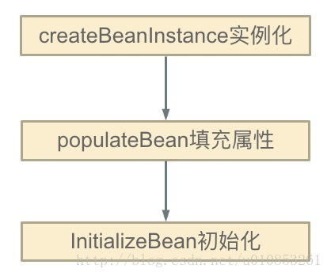

## SpringFramework

#### SpringMVC响应流程

上图是一个Spring MVC从接收请求到返回响应的完整流程。我理解对于SpringBoot的RestController来说，在第四步没有返回ModelAndView，而是直接返回了Json，并通过@ResponseBody将Json直接写到了响应Body，略过了第5步和第6步。

#### 什么是循环依赖，如何解决？

- 什么情况下会发生循环依赖

  > ```xml
  > <bean id="beanA" class="xyz.coolblog.BeanA">
  >     <property name="beanB" ref="beanB"/>
  > </bean>
  > 
  > <bean id="beanB" class="xyz.coolblog.BeanB">
  >     <property name="beanA" ref="beanA"/>
  > </bean>
  > ```
  >
  > IOC 按照上面所示的 `<bean>` 配置，实例化 A 的时候发现 A 依赖于 B 于是去实例化 B（此时 A 创建未结束，处于创建中的状态），而发现 B 又依赖于 A ，于是就这样循环下去，最终导致 OOM。

- 循环依赖发生的时机

  > Bean 实例化主要分为三步，如图：
  >
  > 问题出现在：第一步和第二步的过程中，也就是填充属性 / 方法的过程中（如果是使用构造方法注入就是第一步）
  >
  > 

- Spring中如何解决？

  > Spring 为了解决单例的循环依赖问题，使用了 **三级缓存** ，递归调用时发现 Bean 还在创建中即为循环依赖
  >
  > 单例模式的 Bean 保存在如下的数据结构中：
  >
  > ```java
  > /** 一级缓存：用于存放完全初始化好的 bean **/
  > private final Map<String, Object> singletonObjects = 
  >   new ConcurrentHashMap<>(256);
  > 
  > /** 二级缓存：存放原始的 bean 对象（尚未填充属性），用于解决循环依赖 */
  > private final Map<String, Object> earlySingletonObjects = 
  >   new HashMap<>(16);
  > 
  > /** 三级级缓存：存放 bean 工厂对象，用于解决循环依赖 */
  > private final Map<String, ObjectFactory<?>> singletonFactories = 
  >   new HashMap<>(16);
  > ```
  >
  > bean 的获取过程：先从一级获取，失败再从二级、三级里面获取
  >
  > 创建中状态：是指==对象已经 `new` 出来了但是所有的属性均为 `null` 等待被 `init`==
  >
  > **检测循环依赖的过程如下：**
  >
  > 1. 实例化 A，此时 A 还未完成属性填充和初始化方法（@PostConstruct）的执行，==A 只是一个半成品==。
  > 2. 为 A 创建一个 Bean 工厂，并放入到  singletonFactories 中。
  > 3. 发现 A 需要注入 B 对象，但是一级、二级、三级缓存均未发现对象 B。
  > 4. 实例化 B，此时 B 还未完成属性填充和初始化方法（@PostConstruct）的执行，==B 只是一个半成品==。
  > 5. 为 B 创建一个 Bean 工厂，并放入到  singletonFactories 中。
  > 6. 发现 B 需要注入 A 对象，此时在一级、二级未发现对象 A，但是在三级缓存中发现了对象 A，从三级缓存中得到对象 A，并将对象 A 放入二级缓存中，同时删除三级缓存中的对象 A。（注意，此时的 A 还是一个半成品，并没有完成属性填充和执行初始化方法）
  > 7. 将对象 A 注入到对象 B 中。
  > 8. 对象 B 完成属性填充，执行初始化方法，并放入到一级缓存中，同时删除二级缓存中的对象 B。（此时对象 B 已经是一个成品）
  > 9. 对象 A 得到对象 B，将对象 B 注入到对象 A 中。（对象 A 得到的是一个完整的对象 B）
  > 10. 对象 A 完成属性填充，执行初始化方法，并放入到一级缓存中，同时删除二级缓存中的对象 A
  >
  > 
  >
  > 原理总结：将Bean初始化的过程分解，按上例：在注入的过程中B拿到A的引用，即可完成自身初始化（此时A是半成品），最后完成A的初始化。
  >
  > 
  >
  > 如此一来便解决了循环依赖的问题

  > ```java
  > // 以上叙述的源代码
  > protected Object getSingleton(String beanName, boolean allowEarlyReference) {
  >     // 先从一级缓存找
  >     Object singletonObject = this.singletonObjects.get(beanName);
  >     // 设置当前这个 beanName 为创建状态
  >     if (singletonObject == null && isSingletonCurrentlyInCreation(beanName)) {
  >         synchronized (this.singletonObjects) {
  >             // 再从二级缓存里面找
  >             singletonObject = this.earlySingletonObjects.get(beanName);
  >             if (singletonObject == null && allowEarlyReference) {
  >                 // 还找不到则使用三级缓存
  >                 ObjectFactory<?> singletonFactory = this.singletonFactories.get(beanName);
  >                 if (singletonFactory != null) {
  >                     singletonObject = singletonFactory.getObject();
  >                     // 把这个 beanName 存入二级缓存里面
  >                     this.earlySingletonObjects.put(beanName, singletonObject);
  >                     // 把当前这个 beanName 从三级缓存中删除
  >                     this.singletonFactories.remove(beanName);
  >                 }
  >             }
  >         }
  >     }
  >     return (singletonObject != NULL_OBJECT ? singletonObject : null);
  > }
  > ```

- 两级缓存

  > 我们现在已经知道，第三级缓存的目的是为了延迟代理对象的创建，因为如果没有依赖循环的话，那么就不需要为其提前创建代理，可以将它延迟到初始化完成之后再创建。
  >
  > 既然目的只是延迟的话，那么我们是不是可以不延迟创建，而是在实例化完成之后，就为其创建代理对象，这样我们就不需要第三级缓存了。因此，我们可以将 `addSingletonFactory()` 方法进行改造。
  >
  > ```
  > protected void addSingletonFactory(String beanName, ObjectFactory<?> singletonFactory) {
  >     Assert.notNull(singletonFactory, "Singleton factory must not be null");
  > 
  >     synchronized (this.singletonObjects) {
  >         // 判断一级缓存中不存在此对象
  >         if (!this.singletonObjects.containsKey(beanName)) { 
  >             // 直接从工厂中获取 Bean
  >             Object o = singletonFactory.getObject();
  > 
  >             // 添加至二级缓存中
  >             this.earlySingletonObjects.put(beanName, o);
  >             this.registeredSingletons.add(beanName);
  >         }
  >     }
  > }
  > ```
  >
  > 这样的话，每次实例化完 Bean 之后就直接去创建代理对象，并添加到二级缓存中。
  >
  > 测试结果是完全正常的，Spring 的初始化时间应该也是不会有太大的影响，因为如果 Bean 本身不需要代理的话，是直接返回原始 Bean 的，并不需要走复杂的创建代理 Bean 的流程。

- Spring为什么没有用两级缓存，而是用三级缓存

  > **因此，Spring 一开始提前暴露的并不是实例化的 Bean，而是将 Bean 包装起来的 ObjectFactory。为什么要这么做呢？**
  >
  > 这实际上涉及到 AOP，如果创建的 Bean 是有代理的，那么注入的就**应该是代理 Bean，而不是原始的 Bean**。但是 Spring 一开始并不知道 Bean 是否会有循环依赖，**通常情况下（没有循环依赖的情况下），Spring 都会在完成填充属性，并且执行完初始化方法之后再为其创建代理**。但是，如果**出现了循环依赖的话，Spring 就不得不为其提前创建代理对象**，否则注入的就是一个原始对象，而不是代理对象。因此，这里就涉及到应该在哪里提前创建代理对象？
  >
  > Spring 的做法就是在 ObjectFactory 中去提前创建代理对象。它会执行 `getObject()` 方法来获取到 Bean。实际上，它真正执行的方法如下：
  >
  > ```java
  > protected Object getEarlyBeanReference(String beanName, RootBeanDefinition mbd, Object bean) {
  >     Object exposedObject = bean;
  >     if (!mbd.isSynthetic() && hasInstantiationAwareBeanPostProcessors()) {
  >         for (BeanPostProcessor bp : getBeanPostProcessors()) {
  >             if (bp instanceof SmartInstantiationAwareBeanPostProcessor) {
  >                 SmartInstantiationAwareBeanPostProcessor ibp = (SmartInstantiationAwareBeanPostProcessor) bp;
  >                 // 如果需要代理，这里会返回代理对象；否则返回原始对象
  >                 exposedObject = ibp.getEarlyBeanReference(exposedObject, beanName);
  >             }
  >         }
  >     }
  >     return exposedObject;
  > }
  > ```
  >
  > 因为提前进行了代理，避免对后面重复创建代理对象，会在 `earlyProxyReferences` 中记录已被代理的对象。
  >
  > ```java
  > public abstract class AbstractAutoProxyCreator extends ProxyProcessorSupport
  > 		implements SmartInstantiationAwareBeanPostProcessor, BeanFactoryAware {
  >     @Override
  >     public Object getEarlyBeanReference(Object bean, String beanName) {
  >         Object cacheKey = getCacheKey(bean.getClass(), beanName);
  >         // 记录已被代理的对象
  >         this.earlyProxyReferences.put(cacheKey, bean);
  >         return wrapIfNecessary(bean, beanName, cacheKey);
  >     }
  > }
  > ```
  >
  > 通过上面的解析，我们可以知道 Spring 需要三级缓存的**目的是为了在没有循环依赖的情况下，延迟代理对象的创建**，使 Bean 的创建符合 Spring 的设计原则。

## Spring Boot

### SpringBoot

#### Spring的AOP的底层实现原理

#### Spring的事务是如何回滚的? 

#### 谈一下对Spring事务传播特性的理解

#### AOP是怎么实现的？它和IOC是什么关系

BeanPostProcessor，AOP是IOC的一个扩展功能

动态代理

#### JDK动态代理和Cglib实现方式

#### 调用aware接口的方法有什么意义

InvokeAwareMethod

#### BeanPostProcessor里的before究竟是什么？

#### 你能分清Bean的实例化和初始化吗？

实例化：在堆中开辟一块空间，对象属性值时默认值

初始化：给对象属性赋值，调用初始化方法

#### BeanFactory是什么？

用于访问Spring Bean容器的根接口

#### BeanFactoryPostProcessor和BeanPostProcessor区别？

针对不同的操作对象（后置处理器，增强器），分别是BeanFactory和Bean

#### PostProcessor是什么？

用于增强Bean的功能

#### @Configuration低层原理

#### Bean的生命周期

#### 如何修改Bean的加载顺序

1. 使用DependsOn注解

2. 使用@AutoConfigureOrder注解

   > 作用于`spring.factories`中的AutoConfiguration的顺序
   >
   > ```
   > @AutoConfigureOrder(Ordered.HIGHEST_PRECEDENCE) # 值越小优先级越高
   > ```

3. 使用@Order注解

4. BeanPostProcessor接口

5. @Lazy注解延迟加载Bean：使用到Bean时才初始化

6. @AutoConfigureAfter：作用范围同@AutoConfigureOrder

7. @AutoConfigureBefore：作用范围同@AutoConfigureOrder

#### Bean的作用域

#### 初始化前、初始化、初始化后

#### 你会如何设计一个框架？

扩展性

#### 谈谈你对SpringlOC的理解

#### 谈谈你的Bean的理解

#### 描述下Spring Bean的生命周期 

#### BeanFactory和FactoryBean有什么区别

#### Spring中用到哪些设计模式

#### BeanFactory和ApplicationContext的区别 

#### Spring中Filter和Interceptor的区别

#### 说说SmartInitializingSingleton接口的作用

#### 说说ApplicationContextAware接口的作用

#### BeanPostProcessorChecker的作用

#### Filter和Interceptor

- Interceptor：拦截用户请求，进行处理，比如判断用户登录情况、权限验证，只要针对Controller请求进行处理，是通过**HandlerInterceptor**，Interceptor分两种情况，

  > - 一种是对会话的拦截，实现spring的HandlerInterceptor接口并注册到mvc的拦截队列中，其中**preHandle()\**方法在调用Handler之前进行拦截。**postHandle()**方法在视图渲染之前调用，**afterCompletion()**方法在返回相应之前执行；
  > - 另一种是对方法的拦截，需要使用@Aspect注解，在每次调用指定方法的前、后进行拦截。 

- Filter：基于Servlet容器，过滤字符编码、做一些业务逻辑判断，主要用于对用户请求进行预处理，同时也可进行逻辑判断。Filter在请求进入servlet容器执行service()方法之前就会经过filter过滤，依赖于servlet。Filter启动是随WEB应用的启动而启动，只需要初始化一次，以后都可以进行拦截。

- 二者的区别

  > 1. Filter是基于函数回调（doFilter()方法）的，而Interceptor则是基于Java反射的（AOP思想）。
  > 2. Filter依赖于Servlet容器，而Interceptor不依赖于Servlet容器。
  > 3. Filter对几乎所有的请求起作用，而Interceptor只能对action请求起作用。
  > 4. Interceptor可以访问Action的上下文，值栈里的对象，而Filter不能。
  > 5. 在action的生命周期里，Interceptor可以被多次调用，而Filter只能在容器初始化时调用一次。
  > 6. Filter在过滤是只能对request和response进行操作，而interceptor可以对request、response、handler、modelAndView、exception进行操作。

#### 说一下Spring里的动态代理，和静态代理有什么区别

## Spring Cloud

#### @RefreshScope注解的实现原理

#### Spring Cloud Stream

https://fangjian0423.github.io/2019/04/03/spring-cloud-stream-intro/#more

#### Spring Cloud Bus

Spring Cloud Bus是基于Stream实现的。

https://fangjian0423.github.io/2019/04/09/spring-cloud-bus-intro/


#### Spring Cloud Function