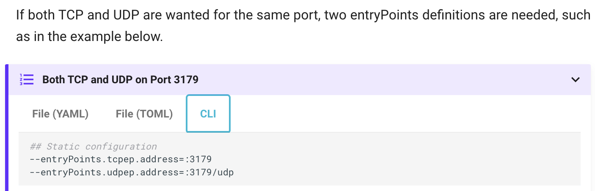
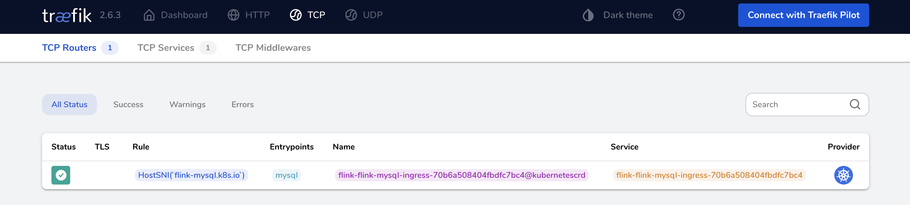

云原生为我们的DevOps带来了巨大的便利，但同时对新技术栈学习也带来新的挑战。以本文所介绍的为例，传统的开发方式中，我们通常使用Nginx作为反向代理实现网络流量的转发（HTTP、HTTPS以及TCP等），在容器的世界里同样提供了这样一个利器`Traefik`。HTTP流量的代理比较简单，本文以MySQL为例实现TCP代理，使我们在外部访问MySQL服务。以方便Navicat等客户端或其它服务的连接。

<!--more-->

本文假设你已经拥有一个Kubernetes集群，且本地已完成helm和kubectl的相关配置。如果没有，可以搜索我的其它文章。

## 准备步骤

### 安装Traefik

#### 准备values.yaml

这是我的配置文件，可按需补充你自己的配置。

```yaml
---
additionalArguments:
  - --entrypoints.mysql.address=:3306/tcp  
ingressRoute:
  dashboard:
    enabled: true
```

`--entrypoints.mysql.address=:3306/tcp`这行是定义entryPoints的关键，我在学习的过程中就忽略了这个配置，因为在官方文档中并没有提及。此处的配置和官网`CLI`选项卡下的配置一致，请看下图：



#### 通过Helm安装Traefik

```shell
# 全新安装
helm install traefik traefik/traefik --namespace=traefik --values=traefik-chart-values.yaml
# 升级
helm upgrade traefik traefik/traefik --namespace=traefik --values=traefik-chart-values.yaml
```

### 部署MySQL

将下方代码片段保存为`mysql-deployment.yaml`文件，然后执行``kubectl apply -f mysql-deployment.yaml`，注意首先要将`「YOUR_MYSQL_PASSWORD」`位置填入你自己生成的代码，生成命令为 `echo -n "1234567890" | base64`

```yaml
# https://kubernetes.io/zh/docs/tasks/run-application/run-replicated-stateful-application/
apiVersion: v1
kind: Secret
metadata:
  namespace: flink
  name: flink-mysql-secret
type: Opaque
data:
  password: YXlrajgzNzUyNjYx  # echo -n "aykj83752661" | base64
---
apiVersion: v1
kind: ConfigMap
metadata:
  name: flink-mysql
  labels:
    app: mysql
data:
  my.cnf: |
    [mysqld]
    bind-address=0.0.0.0
---
apiVersion: v1
kind: Service
metadata:
  name: flink-mysql
  namespace: flink
  labels:
    app: flink
spec:
  ports:
    - port: 3306
      name: flink-mysql
      protocol: TCP
      targetPort: 3306
  type: LoadBalancer
  selector:
    app: flink
    tier: flink-mysql
---
apiVersion: v1
kind: PersistentVolumeClaim
metadata:
  namespace: flink
  name: mysql-pv-claim
  labels:
    app: flink
spec:
  accessModes:
    - ReadWriteOnce
  resources:
    requests:
      storage: 20Gi
---
apiVersion: apps/v1
kind: Deployment
metadata:
  namespace: flink
  name: flink-mysql
  labels:
    app: flink
spec:
  selector:
    matchLabels:
      app: flink
      tier: flink-mysql
  strategy:
    type: Recreate
  template:
    metadata:
      labels:
        app: flink
        tier: flink-mysql
    spec:
      containers:
        - image: mysql:8
          name: mysql
          env:
            - name: MYSQL_ROOT_PASSWORD
              valueFrom:
                secretKeyRef:
                  name: flink-mysql-secret
                  key: password
          ports:
            - containerPort: 3306
              name: flink-mysql
              protocol: TCP
          volumeMounts:
            - name: config-map
              mountPath: /etc/mysql/conf.d
            - name: mysql-persistent-storage
              mountPath: /var/lib/mysql
      volumes:
        - name: config-map
          configMap:
            name: flink-mysql
        - name: mysql-persistent-storage
          persistentVolumeClaim:
            claimName: mysql-pv-claim
```

### 配置Ingress

#### 创建IngressRouteTCP

保存为mysql-ingressroute.yaml，执行`kubectl apply -f mysql-ingressroute.yaml`

```yaml
apiVersion: traefik.containo.us/v1alpha1
kind: IngressRouteTCP
metadata:
  namespace: flink
  name: flink-mysql-ingress
spec:
  entryPoints:
    - mysql
  routes:
    - match: HostSNI(`mysql.k8s.io`)
      services:
      - name: flink-mysql
        namespace: flink
        port: 3306

```

#### 修改Hosts

添加到/etc/hosts

```shell
192.168.0.111 mysql.k8s.io
```

## 测试验证

### MySQL客户端连接

#### CLI命令行

```shell
./mysql -u root -p1234567890 -h mysql.k8s.io
```

#### DBeaver客户端


### Treafik控制台

切换到TCP的菜单我们能看到绿色的Status，这表示我们已经成功实现基于Traefik进行TCP流量转发。



## 参考资料

1. https://doc.traefik.io/traefik/routing/entrypoints/
2. https://community.traefik.io/t/tcp-on-kubernetes/1528/17
3. https://kubernetes.io/zh/docs/tasks/run-application/run-replicated-stateful-application/
