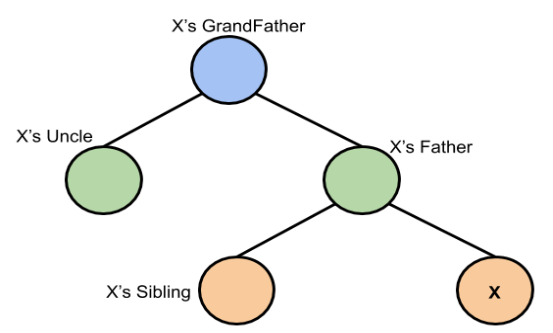
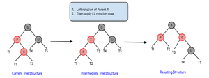
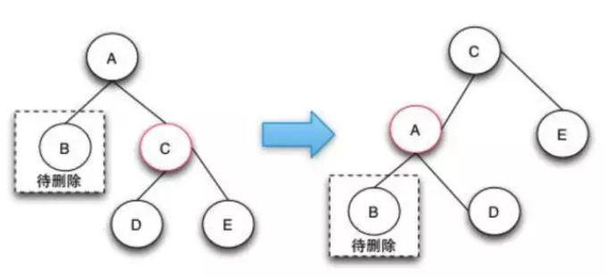
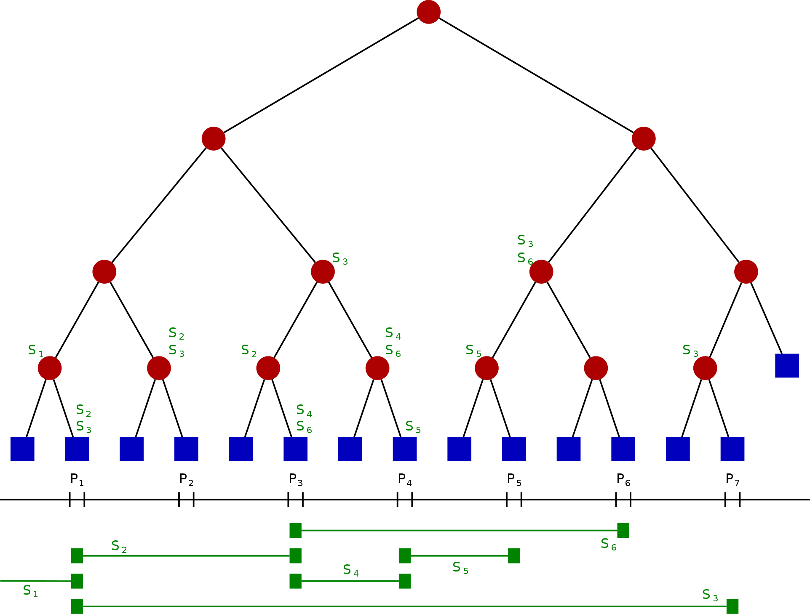

树是一种数据结构，它是由n(n≥0)个有限节点组成一个具有层次关系的集合。把它叫做“树”是因为它看起来像一棵倒挂的树，也就是说它是根朝上，而叶朝下的。它具有以下的特点：

1. 每个节点有零个或多个子节点；
2. 没有父节点的节点称为根节点；
3. 每一个非根节点有且只有一个父节点；
4. 除了根节点外，每个子节点可以分为多个不相交的子树。


<!--more-->

## 基本概念

二叉查找树（英语：Binary Search Tree），也称为二叉查找树、有序二叉树（ordered binary tree）或排序二叉树（sorted binary tree），是指一棵空树或者具有下列性质的二叉树：

1. 若任意节点的左子树不空，则左子树上所有节点的值均小于它的根节点的值；
2. 若任意节点的右子树不空，则右子树上所有节点的值均大于它的根节点的值；
3. 任意节点的左、右子树也分别为二叉查找树；

二叉查找树相比于其他数据结构的优势在于查找、插入的时间复杂度较低Olog(N)。二叉查找树是基础性数据结构，用于构建更为抽象的数据结构，如集合、多重集、关联数组等。

| 概念          | 解释                                                         |
| ------------- | ------------------------------------------------------------ |
| 度            | 二叉树的度是指树中所以结点的度数的最大值                     |
| 满二叉树      | 如果一棵二叉树的结点要么是叶子结点，要么它有两个子结点，这样的树就是满二叉树。 |
| 完全二叉树    | 一棵深度为k的有n个结点的二叉树，对树中的结点按从上至下、从左到右的顺序进行编号，<br />如果编号为i（1≤i≤n）的结点与满二叉树中编号为i的结点在二叉树中的位置相同，则这棵二叉树称为完全二叉树。 |
| 二叉搜索树BST | 它或者是一棵空树，或者是具有下列性质的二叉树：<br />1. 若它的左子树不空，则左子树上所有结点的值均小于它的根结点的值；<br />2. 若它的右子树不空，则右子树上所有结点的值均大于它的根结点的值； <br />3. 它的左、右子树也分别为二叉搜索树。 |
| 平衡二叉树AVL | 平衡二叉树本质上是特殊的二叉搜索树（二叉排序树），<br />它具有二叉搜索树所有的特点，此外它有自己的特别的性质，如下：<br />1. 它是一棵空树或它的左右两个子树的高度差的绝对值不超过1； <br />2. 平衡二叉树的左右两个子树都是一棵平衡二叉树。 |

## 二叉搜索树

### BST 二叉查找树（不平衡）

#### 搜索元素

1. 从根节点开始
2. 将搜索到的元素与根进行比较，如果小于根，则递归调用左子树，否则递归调用右子树
3. 如果在任何地方找到要搜索的元素，返回true，否则返回false

```java
public Node search(Node root, int key)
{
    // Base Cases: root is null or key is present at root
    if (root==null || root.key==key)
        return root;
    // Key is greater than root's key
    if (root.key < key)
       return search(root.right, key);
    // Key is smaller than root's key
    return search(root.left, key);
}
```

#### 插入元素

一个新的元素总是在叶子上插入。

我们从根部开始搜索，直到我们遇到一个叶子节点。一旦找到一个叶子节点，新的节点就被添加为叶子节点的子节点。

```java
class BinarySearchTree {
    /* Class containing left
       and right child of current node
     * and key value*/
    class Node {
        int key;
        Node left, right;
        public Node(int item)
        {
            key = item;
            left = right = null;
        }
    }
    // Root of BST
    Node root;
    // Constructor
    BinarySearchTree() { root = null; }
    BinarySearchTree(int value) { root = new Node(value); }
    // This method mainly calls insertRec()
    void insert(int key) { root = insertRec(root, key); }
    /* A recursive function to
       insert a new key in BST */
    Node insertRec(Node root, int key)
    {
        /* If the tree is empty,
           return a new node */
        if (root == null) {
            root = new Node(key);
            return root;
        }
        /* Otherwise, recur down the tree */
        if (key < root.key)
            root.left = insertRec(root.left, key);
        else if (key > root.key)
            root.right = insertRec(root.right, key);
        /* return the (unchanged) node pointer */
        return root;
    }
    // This method mainly calls InorderRec()
    void inorder() { inorderRec(root); }
    // A utility function to
    // do inorder traversal of BST
    void inorderRec(Node root)
    {
        if (root != null) {
            inorderRec(root.left);
            System.out.println(root.key);
            inorderRec(root.right);
        }
    }
    // Driver Code
    public static void main(String[] args)
    {
        BinarySearchTree tree = new BinarySearchTree();
        /* Let us create following BST
              50
           /     \
          30      70
         /  \    /  \
       20   40  60   80 */
        tree.insert(50);
        tree.insert(30);
        tree.insert(20);
        tree.insert(40);
        tree.insert(70);
        tree.insert(60);
        tree.insert(80);
        // print inorder traversal of the BST
        tree.inorder();
    }
}
```


### 平衡二叉树AVL

#### 概念

AVL树得名于它的发明者G. M. Adelson-Velsky和E. M. Landis，他们在1962年的论文《An algorithm for the organization of information》中发表了它。

AVL树是一种自平衡二叉树，它的平衡原则其实很简单，左右子树深度差不超过1。为了保证AVL树的基本性质不变，每次插入或删除节点之后，如果发现树的平衡原则被打破，就要**通过树的左右旋转重新调整树回到正确的平衡状态上**。

#### 树的旋转


#### 插入节点

在插入操作中，由于二叉排序树的性质，节点加入树中是必须遵守左小右大（或左大右小），所以二叉排序树的插入节点也需要安插在适合的位置。

但是树这种结构，如果你在半山腰插入一个元素，整个过程将影响一票节点，效率会降低很多，并且不好处理，这时候我们往往选择把节点插入在最后一层一个原本为空的位置上。举个例子：在下面树中插入一个新的节点4。


我们并不会在3和5之间插入节点4，具体插入过程是：

1. 从根5开始寻找，4比5小所以去左子树。
2. 新子树的根为3，4比3大所以去右子树。
3. 新子树根是空的，找到了要插入的位置，插入4。最终插入后的效果是：


#### 删除节点

删除操作跟插入一样，如果半山腰删除一个元素，第一是情况复杂不好处理，修改很多指针指向性能较差，所以删除我们也需要特殊处理，将结果往底层没有子孙的节点挪。

挪的方法就是找到要删除节点左子树的最右节点，或者右子树的最左节点。举个例子：在下面树中删除节点5。


我们用右子树的最左节点替换，过程是：

1. 去到5的右子树。
2. 从子树根向左遍历至最深，找到节点6，交换5和6。
3. 当前节点右子树不是空的，继续去右子树找最左节点，找到7，交换5和7。
4. 该节点没有孩子，删除节点5。过程图：
   

AVL树是一种自平衡二叉树，它的**平衡原则其实很简单，左右子树深度差不超过1**。为了保证AVL树的基本性质不变，每次插入或删除节点之后，如果发现树的平衡原则被打破，就要通过树的左右旋转重新调整树回到正确的平衡状态上。

所以说AVL树在存储的时候，除了基本树节点存储所需要携带的数据和左右子树的节点外，另外需要存储的是左右子树的高度（或者他们的高度差，但是高度差的维护并不比高度的维护简单），一旦发现左右子树高度差超过1就需要进行平衡调整。AVL树的平衡调整分为如下几种情况：


简单来说，孩子和孙子方向一致（都是左或者都是右），那么就简单一次旋转就能整理好，如果方向不一致（一左一右），先在孩子节点上把孙子节点转到同一方向上，然后再在父节点上按照刚刚方向一致的情况处理。

注意这么做之后，这棵子树的高度会发生变化，所以要在子树根（也就是刚刚的父节点）上回溯调用，在子树的父节点上重新分析，看刚刚的调整有没有在其他位置打破平衡原则，或者更新子树的父节点相关的数据。

#### 时间复杂度

这里大部分教材里面写的AVL树性能瓶颈就是每次平衡几乎都要回溯到根结点。但是AVL树其实并不是每次都要回溯到根的，比如下面这个过程，注意看左右子树高度值变化：


可以发现这时候，H节点的插入，除了C、D、H三个节点存在子树高度或者位置的变化，其他的节点并没有发生任何变化。所以AVL树的数据插入或删除的时间是根据树当前形态来的，不是很稳定。

### 红黑树

红黑树是一种自平衡的二叉搜索树，每个节点都有一个额外的bit来存储节点的颜色（红色或黑色）。这些颜色是用来确保树在插入和删除过程中保持平衡。虽然树的平衡性并不完美，但它足以减少搜索时间，并保持在``O(log n)``时间左右，其中n是树中元素的总数。这种树是由Rudolf Bayer在1972年发明的。


#### 与2-3树的比较


#### 不同操作的时间复杂度

大多数BST操作（如搜索、最大、最小、插入、删除等）需要O(h)时间，其中h是BST的高度。对于倾斜的二叉树，这些操作的成本可能变成O(n)。如果我们确保每次插入和删除后树的高度保持为O(log n)，那么我们可以保证所有这些操作的上界为O(log n)。**红黑树的高度总是O(log n)**，其中n是树上的节点数。

有n个节点的红黑树的高度<= 2Log2(n+1)

| Sr. No. | Algorithm | Time Complexity |
| :------ | :-------- | :-------------- |
| 1.      | Search    | O(log n)        |
| 2.      | Insert    | O(log n)        |
| 3.      | Delete    | O(log n)        |

#### 与AVL对比

与红黑树相比，AVL树更加平衡，但在插入和删除时可能会引起更多的旋转。因此，如果你的应用涉及频繁的插入和删除，那么红黑树应该是首选。而如果插入和删除不那么频繁，而搜索是一个更频繁的操作，那么AVL树应该比红黑树更受欢迎。

AVL插入节点时，每次都需要回溯到根节点。

#### 每棵红黑树都遵循的规则

1. 每个节点都有一个颜色，不是红色就是黑色。
2. 树的根部始终是黑色的。
3. 没有两个相邻的红色节点（一个红色节点不能有一个红色的父节点或红色的子节点）。
4. 从一个节点（包括根）到其任何后代NULL节点的每条路径都有相同数量的黑色节点。
5. 所有叶子节点都是黑色节点。

#### 如何保持平衡

在AVL树的插入中，我们用旋转作为工具来做插入后的平衡。在红黑树中，我们用两个工具来做平衡：重新着色、旋转。

重新着色是改变节点的颜色，即如果它是红色的，就把它改为黑色，反之亦然。必须注意的是，NULL节点的颜色始终是黑色的。此外，我们总是先尝试重新涂色，如果重新涂色不起作用，我们就进行旋转。下面是一个详细的算法。该算法主要有两种情况，取决于叔叔的颜色。如果叔叔是红色的，我们就进行重新着色。如果叔叔是黑色的，我们就进行旋转和/或重新着色。



#### 保持平衡：插入元素

##### 概述

首先，你必须在二叉树中插入类似的节点，并给它分配一个红色。现在，如果该节点是一个根节点，那么将其颜色改为黑色，但如果不是，则检查父节点的颜色。如果它的颜色是黑色的，那么不要改变颜色，但如果它不是，即它是红色的，那么检查节点的叔叔的颜色。如果节点的叔叔是红色的，那么就把节点的父节点和叔叔的颜色改为黑色，把祖父的颜色改为红色，然后对他（即祖父）重复同样的过程。


但是，如果节点的叔叔是黑色的，那么有4种可能的情况。

##### Left Left Case (LL rotation):


##### Left Right Case (LR rotation):

> 

##### Right Right Case (RR rotation)

> 

##### Right Left Case (RL rotation)

> 

- 旋转之后，如果节点的颜色不匹配，那么就对它们重新着色

#### 保持平衡：删除元素

##### 概述

删除操作首先需要做的也是BST的删除操作，删除操作会删除对应的节点，如果是叶子节点就直接删除，如果是非叶子节点，会用对应的中序遍历的后继节点来顶替要删除节点的位置。**删除后就需要做删除修复操作，使的树符合红黑树的定义**，符合定义的红黑树高度是平衡的。

删除修复操作在遇到被删除的节点是红色节点或者到达root节点时，修复操作完毕。

删除修复操作是针对删除黑色节点才有的，当黑色节点被删除后会让整个树不符合RBTree的定义的第四条。需要做的处理是从兄弟节点上借调黑色的节点过来，如果兄弟节点没有黑节点可以借调的话，就只能往上追溯，将每一级的黑节点数减去一个，使得整棵树符合红黑树的定义。

删除操作的总体思想是从兄弟节点借调黑色节点使树保持局部的平衡，如果局部的平衡达到了，就看整体的树是否是平衡的，如果不平衡就接着向上追溯调整。

删除修复操作分为四种情况(删除黑节点后)：

1. 待删除的节点的兄弟节点是红色的节点。
2. 待删除的节点的兄弟节点是黑色的节点，且兄弟节点的子节点都是黑色的。
3. 待调整的节点的兄弟节点是黑色的节点，且兄弟节点的左子节点是红色的，右节点是黑色的(兄弟节点在右边)，如果兄弟节点在左边的话，就是兄弟节点的右子节点是红色的，左节点是黑色的。
4. 待调整的节点的兄弟节点是黑色的节点，且右子节点是是红色的(兄弟节点在右边)，如果兄弟节点在左边，则就是对应的就是左节点是红色的。

##### 删除操作-Case 1

由于兄弟节点是红色节点的时候，无法借调黑节点，所以需要将兄弟节点提升到父节点，由于兄弟节点是红色的，根据RBTree的定义，兄弟节点的子节点是黑色的，就可以从它的子节点借调了。

case 1这样转换之后就会变成后面的case 2，case 3，或者case 4进行处理了。上升操作需要对C做一个左旋操作，如果是镜像结构的树只需要做对应的右旋操作即可。

之所以要做case 1操作是因为兄弟节点是红色的，无法借到一个黑节点来填补删除的黑节点。



##### 删除操作-Case 2

case 2的删除操作是由于兄弟节点可以消除一个黑色节点，因为兄弟节点和兄弟节点的子节点都是黑色的，所以可以将兄弟节点变红，这样就可以保证树的局部的颜色符合定义了。这个时候需要将父节点A变成新的节点，继续向上调整，直到整颗树的颜色符合RBTree的定义为止。

case 2这种情况下之所以要将兄弟节点变红，是因为如果把兄弟节点借调过来，会导致兄弟的结构不符合RBTree的定义，这样的情况下只能是将兄弟节点也变成红色来达到颜色的平衡。当将兄弟节点也变红之后，达到了局部的平衡了，但是对于祖父节点来说是不符合定义4的。这样就需要回溯到父节点，接着进行修复操作。


##### 删除操作-Case 3

case 3的删除操作是一个中间步骤，它的目的是将左边的红色节点借调过来，这样就可以转换成case 4状态了，在case 4状态下可以将D，E节点都阶段过来，通过将两个节点变成黑色来保证红黑树的整体平衡。

之所以说case-3是一个中间状态，是因为根据红黑树的定义来说，下图并不是平衡的，他是通过case 2操作完后向上回溯出现的状态。之所以会出现case 3和后面的case 4的情况，是因为可以通过借用侄子节点的红色，变成黑色来符合红黑树定义4。


##### 删除操作-Case 4

Case 4的操作是真正的节点借调操作，通过将兄弟节点以及兄弟节点的右节点借调过来，并将兄弟节点的右子节点变成红色来达到借调两个黑节点的目的，这样的话，整棵树还是符合RBTree的定义的。

Case 4这种情况的发生只有在待删除的节点的兄弟节点为黑，且子节点不全部为黑，才有可能借调到两个节点来做黑节点使用，从而保持整棵树都符合红黑树的定义。


##### 删除操作的总结

红黑树的删除操作是最复杂的操作，复杂的地方就在于当删除了黑色节点的时候，如何从兄弟节点去借调节点，以保证树的颜色符合定义。由于红色的兄弟节点是没法借调出黑节点的，这样只能通过选择操作让他上升到父节点，而由于它是红节点，所以它的子节点就是黑的，可以借调。

对于兄弟节点是黑色节点的可以分成3种情况来处理，当所以的兄弟节点的子节点都是黑色节点时，可以直接将兄弟节点变红，这样局部的红黑树颜色是符合定义的。但是整颗树不一定是符合红黑树定义的，需要往上追溯继续调整。

对于兄弟节点的子节点为左红右黑或者 (全部为红，右红左黑)这两种情况，可以先将前面的情况通过选择转换为后一种情况，在后一种情况下，因为兄弟节点为黑，兄弟节点的右节点为红，可以借调出两个节点出来做黑节点，这样就可以保证删除了黑节点，整棵树还是符合红黑树的定义的，因为黑色节点的个数没有改变。

红黑树的删除操作是遇到删除的节点为红色，或者追溯调整到了root节点，这时删除的修复操作完毕。

#### 总结

作为平衡二叉查找树里面众多的实现之一，红黑树无疑是最简洁、实现最为简单的。红黑树通过引入颜色的概念，通过**颜色这个约束条件的使用来保持树的高度平衡**。作为平衡二叉查找树，旋转是一个必不可少的操作。通过旋转可以降低树的高度，在红黑树里面还可以转换颜色。

红黑树里面的插入和删除的操作比较难理解，这时要注意记住一点：操作之前红黑树是平衡的，颜色是符合定义的。在操作的时候就需要向兄弟节点、父节点、侄子节点借调和互换颜色，要达到这个目的，就需要不断的进行旋转。所以红黑树的插入删除操作需要不停的旋转，一旦借调了别的节点，删除和插入的节点就会达到局部的平衡（局部符合红黑树的定义），但是被借调的节点就不会平衡了，这时就需要以被借调的节点为起点继续进行调整，直到整棵树都是平衡的。在整个修复的过程中，插入具体的分为3种情况，删除分为4种情况。

整个红黑树的查找，插入和删除都是O(logN)的，原因就是整个红黑树的高度是logN，查找从根到叶，走过的路径是树的高度，删除和插入操作是从叶到根的，所以经过的路径都是logN。

### 相关题目

#### 二叉搜索树的众数[leetcode 501]

https://leetcode-cn.com/problems/find-mode-in-binary-search-tree/

```go
func findMode(root *TreeNode) (answer []int) {
   var dfs func(*TreeNode)
   var maxCount, base, count int
   // 对inorder有序遍历进行处理
   update := func(value int) {
      if base == value {
         count++
      } else {
         // 此处count为何是1？
         base, count = value, 1
      }
      if count == maxCount {
         answer = append(answer, base)
      } else if count > maxCount {
         // 此处base是符合条件的answer
         answer = []int{base}
         maxCount = count
      }
   }
   // inorder遍历把BST转变为有序数组的遍历
   dfs = func(node *TreeNode) {
      if node == nil {
         return
      }
      if node.Left != nil {
         dfs(node.Left)
      }
      update(node.Val)
      if node.Right != nil {
         dfs(node.Right)
      }
   }
   dfs(root)
   return
}
```

#### 最近的公共祖先[leetcode 235]

根据BST的性质，如果p/q的值都大于root，则最近公共祖先在root右侧，反之在左侧。以此递归。

https://leetcode-cn.com/problems/lowest-common-ancestor-of-a-binary-search-tree/

```go
func lowestCommonAncestor(root, p, q *TreeNode) *TreeNode {
   if root.Val > p.Val && root.Val > q.Val {
      return lowestCommonAncestor(root.Left, p, q)
   } else if root.Val < p.Val && root.Val < q.Val {
      return lowestCommonAncestor(root.Right, p, q)
   } else {
      return root
   }
}
```

#### 有序数组转二叉树

https://leetcode-cn.com/problems/minimum-height-tree-lcci/

```go
func sortedArrayToBST(nums []int) *TreeNode {
   var helper func(nums []int, left int, right int) *TreeNode
   helper = func(nums []int, left int, right int) *TreeNode {
      if left > right {
         return nil
      }
      mid := left + ((right - left) / 2)
      node := &TreeNode{Val: nums[mid]}
      node.Left = helper(nums, left, mid-1)
      node.Right = helper(nums, mid+1, right)
      return node
   }
   return helper(nums, 0, len(nums)-1)
}
```

#### 恢复二叉树

找到第一个递减的后值，和第二个递减的前值；然后交换他们的位置。

https://leetcode-cn.com/problems/recover-binary-search-tree/

```go
func recoverTree(root *TreeNode) {
   // 中序遍历的实现有迭代和递归两种等价的写法，在本方法中提供迭代实现的写法。使用迭代实现中序遍历需要手动维护栈。
   stack := []*TreeNode{}
   var x, y, pred *TreeNode
   for len(stack) > 0 || root != nil {
      for root != nil {
         stack = append(stack, root)
         root = root.Left
      }
      root = stack[len(stack)-1]
      stack = stack[:len(stack)-1]
      if pred != nil && root.Val < pred.Val {
         y = root
         if x == nil {
            x = pred
         } else {
            break
         }
      }
      pred = root
      root = root.Right
   }
   x.Val, y.Val = y.Val, x.Val
}
```

## 霍夫曼树 huffman

### 概念

哈夫曼（Huffman）树又称作最优二叉树，它是n个带权叶子结点构成的所有二叉树中，*带权路径长度*最小的二叉树。

“路径”就是从树中的一个结点到另一个结点之间的分支构成的部分，而*分支的数目就是路径长度*。

*树的路径长度*：就是从树根到每一结点的路径长度之和。

*树*的*带权路径长度WPL(weighted path length)*：树中所有叶子结点的带权路径长度之和。

### 树的带权路径长度

设二叉树具有 个带权叶结点，从根结点到各叶结点的路径长度与相应叶节点权值的乘积之和称为 **树的带权路径长度（Weighted Path Length of Tree，WPL）**。

设 为二叉树地 个叶结点的权值， 为从根结点到第 个叶结点的路径长度，则 WPL 计算公式如下：


如上图所示，其 WPL 计算过程与结果如下：


### 结构

对于给定一组具有确定权值的叶结点，可以构造出不同的二叉树，其中，**WPL 最小的二叉树** 称为 **霍夫曼树（Huffman Tree）**。

对于霍夫曼树来说，其叶结点权值越小，离根越远，叶结点权值越大，离根越近，此外其仅有叶结点的度为 ，其他结点度均为 。

### 构造霍夫曼树

霍夫曼算法用于构造一棵霍夫曼树，算法步骤如下：

1. **初始化**：由给定的 个权值构造 棵只有一个根节点的二叉树，得到一个二叉树集合 。
2. **选取与合并**：从二叉树集合 中选取根节点权值 **最小的两棵** 二叉树分别作为左右子树构造一棵新的二叉树，这棵新二叉树的根节点的权值为其左、右子树根结点的权值和。
3. **删除与加入**：从 中删除作为左、右子树的两棵二叉树，并将新建立的二叉树加入到 中。
4. 重复 2、3 步，当集合中只剩下一棵二叉树时，这棵二叉树就是霍夫曼树。


### 依照Huffman Tree进行解码


假设我们手边有一棵Huffman Tree（如上图所示），以及一段神秘字串「11100100100111000110010110100111101110010010011」。现在我们来解码这段字串。

首先从图中的root（标示着18的节点）出发。由于神秘字串的第一个数字为1，所以我们沿着标示着1的箭头走，抵达右侧的子节点。接着，第二个数字为1，故我们同样走向右侧的子节点。第三个数字为1，因此我们最后抵达了「t」。所以「111」解码后的内容为「t」，或者说「t」所对应的编码为「111」。

重复以上步骤，尝试解码这段字串，最后会得到「to be or not to be」。

生成霍夫曼树：https://www.csfieldguide.org.nz/en/interactives/huffman-tree/

### 用途

赫夫曼编码就是一种前缀编码， 它能解决不等长编码时的译码问题。通过它，我们既能尽可能减少编码的长度， 同时还能够**避免二义性**实现正确译码。霍夫曼编码是一种经典的数据压缩方法，可以压缩图像、音频、表格等。这种压缩方案主要用于JPEG和MPEG-2。

## B系列查找树

### B-树

B+树，由二叉树和双向链表引申出来的一种数据结构。 通常数据库的索引是通过B+Tree来实现的。聚集索引和非聚集索引都是B+Tree的结构。


B-树：多路搜索树，每个结点存储M/2到M个关键字，非叶子结点存储指向关键字范围的子结点；所有关键字在整颗树中出现，且只出现一次，非叶子结点可以命中；

### B+树

B+树：在B-树基础上，为叶子结点增加链表指针，所有关键字都在叶子结点中出现，**非叶子结点作为叶子结点的索引**；B+树**总是到叶子结点才命中**；


可视化演示：https://www.cs.usfca.edu/~galles/visualization/BPlusTree.html

## 字典树 Trie

### 基本介绍

是一种**空间换时间**的数据结构，又称Trie树、前缀树，是一种树形结构(字典树是一种数据结构)，典型用于**统计、排序、和保存大量字符串**。所以经常被搜索引擎系统用于文本词频统计。

它的优点是：利用字符串的公共前缀来减少查询时间，最大限度地减少无谓的字符串比较，**查询效率比哈希树高**。

对于字典树，有三个重要性质：

1. 根节点不包含字符，除了根节点每个节点都只包含一个字符。root节点不含字符这样做的目的是为了能够包括所有字符串。
2. 从根节点到某一个节点，路过字符串起来就是该节点对应的字符串。
3. 每个节点的子节点字符不同，也就是找到对应单词、字符是唯一的。


### 实现

Trie，又称前缀树或字典树，是一棵有根树，其每个节点包含以下字段：

1. 指向子节点的指针数组 children。对于本题而言，数组长度为 26，即小写英文字母的数量。此时 children[0] 对应小写字母 a,children[1] 对应小写字母 b，..,children[25] 对应小写字母 z。
2. 布尔字段 isEnd，表示该节点是否为字符串的结尾。

#### 插入字符串

我们从字典树的根开始，插入字符串。对于当前字符对应的子节点，有两种情况：

> 子节点存在。沿着指针移动到子节点，继续处理下一个字符。
> 子节点不存在。创建一个新的子节点，记录在children 数组的对应位置上，然后沿着指针移动到子节点，继续搜索下一个字符。

重复以上步骤，直到处理字符串的最后一个字符，然后将当前节点标记为字符串的结尾。


用数组的话如果字符比较多的话可能会消耗一些内存空间，但是这里26个连续字符还好的，如果向一个字典树中添加`big`,`bit`,`bz` 那么它其实是这样的：


#### 查找前缀

从字典树的根开始，查找前缀。对于当前字符对应的子节点，有两种情况：

> 子节点存在。沿着指针移动到子节点，继续搜索下一个字符。
> 子节点不存在。说明字典树中不包含该前缀，返回空指针。

重复以上步骤，直到返回空指针或搜索完前缀的最后一个字符。若搜索到了前缀的末尾，就说明字典树中存在该前缀，若前缀末尾对应节点的 **isEnd 为真，则说明字典树中存在该字符串**。

#### 代码

```go
type Trie struct {
    children [26]*Trie   // 注意点
    isEnd    bool
}
func Constructor() Trie {
    return Trie{}
}
func (t *Trie) Insert(word string) {
    node := t
    for _, ch := range word {
        ch -= 'a'		// ch 为数组索引
        if node.children[ch] == nil {
            node.children[ch] = &Trie{}
        }
        node = node.children[ch]
    }
    node.isEnd = true
}
func (t *Trie) SearchPrefix(prefix string) *Trie {
    node := t
    for _, ch := range prefix {
        ch -= 'a'
        if node.children[ch] == nil {
            return nil
        }
        node = node.children[ch]  // 指针移到子节点
    }
    return node
}  
```

### 应用场景

#### 字符串检索

事先将已知的一些字符串（字典）的有关信息保存到trie树里，查找另外一些未知字符串是否出现过或者出现频率。举例：

> 给出N 个单词组成的熟词表，以及一篇全用小写英文书写的文章，请你按最早出现的顺序写出所有不在熟词表中的生词。
> 给出一个词典，其中的单词为不良单词。单词均为小写字母。再给出一段文本，文本的每一行也由小写字母构成。判断文本中是否含有任何不良单词。例如，若rob是不良单词，那么文本problem含有不良单词。

#### 字符串最长公共前缀
Trie树利用多个字符串的**公共前缀来节省存储空间**，反之，当我们把大量字符串存储到一棵trie树上时，我们可以快速得到某些字符串的公共前缀。举例：

> 给出N 个小写英文字母串，以及Q 个询问，即询问某两个串的最长公共前缀的长度是多少？
>
> 解决方案：首先对所有的串建立其对应的字母树。此时发现，对于两个串的最长公共前缀的长度即它们所在结点的公共祖先个数，于是，问题就转化为了离线（Offline）的最近公共祖先（Least Common Ancestor，简称LCA）问题。

而最近公共祖先问题同样是一个经典问题，可以用下面几种方法：

> 1. 利用并查集（Disjoint Set），可以采用采用经典的Tarjan 算法；
> 2. 求出字母树的欧拉序列（Euler Sequence ）后转为经典的最小值查询（Range Minimum Query，简称RMQ）问题；

#### 排序

Trie树是一棵多叉树，只要先序遍历整棵树，输出相应的字符串便是按字典序排序的结果。比如给你N 个互不相同的仅由一个单词构成的英文名，让你将它们按字典序从小到大排序输出。

#### 作为其他数据结构和算法的辅助结构
如后缀树，AC自动机等。

#### 词频统计
Trie树在这里的应用类似哈夫曼树，比如词频统计使用哈希表或者堆都可以，但是如果内存有限，就可以用Trie树来压缩空间，因为trie树的公共前缀都是用一个节点保存的。

#### 字符串搜索的前缀匹配
Trie树常用于搜索提示。如当输入一个网址，可以自动搜索出可能的选择。当没有完全匹配的搜索结果，可以返回前缀最相似的可能。Trie树检索的时间复杂度可以做到n，n是要检索单词的长度，如果使用暴力检索，需要指数级O(N2)的时间复杂度。

## 线段树

### 基本概念

线段树（segment tree），顾名思义， 是用来存放给定区间（segment, or interval）内对应信息的一种数据结构。与树状数组（binary indexed tree）相似，线段树也用来处理数组相应的区间查询（range query）和元素更新（update）操作。与树状数组不同的是，线段树不止可以适用于区间求和的查询，也可以进行区间最大值，区间最小值（Range Minimum/Maximum Query problem）或者区间异或值的查询。

一个包含 n 个区间的线段树，空间复杂度为 O(n) ，查询的时间复杂度则为O(logn+k) ，其中 k 是符合条件的区间数量。线段树的数据结构也可推广到高维度。



令 S 是一维线段的集合。将这些线段的端点坐标由小到大排序，令其为x1,x2,⋯,xm 。我们将被这些端点切分的每一个区间称为“单位区间”（每个端点所在的位置会单独成为一个单位区间），从左到右包含：
$$
(−∞,x1),[x1,x1],(x1,x2),[x2,x2],...,(xm−1,xm),[xm,xm],(xm,+∞)
$$
线段树的结构为一个二叉树，每个节点都代表一个坐标区间，节点 N 所代表的区间记为 Int(N)，则其需符合以下条件：

- 其每一个叶节点，从左到右代表每个单位区间。
- 其内部节点代表的区间是其两个儿子代表的区间之并集。
- 每个节点（包含叶子）中有一个存储线段的数据结构。若一个线段 S 的坐标区间包含 Int(N) 但不包含 Int(parent(N))，则节点 N 中会存储线段 S。


线段树是二叉树，其中每个节点代表一个区间。通常，一个节点将存储一个或多个合并的区间的数据，以便可以执行查询操作。

### 用途

线段树适用于和区间统计有关的问题。比如某些数据可以按区间进行划分，按区间动态进行修改，而且还需要按区间多次查询，那么使用线段树可以达到较快的速度

## 跳表

1. skiplist的复杂度和红黑树一样，而且实现起来更简单。
2. 在并发环境下skiplist有另外一个优势，红黑树在插入和删除的时候可能需要做一些rebalance的操作，这样的操作可能会涉及到整个树的其他部分，而skiplist的操作显然更加局部性一些，锁需要盯住的节点更少，因此在这样的情况下性能好一些。
3. JDK中ConcurrentSkipListMap是基于跳表实现的有序、线程安全的
4. 跳表在redis的set中被使用。

### 查找

查找元素，是通过头节点，先尽最大努力往右，再往下，再往右，每一层都要尽最大努力往右，直到右边的索引比目标值大为止，到达0层的时候再按照链表的方式来遍历，用图来表示如下（这里的指针，在索引中叫作right，在链表中叫作next，是不一样的）


所以，整个过程分成两大步：

1. 寻找目标节点前面最接近的索引对应的节点；

2. 按链表的方式往后遍历；

## 二叉堆

### 基本概念

从二叉堆的结构说起，它是一棵二叉树，并且是**完全二叉树**，每个结点中存有一个元素（或者说，有个权值）。

堆性质：父亲的权值不小于儿子的权值（大根堆）。同样的，我们可以定义小根堆。本文以大根堆为例。由堆性质，树根存的是最大值（getmax 操作就解决了）。

### 建堆

考虑这么一个问题，从一个空的堆开始，插入 个元素，不在乎顺序。

直接一个一个插入需要 的时间，有没有更好的方法？

#### 方法一：使用向上调整

从根开始，按 `BFS 序`进行。

```c
void build_heap_1() {
  for (i = 1; i <= n; i++) up(i);
}
```

为啥这么做：对于第`k`层的结点，向上调整的复杂度为`O(k)`而不是`O(logn)` ，总复杂度：`O(nlogn)`。

#### 方法二：使用向下调整

这时换一种思路，从叶子开始，逐个向下调整

```c
void build_heap_2() {
  for (i = n; i >= 1; i--) down(i);
}
```

换一种理解方法，每次「合并」两个已经调整好的堆，这说明了正确性。

注意到向下调整的复杂度为`O(logn-k)` ，另外注意到叶节点无需调整，因此可从序列约`n/2` 的位置开始调整，可减少部分常数但不影响复杂度，总复杂度为 `O(n)`。

之所以能`O(n)`建堆，是因为堆性质很弱，二叉堆并不是唯一的。

### 插入节点

插入操作是指向二叉堆中插入一个元素，要保证插入后也是一棵完全二叉树。

最简单的方法就是，最下一层最右边的叶子之后插入。

如果最下一层已满，就新增一层。

插入之后可能会不满足堆性质？

**向上调整**：如果这个结点的权值大于它父亲的权值，就交换，重复此过程直到不满足或者到根。

可以证明，插入之后向上调整后，没有其他结点会不满足堆性质。

向上调整的时间复杂度是`O(logn)`的。


### 删除节点

时间复杂度 Olog(n)，取决于树的高度。

删除操作指删除堆中最大的元素，即删除根结点。

但是如果直接删除，则变成了两个堆，难以处理。

所以不妨考虑插入操作的逆过程，设法将根结点移到最后一个结点，然后直接删掉。

然而实际上不好做，我们通常采用的方法是，把根结点和最后一个结点直接交换。

于是直接删掉（在最后一个结点处的）根结点，但是新的根结点可能不满足堆性质……

**向下调整**：在该结点的儿子中，找一个最大的，与该结点交换，重复此过程直到底层。

可以证明，删除并向下调整后，没有其他结点不满足堆性质。

### 基于数组实现

我们发现，上面介绍的几种操作主要依赖于两个核心：向上调整和向下调整。考虑使用一个序列 来表示堆。 的两个儿子分别是 和 ， 是根结点：


参考代码（大顶堆向下取整）：

```c
type heap struct{
    m []int
    len int //堆中有多少元素
}

func main() {
    m := []int{0,9,3,6,2,1,7} //第0个下标不放目标元素
    h := buildHeap(m) //建堆，返回一个heap结构
    h.Push(50)
    h.Pop()
    fmt.Println(h.m)
}
/**
  建堆，就是在原切片上操作，形成堆结构
  只要按照顺序，把切片下标为n/2到1的节点依次堆化，最后就会把整个切片堆化
 */
func buildHeap(m []int) *heap{
    n := len(m)-1
    for i:=n/2; i>0; i-- {
        heapf(m, n, i)
    }
    return &heap{m,n}
}
func (h *heap)Push(data int) {
    h.len++
    h.m = append(h.m, data)//向切片尾部插入数据（推断出父节点下标为i/2）
    i := h.len
    for i/2 >0 && h.m[i/2]<h.m[i] { //自下而上的堆化
        h.m[i/2], h.m[i] = h.m[i], h.m[i/2]
        i = i/2
    }
}
/**
	弹出堆顶元素，为防止出现数组空洞，需要把最后一个元素放入堆顶，然后从上到下堆化
 */
func (h *heap)Pop() int{
    if h.len < 1 {
        return -1
    }
    out := h.m[1]
    h.m[1] = h.m[h.len] //把最后一个元素给堆顶
    h.len--
    //对堆顶节点进行堆化即可
    heapf(h.m, h.len, 1)
    return out
}
//对下标为i的节点进行堆化， n表示堆的最后一个节点下标
//2i,2i+1
func heapf(m []int, n,i int) {
    for {
        maxPos := i
        if 2*i<= n && m[2*i] > m[i] {
            maxPos = 2*i
        }
        if 2*i+1 <=n && m[2*i+1] > m[maxPos] {
            maxPos = 2*i + 1
        }
        if maxPos == i { //如果i节点位置正确，则退出
            break
        }
        m[i],m[maxPos] = m[maxPos],m[i]
        i = maxPos
    }
}
```

### 应用

#### 优先级队列
合并 n 个有序小文件 把 n 个有序的小文件的第一个元素取出，放入堆中，取出堆顶到大文件，然后再从小文件中取出一个加入到堆，这样就把小文件的元素合并到大文件中了。

#### 用堆求 Top K

从一堆数据中找出前 k 大的数据

> a. 针对静态数据（数据不变） 建立大小为 K 的小顶堆，遍历数组，数组元素与堆顶比较，比堆顶大，就把堆顶删除，并插入该元素到堆 
>
> b. 针对动态数据（数据不断插入更新的） 在动态数据插入的时候就与堆顶比较，看是否入堆，始终维护这个堆，需要的时候直接返回，最坏 O (n*lgK)

#### 海量关键词搜索记录，求搜索次数 topK
a. 先用 hashTable 去重，并累加搜索次数

b. 再建立大小为 K 的小顶堆，遍历散列表，次数大于堆顶的，顶替堆顶入堆（就是应用 2 的解法）

散列表很大时，超出内存要求

建立 n 个空文件，对搜索关键词求哈希值，哈希值对 n 取模，得到该关键词被分到的文件号（0 到 n-1）

对每个文件，利用散列和堆，分别求出 topK，然后把 n 个 topK（比如 10 个 Top 20，200 很小了吧）放在一起，出现次数最多的 K（20）个关键词就是这海量数据里搜索最频繁的。

## 参考资料

1. https://www.geeksforgeeks.org/red-black-tree-set-1-introduction-2/?ref=lbp
2. https://tech.meituan.com/2016/12/02/redblack-tree.html
3. https://medium.com/@bhch3n/huffman-coding-%E9%9C%8D%E5%A4%AB%E6%9B%BC%E7%B7%A8%E7%A2%BC-3879df5ecddc