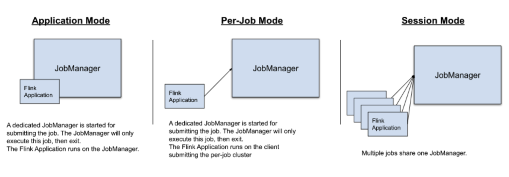
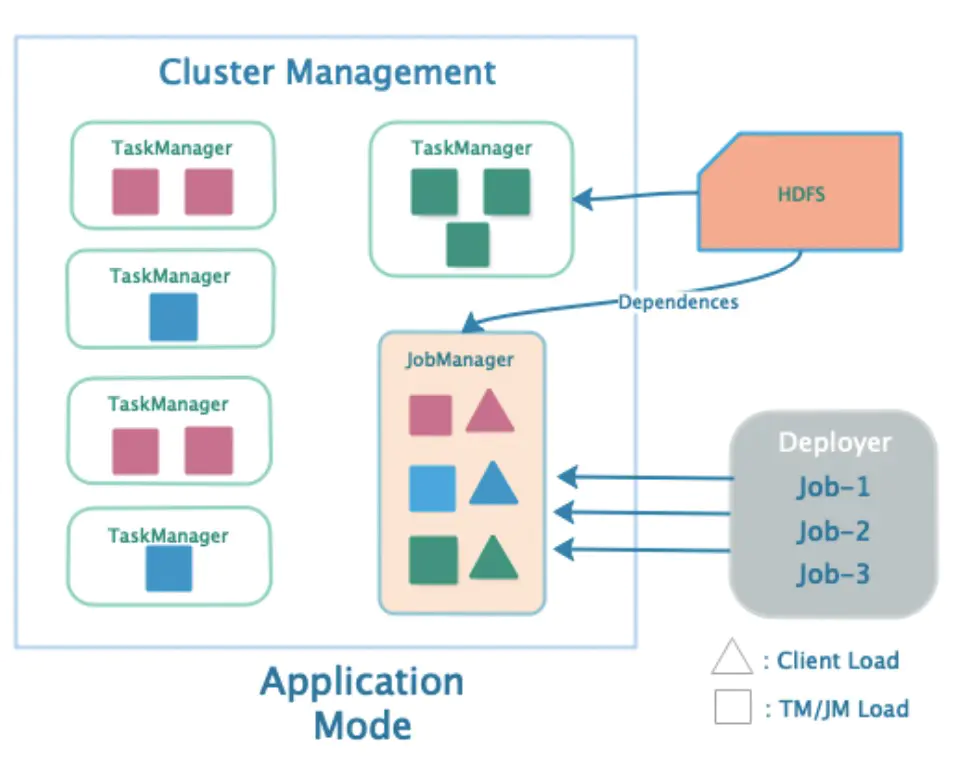

K3s 是一个轻量级的 Kubernetes 发行版，它针对边缘计算、物联网等场景进行了高度优化，并且可用于生产环境。Kubernetes 是一个 10 个字母的单词，简写为 K8s。所以，有 Kubernetes 一半大的东西就是一个 5 个字母的单词，简写为 K3s。K3s 没有全称，也没有官方的发音。因为公司开发需要，准备搭建一个Flink集群。

比较过Yarn和Native安装方法，都觉得后期运维比较麻烦Kubernetes相对来讲比较通用，可以方便迁移到公有云并创建1:1的运行环境。


<!--more-->

在Kubernetes上运行Apache Flink将带来以下好处：

- **Scalability**: 按需弹性调整资源
- **Reliability**: 当Flink节点异常崩溃后，一个新的节点会被自动启动
- **Portability**: 适用于几乎所有的云设施及本地的测试环境
- **Cost-effectiveness**: 降低系统维护成本
- **Monitoring**: 设置专门的监控系统

## 准备K3S环境

### 安装K3S

systemctl restart k3s

### 安装Traefik

### 安装Kubernetes Dashboard

## 部署Flink

Flink的部署支持Application、Cluster和Session Cluster三种模式，目前在K8s中仅支持Application Mode和Session Mode。



集群之间的区别在于：

- 集群的运行和资源是相互否隔离
- 应用的main方法在客户端或集群中是否被执行

|                                    | Session Cluster | Job Cluster | Application Cluster |
| ---------------------------------- | --------------- | ----------- | ------------------- |
| Standalone（包括on Docker，on K8s) | 支持            | 不支持      | 支持                |
| Native Kubernetes                  | 支持            | 不支持      | 支持                |
| YARN                               | 支持            | 支持        | 支持                |

### Session Cluster Mode

#### 基本介绍

Flink Session Cluster集群部署模式也称为session mode。该模式集群会预先启动、长时间运行，并且能够接收多个job提交运行。也就是提交到集群的job共享一套flink runtime cluster（JobManager和TaskManager）。


该模式特点如下：

> - 集群生命周期：独立于任务，任务的开始、结束等不影响集群的生命周期。
> - 集群的资源隔离：所有任务都运行在一个集群上面，所以隔离性差。Flink的Slot仅能隔离内存，并不能隔离CPU资源。而且一个任务如果把TaskManager搞挂了，那上面的其它任务也会受牵连。
> - `main()`方法在Client侧执行。

#### 资源文件

##### configmap.yaml

```yaml
apiVersion: v1
kind: ConfigMap
metadata:
  namespace: flink
  name: flink-config
  labels:
    app: flink
data:
  # https://nightlies.apache.org/flink/flink-docs-release-1.14/docs/deployment/config/
  flink-conf.yaml: |+
    jobmanager.rpc.address: flink-jobmanager-rpc
    taskmanager.numberOfTaskSlots: 4
    blob.server.port: 6124
    jobmanager.rpc.port: 6123
    taskmanager.rpc.port: 6122
    queryable-state.proxy.ports: 6125
    jobmanager.memory.process.size: 2g
    taskmanager.memory.process.size: 2g
    parallelism.default: 1
    state.backend: filesystem
    state.checkpoints.dir: /opt/flink/data/checkpoints
    state.savepoints.dir: /opt/flink/data/savepoints
    web.cancel.enable: true

  log4j-console.properties: |+
    # 如下配置会同时影响用户代码和 Flink 的日志行为
    rootLogger.level = INFO
    rootLogger.appenderRef.console.ref = ConsoleAppender
    rootLogger.appenderRef.rolling.ref = RollingFileAppender

    # 如果你只想改变 Flink 的日志行为则可以取消如下的注释部分
    #logger.flink.name = org.apache.flink
    #logger.flink.level = INFO

    # 下面几行将公共 libraries 或 connectors 的日志级别保持在 INFO 级别。
    # root logger 的配置不会覆盖此处配置。
    # 你必须手动修改这里的日志级别。
    logger.akka.name = akka
    logger.akka.level = INFO
    logger.kafka.name= org.apache.kafka
    logger.kafka.level = INFO
    logger.hadoop.name = org.apache.hadoop
    logger.hadoop.level = INFO
    logger.zookeeper.name = org.apache.zookeeper
    logger.zookeeper.level = INFO

    # 将所有 info 级别的日志输出到 console
    appender.console.name = ConsoleAppender
    appender.console.type = CONSOLE
    appender.console.layout.type = PatternLayout
    appender.console.layout.pattern = %d{yyyy-MM-dd HH:mm:ss,SSS} %-5p %-60c %x - %m%n

    # 将所有 info 级别的日志输出到指定的 rolling file
    appender.rolling.name = RollingFileAppender
    appender.rolling.type = RollingFile
    appender.rolling.append = false
    appender.rolling.fileName = ${sys:log.file}
    appender.rolling.filePattern = ${sys:log.file}.%i
    appender.rolling.layout.type = PatternLayout
    appender.rolling.layout.pattern = %d{yyyy-MM-dd HH:mm:ss,SSS} %-5p %-60c %x - %m%n
    appender.rolling.policies.type = Policies
    appender.rolling.policies.size.type = SizeBasedTriggeringPolicy
    appender.rolling.policies.size.size=100MB
    appender.rolling.strategy.type = DefaultRolloverStrategy
    appender.rolling.strategy.max = 10

    # 关闭 Netty channel handler 中不相关的（错误）警告
    logger.netty.name = org.jboss.netty.channel.DefaultChannelPipeline
    logger.netty.level = OFF
```

##### job-manager-service.yaml

```yaml
apiVersion: v1
kind: Service
metadata:
  name: flink-jobmanager-rest
  namespace: flink
spec:
  type: NodePort
  ports:
    - name: rest
      port: 8081
      targetPort: 8081
  selector:
    app: flink
    component: jobmanager
---
apiVersion: v1
kind: Service
metadata:
  name: flink-jobmanager-rpc
  namespace: flink
spec:
  type: NodePort
  ports:
    - name: rpc
      port: 6123
      targetPort: 6123
  selector:
    app: flink
    component: jobmanager
```

##### jobmanager-session-dep-ha.yaml

```yaml
apiVersion: apps/v1
kind: Deployment
metadata:
  name: flink-jobmanager
  namespace: flink
spec:
  replicas: 1 # 通过设置大于 1 的整型值来开启 Standby JobManager
  selector:
    matchLabels:
      app: flink
      component: jobmanager
  template:
    metadata:
      labels:
        app: flink
        component: jobmanager
    spec:
      containers:
        - name: jobmanager
          image: apache/flink:1.14.4-scala_2.11
          env:
            - name: POD_IP
              valueFrom:
                fieldRef:
                  apiVersion: v1
                  fieldPath: status.podIP
          # 下面的 args 参数会使用 POD_IP 对应的值覆盖 config map 中 jobmanager.rpc.address 的属性值。
          args: ["jobmanager"]
#          args: ["jobmanager", "$(POD_IP)"]
          ports:
            - containerPort: 6123
              name: rpc
            - containerPort: 6124
              name: blob-server
            - containerPort: 8081
              name: webui
          livenessProbe:
            tcpSocket:
              port: 6123
            initialDelaySeconds: 30
            periodSeconds: 60
          volumeMounts:
            - name: flink-config-volume
              mountPath: /opt/flink/conf
            - name: state-savepoints-volume
              mountPath: /opt/flink/data/savepoints
            - name: state-checkpoints-volume
              mountPath: /opt/flink/data/checkpoints
          securityContext:
            runAsUser: 9999  # 参考官方 flink 镜像中的 _flink_ 用户，如有必要可以修改
      serviceAccountName: flink # 拥有创建、编辑、删除 ConfigMap 权限的 Service 账号
      volumes:
        - name: flink-config-volume
          configMap:
            name: flink-config
            items:
              - key: flink-conf.yaml
                path: flink-conf.yaml
              - key: log4j-console.properties
                path: log4j-console.properties
        - name: state-savepoints-volume
          hostPath:
            # directory location on host
            path: /var/flink/state/savepoints
            # this field is optional
            type: Directory
        - name: state-checkpoints-volume
          hostPath:
            # directory location on host
            path: /var/flink/state/checkpoints
            # this field is optional
            type: Directory
```

##### taskmanager-state-query-rest.yaml

```yaml
apiVersion: v1
kind: Service
metadata:
  name: flink-taskmanager-query-state
  namespace: flink
spec:
  type: NodePort
  ports:
    - name: query-state
      port: 6125
      targetPort: 6125
      nodePort: 30025
  selector:
    app: flink
    component: taskmanager
```

##### taskmanager-session-dep.yaml

```yaml
apiVersion: apps/v1
kind: Deployment
metadata:
  name: flink-taskmanager
  namespace: flink
spec:
  replicas: 2
  selector:
    matchLabels:
      app: flink
      component: taskmanager
  template:
    metadata:
      labels:
        app: flink
        component: taskmanager
    spec:
      containers:
        - name: taskmanager
          image: apache/flink:1.14.4-scala_2.11
          args: ["taskmanager"]
          ports:
            - containerPort: 6122
              name: rpc
            - containerPort: 6125
              name: query-state
          livenessProbe:
            tcpSocket:
              port: 6122
            initialDelaySeconds: 30
            periodSeconds: 60
          volumeMounts:
            - name: flink-config-volume
              mountPath: /opt/flink/conf/
          securityContext:
            runAsUser: 9999  # 参考官方 flink 镜像中的 _flink_ 用户，如有必要可以修改
      volumes:
        - name: flink-config-volume
          configMap:
            name: flink-config
            items:
              - key: flink-conf.yaml
                path: flink-conf.yaml
              - key: log4j-console.properties
                path: log4j-console.properties
```

### Flink Job Cluter（Per-Job Mode）

#### 基本介绍

Flink Job Cluster集群部署模式又称为per-job mode。该模式与Job绑定，集群管理器会为每个Job启动一个flink runtime cluster(JobManager和TaskManager)。Client会首先向集群管理器请求资源来启动JobManager，并将job提交给其内部的Dispatcher，TaskManager根据job的资源请求延迟分配启动的。该模式特点如下：

> - 集群生命周期：与任务生命周期同步，随任务运行而创建，随任务结束而消亡。
> - 集群的资源隔离：任务独占集群，隔离性最好。
> - `main()`方法在Client侧执行。

### Flink Application Cluster

#### 基本介绍

一个Application指包含一个或多个任务（Job）的程序，也就是包含多个`execute`或`executeAsync`。该模式下，一个Application动态创建一个属于自己专有的集群，Application内的所有任务共享该集群，很显然这是一种介于Session Cluster和Job Cluster之间的模式：不同Application之间是完全隔离的，类似Job Cluster；但一个Application内的任务是不隔离的，类似于Session Cluster。此时：



该模式特点如下：

> - 集群生命周期：与Application生命周期同步，随Application运行而创建，随Application结束而消亡。
> - 集群的资源隔离：Application之间隔离，Application内的所有任务共享集群，隔离性一般。
> - `main()`方法**在集群侧**执行。

## Operator方案

### Lyft提供的K8sOperator

https://github.com/lyft/flinkk8soperator

### 官方提供的Operator

https://nightlies.apache.org/flink/flink-kubernetes-operator-docs-main/

## 参考资料

1. https://nightlies.apache.org/flink/flink-docs-release-1.14/docs/deployment/resource-providers/native_kubernetes/
2. https://nightlies.apache.org/flink/flink-docs-master/zh/docs/deployment/config/
3. https://www.jianshu.com/p/3898dd13f079
