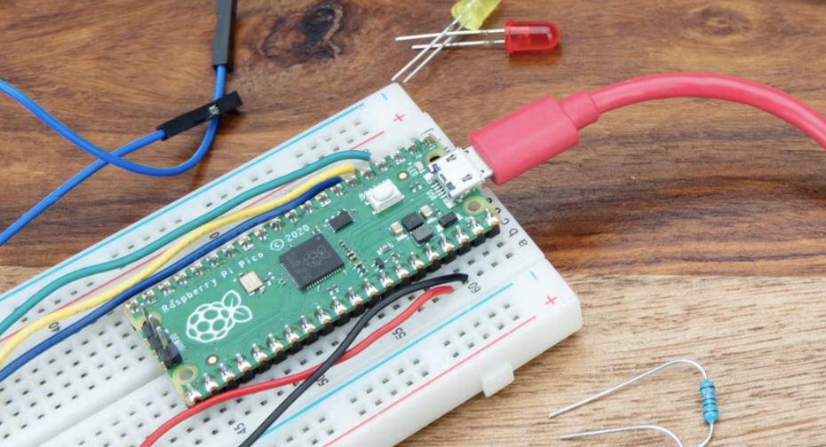
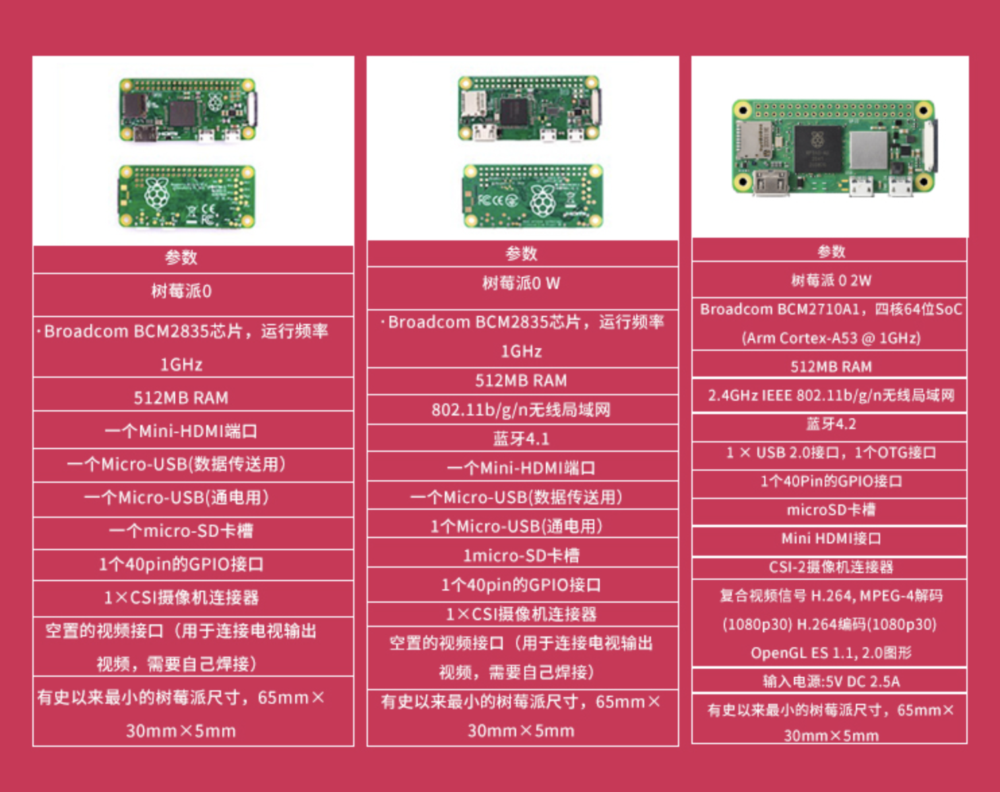
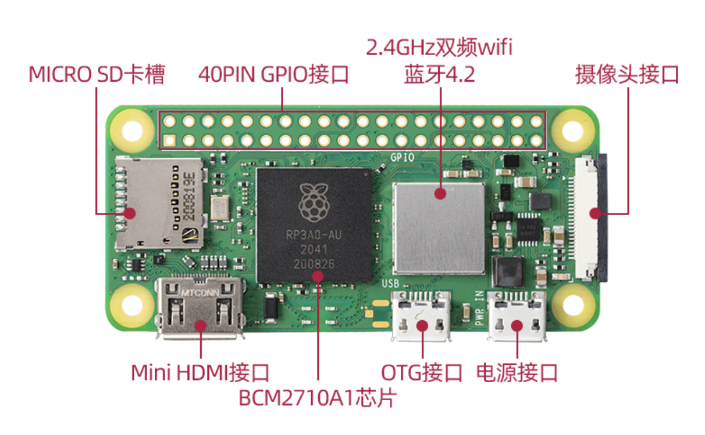

针对各类型开发版

## 单板计算机

### 树莓派

#### 型号对比

[DataSheet](https://datasheets.raspberrypi.com/)

|     型号     |                              3B                              |                             3B+                              |                             3A+                              |                           4B                            |                           400                           |
| :----------: | :----------------------------------------------------------: | :----------------------------------------------------------: | :----------------------------------------------------------: | :-----------------------------------------------------: | :-----------------------------------------------------: |
|   上市价格   | 35                              \|                             35 | 35                              \|                         35/45/55/75 |                             $70                              |                                                         |                                                         |
|     SoC      |         Broadcom BCM2837（CPU，GPU DSP和SDRAM、USB）         |         Broadcom BCM2837（CPU，GPU DSP和SDRAM、USB）         |         Broadcom BCM2837（CPU，GPU DSP和SDRAM、USB）         |                    Broadcom BCM2711                     |                    Broadcom BCM2711                     |
|     CPU      |       ARM Cortex-A53 64位 (ARMv8系列) 1.2GHz (四核心)        |       ARM Cortex-A53 64位 (ARMv8系列) 1.4GHz (四核心)        |       ARM Cortex-A53 64位 (ARMv8系列) 1.4GHz (四核心)        |       ARM Cortex-A72 (ARMv8系列) 1.5GHz (四核心)        |       ARM Cortex-A72 (ARMv8系列) 1.8GHz (四核心)        |
|     GPU      | Broadcom VideoCore IV[27], OpenGL ES 2.0, 1080p 30 h.264/MPEG-4 AVC高清解码器 | Broadcom VideoCore IV[27], OpenGL ES 2.0, 1080p 30 h.264/MPEG-4 AVC高清解码器 | Broadcom VideoCore IV[27], OpenGL ES 2.0, 1080p 30 h.264/MPEG-4 AVC高清解码器 | H.265 (4Kp60), H.264 (1080p60 / 1080p30)，OpenGL ES 3.0 | H.265 (4Kp60), H.264 (1080p60 / 1080p30)，OpenGL ES 3.0 |
|     内存     |                        1 GB (LPDDR2)                         |                        1 GB (LPDDR2)                         |                        512MB (LPDDR2)                        |                 2/4/8 GB (LPDDR4-3200)                  |                   4GB (LPDDR4-3200）                    |
| USB 接口个数 |                        USB 2.0（4个）                        |                        USB 2.0（4个）                        |                        USB 2.0（1个）                        |             USB 2.0（2个），USB 3.0（2个）              |             USB 2.0（1个），USB 3.0（2个）              |
|   音源输出   |                 3.5mm插孔，HDMI电子输出或I²S                 |                 3.5mm插孔，HDMI电子输出或I²S                 |                 3.5mm插孔，HDMI电子输出或I²S                 |              3.5mm插孔，HDMI电子输出或I²S               |                      HDMI电子输出                       |
|   板载存储   |                        MicroSD卡插槽                         |                        MicroSD卡插槽                         |                        MicroSD卡插槽                         |                      MicroSD卡插槽                      |                      MicroSD卡插槽                      |
|   网络接口   | 10/100Mbps 以太网接口（RJ45接口），支持802.11n无线网络及蓝牙4.1 | 100/1000Mbps 以太网接口（RJ45接口），支持802.11n无线网络及蓝牙4.1 | 100/1000Mbps 以太网接口（RJ45接口），支持802.11n无线网络及蓝牙4.1 |     千兆以太网，支持双频802.11ac的无线网络及蓝牙5.0     |     千兆以太网，支持双频802.11ac的无线网络及蓝牙5.0     |
|  GPIO引脚数  |                              40                              |                              40                              |                              40                              |                           40                            |                           40                            |
|   额定功率   |                      10.5 瓦 (5V/2.1A)                       |                      10.5 瓦 (5V/2.1A)                       |                      10.5 瓦 (5V/2.1A)                       |                      15 瓦 (5V/3A)                      |                      15 瓦 (5V/3A)                      |
|   电源输入   |              5V 电压 (通过MicroUSB或经GPIO输入)              |              5V 电压 (通过MicroUSB或经GPIO输入)              |              5V 电压 (通过MicroUSB或经GPIO输入)              |             5V 电压 (通过USB-C或经GPIO输入)             |             5V 电压 (通过USB-C或经GPIO输入)             |
|     型号     |                              3B                              |                             3B+                              |                             3A+                              |                           4B                            |                           400                           |

#### 辅助配件

##### 树莓派集群箱

https://www.amazon.cn/dp/B09S11Q684/ref=sr_1_10?__mk_zh_CN=%E4%BA%9A%E9%A9%AC%E9%80%8A%E7%BD%91%E7%AB%99&crid=U8PVF1SDZD3J&keywords=UCTRONICS&qid=1649509256&sprefix=uctronics%2Caps%2C207&sr=8-10

https://www.amazon.cn/dp/B09K439BTY/ref=sr_1_6?__mk_zh_CN=%E4%BA%9A%E9%A9%AC%E9%80%8A%E7%BD%91%E7%AB%99&crid=1TR5BXHZ3HN62&keywords=%E6%A0%91%E8%8E%93%E6%B4%BE&qid=1649509542&sprefix=%E6%A0%91%E8%8E%93%E6%B4%BE%2Caps%2C239&sr=8-6

#### Raspberry Pi 3 B+

#### Raspberry Pi 4 

#### Pi Compute Module 4(CM4)

[规格说明书](https://datasheets.raspberrypi.com/cm4/cm4-product-brief.pdf)

#### CM4IO

#### Raspberry Pi 400

[规格说明书](https://datasheets.raspberrypi.com/rpi400/raspberry-pi-400-product-brief.pdf)

#### Pi Pico

[规格说明书](https://datasheets.raspberrypi.com/pico/Pico-R3-A4-Pinout.pdf)

https://item.taobao.com/item.htm?spm=2013.1.w4023-23859380088.8.5cbd7e21ySJBki&id=637378283845

Raspberry Pi Pico is a tiny, fast, and versatile board built using RP2040, a brand new microcontroller chip designed by Raspberry Pi in the UK.

#### Pi Zero

#### Pi Zero W

#### Pi Zero 2 W 

$15

#### Pi Zero WH

### Jetson 

#### Jetson Nano

### BBC Micro:Bit 

### Arduino

## 显示器

#### 7寸显示器

https://detail.1688.com/offer/645885602753.html

#### 10.1寸触摸屏

https://detail.1688.com/offer/658297236203.html

## 电池

### 18650锂电池

18650是锂离子电池的鼻祖--[日本](https://baike.baidu.com/item/日本/111617)SONY公司当年为了节省成本而定下的一种标准性的[锂离子](https://baike.baidu.com/item/锂离子/7036470)电池型号，其中18表示直径为18mm，65表示长度为65mm，0表示为圆柱形电池。

3.7v、3.2v

常见容量 2000mAh/2600mAh/3000mAh

## 教程

### 操作系统

#### 树莓派4运行Windows 11

https://news.mydrivers.com/1/767/767280.htm

[操作系统下载](https://next.itellyou.cn/Original/#cbp=Product?ID=42e87ac8-9cd6-eb11-bdf8-e0d4e850c9c6)

#### 树莓派4B通过U盘启动

https://www.quarkbook.com/?p=638

### 开发套件

#### MicroPython

https://github.com/micropython/micropython/wiki

https://www.raspberrypi.com/documentation/microcontrollers/micropython.html

#### PicoPython

https://datasheets.raspberrypi.com/pico/raspberry-pi-pico-python-sdk.pdf

### 存储

#### eMMC Flash

EMMC = NAND + 控制器 + 标准封装接口

功能包括存储以及取代NOR Flash的开机功能，不需要处理NAND Flash相容性和管理问题。手机厂商不需要因为NAND Flash供应商或者不同制程世代而重新设计规格。

eMMC (Embedded Multi Media Card）是MMC协会订立、主要针对手机或平板电脑等产品的内嵌式存储器标准规格。eMMC在封装中集成了一个控制器，提供标准接口并管理闪存，使得手机厂商就能专注于产品开发的其它部分，并缩短向市场推出产品的时间。

#### 闪存 Flash Memory

闪存，是一种电子式可清除程序化只读存储器的形式，允许在操作中被多次擦或写的存储器。这种科技主要用于一般性资料存储，以及在电脑与其他数字产品间交换传输资料，如储存卡与U盘。闪存是一种特殊的、以宏块抹写的EEPROM。早期的闪存进行一次抹除，就会清除掉整颗芯片上的资料。

#### NAND Flash

1989年，东芝公司发表了NAND Flash结构，强调降低每比特的成本，更高的性能，并且像磁盘一样可以通过接口轻松升级。

NAND结构能提供极高的单元密度，可以达到高存储密度，并且写入和擦除的速度也很快（NAND的基本存储单元是页），应用NAND的困难在于flash的管理需要特殊的系统接口。

NAND一般以存储数据为主，晶片容量大，容量可以达到2Gb甚至更大，NAND的读取是以一次读取一块的形式来进行的，通常一次读取512个字节，采用这种技术的Flash比较廉价；。用户不能直接运行NAND上的代码，因此很多使用NAND的开发板除了使用NAND Flash以外，还加上一块小的NOR Flash来运行启动代码。

#### NOR Flash

NOR Flash是Intel在1988年创建的。NOR采用内存的随机读取技术，允许随机寻址，不需要纠错以及较高的每比特成本。如果我们只是利用闪存来存储小量代码，那无疑NOR是非常合适的。NOR 的传输效率（注意是效率，并不是速度）很高，在1~4MB的小容量时具有很高的成本效益，但是很低的写入和擦除速度大大影响到它的性能（因为NOR和内存一样基本存储单元是字节）。NOR的一大特点是应用程序可以直接在Flash闪存内运行，不必再把代码读到系统RAM中。

#### UFS

UFS最新标准是UFS3.0，它最大带宽可以达到2163MB/s。目前，大多数5G手机的机型都用上了UFS 3.0储存方案。但也有旗舰手机机型仍采用UFS 2.1，这其中的原因也很简单：就目前而言，UFS 3.0虽然在传输速率以及实际体验上“秒杀”UFS 2.1，但UFS 3.0也面临着诸多问题：暂时还未实现更大规模的普及、产能不足、价格昂贵。

## 学习社区

### 硬件学习

#### https://community.element14.com/

#### https://www.hackster.io/

*Hackster* is a community dedicated to learning hardware, from beginner to pro. Share your projects and learn from other developers.

## 供应商

### 电子元件

####e络盟

https://cn.element14.com/

e络盟为[易络](https://baike.baidu.com/item/易络)盟电子（中国）有限公司的商标名称，前身为派睿电子（上海）有限公司，隶属于英国Premier Farnell集团。e络盟取自其英文商标名称element14的谐音，来自化学[元素周期表](https://baike.baidu.com/item/元素周期表/282048)上硅的化学名称，注入了电子行业的DNA，它深刻理解[电子设计工程师](https://baike.baidu.com/item/电子设计工程师/4051545)的需求，并因此而诞生。

P4 4GB 388元

https://cn.element14.com/raspberry-pi/rpi4-modbp-4gb/raspberry-pi-4-model-b-4gb/dp/3051887

#### 贸泽电子

https://www.mouser.cn/

#### 搜索引擎OCTOPART

https://octopart.com/

#### 唯样

https://www.oneyac.com/

#### 杭州隽鹏电子

https://qpdz.taobao.com/?spm=2013.1.1000126.3.56d163a9adv9tq

### 外壳

铝合金外壳 http://www.lvwaikechang.com/

## 科技特长生

