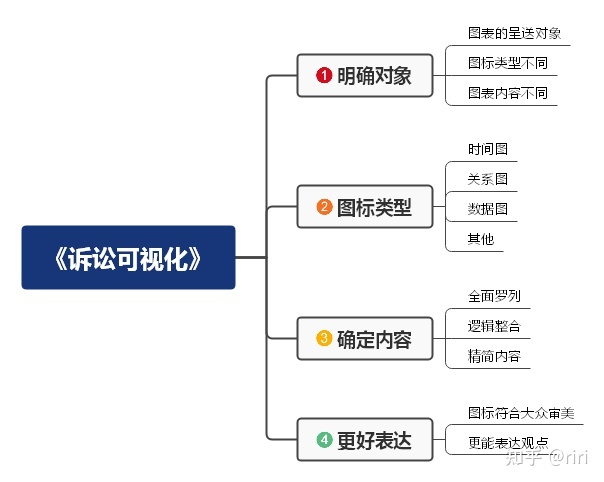

## 卷宗

## 证据目录

## 思路收集

### 诉讼可视化

#### 案件事实图

#### 法律关系图

## 判决书

### 赣榆张兴义劳务纠纷 2014-00047

江苏省赣榆县人民法院

民 事 判 决 书

（2014）赣商初字第00047号

原告张兴义，居民。

委托代理人刘宗波。

被告刘家新，居民。

委托代理人刘入根，男，1958年2月14日出生，汉族，居民。

委托代理人潘长城，江苏衡信达律师事务所律师。

原告张兴义与被告刘家新劳务合同纠纷一案，本院于2013年12月26日立案受理后，依法由审判员王金中适用简易程序，于2014年2月20日、2014年2月27日两次公开开庭进行了审理。后因案情复杂，转为普通程序，组成合议庭于2014年4月3日公开开庭进行了审理。原告张兴义及其委托代理人刘宗波、被告刘家新及其委托代理人刘入根、潘长城到庭参加了诉讼。本案现已审理终结。

原告张兴义诉称，2011年被告承包了徐圩工地和242省道东辛农场路段的施工工程，被告因缺少工人施工，雇佣原告为其施工，2012年1月29日即农历春节前原告与被告对施工费先进行了第一次结算，被告应付原告78620元，实付70000元，余欠8620元，被告书写欠条给原告，欠条小写8620元，大写为柒仟捌佰陆拾元，另有部分工程施工费春节前没有结算，2012年2月4日春节后双方又进行了第二次结算，被告欠原告施工费24900元，并书写欠条给原告，承诺用2012年第一批工程款支付。但直至工程结束，被告也没有支付。两项合计被告共欠原告施工费32760元，后该款经原告多次催要，被告均以困难为由拖延支付。现请求依法判令被告支付劳务费32760元及从原告主张权利之日起至被告还款之日止的同期银行利息。

被告刘家新辩称，原告所诉与事实不符，原告多次以借支的形式从被告处领款共计33700元，被告所欠原告欠款已全部付清，请求依法驳回原告的诉讼请求。

经审理查明，2011年期间，原告张兴义带人在被告刘家新承包的连云港徐圩工地和242省道东辛农场段工地为被告刘家新施工。2012年1月29日，被告刘家新向原告张兴义出具欠条一张，欠条内容为“应付21220＋5700＝78620下欠8620元大写柒仟捌佰陆拾元整刘家新2012.1.29”。后原、被告双方于2012年2月4日再次进行结算，被告刘家新又向原告张兴义出具欠条一张，欠条内容为“今欠张兴义2011年度在徐圩工地、242省道东辛农场段工地所有人工费等余额共计：贰万肆仟玖佰元整（￥24900元整）其中：242省道余额17000元，王金虎医药费、误工等共计1300元，插入振动器等600元，徐圩工地余额6000元，以上所有费用一次性算死，以后不再重算！2012年第一次工程拨款付清！本帐不对第三者生效！欠款人：刘家新2014.2.4证明人韦霞方、韦造方认可人：张兴义2012.2月4号”。后因被告刘家新没有按约付款，双方因此产生诉争。

庭审中，被告刘家新对原告提交的2012年1月29日、2012年2月4日的两张欠条真实性没有异议，但认为2012年1月29日的欠条大写注明的金额为7860元，应当以大写金额为准，且该7860元包含在2012年2月4日的24900元欠条中。原告认可2012年1月29日的欠条以大写的欠款金额7860元为准，并陈述该7860元是242省道东辛农场工程的欠款，主张该7860元不包含在2012年2月4日的24900元欠条中。同时被告刘家新辩称原告多次以借支的形式从被告处领款共计33700元，被告所欠原告款项已全部付清，并向法庭提交了11张由原告张兴文在2012年7月份至2013年2月份期间出具的借支条予以证明，该11张借支条共计金额33700元，其中原告张兴义于2012年8月26日出具的借条内容为“今借现金5000.00元，伍仟元整孩子上学用张兴义收2012.8.26”，于2013年2月9日出具的两张借条内容分别为“今借现金玖仟元整￥9000张兴义收2013年9号”、“今借现金1000元大写壹仟元张兴义2013.9号”，原告对被告刘家新提交的该11张借支条的真实性没有异议，认可2012年8月26日的5000元借款由原告自己使用，同意抵扣欠款；2013年2月9日的两张借条共计10000元由其个人取得，并主张该10000元是2012年期间其在连云港市BRT工程中（施工期间为2012年5月至9月）为被告刘家新带班的工资，但未提交相关证据予以证明，同时主张剩余借支条均是其2012年期间为被告刘家新在连云港市BRT工程中带班借支的费用，不应在本案中抵扣。被告刘家新为证明其提交的总金额为33700元的11张借支条是其支付徐圩工地、242省道东辛农场段工地的欠款，而不是连云港BRT工程的费用，另外向法庭提交了11张2012年6月至2012年10月期间由原告张兴义出具给被告刘家新的借支条11张及3张银行转账凭证，金额总计为37934元，11张借支条中有5张注明系连云港BRT工程。原告张兴义认为该11张借支条均是其在连云港BRT工程中为被告带班的开支，与本案无关，3张银行转账凭证是房租费，与其无关。后被告刘家新自认除2012年8月26日的5000元借条及2013年2月9日的9000元和1000元借条之外，其向法庭提交的由原告张兴义出具的其他借支条均系连云港BRT工程中的借支，并主张2012年8月26日的5000元借支及2013年2月9日的9000元和1000元借支应在本案中予以抵扣，且认为其与原告张兴义在BRT工程中应为转包关系而非代班。

另查明，在原告张兴义带人为被告刘家新承包的连云港徐圩工地和242省道东辛农场段工地施工期间，原告张兴义分别欠其工人张兴东、陈兴玉劳务费4800元、3750元，并于2011年12月份分别向张兴东、陈兴玉出具欠条，被告刘家新在两张欠条背面注明其同意于春节后农历正月十五支付。后张兴东、陈兴玉于2013年12月23日将张兴义、刘家新诉至本院，本院于2014年1月8日作出（2014）赣商初字第0007、第0008号民事判决书，判决书认定刘家新系发包方，张兴义系承包方，张兴义在出具给张兴东、陈兴玉的欠条上注明将债务转移给刘家新，刘家新在欠条背面分别签名并同意债务转让事宜，张兴东、陈兴玉对此均无异议，应视为对债务转移的认可，故判令被告刘家新于判决生效后十日内分别支付张兴东、陈兴玉劳务费4800元、3750元，民事判决书已发生法律效力。

本院所确认的上述事实，有原告提交的2012年1月29日、2012年2月4日的两张欠条、被告提交的2012年8月26日的5000元借支条、2013年2月9日的9000元借支条、1000元借支条、（2014）赣商初字第0007、第0008号民事判决书以及原告张兴义及其委托代理人刘宗波、被告刘家新及其委托代理人刘入根、潘长城的陈述笔录在卷为凭，经开庭审查和质证，本院对上述证据予以确认。

本院认为，原告张兴义带人在被告刘家新承包的连云港徐圩工地和242省道东辛农场段工地为被告刘家新施工，原告张兴义与被告刘家新之间的转包关系事实清楚，证据充分。被告刘家新于2012年1月29日、2012年2月4日分别向原告张兴义出具金额为7860元、24900元的欠条，但2012年2月4日的欠条明确注明“张兴义2011年度在徐圩工地、242省道东辛农场段工地所有人工费等余额共计：贰万肆仟玖佰元整（￥24900元整）……以上所有费用一次性算死，以后不再重算！”，故可以认定被告刘家新2012年1月29日出具欠条的欠款金额已经包含在24900元的欠款之中，即在连云港徐圩工程和242省道东辛农场段工程中，被告刘家新最终结欠原告张兴义劳务费24900元。因2012年2月4日24900元的欠条系原告张兴义与被告刘家新就连云港徐圩工程和242省道东辛农场段工程的总结算，故原告张兴义于2011年12月份结欠其雇用的工人张兴东、陈兴玉的劳务费4800元、3750元亦应当包含在被告刘家新最终结欠原告张兴义的24900元中，因本院（2014）赣商初字第0007、第0008号民事判决书已经判决由被告刘家新支付张兴东劳务费4800元，支付陈兴玉劳务费3750元，且该判决书已经生效，免除了原告张兴义应承担的付款义务，故该4800元、3750元应从本案被告刘家新欠原告张兴义的24900元中予以扣除。在连云港徐圩工程和242省道东辛农场段工程结束之后，原告张兴义于2012年8月26日向被告刘家新借款5000元用于孩子上学，因该借款发生在2012年2月4日双方结算之后，该5000元应当在本案中予以抵销。对于2013年2月9日原告张兴义借支的9000元和1000元，原告张兴义主张系其在连云港BRT工程中的工资，但未提供证据予以证明，因该10000元借款发生在连云港徐圩工程、242省道东辛农场段工程及连云港BRT工程之后，且该10000元原告张兴义认可由其所得，被告刘家新要求将该10000元在本案中予以抵扣，而本案结算的欠款24900元的履行期限在先，故该10000元亦应当从本案中扣除。综上，被告刘家新还应支付原告张兴义劳务费1350元（24900元－5000元－4800元－3750元－10000元）。对于利息，因双方未约定利率，原告主张自主张权利之日起计算，故应自2013年12月26日起按照中国人民银行同期同类贷款基准利率计算为宜。对于被告刘家新辩称原告多次以借支的形式从其处领款共计33700元，所欠原告欠款已全部付清，因被告刘家新提交的其他由原告张兴义出具的借支条均涉及连云港BRT工地，本案不作一并处理，当事人可另行主张，对被告刘家新的该辩解意见，本院不予采信。依据《中华人民共和国合同法》第九十九条、第一百零七条、第一百零九条、第一百一十二条、《最高人民法院关于使用﹤中华人民共和国合同法﹥若干问题的解释（二）》第二十条之规定，判决如下：

一、被告刘家新于本判决生效之日起十日内给付原告张兴义劳务费1350元及利息（自2013年12月26日起计算至本判决确定的还款之日止，按照中国人民银行同期同类贷款基准利率计算）；

二、驳回原告张兴义的其他诉讼请求。

被告刘家新如果未按本判决指定的期间履行给付金钱义务，应当依照《中华人民共和国民事诉讼法》第二百五十三条之规定，加倍支付迟延履行期间的债务利息。

案件受理费619元，由原告张兴义负担569元，由被告刘家新负担50元（该款原告已垫付，被告刘家新于本判决生效之日起十日内将上述费用支付原告）。

如不服本判决，可在判决书送达之日起十五日内，向本院递交上诉状，并按对方当事人的人数提出副本，上诉于江苏省连云港市中级人民法院。根据国务院《诉讼费用交纳办法》的规定，同时应向连云港市中级人民法院预交上诉案件受理费619元。连云港市中级人民法院开户行：连云港市农行苍梧支行营业部，账号：44×××94。

依照《中华人民共和国民事诉讼法》第二百二十四条、第二百三十九条之规定，本判决生效后，权利人可向本院或者与本院同级的被执行财产所在地法院申请强制执行，申请强制执行期限为二年。

审　判　长　　王金中

代理审判员　　陆　帆

人民陪审员　　张明康

二〇一四年六月二十日

书　记　员　　徐　菡

法律条文及上诉须知附录

一、法律条文

（一）《中华人民共和国合同法》

第九十九条当事人互负到期债务，该债务的标的物种类、品质相同的，任何一方可以将自己的债务与对方的债务抵销，但依照法律规定或者按照合同性质不得抵销的除外。当事人主张抵销的，应当通知对方。通知自到达对方时生效。抵销不得附条件或者附期限。

第一百零七条当事人一方不履行合同义务或者履行合同义务不符合约定的，应当承担继续履行、采取补救措施或者赔偿损失等违约责任。

第一百零九条当事人一方未支付价款或者报酬的，对方可以要求其支付价款或者报酬。

第一百一十二条当事人一方不履行合同义务或者履行合同义务不符合约定的，在履行义务或者采取补救措施后，对方还有其他损失的，应当赔偿损失。

《最高人民法院关于使用﹤中华人民共和国合同法﹥若干问题的解释（二）》

第二十条债务人的给付不足以清偿其对同一债权人所负的数笔相同种类的全部债务，应当优先抵充已到期的债务；几项债务均到期的，优先抵充对债权人缺乏担保或者担保数额最少的债务；担保数额相同的，优先抵充债务负担较重的债务；负担相同的，按照债务到期的先后顺序抵充；到期时间相同的，按比例抵充。但是，债权人与债务人对清偿的债务或者清偿抵充顺序有约定的除外。

（三）《中华人民共和国民事诉讼法》

第二百五十三条被执行人未按判决、裁定和其他法律文书指定的期间履行给付金钱义务的，应当加倍支付迟延履行期间的债务利息。被执行人未按判决、裁定和其他法律文书指定的期间履行其他义务的，应当支付迟延履行金。

二、上诉须知

根据有关法律、法规和司法解释的规定，现将有关上诉事项告知如下：

当事人享有《中华人民共和国民事诉讼法》第一百六十四条、国务院《诉讼费用交纳办法》第二十二条、第四十八条规定的上诉及相关权利、义务。

上诉人上诉时未交纳上诉费的，应自递交上诉状之日起七日内交纳上诉案件受理费，同时将缴款凭证提交本院。逾期未交纳或者未将交纳凭证提交本院的，本院将依照最高人民法院《关于适用〈诉讼费用交纳办法〉的通知》第二条的规定，报连云港市中级人民法院裁定按自动撤回上诉处理。

本上诉须知与《催交上诉费通知》具有同等法律效力。

### 赣榆一审（2014）赣商初字第00047号

江苏省赣榆县人民法院

民 事 判 决 书

（2014）赣商初字第00047号

原告张兴义，居民。

委托代理人刘宗波。

被告刘家新，居民。

委托代理人刘入根，男，1958年2月14日出生，汉族，居民。

委托代理人潘长城，江苏衡信达律师事务所律师。

原告张兴义与被告刘家新劳务合同纠纷一案，本院于2013年12月26日立案受理后，依法由审判员王金中适用简易程序，于2014年2月20日、2014年2月27日两次公开开庭进行了审理。后因案情复杂，转为普通程序，组成合议庭于2014年4月3日公开开庭进行了审理。原告张兴义及其委托代理人刘宗波、被告刘家新及其委托代理人刘入根、潘长城到庭参加了诉讼。本案现已审理终结。

原告张兴义诉称，2011年被告承包了徐圩工地和242省道东辛农场路段的施工工程，被告因缺少工人施工，雇佣原告为其施工，2012年1月29日即农历春节前原告与被告对施工费先进行了第一次结算，被告应付原告78620元，实付70000元，余欠8620元，被告书写欠条给原告，欠条小写8620元，大写为柒仟捌佰陆拾元，另有部分工程施工费春节前没有结算，2012年2月4日春节后双方又进行了第二次结算，被告欠原告施工费24900元，并书写欠条给原告，承诺用2012年第一批工程款支付。但直至工程结束，被告也没有支付。两项合计被告共欠原告施工费32760元，后该款经原告多次催要，被告均以困难为由拖延支付。现请求依法判令被告支付劳务费32760元及从原告主张权利之日起至被告还款之日止的同期银行利息。

被告刘家新辩称，原告所诉与事实不符，原告多次以借支的形式从被告处领款共计33700元，被告所欠原告欠款已全部付清，请求依法驳回原告的诉讼请求。

经审理查明，2011年期间，原告张兴义带人在被告刘家新承包的连云港徐圩工地和242省道东辛农场段工地为被告刘家新施工。2012年1月29日，被告刘家新向原告张兴义出具欠条一张，欠条内容为“应付21220＋5700＝78620下欠8620元大写柒仟捌佰陆拾元整刘家新2012.1.29”。后原、被告双方于2012年2月4日再次进行结算，被告刘家新又向原告张兴义出具欠条一张，欠条内容为“今欠张兴义2011年度在徐圩工地、242省道东辛农场段工地所有人工费等余额共计：贰万肆仟玖佰元整（￥24900元整）其中：242省道余额17000元，王金虎医药费、误工等共计1300元，插入振动器等600元，徐圩工地余额6000元，以上所有费用一次性算死，以后不再重算！2012年第一次工程拨款付清！本帐不对第三者生效！欠款人：刘家新2014.2.4证明人韦霞方、韦造方认可人：张兴义2012.2月4号”。后因被告刘家新没有按约付款，双方因此产生诉争。

庭审中，被告刘家新对原告提交的2012年1月29日、2012年2月4日的两张欠条真实性没有异议，但认为2012年1月29日的欠条大写注明的金额为7860元，应当以大写金额为准，且该7860元包含在2012年2月4日的24900元欠条中。原告认可2012年1月29日的欠条以大写的欠款金额7860元为准，并陈述该7860元是242省道东辛农场工程的欠款，主张该7860元不包含在2012年2月4日的24900元欠条中。同时被告刘家新辩称原告多次以借支的形式从被告处领款共计33700元，被告所欠原告款项已全部付清，并向法庭提交了11张由原告张兴文在2012年7月份至2013年2月份期间出具的借支条予以证明，该11张借支条共计金额33700元，其中原告张兴义于2012年8月26日出具的借条内容为“今借现金5000.00元，伍仟元整孩子上学用张兴义收2012.8.26”，于2013年2月9日出具的两张借条内容分别为“今借现金玖仟元整￥9000张兴义收2013年9号”、“今借现金1000元大写壹仟元张兴义2013.9号”，原告对被告刘家新提交的该11张借支条的真实性没有异议，认可2012年8月26日的5000元借款由原告自己使用，同意抵扣欠款；2013年2月9日的两张借条共计10000元由其个人取得，并主张该10000元是2012年期间其在连云港市BRT工程中（施工期间为2012年5月至9月）为被告刘家新带班的工资，但未提交相关证据予以证明，同时主张剩余借支条均是其2012年期间为被告刘家新在连云港市BRT工程中带班借支的费用，不应在本案中抵扣。被告刘家新为证明其提交的总金额为33700元的11张借支条是其支付徐圩工地、242省道东辛农场段工地的欠款，而不是连云港BRT工程的费用，另外向法庭提交了11张2012年6月至2012年10月期间由原告张兴义出具给被告刘家新的借支条11张及3张银行转账凭证，金额总计为37934元，11张借支条中有5张注明系连云港BRT工程。原告张兴义认为该11张借支条均是其在连云港BRT工程中为被告带班的开支，与本案无关，3张银行转账凭证是房租费，与其无关。后被告刘家新自认除2012年8月26日的5000元借条及2013年2月9日的9000元和1000元借条之外，其向法庭提交的由原告张兴义出具的其他借支条均系连云港BRT工程中的借支，并主张2012年8月26日的5000元借支及2013年2月9日的9000元和1000元借支应在本案中予以抵扣，且认为其与原告张兴义在BRT工程中应为转包关系而非代班。

另查明，在原告张兴义带人为被告刘家新承包的连云港徐圩工地和242省道东辛农场段工地施工期间，原告张兴义分别欠其工人张兴东、陈兴玉劳务费4800元、3750元，并于2011年12月份分别向张兴东、陈兴玉出具欠条，被告刘家新在两张欠条背面注明其同意于春节后农历正月十五支付。后张兴东、陈兴玉于2013年12月23日将张兴义、刘家新诉至本院，本院于2014年1月8日作出（2014）赣商初字第0007、第0008号民事判决书，判决书认定刘家新系发包方，张兴义系承包方，张兴义在出具给张兴东、陈兴玉的欠条上注明将债务转移给刘家新，刘家新在欠条背面分别签名并同意债务转让事宜，张兴东、陈兴玉对此均无异议，应视为对债务转移的认可，故判令被告刘家新于判决生效后十日内分别支付张兴东、陈兴玉劳务费4800元、3750元，民事判决书已发生法律效力。

本院所确认的上述事实，有原告提交的2012年1月29日、2012年2月4日的两张欠条、被告提交的2012年8月26日的5000元借支条、2013年2月9日的9000元借支条、1000元借支条、（2014）赣商初字第0007、第0008号民事判决书以及原告张兴义及其委托代理人刘宗波、被告刘家新及其委托代理人刘入根、潘长城的陈述笔录在卷为凭，经开庭审查和质证，本院对上述证据予以确认。

本院认为，原告张兴义带人在被告刘家新承包的连云港徐圩工地和242省道东辛农场段工地为被告刘家新施工，原告张兴义与被告刘家新之间的转包关系事实清楚，证据充分。被告刘家新于2012年1月29日、2012年2月4日分别向原告张兴义出具金额为7860元、24900元的欠条，但2012年2月4日的欠条明确注明“张兴义2011年度在徐圩工地、242省道东辛农场段工地所有人工费等余额共计：贰万肆仟玖佰元整（￥24900元整）……以上所有费用一次性算死，以后不再重算！”，故可以认定被告刘家新2012年1月29日出具欠条的欠款金额已经包含在24900元的欠款之中，即在连云港徐圩工程和242省道东辛农场段工程中，被告刘家新最终结欠原告张兴义劳务费24900元。因2012年2月4日24900元的欠条系原告张兴义与被告刘家新就连云港徐圩工程和242省道东辛农场段工程的总结算，故原告张兴义于2011年12月份结欠其雇用的工人张兴东、陈兴玉的劳务费4800元、3750元亦应当包含在被告刘家新最终结欠原告张兴义的24900元中，因本院（2014）赣商初字第0007、第0008号民事判决书已经判决由被告刘家新支付张兴东劳务费4800元，支付陈兴玉劳务费3750元，且该判决书已经生效，免除了原告张兴义应承担的付款义务，故该4800元、3750元应从本案被告刘家新欠原告张兴义的24900元中予以扣除。在连云港徐圩工程和242省道东辛农场段工程结束之后，原告张兴义于2012年8月26日向被告刘家新借款5000元用于孩子上学，因该借款发生在2012年2月4日双方结算之后，该5000元应当在本案中予以抵销。对于2013年2月9日原告张兴义借支的9000元和1000元，原告张兴义主张系其在连云港BRT工程中的工资，但未提供证据予以证明，因该10000元借款发生在连云港徐圩工程、242省道东辛农场段工程及连云港BRT工程之后，且该10000元原告张兴义认可由其所得，被告刘家新要求将该10000元在本案中予以抵扣，而本案结算的欠款24900元的履行期限在先，故该10000元亦应当从本案中扣除。综上，被告刘家新还应支付原告张兴义劳务费1350元（24900元－5000元－4800元－3750元－10000元）。对于利息，因双方未约定利率，原告主张自主张权利之日起计算，故应自2013年12月26日起按照中国人民银行同期同类贷款基准利率计算为宜。对于被告刘家新辩称原告多次以借支的形式从其处领款共计33700元，所欠原告欠款已全部付清，因被告刘家新提交的其他由原告张兴义出具的借支条均涉及连云港BRT工地，本案不作一并处理，当事人可另行主张，对被告刘家新的该辩解意见，本院不予采信。依据《中华人民共和国合同法》第九十九条、第一百零七条、第一百零九条、第一百一十二条、《最高人民法院关于使用﹤中华人民共和国合同法﹥若干问题的解释（二）》第二十条之规定，判决如下：

一、被告刘家新于本判决生效之日起十日内给付原告张兴义劳务费1350元及利息（自2013年12月26日起计算至本判决确定的还款之日止，按照中国人民银行同期同类贷款基准利率计算）；

二、驳回原告张兴义的其他诉讼请求。

被告刘家新如果未按本判决指定的期间履行给付金钱义务，应当依照《中华人民共和国民事诉讼法》第二百五十三条之规定，加倍支付迟延履行期间的债务利息。

案件受理费619元，由原告张兴义负担569元，由被告刘家新负担50元（该款原告已垫付，被告刘家新于本判决生效之日起十日内将上述费用支付原告）。

如不服本判决，可在判决书送达之日起十五日内，向本院递交上诉状，并按对方当事人的人数提出副本，上诉于江苏省连云港市中级人民法院。根据国务院《诉讼费用交纳办法》的规定，同时应向连云港市中级人民法院预交上诉案件受理费619元。连云港市中级人民法院开户行：连云港市农行苍梧支行营业部，账号：44×××94。

依照《中华人民共和国民事诉讼法》第二百二十四条、第二百三十九条之规定，本判决生效后，权利人可向本院或者与本院同级的被执行财产所在地法院申请强制执行，申请强制执行期限为二年。

审　判　长　　王金中

代理审判员　　陆　帆

人民陪审员　　张明康

二〇一四年六月二十日

书　记　员　　徐　菡

法律条文及上诉须知附录

一、法律条文

（一）《中华人民共和国合同法》

第九十九条当事人互负到期债务，该债务的标的物种类、品质相同的，任何一方可以将自己的债务与对方的债务抵销，但依照法律规定或者按照合同性质不得抵销的除外。当事人主张抵销的，应当通知对方。通知自到达对方时生效。抵销不得附条件或者附期限。

第一百零七条当事人一方不履行合同义务或者履行合同义务不符合约定的，应当承担继续履行、采取补救措施或者赔偿损失等违约责任。

第一百零九条当事人一方未支付价款或者报酬的，对方可以要求其支付价款或者报酬。

第一百一十二条当事人一方不履行合同义务或者履行合同义务不符合约定的，在履行义务或者采取补救措施后，对方还有其他损失的，应当赔偿损失。

《最高人民法院关于使用﹤中华人民共和国合同法﹥若干问题的解释（二）》

第二十条债务人的给付不足以清偿其对同一债权人所负的数笔相同种类的全部债务，应当优先抵充已到期的债务；几项债务均到期的，优先抵充对债权人缺乏担保或者担保数额最少的债务；担保数额相同的，优先抵充债务负担较重的债务；负担相同的，按照债务到期的先后顺序抵充；到期时间相同的，按比例抵充。但是，债权人与债务人对清偿的债务或者清偿抵充顺序有约定的除外。

（三）《中华人民共和国民事诉讼法》

第二百五十三条被执行人未按判决、裁定和其他法律文书指定的期间履行给付金钱义务的，应当加倍支付迟延履行期间的债务利息。被执行人未按判决、裁定和其他法律文书指定的期间履行其他义务的，应当支付迟延履行金。

二、上诉须知

根据有关法律、法规和司法解释的规定，现将有关上诉事项告知如下：

当事人享有《中华人民共和国民事诉讼法》第一百六十四条、国务院《诉讼费用交纳办法》第二十二条、第四十八条规定的上诉及相关权利、义务。

上诉人上诉时未交纳上诉费的，应自递交上诉状之日起七日内交纳上诉案件受理费，同时将缴款凭证提交本院。逾期未交纳或者未将交纳凭证提交本院的，本院将依照最高人民法院《关于适用〈诉讼费用交纳办法〉的通知》第二条的规定，报连云港市中级人民法院裁定按自动撤回上诉处理。

本上诉须知与《催交上诉费通知》具有同等法律效力。

### 连云港中院二审（2018）苏07民终910号

江苏省连云港市中级人民法院

民 事 判 决 书

（2018）苏07民终910号

上诉人（原审被告）：刘家新，男，1963年6月27日生，汉族，住连云港市赣榆区。

委托诉讼代理人：陈西飞，江苏衡信达律师事务所律师。

上诉人（原审被告）：江苏海通建设工程有限公司，住所地连云港市海州区建设东路72号。

法定代表人：茅红兵，该公司董事长。

委托诉讼代理人：马晋桥、刘华国，江苏和济律师事务所律师。

被上诉人（原审原告）：韦霞方，男，1966年2月11日生，汉族，住连云港市赣榆区。

委托诉讼代理人：孙利娟、徐敬飞，江苏苍梧律师事务所律师。

上诉人刘家新、江苏海通建设工程有限公司（以下简称海通公司）因与被上诉人韦霞方建设工程施工合同纠纷一案，不服连云港市连云区人民法院（2017）苏0703民初575号民事判决，向本院提起上诉。本院于2018年3月7日受理后，依法组成合议庭进行了审理，本案现已审理终结。

上诉人刘家新上诉请求：撤销一审判决，依法改判刘家新不承担付款义务或发回重审，由被上诉人承担诉讼费用。一、一审判决认定事实错误。一审判决认定被上诉人所干工程的总价款为2076816.01元的依据是被上诉人自己制作的结算单、证人证言和评估报告三组证据，但该三组证据不能相互印证，不能作为定案的依据。1、结算单没有上诉人的签字确认，不具有真实性、合法性。2、几位证人实际是案件当事人，他们的陈述只能作为当事人陈述，不能作为证言使用，且证人证言之间不能相互印证，均是孤证，均不具有真实性和客观性。几位证人均从上诉人手中分包工程，而不是从被上诉人手中分包工程。3、被上诉人除了证人证言外，无其他证据证明其施工的范围，而评估报告是建立在假设工程系被上诉人施工的基础上作出的，故该报告与本案无关联性，不能作为定案的依据。二、一审判决对事实的认定过于片面，没有综合考虑上诉人所提交的证据。本案中，上诉人从海通公司处分包工程的总工程款为2598987.6元，已向被上诉人及其他施工人支付了1371475元（一审判决认定1210475元），最后一次庭审中，上诉人又向法庭提交了为该工程另外支付的费用（含人工费、材料费、税费等）原始单据数额为1212809元，两者相加为2584284元，与总工程款2598987.6元相近。如果按一审判决结果让上诉人向被上诉人再次支付866341.01元，那么上诉人总的支付额将达到3450625.01元，远远超出了上诉人与海通公司之间合同约定的合同价款额。三、一审判决程序违法。根据证据显示，上诉人是将涉案工程直接分包给被上诉人、徐某、张兴义、韦造方等人施工，而不是由被上诉人分包给他们几人，故上述几人应作为诉讼主体参与诉讼，否则就是遗漏主体，属于程序违法。

上诉人海通公司上诉请求：撤销一审判决，发回重审或依法改判。一、一审程序违法。韦霞方在一审中提出的诉讼请求是要求上诉人在欠付工程款范围内承担连带责任，上诉人在一审期间已经提供与刘家新之间的结算、付款凭证，证明上诉人已经付清刘家新全部工程款，刘家新也认可该事实，一审在此情况下却判决我公司承担连带责任，不仅违背了不告不理的原则，也超出了被上诉人的诉讼请求，系程序违法。二、一审判决上诉人承担连带责任没有法律依据。三、一审判决上诉人承担连带责任违背公平原则，浪费司法资源。1、一审判决结果将直接导致上诉人在同一涉案工程中要重复支付两笔工程款项，可能导致上诉人在后续追偿过程中因刘家新的履行能力不足而产生新的损失，违背了公平原则，增加了上诉人的诉讼成本，浪费了司法资源。四、一审认定被上诉人的施工范围事实不清，证据不足。一审法院仅依据被上诉人提供的徐某、张兴义、韦造方等单方制作的结算书等材料及出庭证言，在缺乏直接证据证明施工范围的情况下，即认定争议的工程系被上诉人施工，而没有否定刘家新所提供证据的证明效力的情况下，没有进一步查清争议工程的施工范围，显然是事实不清，证据不足。

被上诉人韦霞方答辩称：一、针对刘家新的上诉，刘家新在一审中提供证据证明其实际支付工程款累计达到280多万元，以此证明对争议的工程款全部支付完毕，但经审查上诉人提供的很多收款凭证都是上诉人私自伪造，其上诉理由不能成立。二、针对海通公司的上诉，依据法律规定，总承包人将工程分包或转包给不具有相应资质的施工单位或个人，合同无效，故海通公司应当承担连带责任。一审判决认定事实清楚，适用法律正确，程序合法，应予维持。

韦霞方向原审法院提出诉讼请求：判令刘家新支付工程款979625元（以鉴定为准）及利息，利息从2015年1月12日计算至判决确定的给付之日，按银行同期贷款利率计算；海通公司在欠付工程款范围内承担连带责任；本案诉讼费由刘家新、海通公司承担。

一审判决查明,2011年3月1日，刘家新、海通公司签订《路缘石施工合同》，约定由海通公司将其承建的242省道东辛农场段路面二标公路工程中的路缘石工程发包给刘家新施工，施工方式为包工包料，合同价款暂定为3051000元，综合单价包干为540元/立方米，该单价为固定单价。该合同签订后，刘家新将承包路缘石工程中的部分路段转包给韦霞方施工，韦霞方与刘家新就转包工程未订立书面施工合同。对施工的价格，韦霞方主张刘家新口头承诺按刘家新、海通公司之间的书面合同履行，刘家新不予认可，刘家新认为其与韦霞方对施工的价格未作明确约定。韦霞方主张其与刘家新口头达成一致施工意见后，即组织施工，于2011年12月底全部完成施工并实际交付刘家新。现涉案二标工程已经全部完工并由海通公司于2013年7月22日向业主交付并实际投入使用。韦霞方与刘家新未对韦霞方施工的工程价款进行结算。为此，韦霞方于2016年1月13日诉至法院，要求刘家新支付尚欠工程款979625元、返还模板等租赁物或折价赔偿租赁物损失145014元、支付租赁物租金194389元，并由海通公司承担连带责任。一审法院依法予以立案受理，案号为（2016）苏0703民初319号（以下简称319号案），一审法院于2017年1月22日裁定驳回了韦霞方的起诉。

韦霞方与刘家新就韦霞方施工工程价款未能达成一致结算意见，韦霞方在本案中申请委托鉴定，经委托江苏宏业工程项目管理咨询有限公司对涉案工程价款分三段进行鉴定，结论为：第一段为开发区松江路康缘药业十字路口东为起点至第一个路口处工程造价为97890.61元，第二段为从S242K0+743到K8+560处工程造价为714905.10元，第三段为从K8+560到扁担河大桥（即灌云大桥）西处工程造价为1264020.30元。韦霞方对该鉴定结论表示没有异议；刘家新认可第二段从S242K0+743到K8+560处路段路缘石工程是韦霞方施工，认为第一、三两路段的路缘石工程不是韦霞方施工，是刘家新自己组织工人施工的，刘家新以韦霞方施工路段工程造价没有约定，鉴定机构的鉴定结论没有依据为由，对鉴定结论不予认可，但就鉴定结论刘家新没有提供证据予以推翻；海通公司认为该鉴定结论与其没有关系而未发表质证意见。对此，一审法院经认证认为，正是因为韦霞方与刘家新就涉案工程价款没有约定，才委托鉴定，而鉴定机构根据双方当事人的资质情况、涉案工程图纸及施工现场情况，对涉案工程造价出具了鉴定结论，刘家新虽不予认可，但其未能提供证据予以推翻，而该鉴定结论符合法定程序，合法有效，一审法院对其效力依法予以确认。

关于韦霞方施工范围，韦霞方主张委托鉴定的三个路段的路缘石工程全部是其施工，刘家新应当按照鉴定结论支付相应的工程价款；刘家新仅认可鉴定结论中的第二路段系韦霞方施工。双方均认可第一、二路段不是连贯的，缺损部分是双方主张的施工前需拆迁部分，韦霞方与刘家新均认可该部分是刘家新施工。为此，韦霞方向一审法院提供涉案工程实际施工的施工人徐某、张兴义、韦造方、王家穆等的结算书、施工涉案工程所购材料及租赁物品等的支出凭证、合同、法院生效判决等加以证明，并申请徐某、张兴义、韦造方等出庭作证，形成完整的证据锁链，能够证明韦霞方主张的三个路段系由其组织工人施工。据此依据鉴定结论，刘家新应付韦霞方工程价款为2076816.01元。

关于刘家新已付韦霞方工程款，韦霞方主张刘家新已付其工程款1161893元，其中垫付工资、材料款711893元，现金借支45万元；刘家新主张已付韦霞方1371475元，并向一审法院提供付款的凭证加以证明。韦霞方主张刘家新提供的付款凭证有刘家新添加、涂改的情形，增加了付款金额，并在319号案件中申请对部分付款凭证笔迹真伪、是否变造进行鉴定，经一审法院委托南京东南司法鉴定中心进行鉴定，并由该中心于2017年1月10日出具鉴定意见书，结论为：1、送检标称日期为2011年6月19日的“付”条上“32车”中“3”、“21100元”中“2”及“贰万壹仟壹佰元”中“贰万”符合添加形成的特点；2、据现有鉴定材料，送检标称日期为2011年5月17日的“借”条上“91400元”中“91”及“玖仟肆佰元”中“玖仟”符合添加形成的特点；3、据现有鉴定材料，送检标称日期为2011年6月20日的“借”条上“借21500元”中“2”及“贰万壹仟伍佰元”中“贰万”符合添加形成的特点；4、据现有鉴定材料，送检标称日期为2011年12月2日下午的“借”条上签名字迹“韦侠方”不是韦侠方所写。对该鉴定意见，在319号案件中已经送达双方，韦霞方对该鉴定结论表示没有异议；海通公司以与其没有关系为由没有发表意见；刘家新对报告真实性表示没有异议，但以添加都有韦霞方签名确认，并主张添加的字是谁写的其不清楚为由，认为该鉴定结论与案件结果无关联性。对此，一审法院经认证认为，该鉴定意见书是经韦霞方申请在319号案件中经法院委托鉴定形成，程序合法，应属合法有效，且与本案刘家新已付款有直接因果关系，故应当适用于本案。因该凭证均系刘家新向法院提供，韦霞方不认可其向刘家新出具凭证时有添加、变造情形，故该添加、变造的后果应当由刘家新承担。据该鉴定结论，应当从刘家新主张的已付韦霞方的工程款1371475元中扣减鉴定结论1添加的2万元、鉴定结论2添加的91000元、鉴定结论3添加的2万元、鉴定结论4指向的借条记载的付款3万元，合计161000元。对韦霞方主张的其他添加或变造，因韦霞方未提供证据证明，依法不予支持。据此，一审法院确认刘家新已付韦霞方工程价款合计1210475元。

海通公司与刘家新主张其间就涉案工程已经进行结算，并由海通公司将工程款全部支付刘家新。故海通公司与刘家新认为海通公司在本案中不应再向韦霞方在欠付工程款范围内承担连带责任。韦霞方对此不予认可。

一审法院认为，海通公司将其承包的242省道东辛农场段路面二标公路工程中的路缘石工程发包给刘家新施工，刘家新与海通公司之间形成建设工程分包关系，因刘家新不具有施工企业资质，故刘家新与海通公司之间属违法分包，其间的施工合同系无效合同；刘家新承包该工程后，又将该工程部分转包给韦霞方施工，因刘家新与韦霞方均不具有施工企业资质，刘家新与韦霞方之间的口头建设工程施工合同亦属无效。因涉案工程已经完工，且已经交付使用，故刘家新应当向韦霞方支付所有工程款。虽然海通公司就涉案工程价款与刘家新已经进行了结算，并支付完毕，但因其违法分包，其对刘家新所欠韦霞方的工程款仍应当承担连带责任。刘家新所欠韦霞方工程款金额为2076816.01元-1210475元=866341.01元；对韦霞方主张的该款利息，因韦霞方与刘家新未约定具体付款时间，按照法律规定建设工程已经实际交付的，交付之日为付款时间，利息从交付之日的次日起算，而涉案工程韦霞方于2011年12月底交付刘家新，故应从2012年1月1日作为利息的起算点，韦霞方主张自2015年1月12日起、利率按中国人民银行同期贷款利率计算，符合法律规定，一审法院依法予以支持。一审法院依据《中华人民共和国合同法》第五十二条第（五）项、第二百六十九条、第二百八十七条，《最高人民法院关于审理建设工程施工合同纠纷案件使用法律问题的解释》第二条、第十七条第一款第（一）项、第二十六条，《中华人民共和国民事诉讼法》第六十四条之规定，判决：一、刘家新于判决生效之日起十日内给付韦霞方工程款866341.01元及利息（利息以866341.01元为本金，自2015年1月12日起至实际给付之日止，按中国人民银行同期贷款利率计算）。二、江苏海通建设工程有限公司对上述第一项款项的给付承担连带责任。一审案件受理费13596元，鉴定费25000元，合计38596元，由韦霞方承担12500元，由刘家新、江苏海通建设工程有限公司连带承担26096元。

二审期间，上诉人刘家新向本院提供下列证据：

1、现场施工的照片若干份，以证明2012年2月以后涉案工程由刘家新另行找人施工，说明韦霞方并没有施工完涉案的全部工程。

2、刘家新与徐某的电话录音，以证明证人徐某在一审中作了伪证，说明一审认定韦霞方包工包料是不真实的，仅仅是包人工。

3、证人孙某、杜某出庭证言，以证明涉案工程施工的具体情况。

经质证，韦霞方认为照片均无拍摄时间，不能证明刘家新的观点；对录音的真实性、合法性及与本案的关联性均提出异议；对证人证言陈述内容的真实性均提出异议。海通公司对上述证据无异议。

二审期间，上诉人海通公司向本院提供其公司与刘家新之间的工程结算单以及向刘家新支付工程款的财务凭证若干，以证明海通公司与刘家新之间的工程款已经结算完毕且已全部付清。经质证，韦霞方对上述证据与本案的关联性均提出异议，认为海通公司与刘家新之间还存在其他工程结算关系，上述付款不能当然证明系支付本案的工程款，不能证明海通公司不欠刘家新的工程款。刘家新对上述证据均无异议。

本院经审理查明，原审判决查明的事实属实，本院予以确认。

本院另查明，海通公司与刘家新对S242省道东辛农场段路面2标工程已经进行了结算，海通公司确认应付刘家新施工的工程价款为2798706.10元。自2011年4月至2016年3月期间，海通公司分多次共计支付刘家新工程款2798706.10元，海通公司与刘家新在本案中均确认双方之间的工程款已经全部结清。

本案的争议焦点为：一、韦霞方实际施工的范围如何认定；二、海通公司在本案中应否承担连带责任。

关于韦霞方实际施工的范围如何认定的问题，本院经审查，诉争的工程包括以下三段：第一段为开发区松江路康缘药业十字路口东为起点至第一个路口处施工长度约4021.80米，第二段为从S242K0+743到K8+560处施工长度约6090米，第三段为从K8+560到扁担河大桥（即灌云大桥）施工长度约10767.70米；韦霞方主张，上述三段工程均系其本人施工，而刘家新则主张，韦霞方只实际施工了第二段，第一段和第三段系刘家新实际施工。本院认为，海通公司将其承接的242省道东辛农场段路面二标公路工程中的路缘石工程分包给刘家新，而刘家新又将其中的部分路段再次分包给韦霞方施工，双方并未签订书面的施工合同，故对于施工具体范围的争议，双方均负有举证责任。

刘家新为证明其主张，向本院提供了韦霞方、韦造方签名的承诺书，韦霞方、韦造方、张兴义等人从刘家新处领款的收据若干，相关案件的民事判决书，2012年2月以后的施工记录表，施工照片若干，工资表、证人孙某、杜某出庭证言、与海通公司的结算材料等证据，本院经审查认为，刘家新所举上述证据均系间接证据，彼此之间不能相互印证，不能形成完整的证据锁链，不能证明诉争的第一段和第三段工程系其实际施工的事实，本院对其主张不予采信。

韦霞方为证明其主张，向法院提供了其与具体施工人张兴义、韦造方、樊石国签订的《路缘石施工合同》及补充协议，与徐某、张兴义、韦造方、樊石国、闫树伦、王家穆等人签订的工程结算书，徐某、张兴义、韦造方、孙玉芳的出庭证言，《场地租赁协议》、《钢模板购销合同》、《灌车租用协议》、《商品混凝土买卖合同》、水泥、石子等购销合同、发货单、运输协议、支付各项费用的票据等证据，另从韦霞方与张兴义、韦造方等施工队最终的工程量结算结果来看，根据施工的路缘石总块数计算出来的总长度与鉴定机构鉴定出来的施工总长度也基本一致。综合双方当事人提供的全案证据，本院认为，韦霞方在本案中所提供的证据彼此之间能够相互印证，能够形成完整的证据锁链，韦霞方在本案中所提供证据的证明效力明显高于刘家新所提供证据的证明效力，根据民事诉讼证据的高度盖然性规则，本院认为韦霞方所举证据能够证明诉争的第一段和第三段工程系其实际施工的范围，本院对韦霞方主张的上述事实予以采信。

关于海通公司在本案中应否承担连带责任的问题，本院经审查认为，海通公司将其承包的242省道东辛农场段路面二标公路工程中的路缘石工程违法分包给刘家新施工，双方之间签订的施工合同系无效合同；刘家新后又将该工程部分分包给韦霞方施工，双方之间形成的施工合同亦属无效。因涉案工程已经完工，且已经交付使用，故刘家新应当向韦霞方支付所欠工程款。韦霞方在一审起诉状中的诉讼请求为：判令两被告支付工程款979625元及利息，但在一审2017年3月6日庭审中明确要求海通公司在欠付工程款范围内承担连带责任，在一审2017年10月25日庭审法庭辩论中主张海通公司应当在欠付刘家新的工程款范围内承担连带责任。本案中已经查明海通公司就涉案工程价款与刘家新已经结清，海通公司不存在欠付刘家新涉案工程款的事实，故韦霞方要求海通公司在欠付刘家新工程款范围内承担连带责任的诉讼请求没有事实依据，本院不予支持。虽然海通公司存在违法分包行为，但海通公司已经举证证明其已经付清了欠付刘家新的工程款，故应当免除其给付义务。海通公司关于“一审超出韦霞方诉讼请求判决属于程序违法”的上诉理由成立，本院予以采纳。

综上所述，上诉人刘家新的上诉理由均无事实和法律依据，本院不予采纳。上诉人海通公司关于“其公司不应承担连带责任”的上诉理由成立，本院予以支持；原审判决认定事实清楚，但适用法律不当，本院予以纠正。依照《中华人民共和国民事诉讼法》第一百七十条第一款第（一）、（二）项之规定，判决如下：

一、维持连云港市连云区人民法院（2017）苏0703民初575号民事判决第（一）项；

二、撤销连云港市连云区人民法院（2017）苏0703民初575号民事判决第（二）项；

三、驳回韦霞方对江苏海通建设工程有限公司的诉讼请求。

一审案件受理费13596元，鉴定费25000元，合计38596元，由韦霞方负担12500元，刘家新负担26096元。上诉人刘家新缴纳的上诉案件受理费13596元，由刘家新负担；上诉人海通公司缴纳的上诉案件受理费13596元，本院予以退回。

本判决为终审判决。

审判长　周　淼

审判员　万子榕

审判员　严伟晏

二〇一八年十一月二十五日

书记员　刘志远

附录法律条文

《中华人民共和国民事诉讼法》

第一百七十条第二审人民法院对上诉案件，经过审理，按照下列情形，分别处理：

（一）原判决、裁定认定事实清楚，适用法律正确的，以判决、裁定方式驳回上诉，维持原判决、裁定；

（二）原判决、裁定认定事实错误或者适用法律错误的，以判决、裁定方式依法改判、撤销或者变更；

（三）原判决认定基本事实不清的，裁定撤销原判决，发回原审人民法院重审，或者查清事实后改判；

（四）原判决遗漏当事人或者违法缺席判决等严重违反法定程序的，裁定撤销原判决，发回原审人民法院重审。

原审人民法院对发回重审的案件作出判决后，当事人提起上诉的，第二审人民法院不得再次发回重审。

### 江苏高院（2019）苏民申1529号

江苏省高级人民法院

民 事 裁 定 书

（2019）苏民申1529号

再审申请人（一审被告、二审上诉人）：刘家新。

委托诉讼代理人：孟庆保，江苏港人律师事务所律师。

被申请人（一审原告、二审被上诉人）：韦霞方。

委托诉讼代理人：刘巍，北京市隆安（南京）律师事务所律师。

委托诉讼代理人：段俊明，北京市隆安（南京）律师事务所律师。

一审被告、二审上诉人：江苏海通建设工程有限公司，住所地江苏省连云港市海州区建设东路72号。

法定代表人：茅红兵，该公司董事长。

委托诉讼代理人：武旸，江苏公善民律师事务所律师。

再审申请人刘家新因与被申请人韦霞方、一审被告、二审上诉人江苏海通建设工程有限公司（以下简称海通公司）建设工程施工合同纠纷一案，不服江苏省连云港市中级人民法院（2018）苏07民终910号民事判决，向本院申请再审。本院依法组成合议庭进行了审查，现已审查终结。

刘家新申请再审称，1.一、二审法院认定本案242省道东辛农场段路面二标公路工程中三段路缘石工程都是由韦霞方施工，证据不足。韦霞方未提供工程承包协议、工程结算书、工程交接单等主要证据，仅提供了无关的书面材料及伪造的证人证言；徐恒波、张兴义两人的证言与在（2012）赣商初字第3684号（以下简称3684号）、（2014）赣商初字第00047号（以下简称47号）、（2014）赣商初字第0007号（以下简称7号）、（2014）赣商初字第0008号（以下简称8号）案件中陈述不一致；韦霞方主张的施工长度与鉴定意见不符；工程结算单未经刘家新签字认可。刘家新本案中提交了支付人工费、材料费及缴纳税费的票据，证明韦霞方仅施工部分工程且刘家新已超付工程款。刘家新与徐恒波的通话录音可以证明其受刘家新雇佣。韦霞方在2011年4月16日出具承诺书后不再继续施工，仅作为刘家新的工地负责人采购材料、支付工资，其本人并未实际付款，对此刘家新有新证据予以证实。2.3684号及7号、8号、47号民事判决书证明刘家新承包了本案中的路缘石工程进行实际施工并应承担付款义务。3684号民事判决书认定徐恒波在刘家新承包的242省道路缘石工程工作。47号案件中张兴义主张刘家新作为唯一承包人应向其支付劳务费用。韦霞方在3684号案件中辩称与刘家新是合伙关系，在47号案件中否认负有向张兴义给付劳务费的义务，与其本案中主张施工了诉争工程矛盾。3.韦霞方就本案工程起诉刘家新的（2016）苏0703民初319号（以下简称319号）案件，一审法院裁定驳回了韦霞方的诉讼请求。韦霞方提起本案诉讼，违反了一事不再理原则。综上，刘家新依照《中华人民共和国民事诉讼法》第二百条第一项、第二项、第六项的规定申请本案再审。

韦霞方提交意见称，1.韦霞方提供了几百份书证，包括购买、制作路缘石的书证、与施工班组的结算手续、证人证言等证据与鉴定报告能相互印证，证明韦霞方从刘家新处承揽了诉争的三段工程后将主要的路缘石工程交由徐恒波、韦造方、张兴义、樊石国等班组施工。2.韦霞方在3684号案件中陈述与刘家新是合伙关系，系指共同完成工程施工，此项陈述不影响本案双方关系的认定。张兴义在47号案件中主张的并非本案工程款。3.诉争三段路缘石工程是刘家新从海通公司处承包工程的一部分，同时期刘家新尚有其他工程在施工，刘家新提供的付款凭证等证据不能证明其主张。综上，请求驳回刘家新的再审申请。

海通公司提交意见称，海通公司与刘家新签订路缘石工程施工合同，与韦霞方不存在合同关系。海通公司已按约与刘家新进行结算并付清了工程款。

再审审查过程中，刘家新提交了分别由242省道青口至杨集段工程建设指挥部、海通公司等单位、闫树伦、李杰、王家穆、成珍德、邱友军等人出具的共计19份书面证明主张为新证据，用以证明刘家新在诉争工程中支付材料费和人工费的情况。经质证，韦霞方认为该些证据未在法定举证期限内提交，不属于再审审查阶段的新证据，其性质属于证人证言，证人未出庭作证，真实性不予认可。海通公司对该公司出具的证明没有异议，对其他证据表示不清楚。

本院经审查认为，海通公司将242省道东辛农场段路面二标公路工程中路缘石工程发包给刘家新施工，就诉争三段工程，刘家新与韦霞方未签订合同，施工过程中未有工程联系单等工程资料证实韦霞方施工范围，双方亦未进行结算，故对韦霞方实际施工范围应结合双方举证情况综合进行认定。

1.韦霞方主张其以包工包料方式承包了诉争的三段工程并组织徐恒波、张兴义、韦造方、樊石国等班组施工。据此其提供了与该些班组签订的施工合同、补充协议、结算书、付款明细及凭证，结算账目明细表上有各班组人员的签名捺印。诉讼过程中，张兴义、徐恒波、韦造方等人出庭作证也确认了就本案工程系受雇于韦霞方而非刘家新的事实。韦霞方还就材料采购事实提供了供货合同、机械设备及场地等的租用合同、交款收据等证据。韦霞方提交的人工及材料、机械等费用的结算总额与经鉴定所确定的诉争工程造价相近。

刘家新主张其雇佣了韦霞方、张兴义、徐恒波等人进行施工并购买工程材料，但未提供与上述班组以及材料供应商就本案工程签订的施工合同、结算书、供货合同等工程资料。刘家新提供的与徐恒波的通话录音时间在徐恒波出庭作证之后，且刘家新在3684号案件中辩称徐恒波受雇于韦霞方，故该录音资料不足以推翻韦霞方的证据。刘家新提供的主要证据是其向班组人员、材料商的付款票据及缴税单据，并在319号案件及本案工程造价司法鉴定报告书作出之前主张已付款为1371475元，已经超付。经鉴定，诉争工程造价为2076816.01元，报告书出具后刘家新又主张其另行支付了150余万元，合计已付280万余元，亦已超付。其提供的付款凭证中，除韦霞方认可的代付款以外，部分凭证虽载明为242省道工程款项，但因刘家新又自行施工了242省道诉争三段工程以外的工程，不能确定均系支付本案款项。其余凭证未记载明确的工程项目，甚至部分凭证还明确载明用于“226省道”等其他工程，关联性不能确认。且经鉴定，凭证中多处存在涂改、添加的痕迹，故刘家新提供的付款凭证不足以证明其主张。刘家新再审审查过程中提供的书面证明与相应人员签名的书面结算单、施工合同、购销合同等内容不符，242省道工程指挥部及海通公司的证明中并未确认诉争三段工程具体施工人员，其余人员虽在证明中表述其向242省道工程供货并由刘家新付款，但与本案认定刘家新存在代付款的事实并无冲突，故刘家新提交的证明不足以推翻一、二审判决认定的事实。

2.徐恒波在3684号案件中请求判令刘家新、韦霞方支付242省道东辛农场段劳务费。该判决认定刘家新承包了242省道东辛农场段路面二标公路工程路缘石工程，徐恒波系韦霞方联系并安排施工，韦霞方应向徐恒波支付劳务费及利息。该案判决刘家新向徐恒波支付7330元系因刘家新同意支付该款。刘家新一方还曾在319号案件及本案中均主张3684号民事判决书能证明徐恒波是韦霞方雇佣的人员而与刘家新无关。因刘家新亦施工了242省道部分工程及其他工程，且本案已经认定刘家新就诉争工程有代付款事实，故7号、8号及47号民事判决书不足以推翻一、二审判决认定的事实。

3.刘家新诉讼中主张韦霞方仅施工诉争第二段工程造价约80万元，但未合理解释其超付近一倍甚至两倍多工程款却未要求对方返还，反而在韦霞方起诉后方以超付为由对抗韦霞方的付款请求。刘家新亦主张韦霞方撤场后其继续组织施工并返工，但仅提供了单方制作的考勤表及工资发放单，款项数额及具体施工范围均未有明确记载。刘家新又主张韦霞方等人于2011年4月16日出具承诺书后，韦霞方仅为刘家新进行现场管理而不组织施工，但承诺书并未体现刘家新所述内容；在承诺书所载日期之后，刘家新的证据显示韦霞方多次向刘家新借款以支付人工工资。

综上，刘家新提供的证据不足以反驳韦霞方为证明其主张所提供的证据，一、二审法院根据双方举证情况认定韦霞方所施工工程的造价及刘家新已付款数额，并无不当。一审法院作出的319号案件以韦霞方的诉讼请求属于不同法律关系为由而裁定驳回起诉，韦霞方提起本案诉讼不违背一事不再理原则。

依照《中华人民共和国民事诉讼法》第二百零四条第一款，《最高人民法院关于适用<中华人民共和国民事诉讼法>的解释》第三百九十五条第二款规定，裁定如下：

驳回刘家新的再审申请。

审判长　吴　艳

审判员　陈　丽

审判员　潘四海

二〇二〇年四月二十日

书记员　常　晨

### 执行裁定书

连云港市连云区人民法院

结 案 通 知 书

（2018）苏0703执1546号

韦霞方：

申请执行人韦霞方与被执行人刘家新建设工程施工合同纠纷一案,申请执行标的为工程款866341.01元及利息、迟延履行利息、案件受理费26096元。本案立案受理后，本院依法拍卖了被执行人刘家新及其配偶孙秀开名下位于赣榆区青口镇环城北路怡园小区1号楼3号门面房，案外人李伟以人民币863000元竞得；依法拍卖了被执行人刘家新及其配偶孙秀开名下位于赣榆区xx号门面和xx号门面，原共有人孙秀开以人民币1097820.5元的价格竞得，孙秀开将刘家新所有一半房产对应的款项548910.25元付至本院；刘家新于2020年4月28日主动付至本院执行款账户153693.94元。本院扣留本案执行费11063元，支付给赣榆区税务局刘家新应承担税款429772.28元（税务局原核算税款为436415.95元），支付给同伦拍拍（连云港）信息科技有限公司信息技术服务费6000元，支付给申请人韦霞方1112125.24元（含垫付的评估费1500元、公告费1400元），退还刘家新税款6643.67元。至此，韦霞方申请执行的（2017）苏0703民初575号民事判决书及（2018）苏07民终910号民事判决书确定的义务全部执行完毕。本案实体结案。

特此通知。

二〇二〇年四月三十日

## 法律文书【律师提供】

### **抗诉申请书**（刘家胜）

申请人：刘家新，男，1963年6月27日生，居民身份证号码320721196306274672，汉族，个体建设工程从业者，住连云港市赣榆区青口镇五里墅电信1033号。

**有效联系方式**：徐双双  李然 江苏公善民律师事务所律师，地址：江苏省连云港市海州区朝阳东路36号凤凰国际大厦12A；

电话：15261391605  13961390961

被申请人：韦霞方，男，1966年2月11日生，汉族，无固定职业，身份证号码320721196602114614，住连云港市赣榆区金山镇八条路村。电话：

原审被告：江苏海通建设工程有限公司，住所地连云港市海州区建设东路72号。

法定代表人：茅红兵，董事长。

申请人因不服连云港市连云区人民法院（2017）苏0703民初575号，连云港市中级人民法院（2018）苏07民终910号民事判决、江苏省高级人民法院（2019）苏民申1529号，现申请抗诉。

**抗诉请求**：提出抗诉，依法再审。

事实与理由

**一、本案审理过程中，一审法官王艳隐匿关键证据（卷宗五），二审法官周淼敷衍塞责，严重不负责任，审理程序严重违法，对本案的后续审理形成维持惯性和误导。**

**（一）本案在连云法院一审期间，一审法官王艳隐藏刘家新提交的为案涉242省道路缘石工程支出费用共150万余元的原始证据--卷宗第五册。**

该卷宗第五册证明刘家新为案涉工程支付了150余万元的费用（人工、材料、税费等），开庭时也经过了法庭质证。开庭完毕后，该卷宗的原件本应当由法院保管，但是王艳却通知申诉人将原件拿回，申诉人不明原因，就拿回了卷宗五的原件。本案一审判决后，申诉人发现已经质证过的卷宗五的全部近100多页的原始证据**判决书只字未提**，如同从没有出现过一样“蒸发”了。 

**（二）二审法官周淼对卷宗五的证据仍然没有进行任何审查，严重不负责任。**

申诉人对一审判决提出上诉，上诉状中指出有此150万元的证据（注：上诉状加错错写成1212809元）。二审法官周淼对此卷宗五仍没有注意，在二审判决书中仍然没有对此卷宗五支出证据是否采纳进行任何评判，即全额维持了一审认定的数额。

**（三）卷宗五实际是被故意隐匿，并没有随案移交中院**

二审维持后，申诉人对两次判决书中为什么均没有对支付150万余元的证据进行任何评判产生疑问。提出再审后，申诉人打电话问中院负责移送卷宗的工作人员，该同志起初同申诉人讲，待移交的卷宗中没有发现卷宗五。结果过了一段时间，又告诉申诉人找到了卷宗五的复印件。很明显，该卷宗五开始就被王艳隐匿了，只是要向省高院移送时才发现没有，之后才把该卷宗五找来移交省院。

  **二、本案整个审理程序，法官作风浮躁，对明显的证据视而不见，错得令人震惊，突出表现在对刘家新代付的水泥、砼、砂子款合计492152元这样十分明显的证据视而不见上，没有相应抵扣。**

此款韦霞方承认刘家新代付、而且也有刘家新相应的支付凭证。韦霞方自己提交的《242省道东辛农场段路缘石工程韦霞方施工队结算余额》表中（见卷宗二），承认刘家新代付材料费①港龙砼款122680元②砂子款31300元③代付场地费9000元④项目代扣水泥款329172元合计492152元，原始凭据在卷宗一、卷宗第二册笫80页，也得到刘家新、海通公司提交的凭证、结算书的印证，此款项凭据也不包含在刘家新提交的卷宗四1371475元当中，应从应付款中另外扣除。这个明显的事实，三级法院的法官都如同视而不见，可见，是多么的不负责任！ 

**三、被申诉人韦霞方没有证据证明其实际支付了相应的工程款，没有尽到举证责任。而且，串通同为利害关系人的所谓**“证人”张兴义、徐恒波、韦造方等做伪证，涉嫌虚假诉讼。**

**（一）**韦霞方没有提供相应的、由刘家新确认的工程承包协议、工程结算书、工程交接单等书面证据，没有提供相应金额的购买材料的有效票据证明其实际支付了相应的款项，仅提供了部分自行制作的“书面材料”“工程费用汇总表”、结算单及虚假的利害关系人张兴义、徐恒波、韦造方等证人证言。无法证实案涉工程，其是包工包料的施工人。

**（二）被申诉人韦霞方、证人张兴义、徐恒波、韦造方等与以前在赣榆区法**

**院的诉讼中陈述不一致，前后矛盾。**

1.韦霞方：在（2012）赣商初字第3684号案件中被申请人辩称与申请人是合伙关系，在（2014）赣商初字第00047号案件中不承认张兴义等人是其雇佣，不承担给付张兴义劳务费的义务，而在本案中又称“借用申诉人与海通公司的合同施工，施工过程与申请人无关，张兴义、徐恒波是受其雇佣”。

2.本案中徐恒波、张兴义等证人提供证言证明“案涉工程是韦霞方承揽，其是受韦霞方雇佣”等内容，与他们在赣榆县人民法院（2012）第3684号、（2014）赣商初字第00047号两个案件中的陈述相矛盾，在这两起以前的诉讼中，他们都起诉刘家新，认可刘家新为本案案涉工程的合同责任人和施工人，而并没有起诉韦霞方，如果真是受韦霞方承揽、受其雇佣，也应当起诉韦霞方。本案的判决与前述两份生效民事判认定的事实及判决结果直接矛盾。

**3****.** 刘家新提交的徐恆波，韦霞方，韦造方2011-4-16签字的承诺书（卷

四中），包括进度、质量、安全三项内容，承诺书是本案的最直接最有效的证据，证明三人是直接受刘家新雇佣。在本案工程没有完成及质量人工都没有当亊人相互认定的状况下，他们几个人在2012年2月开工后擅自去别处施工，己违约承诺书的责任。

**（三）本案证人张兴义、徐恒波、韦造方等只所以做假证，是因为韦霞方许**

**诺给他们高昂的人工费**

韦霞方提交的“汇总表”、结算清单显示，“韦造方班结算书”人工费高达183149元；韦造方为韦霞方的近门兄弟；“张兴义班结算书”人工费为136193元。计算人工费的依据在哪？

**三、****一审判决认定韦霞方所干工程的总价款为****2****076816.01元的依据是韦霞方自行制作的****《2****42****省道东辛农场段路缘石工程费用汇总表》、****结算单、证人证言和****鉴定****报告三组证据，但该三组证据不能相互印证，****与实际工程量严重不符合，****不能作为****定案的****依据****。**

**具体****陈述****如下:**

**（一） 韦霞方自行制作的结算单，没有申诉人的签字确认，不具备真实性、合法性，只能作为其单方陈述****；没有有效的支付购买材料费等凭证印证。**

**（二）****证人证言也不成立，因为三名证人徐恒波、张兴义、韦造方均从刘家新手中分包工程，而不是从韦霞方手中分包工程，这从刘家新提交的三名证人领取人工费和材料费的签字单可以证实。**

**1.****徐恒波做假证的直接证据：**

(1)在2012赣商初字第3684号诉讼中，徐恒波起诉刘家新、韦霞方，认为2人是合伙关系（韦霞方也认为与刘家新是合伙关系），但在此次诉讼中，徐恒波却证明其只受韦霞方雇佣。在两个诉讼中陈述矛盾。(2)刘家新与徐恆波的电话录音中第一页下二行，徐说，“这个案子我听很慎重慎重给判的，你当哪里容易？”录音第五页第十二行，徐恆波说，“我听说是法庭庭长亲自判的，对这事很重视”；录音第四页第四行“当时打官司把3万块钱都给我，现在你不会出现这个亊情”“人家霞方一判，人霞方就（把钱）打给我了，判了86万还有三年利息…”。上述电话录音证明，他们是合伙恶意诉讼，并可能涉及司法腐败。

**2.****张兴义做假证的证据**：

(1)在(2014)赣商初字00047号诉讼中，张兴义起诉刘家新，证明张兴义是刘家新雇佣的，本案工程承包人刘家新没有转包他人。而在本案中，张兴义出庭作证韦霞方是承包人，自相矛盾，明显是违法恶意相互串通制造假案。

(2)在2014赣商初字0007，0008号判决书，证明张兴义没有支付本案工程施工中的工资款项给工人，事实是工程承包人刘家新在2012年1月21号己支付工资款给张兴义（张兴义没有发给工人），付款证明在卷宗第四册中。而此款项张兴义借给韦霞方去山东建楼垫付款用了，在施工中因不具备承包条件的能力，施工了3个月被业主强制清场，严重亏损，清场后张兴义又打电话找活干，我就给他施工了连云区BRT基础工程。上述事实证明了本案工程刘家新承担合同各项责任，一直没有人找韦霞方要工程款。

 (3)在本案中，韦霞方提供有张兴义用表格式的签字证明，刘家新用韦霞方釆购的塑料模具租用一个一天一块钱租用费和丢失赔偿费合计17万多元，此证明在2016苏0703民初319号诉讼证明中。张兴义又直接做了伪证。而事实是，刘家新在本案工程施工中的2011年4月16号该三人签定承诺书后，4月27刘家新购买塑料模具500个X170元/个共支付85000元，证明有原始付款发票，另外收款人又增加了书面证明。该证据在卷宗第五册第66页，刘家新8.5万元釆购。

  3.韦造方做假证的证据：

(1)韦霞方和韦造方是近门的兄弟关糸，有本案工程人工费结算中有利益输送的明显证据。在工程鉴定报告中的人工费中，工程量16857Ⅹ每米10.48元,合计17万元。而韦造方在韦霞方提交的《242省道东辛农场段路缘石工程费用汇总》中第24号显示为其人工费为183149元(合计人工费共56万元)，一个班组的人工费就己超出本案工程鉴定报告中全部人工费了？？？！自相予盾，也不符合现场实际情况。

(2)在卷宗第五册第49页签字证明：本案工程韦霞方实干1000米左右，钢模部分签字日期2016年5月17日。而在本案中做假证说韦霞方干了全部工程。

 (3)在卷宗第五册第22一25页计12张，韦造方原始收料付款证明，说明本案工程不是韦霞方承包。

**（三） 2****076816.01元的鉴定报告与本案无关联性，不能作为定案的依据。****鉴定报告内容与韦霞方提供的原始凭据反映的现场工程量严重不符。**

因为韦霞方除了自己制作的结算书、提供的利害关系证人之外，对于其已施工的范围、长度均无其他证据可以证实。而此鉴定报告是建立在“假设工程是被申诉人施工的基础上”作出的，评估报告的结论是“空中楼阁”，没有其他证据作为事实基础支撑鉴定结论的客观性和与本案存在关联性。

1.韦霞方陈述其施工的长度为28350 米，换算成双边长度为14175米，而鉴定报告认定的施工双边长度为16857米，二者相矛盾，相差32万元。

2.鉴定报告中的第一段工程量100705元与现场严重失实。理由：

(1)韦霞方提交的汇总表中，没有与鉴定报告中100705元工程量相符的3990米X每米材料费19、04元计76000元原始材料费证据(成品小路缘石0.75X0.3X0.11cm)；

(2)在工程施工中也没有配套的附属工程项目，无法进行主体施工，不符合正常的施工条件。

 韦霞方提交的工程量中没有附属工程方面的费用，也说明了案涉工程根本不是他干的。一个工程怎么可能没有附属工程？

案涉工程有16.3万元的附属工程大多是人工费，主体工程263.5万元。（刘家新与海通的结算书为2798706.01元）。附属工程的费用证据在卷宗五。

**相反**，刘家新诉讼中提供了实际工程量与材料费的证据。(1)依据刘家新与海通工程有限公司结算单的证明序号3一8号开发区6标240米段，合计总价56496元，其中购买用于附属工程的小路缘石成品3038x每块12元计36456元材料费。此款项证明在卷宗第五册第72页收据号7345号原始收据，成品型号0.75X0.3X0.11Cm计3038块X12元/块计金额36456元，与结算单购买路缘石金额36456相同。(2)其它附属配套工程有人工安装费120个工日X110元/天合计用13200元。风搞台班5X300元/个计1500元等等。以上费用合计56496元造价款。综上述，根据卷宗五的证据，该段完全是刘家新施工。

  3.根据工程鉴定报告第二、三段工程量是6090米十10767.7米，计16857.7米，每米综合单价118.79元。合计造价是2002526元。其中(一)**材料费是16857.7米X每米106.25元合计1799653元材料费。而韦霞方提交的《242省道东辛农场段路缘石施工工程费用汇总》中材料费，序号1一7合计76万元的材料费与工程量鉴定报告中的材料费1799653元相差104万元，说明韦霞方的汇总表严重失实，明显作假。**特别是，韦霞方的所谓76万元的材料费，都是刘家新支付的，刘家新提交的第四，五册卷宗内有相应的原始票据。韦霞方没有提供其他与该鉴定报告工程量相附的有效的原始付款证明。（注：更为令人不解的是，韦霞方此76万材料费，在他自己提交的《242省道东辛农场段路缘石工程韦霞方施工队结算余额》表中，自己承认刘家新代付材料费港龙砼122680、砂子款31300、场地费9000、代付水泥款329172四项共计**492152元判决却没有认定并从应付金额中扣除**。--此492152元的支付凭证在韦霞方提供的卷宗二中，不包含在法院已经认定的卷宗四证据中；同时，本案在省高院诉讼期间，刘家新又补交了海通公司出具的证据等）

  与韦霞方没有提供材料费凭证不同的是，刘家新提交的卷宗五有材料费等150万元的凭据（如前，该证据被一、二审隐匿不提；省高院再审忽视）。刘家新提交省高院的242省道东辛农场段路缘石工程费用支及工程量汇总表中序号1一8号合计120万元材料费。上述材料费有原始付款证明加收款当事人的书面证明，身份证号码，手机号等。 

4.本案工程鉴定报告的第二、三段机具费用没有纳入(正常百分之五右)，而韦霞方提交的《242省道东辛农场段路缘石施工费用汇总表》中序号8一21号合计68万元机具费用（机械、燃油等）。总造价207万余元的工程量用了68万元的机具费用，占了32.9%，严重不符合实际！！ **本项工程绝大工程量使用商品，用灌车从拌合站直接到工地，机械费等支出很有限。**关键是，韦霞方根本就没有提供有效的原始凭证证明支付了这些费用。

相反，刘家新提交了详细的机具证据，机具费用：①塑料模具8.5万元②振捣器，施工翻斗车，三轮车计2.5万元;③砼运输2.5万元;④切割机一台0.3万元。**合计14万元。**以上机具证明在卷宗第五册笫77页；砼运输费用证明在卷宗第五册第98，105页；此款另有运输砼司机书面证明，身份证号码，手机号。都是原始付款证明。

  5.本案工程鉴定报告中人工费是16857ⅹ每米10.48元合计人工费17.7万元。而韦霞方提交的《242省道东辛农场段路缘石施工工程费用汇总》中序号22一36号合计人工费56万元，比鉴定报告中多出38万元。严重失实。这充分说明，韦霞方提交的人工费核算书完全是造假的。

2012年2月春节后，韦霞方等去青岛后，刘家新自己另组织人干，2012年2月到9月份的杜庆安，张兴记，郭敬強三个班组的人工费等费用合计组成32万元（见提交省高院本工程费汇总表），包括相应的附属工程，如现场请理及不合格维修等，此款与卷宗第四册无关。

**四、关于省高院（2019）苏民申1529号《民事裁定书》的错误**

（一）裁定书中提到“韦霞方认可的代付款”，也就是前述韦霞方提交的《242省道东辛农场段路缘石工程韦霞方施工队结算余额》表中，自己承认刘家新代付材料费港龙砼122680、砂子款31300、场地费9000、代付水泥款329172四项共计492152元，但省高院仍没有予以纠正。显然，高院法官审查不严，没有发现该代付材料费是在韦霞方提交的卷宗二里，而误认为是在刘家新提供的卷宗四1371475元中。海通公司提交的水泥款证据也证明裁决是错误的。

**（二）高院裁定没有认定刘家新提交的卷宗五支付150万余元的证据，依据不足。**

1.高院不认定载有“242省道工程款”的凭据，认为刘家新又自行施工了“242省道诉争三段工程以外的工程，不能确定均系支付本案款项”。**此说错误。刘家新并没有做242省道诉争三段工程以外的2****42****工程。**刘家新只从海通公司承包了诉争的242省道三段工程，其他没有再承揽242省道其他段工程。因此，卷宗五中所有载有242省道工程款，都是本案诉争工程款。

2.高院以仅有的一张写有“226省道”的票据，从而否定整本共计114页150万元的支付凭证与本案的关联性，完全是以偏概全，严重不负责任。

（1）写有“226省道”的票据是出票方的误写，因为在此之前，刘家新承揽的226省道工程也在该处购买相应材料，对方误认为仍是用于226省道工程，而当时刘家新也没有注意到这个问题及时要求改正。退一步讲，即使真是用于226省道工程，也不能以此否定整本卷宗五150万余元的其他凭证与本案的关联性，这不是实事求是的态度。

（2）卷宗五中150万余元的凭证都是与案涉242省道三段工程用料、工程量、与海通公司的结算书相吻合。该内容在前述三（三）中有详细说明。

**（三）高院维持判决的一个理由是“刘家新未合理解释其超付一倍甚至两倍多工程款却未要求对方返还；主张韦霞方撤场后其继续组织施工并返工，但仅仅提供了单方制作的考勤表、工资发放单，款项数额及具体施工范围均未有明确记载”。**

**以上理由十分站不住脚：**

1.韦霞方从2011年3月到2011年4月16日（承诺书日期）干了充其量不超过1000米，根据以上所述，韦霞方本人欠外债80多万元（注：在2010年中国执行信息网6次被强制执行、本次诉讼中韦霞方自己提交的张善岭判决书欠1.5万石子款；均未能偿还。），根本没有财力自己干，工程材料、人工费大都是刘家新出钱，韦霞方只是代支付、管理。2011年4月16日，刘家新发现他没有能力继续干下去后，就要求他全部撤出，结果他赖着不走，还想继续作为管理人员继续干，于是，刘家新就让他继续在工地负责管理，就让他和徐恒杰、韦造方三人签了承诺书。到2012年春节前依据韦霞方计算的人工费发放了工资（有工资表在卷宗四中）。2012年2月春节过后要复工时，发现韦霞方带着张兴义等人去了青岛干工程。之后，就由刘家新亲自组织施工。整个工程，刘家新提供了卷宗四131万余元、卷宗五150万余元的支出凭证，刘家新购买的材料费、支付费用在卷宗五也有体现，都是与鉴定报告的工程量相适应的。因此，法院的此种说法完全是不顾事实。

2.韦霞方在2012年2月撤场后，带队伍去了青岛干工程，就对刘家新避而不见，联系不上，也不对账。其因青岛工程也亏损。在这种情况下，如何起诉？起诉了，他有钱还嘛？退一步讲，不起诉，怎么能成为不欠款的理由？

**（四）高院裁定违背民事诉讼证据规则。裁定对刘家新、韦霞方采用了不同的“证据标准”。**

韦霞方作为本案的原告，应当对垫资购买材料、支付费用等提供有效的原始凭证或其他书面证据，但是他却大部分提供了单方面与利害关系人制作的所谓结算书、与以前其他诉讼中的陈述矛盾百出的徐恒波、张兴义、韦造方的证言。即使提供了部分的原始凭证，也只是作为现场管理人员的代付和对资料的临时管理，并没有提出相应的出资支付证据。卷宗五中的相关证据和其他证据证实是刘家新实际支付。

对此，法院不去要求韦霞方承担举证责任，反而对作为被告的刘家新承担更加严格的举证责任。被告刘家新，作为抗辩方，提出的证据实际上只要达到高度盖然性就可，更何况其已经提出了确切的、远远超出应付款的抗辩证据！

即使按照一、二审的应付866341.01元的判决，扣除应该冲抵的刘家新代付材料费492152元，还剩下374189元。难道卷宗五150万元的支付凭证中没有374189元有效的支付？！高级法院对150万元支付证据的全盘否定，完全是建立在主观臆断的基础上，有什么充分的证据否定与本案的关联性？

**按照民事证据规则，当被告提出抗辩事实、证据后，原告应负有提出证据证明对方的证据是错误的责任，但是，韦霞方并没有提出证据证明卷宗五****150万元的支出不是用于本案诉争242省道的三段工程。原告的举证义务让法官的错误的举证责任分配和主观臆测代替了。**

**五、其他相关重要问题的说明**

（一）本案中，刘家新从海通公司分包工程的结算额为2798706元（含16.3万元的附属工程，见结算书），已向韦霞方及其他施工人支付了1371475元，一审在最后一次庭审，上诉人又向法庭提交了该工程另外支付的费用原始单据（卷宗五），总额为150万余 元，两者相加为287万余元，与总工程款279万元相近（注：由于韦霞方与具体施工人张兴义、韦造方、徐恒波等结算人工费水分太大、韦霞方支付柴油费等与现实差距太大、材料费涨价等因素，刘家新在此工程中是实际是亏损的）。如果再按判决结果再次支付866341.01元，那么刘家新总的支付额将达373万余元， 远远超过了申诉人与海通公司之间结算额279万余元。

（二）韦霞方没有提供86万余元（判决金额）的有效的垫资支付的原始票据用于购买材料费等，同时，他也没有相应的财力垫资
  韦霞方在施工中，因在2009年204省道改建工程中使用了月息1.5的高利贷，被债务人堵在出租屋内被打住院，我2011-4-17、4-21、5-17三次借给他7万元，借据上备注银行利息、还款人、还款日期等，用于支付人工费（赣榆2012第3684判决第三页）。但是，一直到2012年春节都没有给我。韦霞方在2012年春节前要到204省道工程款50万元仍没有归还，(他用此款去山东青岛施工垫付款，结果质量不好被清场，50万元全部亏掉)此证据在卷宗第四册中。 由此证明，本案判决的86万元根本不可能是韦霞方垫款，实际全都是申诉人支付。

综上，一二审法院、省高院严重不负责任，严重违背审理程序、隐匿卷宗证据、违背证据规则导致认定事实、适用法律错误，严重侵害了申请人的合法权益，危害了司法公正，特请求人民检察院依法提出抗诉。

此致

江苏省人民检察院

申诉人：刘家新

### 申诉申请书（南京律师）

**申请人：**刘家新，男，汉族，1963年6月27日生，居民身份证号码320721196306274672，住址在江苏省连云港市赣榆区青口镇五里墅电信1033号，联系电话：15251270619。

**被申请人：**韦霞方，男，汉族，1966年2月11日生，居民身份证号码320721196602114614，住址在江苏省连云港市赣榆区金山镇八条路村，联系电话：13675228166。

**原审被告：**江苏海通建设工程有限公司，统一社会信用代码：91320700750529771D，住所： 连云港市连云区金港路11号。

法定代表人：仲济强 

申请人因不服连云港市连云区人民法院（2017）苏0703民初575号民事判决书、连云港中级人民法院（2018）苏07民终910号民事判决书、江苏省高级人民法院（2019）苏民申1529号民事裁定书，现申请抗诉。

**抗诉请求：**提出抗诉，依法再审。

#### 事实与理由

**一、本案审理过程中，审判法院存在严重的程序违法行为，一审、二审、再审法官均对案件关键性证据视而不见，对关键性事实审查不清，视若无睹，甚至隐匿了案件关键性证据，关键性证据及事实的缺失致使我方证据未形成完整的证据链，严重影响了法院的判决结果。**

**（一）本案在连云区法院一审期间，一审法官隐匿案涉242省道路缘石工程支出费用的关键性证据，载于卷宗第五册。**

242省道路缘石工程支付的关键性证据中详细记载了申请人为案涉工程支付人工、材料、税费等材料的依据。在一审开庭中，上述材料经过了法庭质证，庭审笔录中均有记载。开庭完毕后，证据原件被法官王艳通知拿回，申请人不熟悉法院程序，以为法官说的话便是权威，按照法官的要求拿回了材料，谁知一审判决书中，对于申请人提交的上述关键性证据只字未提，该证据如同人间蒸发。一审判决基于被告的费用支出凭证，认定被申请人为案涉工程的实际施工人，申请人提供了更加确凿的证据却被无视，怎能叫人服气？！

**（二）**本案中连云港市中级人民法院二审审理期间，二审法官依旧对申请人提交的关键性证据视若无睹，依照一审的惯性思维思考案件，从未想过查明事实，为申请人主持正义。**

申请人在上诉状中明确写明存在一审判决中未提及的关键性证据材料，上诉状中加错成1212809元，实际是150万元的支出证据。二审法官仍旧对此视若无睹，在二审判决书中对于该部分依旧不予评判，全额维持一审判决。历经两审法院却都对关键性证据不予评判，作出此类行为，申请人认为是极其不公正的。

**（三）高院再审过程中，申请人发现载有关键性证据的案卷五被一审法官藏匿，未随案移交中院。**

两审法院对于案卷五所载的关键性证据都只字未提，申请人对此感到疑惑，询问中院移送案卷的工作人员是否移送了案卷五所载的证据材料，该人员回复起初移送的案卷中是没有案卷五的，过了一段时间，又告诉申请人找到了案卷五的复印件，已经将案卷移交给了再审法官。申请人认为案卷五的移送过程显然是不符合法定程序的。按照法律规定，案卷的移送是整体移送，不应该存在遗漏案件证据部分的情况。故申请人有理由怀疑该案卷是被一审法官藏匿，因为要移送给高院，一审法官不得以拿了出来

**（**四**）**（2019）苏民申1529号《民事裁定书》中出现了明显的事实记载错误，一审、二审、再审认定事实错误，影响了案件的正确审判。

该裁定书第五页第七行记载：“刘家新提供的主要证据是……除韦霞方认可的代付款以外……”属于认定事实错误。裁定书所指的“代付款”是指刘家新为韦霞方代付的款项492152元，该笔款项证据是由韦霞方提供，记载在《242省道东辛农场段路缘石工程韦霞方施工队结算余额》表中，详见卷三第32页，即刘家新代付材料费港龙砼122680、砂子款31300、场地费9000、水泥款329172，以上合计492152元。上述款项申请人提交的相应证据：一、①水泥款在卷五中第54页注有海通公司提供水泥款329172元扣款的说明、②海通提交的刘家新工程款收款明细中序号第10.11号3296797元水泥款扣除证据、③海通公司出据书面证明（提交高院），再审庭审中其真实性及证明目的也得到了海通公司的认可。二、砼款①混凝土款122680元在申请人提交的卷五中，第55至65页42.8万元支付结算凭据内，②港龙砼公司提供书面证明及法人签字（已提交高院），三、场地租赁费①场地租赁费9000元同样有相应证据证明是刘家新支付。上述相应的证据也能印证492152元款项为申请人垫付的款项。

即使法院认定实际施工人是被申请人，上诉人在工程中为被申请人垫付的相应款项也应当认定，并在判决款项中做相应的扣除。但是再审法院认定事实错误，而且上诉人的代付款项，在申请人、被申请人、海通、港龙砼公司等三方提供的证据材料中，均能够得到印证，在极强的证明力之下，一审、二审及再审法院均未认定，并做相应扣除。如此不负责任的行为，难以让申请人信服。

**二**、**被申请人提供的证据涉嫌虚假证据，相应证据之间无法印证，不能形成完整的证据链，不能证明案涉工程由被申请人施工。**

（一）被申请人提交的	《242省道东辛农场段路缘石工程费用汇总表》见（卷三第63页）系自行制作，未经过申请人签字确认，不应作为认定工程总价款的依据。况且表中证据矛盾及不符合常理、①序号1一7号合计材料费76万元、207万元的工程量只使用76万元的材料费明显不符合常理。与司法鉴定报告中所述三段材料费相差112万元。②表中序号8至22号机具费计68万元，判定结果207万元用68万元的机具费几乎与76万材料相等，与鉴定报告中机具费0.000元相差76万元，此表明显造假。③表中序号23-36号人工费56万元，与司法鉴定中三段人工费19.7万元相差36万元。④表中没有利润及税收，与鉴定报告中没有税收、有利润2.9万元，依据判决结果被申请人应该上交税收（申请人上交了工程款款相应的税收证据见卷五第1至15页）。综上，被申请人自己制作的工程结算造价表存在极度逻辑矛盾，不符合常理，不应作为判决认定的证据。

《242省道东辛农场段路缘石工程费用汇总表》系被申请人的单方陈述性证据，且是孤证，被申请人没有提供与该表相对应的采购合同、支付凭证、证明等予以证明，真实性及合法性不能认定，不应作为认定工程总价款的依据。

**（二）**被申请人提供的证人证言及其自己的陈述均是虚假陈述，自相矛盾，证人与被申请人存在利益纠葛，他们做出的证言不应作为认定的依据。三名证人：徐恒波、张兴义、韦造方实际均是分包申请人承包的工程，申请人提交三名证人领取人工费、材料费的签字单据予以证实。**

**1、徐恒波存在虚假陈述：**

（1）徐恒波曾起诉申请人与被申请人，案件号为（2012）赣商初字第3684号及（2014）赣商初字第00047号民事案件中。在该起诉讼中，徐恒波起诉了申请人与被申请人，并在案件中陈述其受申请人与被申请人雇佣，认为申请人与被申请人是合伙关系，但在此案中又陈述其是受申请人雇佣。事实只有一种，但徐恒波却做出了两种陈述，必然存在虚假陈述的情况，在证人前后做出两种不同陈述的情况下，法院不应以证人的陈述作为认定的依据。

（2）徐恒波与申请人通话录音中第一页下二行，徐说：这个案很慎重慎重给判的、你当那么客易？”录音第五页第十二行，徐说：“我听说是法庭庭长亲自判的，对这亊很重视很重视”，录音第四页第四行徐说：“当时我跟你打官把三万块钱都给我，现在你不会出现这些事情，人家韦霞方一判了就(把钱)打给我了，判了86万来货还有三年利息……”上述电话录音证明他们是合伙恶意诉讼。此录音二审中已经提交。

**2、张兴义存在虚假陈述：**

（1）在（2014）赣商初字00047号判决书中包含0007、0008号判内容及（2014）赣商初字第3684号案件民事案件中，就同一项目，张兴义起诉申请人，在该起诉讼中认定张兴义是被申请人雇佣的，案涉工程承包人为申请人，且申请人没有将案涉工程转包。而在本案中，张兴义却陈述了与以前相反的事实，出庭作证陈述被申请人是案涉工程的承包人，前后陈述了两种不同的情况，必然存在虚假陈述，所作证证言不应作为案件事实认定的依据。上述明显是恶意串通。

（2）在（2014）赣商初字00047号民事案件中，申请人于2012年1月21日向张兴义支付工资款（支付凭证载于案卷第四册中），要求其发放给工人，但张兴义未向案涉工程支付工资，而是将款项出借给被申请人去山东承接其他工程，导致该笔款项最终被亏损。从以上可以看出，案涉工程相应工人的付款责任都是由申请人承担，足以直接证明申请人是案涉工程的实际施工人。

（3）在（2014）赣商初字00047号民事案件中，张兴义起诉申请人的证据是韦霞方计算的工程量和人工费结算，其中包括机具费和工人受伤的医疗费用，此证据韦霞方签字证明、不对第三者生效，另有韦造方作证，申请人签字认可，时间是2012年2月4日，在此证据四方认定后，在本案工程没有完成账务没有对账，人工费结算没有到现场证实的情况下，韦霞方、张兴义、韦造方（工程介绍人）、徐恒波合伙擅自带着本案的不实的人工、机具等等（韦霞方是本案工地施工负责人手里有人工结算、转支付合同保管等权力）没有经过申请人认定去山东承包工程，因不务正业，仅施工了三个月被总承包商强制清场损失百万元，被申请人带走的不实的材料等就正好成几个人的合伙恶意起诉申请人的证据，从而导致申请人十年的漫漫维权史，申请人花费了人生中的十年时间，收到八份判决书及裁定书，对申请人的人生、精神、名誉造成难以估量的不良影响。就同一个工程项目，被申请人与证人徐恒波、张兴义、韦造方恶意串通，虚假陈述，在不同的诉讼中作出对申请人不利的陈述，致使申请人承受了所有的不利后果。他们玩弄法律，肆意践踏法律尊严的行为令人发指！

（4）被申请人提交的砼款项唯一的一张三万元的港龙砼结算单、是张兴义在刘家新手中支取的，证据见（卷四第32页）和韦霞方一起去港龙砼厂代签定合同给付合同予付款三万元结算单张兴义没有给申请人平帐，反而给了韦霞方作为本案唯一的三万元砼款项证据，此三万元加上韦霞方提交的卷三第三十二页自己认可砼款122680元是申请人代付的，正是韦霞方提交的卷三第63页工程费用汇总表中序号7号砼款项156800元。由上述可见韦霞方、张兴义等人明显恶意造假，一、二审及再审判决及裁定所依据的材料系伪造，不应予以认定。

（5）张兴义在本案工程（2016）苏0703民初319号韦霞方提交的证明中：张兴义用表格式证明，申请人用韦霞方塑料模具租用一天一个一块钱和丢失赔偿费用合计17万余元（该证据在319号诉讼证据中），而事实是刘家新在本案工程施工中2011年4月16日、韦霞方等三人签字承诺书后，2011年4月16日申请人购买了塑料模具500个ⅹ170元/个=8.5万元，该证明见（卷五第66页原始发票）另有收款人的书面证明（己提交省高院）。

**3、韦造方存在虚假陈述：**

（1）韦造方与被申请人存在亲属关系、本案人工结算中有利益输送证据明显，依据司法鉴定报中二、三段合计人工费17.7万元，而韦造方的一个班组人工费是184139元，该证据见韦霞方提交的工程费用汇总表中予号第24号。

（2）2011年4月16月给申请人签定的承诺书内容证实韦造方是刘家新雇用，而不是韦霞方，因韦霞方同时也签定了该承诺书、该证据见（卷四第二页）。

（3）韦造方在2016年5月17日给申请人出具证明一份，韦霞方在本案起诉中签字证明所有书证不在法律保护之内，在法律面前无效，同时证明韦霞方只干了1000米。该证据见（卷五第47页）所陈述的事实存在偏向性，故其陈述的事实不应被作为认定的依据。

（4）韦造方在本案工程施工中、给申请人证明及原始收料付款证明共12份，该证据见（卷五第22至25页），由上述再次证明韦霞方没有支付本案工程款项，该工程也不是他承包。

（5）韦造方在赣榆区法院（2014）初字第00047号证据中作了正面证明，又在本案连云区法院作了裁然相反证明，是同一案件，同一个被告人，又是同一作证人。由此证明韦造方等人明显在玩弄法律，恶意合伙串通造假。

4、从被申请人提供的《242省道东辛农场段路缘石施工工程费用汇总》中可以看出，被申请人给三名证人利益输送的人工费用高达183149及136193元。三名证人冒险做虚假陈述是出于违法利益，申请人提交的录音也证明徐恒波、张兴义对3684、00047号判决中没有想得到违法所得，故在本案中做虚假陈述，对申请人进行报复。

5、被申请人没有提交申请人确认的合同、结算、工程交接、材料费等等证据，用以证明本案工程是申请人转让给被申请人施工（被申请人陈述借用本案工程合同施工）。

**（三）判决依据是《工程司法鉴定报告》**，但该鉴定表中数据与**被申请人提交的《242省道东辛农场段路缘石工程费用汇总表》中数据**存在极度矛盾，在者被申请人提交的**《242省道东辛农场段路缘石工程费用汇总表》中，计1994319元是假账，同时各款项证据数据也不符合常理**，系伪造。**

（1）司法鉴定报告中，三段人工费用总计是199000元，而被申请人提交的《242省道东辛农场段路缘石工程费用汇总》中，序号第22-36号记载人工费合计560000元，足足比鉴定报告所载价格高出三倍！

（2）被申请人提交的《242省道东辛农场段路缘石工程费用汇总》中，序号第8-21号记载机具费合计680000元，占总工程款达32.9%，而鉴定报告中机具为0.000元，两者相差680000元，与被申请人自己认可76万元的材料费几乎相等，明显不符合常理，造假明显。

（3）被申请人提交的《242省道东辛农场段路缘石工程费用汇总》中，记载材料费是76万元，鉴定报告中二、三材料费是106.25元/米，若按照法院认定的两个证据结合计算，被申请人施工的是7150米的工程量，而非法院认定的16857.7米的工程量。

（4）被申请人提交的《242省道东辛农场路缘石工程费用汇总表》中，序号第1一7号材料费76万元，而司法鉴定报中三段材料费188万元，矛盾112万元。明显不符事实依据，也不符合常理。

  试问三级法官谁能用76万元的材料费来承包涉案210万元的工程量。况且被申请人自已认可申请人代付材料费492152元。由此可见被申请人只用21万元（21万元也没有事实依据）承包施工了210万元的工程量。如此造假明显的虚假证据，而得到三级法院支持而胜诉，让一个普通的中国公民感觉到心寒。

（4）司法鉴定报告中第一材料费是76000元（4021米x19元/米）。而韦霞方提交的《汇总表中》没有此款项。相反申请人提交的（卷四第1页），本案工程结算单中序号3至8号材料费3038块×12元/块=36456元，加其它附属人工费合计54090元的工程量，申请人购原材料证明见（卷五第72页）和收款人的书面证明（已经提交省高院）。

**（四）被申请人未提供垫资的原始支付凭证，其根本**没有资金能力**在该工程中进行垫资。**

1、案涉工程施工前，2009年经申请人介绍，被申请人进行204省道工程施工，因不善经营，被申请人所欠债达百万元，利息达到1.5万元/天，被申请人因无法偿还欠债，被债权人堵在租房内打伤住院。申请人先后3次借7万元给他还债，该证据见（卷四第27页）。该3张借据中均标注了还款日期、银行利息，支付对象分别为孙传亮、裘強。被申请人六次被债权人申请强制执行，被拘留多次，此情况可在中国执行信息公开网查询到。

2、2009年，被申请人向204省道施工的孙玉芳(女)的弟弟借款40万元，用于偿还部分债务，被申请人债务繁多，无力偿还。其出庭作证是为了让被申请人拿到款项，支付其借款。

3、被申请人在2009年承包的204省道工程中，被申请人向申请人借用电脑、房子等，折价使用费20000元，尚欠申请人4000元未偿还。

4、①张兴义、韦造方、徐恒波、三人（班组）领款在卷四中，②混凝土运输合同款4万元见（卷四24及39页，卷五第98及105页）、③樊志国人工合同款5400元见（卷四第十页）、④场地租赁费合同9000元见（卷三第32页）、⑤后勤见卷四内、⑥张善岭诉讼韦霞方1.5万元石子款被被申请人挪用证明见卷四第3页、⑦被申请人提交的卷三第32页认可申请人代付材料费492152元、⑧其它款项在卷四中韦霞方支借款项87余万元中。综上证明韦霞方提交的工程费用汇总中1994319元是空假帐。

  **注****：****被申请人提交的工程费用汇总表中1994319元，也是现三级法院认定的各项合同款项，没有事实依据。有依据的是，在申请人提交的卷四137万元，卷五150万元工程施工中的原始票据中都能找到现三级法院认定各项合同****款****项****，****由上述证明1994319元的款项****中包括了****申请人提交的卷四、五中的款项。**

5、被申请人根本没有资金实力对案涉工程进行垫资，案涉工程的相应的垫资款项均是申请人支付。

三、**申请人提供的证据形成了完整的证据链，足以证明申请人是案涉工程实际施工人的事实，被申请人未对案涉工程进行施工，没有合法权益要求申请人支付案涉工程款。**

**（一）**申请人提供了支付卷四中137万元，卷五中150余万元的施工费用支付凭证（及卷宗五所载的内容），足以证明申请人全程参与案涉工程施工，是案涉工程的实际施工人。**

 1、申请人提供的支付凭证，大部分支付凭证中均备注有：“242省道工程款及东辛农场段”的字样，是海通公司支付相应款项给申请人的凭证。再审裁定认为申请人不止承包了案涉工程施工路段，不符合事实，申请人是否承包了242省道其他工程施工路段，应有明确的证据予以证明，才能排除申请人提供的支付凭证归属于案涉工程的合理性。而且，海通公司作为发包方，有足够话语权说明案涉工程承包情况。法院作出裁定及判决不能以没有证据证明的可能性，排除有明确证据证明的可能性。

2、申请人提供的支付凭证仅有一张记载有“226省道”的字样，其他有备注的均备注“242省道”，该“226省道”系出票人员误写，当时申请人同时承包了242省道及226省道工程，出票人在出票时一时疏忽导致误写混淆。申请人与海通公司来往票据繁多，加之施工场地事务繁忙，所以没有及时注意到误写的事宜并及时更正。

3、申请人总共提供了114页的支付凭证，详细记载了150余万元的支付明细，足以说明申请人是案涉工程的实际施工人，熟悉工程所有流程中的费用明细。

4、申请人提交的卷五中第21一45页有韦霞方的证人徐恒波、韦造方、张兴义、李杰、王家穆、韦霞方等人给申请人证明的原始支付材料等费用约28万元，应是最有效的直接证据，为什么法院不予评判，对待申请人、被申请人采用双重标准评判。

5、申请人提交的卷五中第1至15页是申请人上交国地税收直接证据，按照工程量x5%计算。相反韦霞方没有上交税收，涉嫌偷税漏税。

6、省高院庭审中申请人提交了海通、港龙砼、砼灌车运输、小路牙石（鉴定的第一段工程量）、砂子、柴机油、张善岭、业主、王家穆、水泥等19份书面书证明，证明书附有身份证号码手机号及原始收款证据，均可查证。

7、申请人提交的卷四、卷五中含附属工程16.3万元大多是人工费，证据见（卷四第1页结算单中人工清土、路缘石与路面街接、风镐台班等附属工程）主体约261万元。相反韦霞方提交的工程费用汇总中并没有附属工程量，由此可见没有附属工程明显不符合常理。278万元的工程怎么能没有附属工程呢？

8、徐恒波在施工工地2011年4月16日签定承诺书是本案中直接证据，徐恒波、韦霞方、韦造方受刘家新雇佣。

9、徐恒波己领取（2012）3684号判决7330元的执行款，证据见（卷五第48页），由此证明申请人己承担了其法律及合同责任，相反徐恒波应起诉被申请人而不是申请人。

**（二）申请人提交了详细的施工机具使用证据、机具费用证据，载于案卷第五册中机具费用等合计140000元，并附有费用支付凭证、运输司机书面证明、身份证号码、手机号予以证实，足见申请人是案涉工程的实际施工人。**

**四、高院裁定驳回的理由无事实依据**及法律依据**，无法令人信服。**

**（一）民事案件的审理应采取“高度盖然性”的原则。**

1、被申请人作为本案原告，应提供充足的证据证明其是案涉工程的实际施工人，其提供了合同及单方制作的结算书，却未提供完整的与合同款项相关的支付凭证，难以形成完整的证据链，不能证明其是实际施工人。而且，被申请人作为案涉工程的现场管理人，其能提供部分支付凭证完全具有合理性，其有工作权限在施工过程中接触到部分支付凭证，但其支付也仅是作为现场管理人为申请人代付，实际项目施工人是申请人。

2、申请人提供的证据材料有工程（分包）合同、海通公司与申请人的结算单、申请人领取工程款明细、相应材料支付凭证、税收、施工人员工资表、现场施工照片、证明施工地段、标志物、人与自然、到庭作证杜庆安、孙汝静2人在照片工资单是相互印证的、卷四137万元、卷五中150万元、砼试验报告、已经形成完整的证据链、证据之间相互印证，足以对案件事实起到确定性的作用。这些证据材料所证明的事实可能性明显高于被申请人。在申请人作为被告已经提供相应的证据材料证明时，法院应要求原告再次提供更高证明性质的材料证明其是实际施工人，而并不是把所有的举证责任分配由申请人来承担，不符合证据法的“谁主张、谁举证”原则。

**（二）高院裁定载明：“刘家新未合理解释其超付一倍甚至两倍多的工程款未要求对方返还”实为无理之词。**

首先，申请人作为债权人一方，有权要求债务人支付债务，也有权不要求债务人支付债务，法律赋予债权人的是权利，而非债务人必须追缴债务的义务。

其次，本案工程施工前被申请人己欠高利贷百万元每天利息1.5万元，证明见中国执行信息网，被申请人所欠外债达百万元，申请人出于同情，暂时未主张债权，且被申请人已经前往外地躲债，申请人明知其没有钱归还，选择暂缓起诉，这些均是申请人的个人选择，合情合理。法院以此理由说理，实为无理之词。

**（二）**申请人承接案涉工程的总工程款为2798706元，已向被申请人及其他工人支付合计1371475元，加上申请人支付的150余万元，申请人合计支付287万元，与申请人承接工程的款项相近，相互印证。因申请人信任被申请人，由其进行现场管理，而被申请人枉顾申请人的信任，利用职务之便，利人工结算输送不正当利益，机具等费用严重失实，若申请人按照判决再支付866341.01元，则申请人再案涉工程中支付了高达373万元，远远高于申请人承接的工程款项，其作为实际施工人，不应再支付款项。况且判决定案几组证据都是矛盾百出，**根本**没有事实依据证明其工程申请人转让给被申请人**，实际施工人是申请人**。**

 **综上所述，一审、二审、再审均认定事实错误，严重违反法律程序，审判结果不公，**认定事实错误，证据严重不足，**严重侵害申请人的合法权益，危害司法公正，特**向贵院提出抗诉，希望还申请人一个公道，还法律以公平正义！！！**

此致

连云港市人民检察院                 

申请人：

2022 年  1 月 17  日

### 举报书（刘家胜）

举报人刘家新，男，1963年6月27日生，居民身份证号码：320721196306274672，汉族，个体从业者，现住连云港市赣榆区城头镇租房居住，电话15251270619

被举报人:江苏省高级人民法院法官吴艳，江苏省连云港市中院法官周淼、连云港市连云区法院法官(庭长)王艳

举报请求：江苏省连云港市中级人民法院主审法官周淼(2018)苏07民终910号，连云港市连云区法院法庭庭长王艳(2017)苏0703民初575号，江苏省高级人民法院主审法官吴艳(2019)苏民审1529号三级法官判决结果支持了有组织有领导有法律工作者参与的黑社会性质的坑蒙拐骗十虚假诉讼，提出举报，持请求中央第六督导组督导有关行政执法单位调查审查，还原被告刘家新公正及有涉案经济财产等损失。

事实与理由一、本案在连云区法院一审期间，一审法官王艳隐藏刘家新提交的案涉242省道路缘石工程施工支出费用共150万余元的费用(人工，材料，税收等的原始付款票据)的关键证据，对本案的后续审理形成维持贯性和误导。

(一)本案在一审期间，一审法官王艳隐藏了刘家新提交的为案涉242省道路缘石工程支付费共150余万元。开庭时也经过法庭质证过，开庭完毕后，该卷宗的原件本应由法院保管，但是法官王艳却通知被告人将原件拿回，被告人不明原因就拿回卷宗五的原件。(取件证明、见附件一)本案一审判决后，被告人发现己经质证过卷宗五的110多页(小票原始付款票据合计250余张)的原始证据判决书中只字未提，如同从没有出现过一样“蒸发”了。

(二)二审法官对卷宗五的证据仍然没有进行任何审查(没有见到卷五卷宗)判决书中没有对卷宗五中的150万元的原始票据作应何评判，被告人对一审判决不服提出上诉，上诉人指出卷五中150万元的证据(注：上诉状加错错写成1212809元)，二审法官周淼对卷宗五的原始支付票据没有审查或没有见到卷宗五、同时证明一审法官王艳没有把卷五支付的原始涉案中材料等费用150万元的证据随从整体涉案卷宗一起转交连云港市中级人民法院，因此在二审判决书中仍然没有对此卷宗五支付证据釆纳进行任何评判了，也左证了一审法官隐藏卷五的事实，在者由此证明二审法官支持一审法官的枉法行为，二审中韦霞方的代理律师孙利娟是连云港市中级人民法院分管建设工程案件专委田勇的侄媳妇，案件结果就未审先判。

在二审再审中关于卷五中的原始支付款项150万元，内含韦霞方确认刘家新支付材料等费492152元，(证据见卷三第32页)或(见附件二)十原告韦霞方的的证人王家穆、李杰、徐恒波、造方、韦霞方等人(此证明三级人民法院判定证据是双重标准)在现场施工中的原始证据证明刘家新支付材料等费用近30元万元(证据见卷五中第21一45页)十国家地方直接证据税票证实14万元(证据见卷五第1一15页)此税票14万元依枉法判决结果应有韦霞方支付、同时证明法官支持韦霞方偷私漏税行为。上述近80万元(不包括税收)证据确凿包含在卷宗五内，全是刘家新涉案工程施工的原始支付证据，并且在省高级人民法院庭审中法官吴艳依据卷五的复印件(原件刘家新手中)的原始票据进行评判，同时刘家新提交的海通、港龙砼、王家穆等19份各项费用的书面证明及附后原始付款凭证、标有手机号、身份证号码相关证据是相互印证的，由上述四组直接证据表明近80万元是刘家新支付的，依公正正义的判决结果应驳回涉案诉讼行为，甚至追查涉黑诈骗虚假诉讼犯罪行为，而在三级法院判决书中没应何评判，反而省高院法官吴艳在法律文书中说明了卷五中唯一的一张硁结算单不是涉案工程款项名称，就此一张错写的付款结算单，让人难一置信就把涉案卷五中其它150万元原始支付票据全盘否认了。由上述证明涉案枉法的判决是有连云港市中院领导田勇上下操弄的直接因果关系，否则法官他们不会做出如此惨无人道昧着良心判决……。

(三)卷宗五实际被一审法官故意隐藏，并没有随案移交中院二审维持后，被告人刘家新对两次判决中为什么没有支付150万余元的原始付款票据，进行任何评判产生疑问，提出再审后，刘家新打电话问中院负责移送卷宗的工作人员，该同志起初同刘家新讲，待移交卷宗中没有发现卷宗五，结果过了一段时间，又告诉我刘家新找到了第五卷(复印件)，并说你这个案不用担心很明显，该卷宗五开始就被王艳给隐藏了，只是要向省高院移送时，才发现没有之后才把该卷宗五送来移交省高院，刘家新打电话问过二审法官周淼，周淼亲口讲过没有见到卷五、因此二审判决书中没有卷五的应何评判。同时也证明二审再审法官对一审法官隐藏关建卷宗卷五的支持。(注:再审法官吴艳对卷五在庭审中及裁定书中进行了评判，由此证明卷五被一审法官隐藏的事实，现在卷五原件在刘家新手中)

(四)在二审中刘家新提交的韦霞方合谋的关建证人徐恒波与刘家新的通话录音中证实。例证①徐恒波对刘家新说，当时我跟你打官司，把3万元钱都给我，现在你不会有这些事情(指3684号诉讼)……例证②徐说，人霞方一判，人霞方就那户(钱)打给我了，判了86万来货，还有三年利息……例证③徐说，人那边是他们庭长亲自判的，对这件事很重视重很视…上述几个例证已证实此案是有组织有领导合谋涉黑诈骗制造的假案左证，一个证人就知道如此详细的涉案经过，如此可怕的人民法院涉案法官让我无语，此录音二审中提交同时被质证。(或见附件三)

二、涉案整个审理程序，法官明显支持坑蒙拐骗团伙黑恶性质的虚假诉讼，对明显的直接证据视而不见，支持虚假诉讼明显的让人深感震惊，宊出表现在对刘家新代付的水泥、砼、砂子、场地租赁费合计金额492152元这样十分明显的证据视而不见，否则本案判决就不成立了，此款韦霞方确认刘家新代付，而且也有刘家新相应的支付凭据。(在卷宗五中有相应证据证明)韦霞方自己提交的<<242省道东辛农场段路缘石工程韦霞方施工队结算余额>>表中此证据见（卷三第32页）或见(附件二)确认刘家新代付材料费(1)港龙砼款122680元(2)砂子款31300元(3)代付场地费9000元(4)项目部代扣水泥款329172元，合计492152元。此492152元内(1)水泥款329172元万也得到海通工程有限公司付款明细中证实及书面证明，在卷五中也有证据证明见(附件四)(2)此款项内中砼款项在卷宗五中第55页至65页的原始付款结算单证明及港龙砼有限公司法人代表书面证明见(附件五)(3)此款内代付场地租赁费证明(见卷三第32页)或(见附件二)、(4)砂子款与卷宗四没有关联。综上四组证据相互印证及韦霞方确认刘家新代付的4921152元材料等费用，不包含在刘家新提交的卷宗四中(一审法官判决依据)的1371475元内，此款韦霞方确认492152元是刘家新代付的材料费证据确凿无疑应从汪法的判决依据账务中扣除，或驳回才是符合有关法律规定，而并没有，由此证明涉案法官枉法判决的事实。

三、涉案判决依据是三个证人与被告刘家新有利害关系的证人证言、工程司法鉴定报告(见七第14一36页)或(见附件六)、涉案费用汇总表(见卷三第63页)或(见附件七)，结算余额表(见卷三第32页)或(见附件二)、原告韦霞方自制结算单及代签或补签合同作为定案依据，上述证据定案明显是合谋害命行为。原告韦霞方与被告刘家新没有合同、结算及工程交接等应何证据证明刘家新与涉案工程总承包人签定工程施工合同转包给原告韦霞方施工。在者涉案中韦霞方提交的各班组(证人)人工费、机具丶材料等费用在刘家新提交的卷四、五中都能找到的、由此证明韦霞方提交的涉案工程费用汇总表199万元是空假帐(详见附件十二)，原告韦霞方在涉案工程前己欠高利贷百万元，每天利息1.5万元，根本没有财力垫付涉案工程款项，证据①(见中国执行信息网附件八)。证据②韦霞方被债权人打伤住院，刘家新三次借款还债，借条注明还款日期及利息、证据见(卷四第27页)或(见附件九)…。由此证明韦霞方没有涉案工程款垫付能力，合同签定是代理签定或合谋签定并没有復行各项合同。

四、本案工程278万元工作量诉讼历时九年八份判决书:(2012)赣商初字3684号、(2014)赣商初字第00047、0007、0008号。上述4份判决书与(2016)苏0703民初319、(2017)苏070民初575、(2018)民终910、民审1529号4份判决主体及证据直接矛盾，赣榆区法院4份判决书证据证言及判决主体与本案判决主体相关证据证截然相反的。是在同一个工程项目、同一个合同责任人、同样的几个证人证言在不同地区法院用截然相反的主体及证据证明，如此明显的践踏法律合谋恶意涉黑犯罪行为法官不给制裁，反而一二再审三级法官支持了几个证人的涉黑诈骗虚假诉讼违法行为，深感让人震惊及可怕…。同是中共中央领导的各级法院执行的相关法律应该是相同的。(注：原告的几个证人与刘家新是敌我矛盾作为主要证人不合适、法官明显偏向对方)

五、涉案判决依据是与败诉人刘家新有利害关系的韦造方徐恒波张兴义三个人的证人证言，韦霞方自制结算单、所谓没有復行涉案代签合谋签定合同、涉案工程汇总表、结算余额表、工程司法鉴定报告几组证据证明刘家新败诉86万元被执行113万元，上述几组证据是极度矛盾也不现实，也不符合常理。例证:韦霞方提交的涉案费用汇总表中(证明见卷三第63页)或(见附件七)，其中①予号1一7号材料费计76万元②予号8一22页号机具费用68万元③予号23一36号人工费计56万元上述三组数据与涉案工程司法鉴定报告中(证据见卷七第14一36页)或(见附件六)三段中的三项数据其中①材料费188万元②机具费000万元③人工费用19.9万元，上述韦霞方提交涉案费用汇总表中三项数据与工程司法鉴定报告中三项数据极度矛盾也不现实、对比如下①材料费(188一76=112)，两者材料费相差112万元、②机具费用(68一000=68)两者机具费相差68万元③人工费(56一19.9)用两者人工费相差36万元，上述两组证据内材料、人工、机具3项费用极度矛盾也不现实的证据作为定案依据三级人民法院法官明显是极度枉法判决。(请问涉案法官:谁能用76万元材料费来承包210万元工程量…？真是天下奇案、儿戏)

综上一审二审再审三级人民法院法官严重的执法枉法玩弄践踏法律、失职、渎职、严重违背审理程序、隐匿卷宗关建证据、违背证据规则导致认定事实适用法律错误、支持坑蒙拐骗涉黑制造虚假诉讼违法犯罪行为，打击了守法公民，严重损害司法行政的公信力、特请求中央第六督导组督导有关执法单位审查调查，还原事实真相，还原刘家新一个公正清白。 

此致

 中央第六督导组                  

 举报人：刘家新

2021年  月  日

### 撤回申诉

撤回申诉申请

连云港市人民检察院：

我与韦霞方工程款纠纷申诉一案，因无法找到被申请人韦霞方等人进行核实，现申请撤回申诉。

刘家新

2021年1月17日 

## 相关网站

[最高人民法院-院长信箱](https://www.court.gov.cn/hudong-gengduo-36.html)

 

 