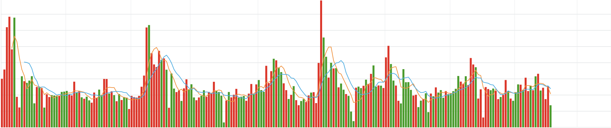
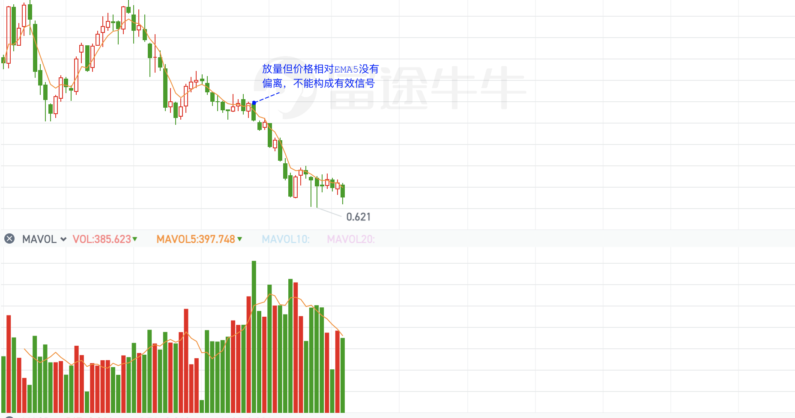

我们都知道，一个有效的策略使用的人多了就会失效。

## 理论基础

### 价格理论

价格是在多因素影响下相对变化的，是个无量纲单位。

## 经典算法

## 原创算法

### 波浪解构

将阶段性的极值点用直线连接，通过比较波浪序列中高低位的变化判断。

升浪：出现连续的右低点高于左低点

跌浪：出现连续的右低点低于左低点

震荡：上述两种情况不连续的无规律的交替出现

同一阶段的成交量，也用波浪连接，就会看到量价背离的现象。

### 阶段性高低点算法【低频】

#### 第一性原理

放在任何市场都准确的，价格和成交量。

一切政策干预/社会动荡/基本面/财务面等**外部因素会反应到量价波动中**

秘密不在一个个基于量/价分别设立的技术指标，而在于量价的配合之中。

#### 空仓与守望

我们清晰的看到，市场每50%的上涨就会对应50%的下跌。

如果指标显示下跌或震荡通道，我们要学会空仓与守望，以免损失利润甚至本金。

日维度的**震荡市不操作**。

#### 右侧交易法

连续的阶段性低点持平或上升时（向下动量减弱），等待向上突破（放量）箱体买入。
连续的阶段性高点持平或下降时（向上动量减弱），等待向下突破（放量）箱体卖出。

#### 判断市场对趋势是否认可

基于量价匹配

##### MACD背离（基于EMA价格动量）

反应不同周期下的价格变化量
DEA或DEM。
今日DEA（MACD）=前一日DEA×8/10+今日DIF×2/10。
计算出的DIF和DEA的数值均为正值或负值。 
用（DIF-DEA）×2即为MACD柱状图。

##### 量价配合（比MACD背离更加灵敏）

也可看做：量价同时在均线的上方和下方（一个在上方一个在下方视为背离）

如下图所示：量价背离后出现下跌（橙黄色均线为EMA5）

> 结合均线判断影响级别

| 价格 | 成交量 | 预期（指下一个波浪） |
| ---- | ------ | -------------------- |
| 新高 | 新低   | 跌（量价异步）       |
| 新低 | 新低   | 涨（量价同步）       |
| 新高 | 新高   | 涨（量价同步）       |
| 新低 | 新高   | 跌（量价异步）       |

##### 共振增强

日、周线

同时出于升浪时最强势

同时背离

##### 换手率

换手率直接反应了市场的情绪，无论是抛压还是吸筹，都能通过不同位置的换手率分析得出。低位放量背离的高换手率必是建仓好时机。股价新高的顶背离的高换手率往往也是平仓的时机。但是仅凭换手率得出的结论很容易被骗线，需要结合多个方面考虑，技术面，公司运作情况以及**大市场趋势**综合分析。

不做参考：相比来讲，成交量的相对变化率更有参考价值

##### 多空一致

多空一致意味着震荡或行情的延续。

## Quantum工具

### 特征值

| 名称       | 特征                                         | 描述                             | 应用            |
| ---------- | -------------------------------------------- | -------------------------------- | --------------- |
| 多空分界线 | EMA(10)导数的MA(5)                           | 大于0位多；小于0位空（有滞后性） |                 |
| 量价背离   | 价格EMA(10)和成交量EMA(10)背离（可以用求导） | 价减量增；价增量减               | 放量突破10日ema |
|            |                                              |                                  |                 |

### XGBoost

### GAN

无监督学习

### Clickhouse

### Backtrader

结合jupyter notebook绘图。

### JupyterNotebook

## 数据源

https://openapi.futunn.com/futu-api-doc/

https://binance-docs.github.io/apidocs/spot/cn/#185368440e

