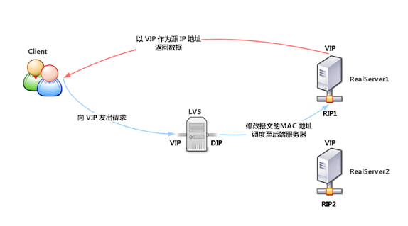
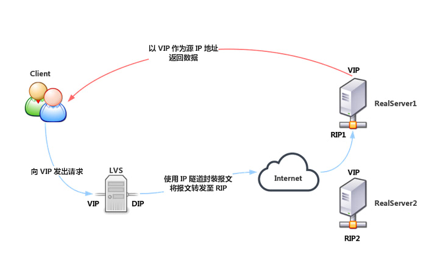
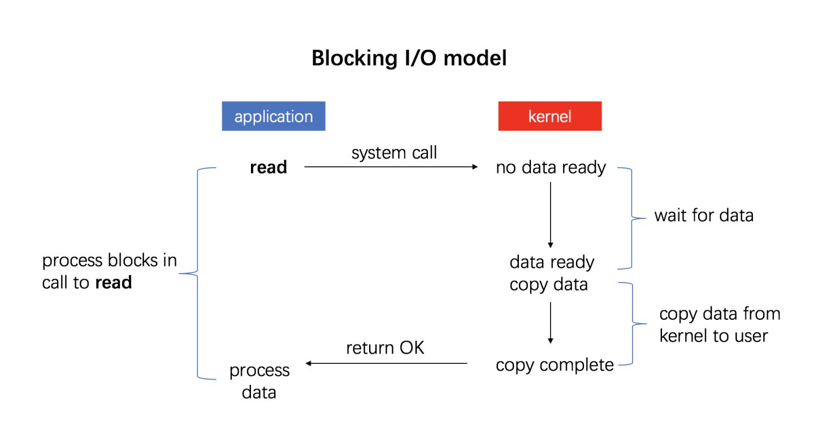
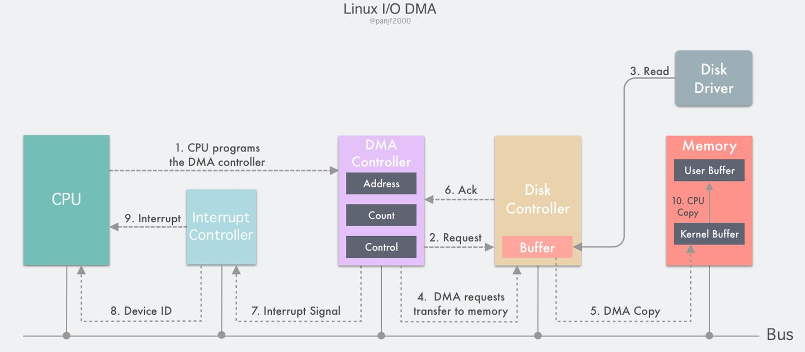
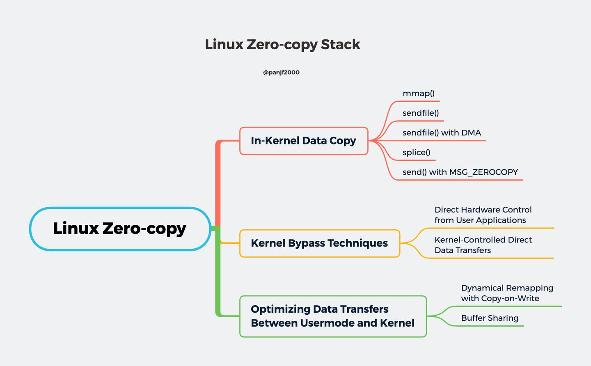

## 计算机基础

### 操作系统

#### SSD能当内存用吗？

#### 什么是虚拟内存？

#### 线程和进程的基本概念

- **进程是对运行时程序的封装，是系统进行资源调度和分配的的基本单位**，实现了操作系统的并发；

- **线程是进程的子任务，是CPU调度和分派的基本单位**，用于保证程序的实时性，实现进程内部的并发。

  > 线程是操作系统可识别的最小执行和调度单位。
  >
  > 独自处理：每个线程都独自占用一个虚拟处理器：独自的寄存器组，指令计数器和处理器状态。
  >
  > 相同地址：每个线程完成不同的任务，但是共享同一地址空间（也就是同样的动态内存，映射文件，目标代码等等），打开的文件队列和其他内核资源。

- 线程和进程的区别

  > 1. 线程依赖于进程而存在：一个线程只能属于一个进程，而一个进程可以有多个线程，但至少有一个线程。
  > 2. 进程在执行过程中拥有独立的内存单元，而多个线程共享进程的内存。（资源分配给进程，同一进程的所有线程共享该进程的所有资源。同一进程中的多个线程共享代码段（代码和常量），数据段（全局变量和静态变量），扩展段（堆存储）。但是每个线程拥有自己的栈段，栈段又叫运行时段，用来存放所有局部变量和临时变量。）
  > 3. 进程是资源分配的最小单位，线程是CPU调度的最小单位；
  > 4. 系统开销： 由于在创建或撤消进程时，系统都要为之分配或回收资源，如内存空间、I/O设备等。因此，操作系统所付出的开销将显著地大于在创建或撤消线程时的开销。类似地，在进行进程切换时，涉及到整个当前进程CPU环境的保存以及新被调度运行的进程的CPU环境的设置。而线程切换只须保存和设置少量寄存器的内容，并不涉及存储器管理方面的操作。可见，进程切换的开销也远大于线程切换的开销。
  > 5. 通信：由于同一进程中的多个线程具有相同的地址空间，致使它们之间的同步和通信的实现，也变得比较容易。进程间通信IPC，线程间可以直接读写进程数据段（如全局变量）来进行通信——需要进程同步和互斥手段的辅助，以保证数据的一致性。在有的系统中，线程的切换、同步和通信都无须操作系统内核的干预
  > 6. 进程编程调试简单可靠性高，但是创建销毁开销大；线程正相反，开销小，切换速度快，但是编程调试相对复杂。
  > 7. 进程间不会相互影响 ；线程一个线程挂掉将导致整个进程挂掉
  > 8. 进程适应于多核、多机分布；线程适用于多核

#### 线程池及其原理

生产/消费者模式

线程池的主要思想是：在进程开始时创建一定数量的线程，并加到池中以等待工作。当服务器收到请求时，它会唤醒池内的一个线程（如果有可用线程），并将需要服务的请求传递给它。一旦线程完成了服务，它会返回到池中再等待工作。如果池内没有可用线程，那么服务器会等待，直到有空线程为止。

系统启动一个新线程的成本是比较高的，因为它涉及与操作系统交互。在这种情形下，使用线程池可以很好地提高性能，尤其是当程序中需要**创建大量生存期很短暂**的线程时，更应该考虑使用线程池。


线程池具有以下优点：

> 1. 用现有线程服务请求比等待创建一个线程更快。
> 2. 线程池限制了任何时候可用线程的数量。这对那些不能支持大量并发线程的系统非常重要。
> 3. 将要执行任务从创建任务的机制中分离出来，允许我们采用不同策略运行任务。例如，任务可以被安排在某一个时间延迟后执行，或定期执行。

池内线程的数量可以通过一些因素来加以估算，如系统 CPU 的数量、物理内存的大小和并发客户请求数量的期望值等。更为高级的线程池架构可以根据使用模式动态调整池内线程数量。这类架构在系统负荷低时，提供了较小的池，从而减低内存消耗。

#### 进程间通信方式（IPC）

| 方式               | 解释                                                         |
| ------------------ | ------------------------------------------------------------ |
| 管道               | 分为命名管道和无名管道，在内核中申请一块固定大小的缓冲区，程序拥有写入和读取的权利，都可以看成一种特殊的文件，具有固定的读端和写端，也可以使用普通的read、write 等函数。但是它不是普通的文件，并不属于其他任何文件系统，并且只存在于内存中；<br />无名管道一般使用fork函数实现父子进程的通信，命名管道用于没有血缘关系的进程也可以进程间通信；面向字节流、自带同步互斥机制、半双工，单向通信，两个管道实现双向通信。 |
| 消息队列           | 在内核中创建一队列，队列中每个元素是一个数据报，**不同的进程可以通过句柄去访问这个队列**；<br />消息队列独立于发送与接收进程，可以通过顺序和消息类型读取，也可以fifo读取；消息队列可实现双向通信 。 |
| 信号量             | 在内核中创建一个信号量集合（本质是个数组），数组的元素（信号量）都是1，使用P操作进行-1，使用V操作+1，通过对临界资源进行保护实现多进程的同步 |
| 共享内存（临界区） | 将同一块物理内存一块映射到不同的进程的虚拟地址空间中，实现不同进程间对同一资源的共享。<br />目前最快的IPC形式，不用从用户态到内核态的频繁切换和拷贝数据，直接从内存中读取就可以，**共享内存是临界区资源**，所以需要操作时必须要保证原子性。使用信号量或者互斥锁都可以。 |
| socket             | 应用层与TCP/IP协议族通信的中间软件抽象层，它是一组接口，把复杂的TCP/IP协议族隐藏在Socket接口后面，对用户来说，一组简单的接口就是全部，让Socket去组织数据。<br />socket起源于UNIX，在Unix一切皆文件哲学的思想下，socket是一种”打开—读/写—关闭”模式的实现，服务器和客户端各自维护一个”文件”，在建立连接打开后，可以向自己文件写入内容供对方读取或者读取对方内容，通讯结束时关闭文件。是一种可以网间通信的方式。 |

#### 竞态条件与临界区

竞态条件& 临界区 当两个线程竞争同一资源时，**如果对资源的访问顺序敏感，就称存在竞态条件**。 导致竞态条件发生的代码区称作临界区。 如下图所示：


### 加密技术

#### RSA非对称加密

#### MD5介绍一下

128位；MD5即Message-Digest Algorithm 5（信息-摘要算法5），用于确保信息传输完整一致。是计算机广泛使用的杂凑算法之一（又译[摘要算法](https://baike.baidu.com/item/摘要算法)、[哈希算法](https://baike.baidu.com/item/哈希算法)），主流编程语言普遍已有MD5实现。

用途：

- 消息防篡改验证
- 文件分发篡改验证

### 编译原理

#### JavaCC的工作原理


## 算法与数据结构

### 做题思路

1. 先画图分析
2. 写算法（递归？）
3. 对数器验算（使用系统提供的算法，或实现一个简单的算法）

### 数据结构

#### 单向链表

#### 双向链表

#### 栈

- 如何用两个栈实现队列？

#### 队列

- 数组实现（RingBuffer）：记住数组limit和size，putindex/pollindex

- 链表实现：
- 两个队列实现栈？

#### 双端队列

#### 单调栈

#### 线性表

线性表，全名为线性存储结构。使用线性表存储数据的方式可以这样理解，即“把所有数据用一根线儿[串](http://data.biancheng.net/view/175.html)起来，再存储到物理空间中”。

#### 最大堆最小堆

#### 哈希表

所有操作的时间复杂度都是O(1)

TreeMap所有的操作时间复杂度为O(logN)

基础类型按值传递（拷贝一份数据），非基础类型按引用传递

#### 跳表

### 算法思想

#### 分治思想

分治算法的基本思想是将一个规模为N的问题分解为K个规模较小的子问题，这些子问题相互独立且与原问题性质相同。 求出子问题的解，就可得到原问题的解。 即一种分目标完成程序算法，简单问题可用二分法完成。

1. 二分法

   > - 二分搜索
   > - 快速排序
   > - 线性时间选择
   > - 汉诺塔
   > - 棋盘覆盖
   > - 循环赛日程表

2. N分法

3. 哈希分治

> - 两个记录着url的16g文件，如何找到在两个文件中都有的URL

3. 递归

   > 

#### 贪心算法

#### 动态规划

> 动态规划也是一种分治思想（比如其状态转移方程就是一种分治），但与分治算法不同的是，分治算法是把原问题分解为若干个子问题，自顶向下求解子问题，合并子问题的解，从而得到原问题的解。动态规划也是把原始问题分解为若干个子问题，然后自底向上，**先求解最小的子问题，把结果存在表格中**，在求解大的子问题时，直接从表格中查询小的子问题的解，避免重复计算，从而提高算法效率。
>
> 所有的暴力递归，都可以改写为动态规划
>
> 先写dp数组，基于递归算法改写（所以要先），从小问题

#### 递归

BaseCase

如果是严格的非条件状态转移，可以使用斐波那契数列

如果每次计算是有条件的，使用动态规划

所有的递归都可以改写为迭代

#### 回溯

#### 分枝界定（Branch and Bound）

分支定界法（branch and bound）是一种求解整数规划问题的最常用算法。 这种方法不但可以求解纯整数规划，还可以求解混合整数规划问题。 分支定界法是一种搜索与迭代的方法，选择不同的分支变量和子问题进行分支。 对于两个变量的整数规划问题，使用网格的方法有时更为简单。

- 基本思想

  > **求解目标**：分支限界法的求解目标则是找出满足约束条件的一个解，或是在满足约束条件的解中找出在某种意义下的最优解。
  >
  > **搜索方式**：以广度优先或以最小耗费优先的方式搜索解空间树。分支限界法常以广度优先或以最小耗费（最大效益）优先的方式搜索问题的解空间树。
  >
  > 在分支限界法中，每一个活结点只有一次机会成为扩展结点。活结点一旦成为扩展结点，就一次性产生其所有儿子结点。在这些儿子结点中，导致不可行解或导致非最优解的儿子结点被舍弃，其余儿子结点被加入活结点表中。
  >
  > 此后，从活结点表中取下一结点成为当前扩展结点，并重复上述结点扩展过程。这个过程一直持续到找到所需的解或活结点表为空时为止。

### 排序算法

#### 特点比较


#### 桶排序

#### 堆排序√

堆排序（Heapsort）是指利用堆这种数据结构所设计的一种排序算法。堆积是一个近似完全二叉树的结构，并同时满足堆积的性质：即子结点的键值或索引总是小于（或者大于）它的父节点。堆排序可以说是一种利用堆的概念来排序的选择排序。分为两种方法：

1. 大顶堆：每个节点的值都大于或等于其子节点的值，在堆排序算法中用于升序排列；
2. 小顶堆：每个节点的值都小于或等于其子节点的值，在堆排序算法中用于降序排列；

排序步骤：

1. 创建一个堆 H[0……n-1]；
2. 把堆首（最大值）和堆尾互换；
3. 把堆的尺寸缩小 1，并调用 shift_down(0)，目的是把新的数组顶端数据调整到相应位置；
4. 重复步骤 2，直到堆的尺寸为 1。

```java
public class HeapSort implements IArraySort {
    @Override
    public int[] sort(int[] sourceArray) throws Exception {
        // 对 arr 进行拷贝，不改变参数内容
        int[] arr = Arrays.copyOf(sourceArray, sourceArray.length);
        int len = arr.length;
        buildMaxHeap(arr, len);
        for (int i = len - 1; i > 0; i--) {
            swap(arr, 0, i);
            len--;
            heapify(arr, 0, len);
        }
        return arr;
    }
    private void buildMaxHeap(int[] arr, int len) {
        for (int i = (int) Math.floor(len / 2); i >= 0; i--) {
            heapify(arr, i, len);
        }
    }
    private void heapify(int[] arr, int i, int len) {
        int left = 2 * i + 1;
        int right = 2 * i + 2;
        int largest = i;
        if (left < len && arr[left] > arr[largest]) {
            largest = left;
        }
        if (right < len && arr[right] > arr[largest]) {
            largest = right;
        }
        if (largest != i) {
            swap(arr, i, largest);
            heapify(arr, largest, len);
        }
    }
    private void swap(int[] arr, int i, int j) {
        int temp = arr[i];
        arr[i] = arr[j];
        arr[j] = temp;
    }
}
```

#### 快速排序√

在平均状况下，排序 n 个项目要 Ο(nlogn) 次比较。在最坏状况下则需要 Ο(n2) 次比较，但这种状况并不常见。事实上，快速排序通常明显比其他 Ο(nlogn) 算法更快，因为它的内部循环（inner loop）可以在大部分的架构上很有效率地被实现出来。

> **快排与归并**：快速排序的最坏运行情况是 O(n²)，比如说顺序数列的快排。但它的平摊期望时间是 O(nlogn)，且 O(nlogn) 记号中隐含的常数因子很小，比复杂度稳定等于 O(nlogn) 的归并排序要小很多。所以，对绝大多数顺序性较弱的随机数列而言，快速排序总是优于归并排序。

```java
public class QuickSort implements IArraySort {
    @Override
    public int[] sort(int[] sourceArray) throws Exception {
        // 对 arr 进行拷贝，不改变参数内容
        int[] arr = Arrays.copyOf(sourceArray, sourceArray.length);
        return quickSort(arr, 0, arr.length - 1);
    }
    private int[] quickSort(int[] arr, int left, int right) {
        if (left < right) {
            int partitionIndex = partition(arr, left, right);
            quickSort(arr, left, partitionIndex - 1);
            quickSort(arr, partitionIndex + 1, right);
        }
        return arr;
    }
    private int partition(int[] arr, int left, int right) {
        // 设定基准值（pivot）
        int pivot = left;
        int index = pivot + 1;
        for (int i = index; i <= right; i++) {
            if (arr[i] < arr[pivot]) {
                swap(arr, i, index);
                index++;
            }
        }
        swap(arr, pivot, index - 1);
        return index - 1;
    }
    private void swap(int[] arr, int i, int j) {
        int temp = arr[i];
        arr[i] = arr[j];
        arr[j] = temp;
    }
}
```

#### 希尔排序√

希尔排序，也称递减增量排序算法，是插入排序的一种更高效的改进版本。但希尔排序是非稳定排序算法。

希尔排序是基于插入排序的以下两点性质而提出改进方法的：

- 插入排序在对几乎已经排好序的数据操作时，效率高，即可以达到线性排序的效率；
- 但插入排序一般来说是低效的，因为插入排序每次只能将数据移动一位；

希尔排序的基本思想是：先将整个待排序的记录序列分割成为若干子序列分别进行直接插入排序，待整个序列中的记录"基本有序"时，再对全体记录进行依次直接插入排序。

算法步骤

> - 选择一个增量序列 t1，t2，……，tk，其中 ti > tj, tk = 1；
>
> - 按增量序列个数 k，对序列进行 k 趟排序；
>
> 每趟排序，根据对应的增量 ti，将待排序列分割成若干长度为 m 的子序列，分别对各子表进行直接插入排序。仅增量因子为 1 时，整个序列作为一个表来处理，表长度即为整个序列的长度。

```java
public static void shellSort(int[] arr) {
    int length = arr.length;
    int temp;
    for (int step = length / 2; step >= 1; step /= 2) {
        for (int i = step; i < length; i++) {
            temp = arr[i];
            int j = i - step;
            while (j >= 0 && arr[j] > temp) {
                arr[j + step] = arr[j];
                j -= step;
            }
            arr[j + step] = temp;
        }
    }
}
```

#### 插入排序

将第一待排序序列第一个元素看做一个有序序列，把第二个元素到最后一个元素当成是未排序序列。

从头到尾依次扫描未排序序列，将扫描到的每个元素插入有序序列的适当位置。（如果待插入的元素与有序序列中的某个元素相等，则将待插入元素插入到相等元素的后面。）

```java
public class InsertSort implements IArraySort {
    @Override
    public int[] sort(int[] sourceArray) throws Exception {
        // 对 arr 进行拷贝，不改变参数内容
        int[] arr = Arrays.copyOf(sourceArray, sourceArray.length);
        // 从下标为1的元素开始选择合适的位置插入，因为下标为0的只有一个元素，默认是有序的
        for (int i = 1; i < arr.length; i++) {
            // 记录要插入的数据
            int tmp = arr[i];
            // 从已经排序的序列最右边的开始比较，找到比其小的数
            int j = i;
            while (j > 0 && tmp < arr[j - 1]) {
                arr[j] = arr[j - 1];
                j--;
            }
            // 存在比其小的数，插入
            if (j != i) {
                arr[j] = tmp;
            }
        }
        return arr;
    }
}
```


#### 归并排序√

归并排序（Merge Sort）是建立在归并操作上的一种有效，稳定的排序算法，该算法是采用分治法（Divide and Conquer）的一个非常典型的应用。 将已有序的子序列合并，得到完全有序的序列；即先使每个子序列有序，再使子序列段间有序。 若将两个有序表合并成一个有序表，称为二路归并。


```java
public class MergeSort implements IArraySort {
    @Override
    public int[] sort(int[] sourceArray) throws Exception {
        // 对 arr 进行拷贝，不改变参数内容
        int[] arr = Arrays.copyOf(sourceArray, sourceArray.length);
        if (arr.length < 2) {
            return arr;
        }
        int middle = (int) Math.floor(arr.length / 2);
        int[] left = Arrays.copyOfRange(arr, 0, middle);
        int[] right = Arrays.copyOfRange(arr, middle, arr.length);
        return merge(sort(left), sort(right));
    }
    protected int[] merge(int[] left, int[] right) {
        int[] result = new int[left.length + right.length];
        int i = 0;
        while (left.length > 0 && right.length > 0) {
            if (left[0] <= right[0]) {
                result[i++] = left[0];
                left = Arrays.copyOfRange(left, 1, left.length);
            } else {
                result[i++] = right[0];
                right = Arrays.copyOfRange(right, 1, right.length);
            }
        }
        while (left.length > 0) {
            result[i++] = left[0];
            left = Arrays.copyOfRange(left, 1, left.length);
        }
        while (right.length > 0) {
            result[i++] = right[0];
            right = Arrays.copyOfRange(right, 1, right.length);
        }
        return result;
    }
}
```

#### 选择排序

首先在未排序序列中找到最小（大）元素，存放到排序序列的起始位置。

再从剩余未排序元素中继续寻找最小（大）元素，然后放到已排序序列的末尾。

重复第二步，直到所有元素均排序完毕。

```java
public class SelectionSort implements IArraySort {
    @Override
    public int[] sort(int[] sourceArray) throws Exception {
        int[] arr = Arrays.copyOf(sourceArray, sourceArray.length);
        // 总共要经过 N-1 轮比较
        for (int i = 0; i < arr.length - 1; i++) {
            int min = i;
            // 每轮需要比较的次数 N-i
            for (int j = i + 1; j < arr.length; j++) {
                if (arr[j] < arr[min]) {
                    // 记录目前能找到的最小值元素的下标
                    min = j;
                }
            }
            // 将找到的最小值和i位置所在的值进行交换
            if (i != min) {
                int tmp = arr[i];
                arr[i] = arr[min];
                arr[min] = tmp;
            }
        }
        return arr;
    }
```

https://www.runoob.com/w3cnote/selection-sort.html

### 查找算法

#### 二分法查找

### 数学思想

#### 斐波那契数列

适用条件：**严格的、没有条件转移的表达式。**

### 状态机

#### AC自动机

#### 有限状态机

### 其它技巧

#### 位运算

- 不引入新的变量交换A，B两个变量的值；A=A\^B，B=A\^B，A=A\^B（条件：A/B不能指向同一个内存）

- 一个数组中，只有一种数出现了奇数词；所有的数异或，最终的结果就是出现奇数次的数。（偶数个相等的数异或结果为0）

- 提取最后一个二进制的1；N & ( ( ~N ) + 1 )

- 乘2：5<<1；乘4：5<<2；除16：80>>4

#### 二进制技巧

- 使用二进制随机数，可以生成任意范围的随机数

#### 双指针

双指针技巧还可以分为两类，一类是「快慢指针」，一类是「左右指针」。前者解决主要解决链表中的问题，比如典型的判定链表中是否包含环；后者主要解决数组（或者字符串）中的问题，比如二分查找。

#### 滑动窗口

### 经典算法题

#### 买卖股票的最佳时机

#### Z字打印二叉树

#### 二叉树镜像（递归）

```java
class Solution {
    public TreeNode mirrorTree(TreeNode root) {
        // 当节点为空时，直接返回
        if(root == null) return null;
        // 设置一个临时的节点 tmp 用来存储当前节点的左子树
        TreeNode tmp = root.left;
        // 以下两个操作是在交换当前节点的左右子树
        // 当前节点的左子树为节点的右子树
        // 同时递归下去，不停的交互子树中的节点
        root.left = mirrorTree(root.right);
        // 当前节点的右子树为节点的左子树
        // 同时递归下去，不停的交互子树中的节点
        root.right = mirrorTree(tmp);
        // 最后返回根节点
        return root;
    }
}
```

## 计算机网络

### 高可用，容灾和异地多活

#### 常见的负载均衡器

根据工作在的协议层划分可划分为：

- 四层负载均衡：根据请求报文中的目标地址和端口进行调度
- 七层负载均衡：根据请求报文的内容进行调度，这种调度属于「代理」的方式

根据软硬件划分：

- 硬件负载均衡：
  - F5 的 BIG-IP
  - Citrix 的 NetScaler
  - 这类硬件负载均衡器通常能同时提供四层和七层负载均衡，但同时也价格不菲
- 软件负载均衡：
  - TCP 层：LVS，HaProxy，Nginx
  - 基于 HTTP 协议：Haproxy，Nginx，ATS（Apache Traffic Server），squid，varnish
  - 基于 MySQL 协议：mysql-proxy

#### Linux高可用之Keepalived

Keepalived是用C语言编写的路由软件。该项目的主要目标是为Linux系统和基于Linux的基础结构提供负载均衡和高可用性的简单而强大的功能。负载平衡框架依赖于提供第4层负载平衡的著名且广泛使用的Linux虚拟服务器（IPVS）内核模块。Keepalived实现了一组VIP功能，以根据其运行状况动态，自适应地维护和管理负载平衡的服务器池。**另一方面，VRRP实现了高可用性 协议。VRRP是路由器故障转移的基础。**

**VRRP （Virtual Router Redundancy Protocol，虚拟路由器冗余协议）：** 在现实的网络环境中，主机之间的通信都是通过配置静态路由（默认网关）完成的， 而主机之间的路由器一旦出现故障，通信就会失败，因此，在这种通信模式中，路由器就成了一个单点瓶颈，为了解决这个问题，就引入了 VRRP 协议。

VRRP 可以将两台或多台物理路由器设备虚拟成一个虚拟路由器，每个虚拟路由器都有一个唯一标识，称为 VRID，一个 VRID 与一组 IP 地址构成了一个虚拟路由器。 这个虚拟路由器通过虚拟IP（一个或多个）对外提供服务。而在虚拟路由器内部，同一时间只有一台物理路由器对外提供服务，这台物理路由器被称为主路由器（处于 MASTER 角色）。 而其他物理路由器不拥有对外的虚拟 IP，也不提供对外网络功能，仅仅接收 MASTER 的 VRRP 状态通告信息，这些路由器被统称为备份路由器（处于 BACKUP 角色）。 当主路由器失效时，处于 BACKUP 角色的备份路由器将重新进行选举，产生一个新的主路由器进入 MASTER 角色继续提供对外服务，整个切换过程对用户来说完全透明。

- Nginx+Keepalived

  > Nginx 可以用来作为反向代理服务器，来提供负载均衡的能力，使我们的 Web 服务器，能够水平扩容，从而处理更多的用户请求，但是反向代理服务器又变成了一个单点，当反向代理服务器挂了，整合 Web 服务器就不能被外界访问到，所以我们必须要保证反向代理服务器的高可用。
  >
  > 而 Keepalived 是一种高性能的服务器高可用或热备解决方案，Keepalived 可以用来防止服务器单点故障的发生，通过配合 Nginx 可以实现 Web 前端服务的高可用。

- LVS+Keepalived

  > 

- 脑裂问题

  > 在高可用系统中，作为主备节点的两台服务器，可能因为一些比如说网络断开，两台机器的心跳检测会认为主挂了，但是主其实是正常的，只是网络断开了，心跳检测没法检查到主还活着，**由于主从之间失去了联系，都以为是对方发生了故障，所以两个节点都会主动的抢占资源，**争抢应用服务，争抢VIP，这样就发发生一些严重的后果，或者资源被瓜分了、或者是两边的节点都启动不起来了、或者是都起来了，但是同时读写共享存储，导致数据损坏。

#### LVS负载均衡及几种工作模式

LVS 是一个工作在四层的负载均衡器，它的实现和 iptables/netfilter 类似，工作在内核空间的 TCP/IP 协议栈上，LVS 工作在 INPUT Hook Funtion 上，并在 INPUT 设置附加规则，一旦客户端请求的是集群服务，LVS 会强行修改请求报文，将报文发往 POSTROUTING，转发至后端的主机。

- 相关术语

  > - LB (Load Balancer 负载均衡)
  > - HA (High Available 高可用)
  > - Failover (失败切换)
  > - Cluster (集群)
  > - LVS (Linux Virtual Server Linux 虚拟服务器)
  > - DS (Director Server)，指的是前端负载均衡器节点
  > - RS (Real Server)，后端真实的工作服务器
  > - VIP (Virtual IP)，虚拟的 IP 地址，向外部直接面向用户请求，作为用户请求的目标的 IP 地址
  > - DIP (Director IP)，主要用于和内部主机通讯的 IP 地址
  > - RIP (Real Server IP)，后端服务器的 IP 地址
  > - CIP (Client IP)，访问客户端的 IP 地址

- LVS-NAT

  > 
  >
  > LVS-NAT 模型类似于 DNAT，工作机制与 DNAT 一样，当客户端请求的是集群服务时，LVS 修改请求报文的目标地址为 RIP，转发至后端的 RealServer，并修改后端响应报文的源地址为 VIP，响应至客户端。
  >
  > 在 LVS-NAT 模型下，Director 进出请求报文都经过 Director，因此 Director 的压力是比较大的。
  >
  > LVS-NAT 的特性：
  >
  > - 集群节点跟 Director 必须在同一个 IP 网络中
  > - RIP 通常是私有地址，仅用于各集群节点间的通信
  > - Director 位于 client 和 Realserver 之间，负责处理进出的所有报文
  > - Realserver 必须将网关指向 DIP
  > - 支持端口映射
  > - 较大规模应用场景中，Director 易成为系统瓶颈（bottleneck）

- LVS-DR

  > 
  >
  > DR 值 Direct Routing，直接路由，DR 模型中，Director 和 Realserver 处在同一网络中，对于 Director，VIP 用于接受客户端请求，DIP 用于和 Realserver 通信。对于 Realserver，每个 Realserver 都配有和 Director 相同的 VIP（此 VIP 隐藏，关闭对 ARP 请求的响应），仅用户响应客户端的请求，RIP 用于和 Director 通信。
  >
  > 当客户端请求集群服务时，请求报文发送至 Director 的 VIP（Realserver的 VIP 不会响应 ARP 请求），Director 将客户端报文的源和目标 MAC 地址进行重新封装，将报文转发至 Realserver，Realserver 接收转发的报文。此时报文的源 IP 和目标 IP 都没有被修改，因此 Realserver 接受到的请求报文的目标 IP 地址为本机配置的 VIP，它将使用自己的 VIP 直接响应客户端。
  >
  > LVS-DR 模型中，客户端的响应报文不会经过 Director，因此 Director 的并发能力有很大提升。
  >
  > LVS-DR 模型的特性：
  >
  > - 保证前端路由器将目标地址为 VIP 的报文通过 ARP 解析后送往 Director。
  >   - 静态绑定：在前端路由将 VIP 对应的目标 MAC 地址静态配置为Director VIP 接口的 MAC 地址。
  >   - arptables：在各 Realserver 上，通过 arptables 规则拒绝其响应对 VIP 的 ARP 广播请求
  >   - 修改内核参数：在 Realserver 上修改内核参数，并结合地址的配置方式实现拒绝响应对 VIP 的 ARP 广播请求
  > - 各RIP 必须与 DIP 在同一个物理网络中
  > - RS 的 RIP 可以使用私有地址，也可以使用公网地址，以方便配置
  > - Director 仅负责处理入站请求，响应报文由 Realserver 直接发往客户端
  > - Realserver 不能将网关指向 DIP，而直接使用前端网关
  > - 不支持端口映射

- LVS-TUN

  > 
  >
  > 和 DR 模型类似，Realserver 都配有不可见的 VIP，Realserver 的 RIP 是公网地址，且可能和 DIP 不再同一网络中。当请求到达 Director 后，Director 不修改请求报文的源 IP 和目标 IP 地址，而是使用 IP 隧道技术，使用 DIP 作为源 IP，RIP 作为目标 IP 再次封装此请求报文，转发至 RIP 的 Realserver 上，Realserver 解析报文后仍然使用 VIP 作为源地址响应客户端。
  >
  > LVS-TUN 的特性：
  >
  > - 集群节点和可以跨越 Internet
  > - RIP，DIP，VIP 都是公网地址
  > - Director 仅负责处理入站请求，响应报文由 Realserver 直接发往客户端
  > - Realserver 使用自己的网关而不是 Director
  > - Realserver 只能使用支持隧道功能的操作系统
  > - 不支持端口映射

#### LVS和HAProxy相比，它的缺点是什么?

The most important thing that differentiates the two solutions (LVS, HAproxy) is that one is working at layer 4 (LVS) and the other at layer 7 (HAproxy). Note that the layers references are from OSI networking model.

If you understand this, you'll be able to use one in the right place. For example : if you need to balance based solely on number of connections (let's say), the layer 4 load balancer should suffice; on the other hand, if you want to load-balancer based on HTTP response time, you'll need a higher layer kind of LB.

The drawbacks of using a higher level LB is the resource needed (for the same amount of let's say, traffic). The plusses are obvious - think "packet level inspection", "protocol routing", etc - things far more complicated than simple "packet routing".

The last point I want to make is that HAproxy is userspace (think "far more easy to customize/tweak", but slower (performance)), while LVS is in kernel space (think "fast as hell", but rigid as the kernel). Also, don't forget about "upgrading LVS might mean kernel change - ergo, reboot"...

### 网络优化

#### CDN内容分发网络

#### DNS解析过程

### 网络安全

#### 什么是物理隔离网闸？有什么用

**网闸**，又称为**物理隔离网闸**，可以在[TCP/IP](https://zh.wikipedia.org/wiki/TCP/IP)协议层的物理层对于多个网络连接进行切换。

网闸是使用带有多种控制功能的固态开关读写介质，连接两个独立主机系统的信息安全设备。 由于两个独立的主机系统通过网闸进行隔离，使系统间不存在通信的物理连接、逻辑连接及信息传输协议，不存在依据协议进行的信息交换，而只有以数据文件形式进行的无协议摆渡。

当一部联网设备需要在多个网络中切换，同时安全级数较高，要求对多个网络进行物理隔离，而非划分vLan的情况下，则推荐使用网闸。

例如一部连接网络的电脑，需要使用公司的内联网（安全环境），也需要上网（不可信环境），同时需要在两者之间互相切换的情况下使用。

| 类型     | 介绍                                                         |
| -------- | ------------------------------------------------------------ |
| 机械网闸 | 机械网闸为机械开关控制，在插入的两根网线中进行切换，此类网闸使用简单，成本低，纯物理隔离，但是不具备任何管理功能，由使用者手动操作，有难以监管和审计等问题 |
| 智能网闸 | 智能网闸具备一般路由器类似的图形管理界面，根据管理员需求，可以对使用者进行审计和时间控制及管理员进行摇控管理等多种功能。 |

（1）涉密网与非涉密网之间。有些政府办公网络涉及敏感信息，当它与外部非涉密网连接的时候可以用单向[物理隔离网闸](https://baike.baidu.com/item/物理隔离网闸/10499692)将两者隔开。

（2）[局域网](https://baike.baidu.com/item/局域网/98626)与[互联网](https://baike.baidu.com/item/互联网/199186)之间（内网与外网之间）。有些局域网络，特别是政府办公网络，涉及政府敏感信息，有时需要与互联网在逻辑上断开，物理隔离网闸是一个常用的办法。

（3）办公网与[业务网](https://baike.baidu.com/item/业务网/5924316)之间。由于办公网络与业务网络的信息敏感程度不同，例如，银行的办公网络和银行业务网络就是很典型的信息敏感程度不同的两类网络。为了提高工作效率，办公网络有时需要与业务网络交换信息。为解决业务网络的安全，比较好的办法就是在办公网与业务网之间使用物理隔离网闸，实现两类网络的逻辑隔离。

（4）电子政务的内网与专网之间。在[电子政务系统](https://baike.baidu.com/item/电子政务系统/10025157)建设中要求政府内网与外网之间用逻辑隔离，在政府专网与内网之间用逻辑隔离。现常用的方法是用物理隔离网闸来实现。

（5）业务网与互联网之间。电子商务网络一边连接着业务网络服务器，一边通过互联网连接着广大用户。为了保障业务网络服务器的安全，在业务网络与互联网之间应实现逻辑隔离。

#### 分布式架构下，Session共享有什么方案

#### 为什么Cookie无法防止CSRF，而Token可以？

#### Cookie和Session有什么区别？如何使用Session进行身份认证？

#### 认证和授权的区别是什么？

#### SSO的基本原理和认证流程？

#### 什么是CSRF？

### TCP/IP模型

#### TCP/IP四层协议模型


- 消息发送流程

  > 第一层：应用层，主要有负责web浏览器的HTTP协议， 文件传输的FTP协议，负责电子邮件的SMTP协议，负责域名系统的DNS等。
  >
  > 第二层：传输层，主要是有**可靠传输**的TCP协议，特别**高效**的UDP协议。主要负责传输应用层的数据包。
  >
  > 第三层：网络层，主要是IP协议。主要负责寻址（找到目标设备的位置）
  >
  > 第四层：数据链路层，主要是负责转换数字信号和物理二进制信号。
  >
  > 

#### TCP连接中的五个常见flag标志位

1. SYN(synchronous)： 发送/同步标志，用来建立连接，和下面的第二个标志位ACK搭配使用。连接开始时，SYN=1，ACK=0，代表连接开始但是未获得响应。当连接被响应的时候，标志位会发生变化，其中ACK会置为1，代表确认收到连接请求，此时的标志位变成了 SYN=1，ACK=1。
2. ACK(acknowledgement)：确认标志，表示确认收到请求。
3. PSH(push) ：表示推送操作，就是指数据包到达接收端以后，不对其进行队列处理，而是尽可能的将数据交给应用程序处理
4. FIN(finish)：结束标志，用于结束一个TCP会话；
5. RST(reset)：重置复位标志，用于复位对应的TCP连接。
6. URG(urgent)：紧急标志，用于保证TCP连接不被中断，并且督促中间层设备尽快处理。

此外，还有两个序号：

1. Sequence number ：顺序号，发送数据包中的第一个字节的序列号，一般为小写的seq。
2. Acknowledge number：确认号，响应前面的seq，值为seq+1，可以理解为期望下次发出的序列号为seq+1；

#### TCP的3次握手


第一次握手：客户端Client发送位码为SYN＝1，随机产生seq=x的数据包到服务器，服务器Server由SYN=1知道，客户端Client要求建立联机；

第二次握手：服务器Server收到请求后要确认联机信息，向客户端Client发送ack=(客户端Client请求连接时的seq)+1，SYN=1，ACK=1，产生seq=y的包,代表接收到连接请求并且向客户端再次确认；

第三次握手：客户端Client收到后检查ack是否正确，即第一次发送的seq+1，以及位码ACK是否为1，代表收到了服务器端发过来的确认信息。之后客户端Client会再向服务器发送ack=(服务器Server的seq+1)，ACK=1，服务器Server收到后确认ack 值与ACK=1，连接建立成功。

#### TCP的4次挥手


客户端Client进程发出连接释放报文，并且停止发送数据。其中FIN=1，顺序号为seq=m（等于前面已经传送过来的数据的最后一个字节的序号加1），此时，客户端Client进入FIN-WAIT-1（终止等待1）状态。 TCP规定，FIN报文段即使不携带数据，也要消耗一个序号。

服务器Server收到连接释放报文，发出确认报文，ACK=1，ack=m+1，并且带上自己的顺序号seq=n，此时，服务器Server就进入了CLOSE-WAIT（关闭等待）状态。TCP服务器通知高层的应用进程，客户端Client向服务器的方向就释放了，这时候处于半关闭状态，即客户端Client已经没有数据要发送了，但是服务器Server若发送数据，客户端Client依然要接受。这个状态还要持续一段时间，也就是整个CLOSE-WAIT状态持续的时间。

客户端Client收到服务器Server的确认信息后，此时，客户端Client就进入FIN-WAIT-2（终止等待2）状态，等待服务器Server发送连接释放报文（在这之前还需要接受服务器Server发送的最后的数据）。

服务器Server将最后的数据发送完毕后，就向客户端发送连接释放报文，FIN=1，ack=m+1，由于在半关闭状态，服务器Server很可能又发送了一些数据，假定此时的顺序号为seq=p，此时，服务器Server就进入了LAST-ACK（最后确认）状态，等待客户端Client的确认。

客户端Client收到服务器Server的连接释放报文后，必须发出确认，ACK=1，ack=p+1，而自己的顺序号是seq=m+1，此时，客户端Client就进入了TIME-WAIT（时间等待）状态。注意此时TCP连接还没有释放，必须经过2*MSL（最长报文段寿命）的时间后，当客户端Client撤销相应的TCB（保护程序）后，才进入CLOSED状态。

服务器Server只要收到了客户端Client发出的确认，立即进入CLOSED状态。同样，撤销TCB后，就结束了这次的TCP连接。可以看到，服务器Server结束TCP连接的时间要比客户端Client早一些。


#### 四次挥手中TIME_WAIT的目的是什么

#### TCP和UDP有什么区别，各适合什么场景？

#### 如何查看TCP状态

#### HTTP和HTTPS的区别

#### TCP的拥塞控制

#### TCP连接状态

在 TCP 的三次握手、数据传输以及四次挥手的过程中，我们给 Client 和 Server 定义了很多状态用于描述整个流程，结合上面的状态转换图来理解这些状态定义：

- LISTEN（Server）: 正在侦听来自远方的 TCP 端口的连接请求，服务端启动后处于 LISTEN 状态用于监听不同客户端的 TCP 请求并建立连接
- SYN-SENT（Client）: 三次握手时，Client 在发送 SYN 以请求后处于等待建立连接的状态
- SYN_RCVD（Server）：三次握手时，当 Server 收到 Client 的 SYN 信号时，将标志位 ACK 和 SYN 发送给 Client 后到建立连接之间，Server 处于 SYN_RCVD 状态
- ESTABLISHED（Server And Client）：三次握手成功以后，Client 和 Server 处于数据传输的状态
- FIN-WAIT-1（Client）：四次挥手时，Client 端发送中断请求 FIN 到收到 Server 端的中断确认的过程
- CLOSE_WAIT（Server）：四次挥手时，Client 接收到 Client 的 FIN 请求响应后回复 ACK 确认到发送 FIN 包的状态
- FIN-WAIT-2（Client）：四次挥手时，当 Client 接收到 Server 对于 FIN 的响应 ACK 后到收到 Server 端的 FIN 包的状态
- LAST_ACK（Server）：四次挥手时，Server 发送 FIN 请求关闭连接到关闭连接前的状态
- TIME_WAIT（Client）：四次挥手时 Client 对于 Server 的 FIN 回复 ACK 到连接关闭前的状态，又称 2MSL 状态
- CLOSE（Server And Client）：Server 和 CLient 关闭连接后的状态

正常情况下，客户端的状态转换流程如下：

```
 CLOSED -> SYN_SENT -> ESTABLISHED -> FIN_WAIT_1 -> FIN_WAIT_2 -> TIME_WAIT -> CLOSED
```

正常情况下，服务端的状态转换流程如下：

```
 CLOSED -> LISTEN -> SYN_RCVD -> ESTABLISHED -> CLOSE_WAIT -> LAST_ACK -> CLOSED
```

#### 为什么连接时三次握手，断开时需要四次挥手

1. 当客户端发起关闭连接的请求时，发出的FIN，仅代表客户端没有需要发送给服务器端的数据了。
2. 如果**服务器端如果仍有数据需要发送**给客户端的话，响应报文ACK和结束报文FIN则就不能同时发送给客户端了。
3. 此时，服务器端会先返回一个响应报文，代表接收到了客户端发出的FIN请求，而后**在数据传输完了之后，再发出FIN请求**，表示服务器端已经准备好断开连接了。

综上所述：所以关闭连接的时候是四次握手。

#### 为什么TIME_WAIT状态需要经过2MSL才能返回到CLOSE状态？

MSL (*Maximum Segment Lifetime*最大报文段生存时间，*RFC 793*中规定*MSL*为*2*分钟，实际应用中常用的是*30*秒，*1*分钟和*2*分钟等。)

按照前面所说，当四个报文全部发送完毕后，理论上就算是结束了。但是实际情况往往不会那么可靠，比如最后一条报文发出后丢失了，那么服务器端就不会接收到这一报文，每隔一段时间，服务器端会再次发出FIN报文，此时如果客户端已经断开了，那么就无法响应服务器的二次请求，这样服务器会继续发出FIN报文，从而变成了死循环。所以需要设置一个时间段，如果在这个时间段内接收到了服务器端的再次请求，则代表客户端发出的ACK报文没有接收成功。

反之，则代表服务器端成功接收响应报文，客户端进入CLOSED状态，此次连接成功关闭。而这个时间，就规定为了2MSL，即客户端发出ACK报文到服务器端的最大时间 + 服务器没有接收到ACK报文再次发出FIN的最大时间 = 2MSL

#### 为什么不能用两次握手进行连接？

三次握手有两个重要的功能，一是要双方做好发送数据的准备工作且双方都知道彼此已准备好，二要允许双方就初始顺序号进行协商，这个顺序号在握手过程中被发送和确认。如果改为了两次握手，是有可能发生死锁的。在两次握手的设定下，服务器端在成功接受客户端的连接请求SYN后，向客户端发出ACK确定报文时，如果因为网络原因客户端没有接收到，则会一直等待服务器端的ACK报文，而服务器端则认为连接成功建立了，便开始向客户端发送数据。但是客户端因为没有收到服务器端的ACK报文，且不知道服务器的顺序号seq，则会认为连接未成功建立，忽略服务器发出的任何数据。

如此客户端一直等待服务器端的ACK报文，而服务器端因为客户端一直没有接收数据，而不断地重复发送数据，从而造成死锁。

#### 已经建立了连接，客户端突然故障怎么办？

TCP还设有一个**保活计时器**，显然，客户端如果出现故障，服务器不能一直等下去，白白浪费资源。

服务器**每收到一次客户端的请求后都会重新复位这个计时器**，时间通常是设置为**2小时**。
若两小时还没有收到客户端的任何数据，服务器就会发送一个探测报文段，以后每隔75秒钟发送一次。若一连发送10个探测报文仍然没反应，服务器就认为客户端出了故障，接着就关闭连接。

#### UDP和TCP的使用场景区别

TCP

> TCP 是**面向连接**的、**可靠**的流协议。流就是指不间断的数据结构，当应用程序采用 TCP 发送消息时，虽然可以保证发送的顺序，但还是犹如没有任何间隔的数据流发送给接收端。
>
> TCP 为提供可靠性传输，实行“**顺序控制**”或“**重发控制**”机制。此外还具备“**流控制（流量控制）**”、“**拥塞控制**”、提高网络利用率等众多功能。
>
> TCP有以下特点：
>
> - TCP充分地实现了数据传输时各种控制功能，可以进行丢包时的重发控制，还可以对次序乱掉的分包进行顺序控制。而这些在 UDP 中都没有。
> - 此外，TCP 作为一种面向有连接的协议，只有在确认通信对端存在时才会发送数据，从而可以控制通信流量的浪费。
> - 根据 TCP 的这些机制，在 IP 这种无连接的网络上也能够实现高可靠性的通信（ **主要通过检验和、序列号、确认应答、重发控制、连接管理以及窗口控制**等机制实现）。

UDP

> UDP 是**面向报文**的，所谓面向报文，是指面向报文的传输方式是应用层交给UDP多长的报文，UDP就照样发送，即一次发送一个报文。因此，应用程序必须选择合适大小的报文。若报文太长，则IP层需要分片，降低效率。若太短，会是IP太小。
>
> UDP 是**不具有可靠性**的数据报协议，细微的处理它会交给上层的应用去完成。在 UDP 的情况下，虽然可以确保发送消息的大小，却不能保证消息一定会到达。因此，应用有时会根据自己的需要进行重发处理。
>
> UDP有以下特点：
>
> - UDP 不提供复杂的控制机制，利用 IP 提供面向无连接的通信服务。
> - 传输途中出现丢包，UDP 也不负责重发。
> - 当包的到达顺序出现乱序时，UDP没有纠正的功能。
> - 并且它是将应用程序发来的数据在收到的那一刻，立即按照原样发送到网络上的一种机制。即使是出现网络拥堵的情况，UDP 也无法进行流量控制等避免网络拥塞行为。
> - 如果需要以上的细节控制，不得不交由采用 UDP 的应用程序去处理。
> - UDP 常用于以下几个方面：
>   - 1.包总量较少的通信（DNS、SNMP等）；
>   - 2.视频、音频等多媒体通信（即时通信）；
>   - 3.限定于 LAN 等特定网络中的应用通信；
>   - 4.广播通信（广播、多播）。

## Linux内核

### 文件系统与IO

#### epoll和poll之间有什么区别

#### DirtyPage脏页

脏页是Linux内核中的概念，因为硬盘的读写速度远赶不上内存的速度，系统就把读写比较频繁的数据事先放到内存中，以提高读写速度，这就叫高速缓存，linux是以页作为高速缓存的单位，当进程修改了高速缓存里的数据时，该页就被内核标记为脏页，内核将会在合适的时间把脏页的数据写到磁盘中去，以保持高速缓存中的数据和磁盘中的数据是一致的。

#### PageCache原理

因为硬盘和内存的读写性能差距巨大，Linux默认情况是以异步方式读写文件的。比如调用系统函数open()打开或者创建文件时缺省情况下是带有O_ASYNC flag的。Linux借助于内核的page cache来实现这种异步操作。

也就是说，我们平常向硬盘写文件时，默认异步情况下，并不是直接把文件内容写入到硬盘中才返回的，而是成功拷贝到内核的page cache后就直接返回，所以大多数情况下，硬盘写操作不会是性能瓶颈。写入到内核page cache的pages成为dirty pages，稍后会由内核线程pdflush真正写入到硬盘上。

从硬盘读取文件时，同样不是直接把硬盘上文件内容读取到用户态内存，而是先拷贝到内核的page cache，然后再“拷贝”到用户态内存，这样用户就可以访问该文件。因为涉及到硬盘操作，所以第一次读取一个文件时，不会有性能提升；不过，如果一个文件已经存在page cache中，再次读取该文件时就可以直接从page cache中命中读取不涉及硬盘操作，这时性能就会有很大提高。

下面用`dd`比较下异步（缺省模式）和同步写硬盘的速度差别：

```
$ dd if=/dev/urandom of=async.txt bs=64M count=16 iflag=fullblock
16+0 records in
16+0 records out
1073741824 bytes (1.1 GB, 1.0 GiB) copied, 7.618 s, 141 MB/s
$ dd if=/dev/urandom of=sync.txt bs=64M count=16 iflag=fullblock oflag=sync
16+0 records in
16+0 records out
1073741824 bytes (1.1 GB, 1.0 GiB) copied, 13.2175 s, 81.2 MB/s
```

page cache除了可以提升和硬盘交互性能外，下面继续讨论page cache功能。

- 如果程序crash，异步模式会丢失数据吗？

  > 比如存在这样的场景：一批数据已经成功写入到page cache，这时程序突然crash，但是在page cache里的数据还没来得及被pdflush写回到硬盘，这批数据会丢失吗？答案"是"，要看具体情况：
  >
  > 1. 如果OS没有crash或者重启的话，仅仅是写数据的程序crash，那么已经成功写入到page cache中的dirty pages是会被pdflush在合适的时机被写回到硬盘，不会丢失数据；
  > 2. 如果OS也crash或者重启的话，因为page cache存放在内存中，一旦断电就丢失了，那么就会丢失数据。
  >    至于这种情况下，会丢失多少数据，主要看系统重启前有多少dirty pages被写入到硬盘，已经成功写回硬盘的就不会丢失；没来得急写回硬盘的数据就彻底丢失了。这也是异步写硬盘的一个潜在风险。
  >    同步写硬盘时就不存在这种丢数据的风险。同步写操作返回成功时，能保证数据一定被保存在硬盘上了。
  >
  > 引用RocksDB wiki中关于“[Asynchronous Writes](https://github.com/facebook/rocksdb/wiki/Basic-Operations#asynchronous-writes)”描述：
  >
  > > Asynchronous writes are often more than a thousand times as fast as synchronous writes. The downside of asynchronous writes is that a crash of the machine may cause the last few updates to be lost. Note that a crash of just the writing process (i.e., not a reboot) will not cause any loss since even when sync is false, an update is pushed from the process memory into the operating system before it is considered done.
  >
  > 那么如何避免因为系统重启或者机器突然断电，导致数据丢失问题呢？
  > 可以借助于WAL（Write-Ahead Log）技术。
  >
  > WAL技术在数据库系统中比较常见，在数据库中一般又称之为redo log，Linux 文件系统ext3/ext4称之为journaling。WAL作用是：写数据库或者文件系统前，先把相关的metadata和文件内容写入到WAL日志中，然后才真正写数据库或者文件系统。WAL日志是append模式，所以，对WAL日志的操作要比对数据库或者文件系统的操作轻量级得多。如果对WAL日志采用同步写模式，那么WAL日志写成功，即使写数据库或者文件系统失败，可以用WAL日志来恢复数据库或者文件系统里的文件。

- 查看一个文件占用page cache情况

  > 可以借助于[vmtouch](https://hoytech.com/vmtouch/)工具（网上提到的linux-ftools中fincore已经停止维护，vmtouch功能类似）：
  >
  > > vmtouch is a tool for learning about and controlling the file system cache of unix and unix-like systems.
  >
  > 比如，有一个文件sample.txt:
  >
  > ```
  > $ ll sample.txt
  > -rw-r--r-- 1 root root 660000271 Mar 14 15:59 sample.txt
  > $ ll -h sample.txt
  > -rw-r--r-- 1 root root 630M Mar 14 15:59 sample.txt
  > ```
  >
  > 如果这个sample.txt文件从来没有被打开过，结果如下：
  >
  > ```
  > $ vmtouch sample.txt
  >            Files: 1
  >      Directories: 0
  >   Resident Pages: 0/161133  0/629M  0%
  >          Elapsed: 0.003136 seconds
  > ```
  >
  > 接着用vim打开这个sample.txt文件，因为这个文件比较大，所以vim会hang住一段时间。同时可以用`watch -n 1 vmtouch sample.txt`持续观察wmtouch输出，可以看到“Resident Pages”的值持续增长直到100%，这时vim也结束了hang的过程并接受用户操作。最终结果是：
  >
  > ```
  > $ vmtouch sample.txt
  >            Files: 1
  >      Directories: 0
  >   Resident Pages: 161133/161133  629M/629M  100%
  >          Elapsed: 0.022034 seconds
  > ```

#### BufferCache

#### Linux中的I/O模式

1. 程序控制 I/O

   > 这是最简单的一种 I/O 模式，也叫忙等待或者轮询：用户通过发起一个系统调用，陷入内核态，内核将系统调用翻译成一个对应设备驱动程序的过程调用，接着设备驱动程序会启动 I/O 不断循环去检查该设备，看看是否已经就绪，一般通过返回码来表示，I/O 结束之后，设备驱动程序会把数据送到指定的地方并返回，切回用户态。
   >
   > 比如发起系统调用 `read()`：
   >
   > 

2. 中断驱动 I/O

   > 
   >
   > 流程如下：
   >
   > 1. 用户进程发起一个 `read()` 系统调用读取磁盘文件，陷入内核态并由其所在的 CPU 通过设备驱动程序向设备寄存器写入一个通知信号，告知设备控制器 (我们这里是磁盘控制器)要读取数据；
   > 2. 磁盘控制器启动磁盘读取的过程，把数据从磁盘拷贝到磁盘控制器缓冲区里；
   > 3. 完成拷贝之后磁盘控制器会通过总线发送一个中断信号到中断控制器，如果此时中断控制器手头还有正在处理的中断或者有一个和该中断信号同时到达的更高优先级的中断，则这个中断信号将被忽略，而磁盘控制器会在后面持续发送中断信号直至中断控制器受理；
   > 4. 中断控制器收到磁盘控制器的中断信号之后会通过地址总线存入一个磁盘设备的编号，表示这次中断需要关注的设备是磁盘；
   > 5. 中断控制器向 CPU 置起一个磁盘中断信号；
   > 6. CPU 收到中断信号之后停止当前的工作，把当前的 PC/PSW 等寄存器压入堆栈保存现场，然后从地址总线取出设备编号，通过编号找到中断向量所包含的中断服务的入口地址，压入 PC 寄存器，开始运行磁盘中断服务，把数据从磁盘控制器的缓冲区拷贝到主存里的内核缓冲区；
   > 7. 最后 CPU 再把数据从内核缓冲区拷贝到用户缓冲区，完成读取操作，`read()` 返回，切换回用户态。

3. DMA I/O

   > 并发系统的性能高低究其根本，是取决于如何对 CPU 资源的高效调度和使用，而回头看前面的中断驱动 I/O 模式的流程，可以发现第 6、7 步的数据拷贝工作都是由 CPU 亲自完成的，也就是在这两次数据拷贝阶段中 CPU 是完全被占用而不能处理其他工作的，那么这里明显是有优化空间的；第 7 步的数据拷贝是从内核缓冲区到用户缓冲区，都是在主存里，所以这一步只能由 CPU 亲自完成，但是第 6 步的数据拷贝，是从磁盘控制器的缓冲区到主存，是两个设备之间的数据传输，这一步并非一定要 CPU 来完成，可以借助 DMA 来完成，减轻 CPU 的负担。
   >
   > DMA 全称是 Direct Memory Access，也即直接存储器存取，是一种用来提供在外设和存储器之间或者存储器和存储器之间的高速数据传输。整个过程无须 CPU 参与，数据直接通过 DMA 控制器进行快速地移动拷贝，节省 CPU 的资源去做其他工作。
   >
   > 目前，大部分的计算机都配备了 DMA 控制器，而 DMA 技术也支持大部分的外设和存储器。借助于 DMA 机制，计算机的 I/O 过程就能更加高效：
   >
   > 
   >
   > DMA 控制器内部包含若干个可以被 CPU 读写的寄存器：一个主存地址寄存器 MAR（存放要交换数据的主存地址）、一个外设地址寄存器 ADR（存放 I/O 设备的设备码，或者是设备信息存储区的寻址信息）、一个字节数寄存器 WC（对传送数据的总字数进行统计）、和一个或多个控制寄存器。
   >
   > 1. 用户进程发起一个 `read()` 系统调用读取磁盘文件，陷入内核态并由其所在的 CPU 通过设置 DMA 控制器的寄存器对它进行编程：把内核缓冲区和磁盘文件的地址分别写入 MAR 和 ADR 寄存器，然后把期望读取的字节数写入 WC 寄存器，启动 DMA 控制器；
   > 2. DMA 控制器根据 ADR 寄存器里的信息知道这次 I/O 需要读取的外设是磁盘的某个地址，便向磁盘控制器发出一个命令，通知它从磁盘读取数据到其内部的缓冲区里；
   > 3. 磁盘控制器启动磁盘读取的过程，把数据从磁盘拷贝到磁盘控制器缓冲区里，并对缓冲区内数据的校验和进行检验，如果数据是有效的，那么 DMA 就可以开始了；
   > 4. DMA 控制器通过总线向磁盘控制器发出一个读请求信号从而发起 DMA 传输，这个信号和前面的中断驱动 I/O 小节里 CPU 发给磁盘控制器的读请求是一样的，它并不知道或者并不关心这个读请求是来自 CPU 还是 DMA 控制器；
   > 5. 紧接着 DMA 控制器将引导磁盘控制器将数据传输到 MAR 寄存器里的地址，也就是内核缓冲区；
   > 6. 数据传输完成之后，返回一个 ack 给 DMA 控制器，WC 寄存器里的值会减去相应的数据长度，如果 WC 还不为 0，则重复第 4 步到第 6 步，一直到 WC 里的字节数等于 0；
   > 7. 收到 ack 信号的 DMA 控制器会通过总线发送一个中断信号到中断控制器，如果此时中断控制器手头还有正在处理的中断或者有一个和该中断信号同时到达的更高优先级的中断，则这个中断信号将被忽略，而 DMA 控制器会在后面持续发送中断信号直至中断控制器受理；
   > 8. 中断控制器收到磁盘控制器的中断信号之后会通过地址总线存入一个主存设备的编号，表示这次中断需要关注的设备是主存；
   > 9. 中断控制器向 CPU 置起一个 DMA 中断的信号；
   > 10. CPU 收到中断信号之后停止当前的工作，把当前的 PC/PSW 等寄存器压入堆栈保存现场，然后从地址总线取出设备编号，通过编号找到中断向量所包含的中断服务的入口地址，压入 PC 寄存器，开始运行 DMA 中断服务，把数据从内核缓冲区拷贝到用户缓冲区，完成读取操作，`read()` 返回，切换回用户态。

4. 传统I/O模式

   > Linux 中传统的 I/O 读写是通过 `read()/write()` 系统调用完成的，`read()` 把数据从存储器 (磁盘、网卡等) 读取到用户缓冲区，`write()` 则是把数据从用户缓冲区写出到存储器：
   >
   > ```text
   > #include <unistd.h>
   > 
   > ssize_t read(int fd, void *buf, size_t count);
   > ssize_t write(int fd, const void *buf, size_t count);
   > ```
   >
   > 一次完整的读磁盘文件然后写出到网卡的底层传输过程如下：
   >
   > 
   >
   > 可以清楚看到这里一共触发了 4 次用户态和内核态的上下文切换，分别是 `read()/write()` 调用和返回时的切换，2 次 DMA 拷贝，2 次 CPU 拷贝，加起来一共 4 次拷贝操作。
   >
   > 通过引入 DMA，我们已经把 Linux 的 I/O 过程中的 CPU 拷贝次数从 4 次减少到了 2 次，但是 CPU 拷贝依然是代价很大的操作，对系统性能的影响还是很大，特别是那些频繁 I/O 的场景，更是会因为 CPU 拷贝而损失掉很多性能，我们需要进一步优化，降低、甚至是完全避免 CPU 拷贝。

#### 零拷贝技术有哪些实现方法

> 零拷贝技术是指计算机执行操作时，**[CPU](https://link.zhihu.com/?target=https%3A//zh.wikipedia.org/wiki/%E4%B8%AD%E5%A4%AE%E5%A4%84%E7%90%86%E5%99%A8)**不需要先将数据从某处**[内存](https://link.zhihu.com/?target=https%3A//zh.wikipedia.org/wiki/%E9%9A%8F%E6%9C%BA%E5%AD%98%E5%8F%96%E5%AD%98%E5%82%A8%E5%99%A8)**复制到另一个特定区域。这种技术通常用于通过网络传输文件时节省 CPU 周期和**[内存带宽](https://link.zhihu.com/?target=https%3A//zh.wikipedia.org/wiki/%E5%86%85%E5%AD%98%E5%B8%A6%E5%AE%BD)**。
>
> **Zero-copy 能做什么？**
>
> - 减少甚至完全避免操作系统内核和用户应用程序地址空间这两者之间进行数据拷贝操作，从而减少用户态 -- 内核态上下文切换带来的系统开销。
> - 减少甚至完全避免操作系统内核缓冲区之间进行数据拷贝操作。
> - 帮助用户进程绕开操作系统内核空间直接访问硬件存储接口操作数据。
> - 利用 DMA 而非 CPU 来完成硬件接口和内核缓冲区之间的数据拷贝，从而解放 CPU，使之能去执行其他的任务，提升系统性能。

在 Linux 平台上，同样也有很多的 zero-copy 技术，新旧各不同，可能存在于不同的内核版本里，很多技术可能有了很大的改进或者被更新的实现方式所替代，这些不同的实现技术按照其核心思想可以归纳成大致的以下三类：

- **减少甚至避免用户空间和内核空间之间的数据拷贝**：在一些场景下，用户进程在数据传输过程中并不需要对数据进行访问和处理，那么数据在 Linux 的 `Page Cache` 和用户进程的缓冲区之间的传输就完全可以避免，让数据拷贝完全在内核里进行，甚至可以通过更巧妙的方式避免在内核里的数据拷贝。这一类实现一般是通过增加新的系统调用来完成的，比如 Linux 中的 mmap()，sendfile() 以及 splice() 等。
- **绕过内核的直接 I/O**：允许在用户态进程绕过内核直接和硬件进行数据传输，内核在传输过程中只负责一些管理和辅助的工作。这种方式其实和第一种有点类似，也是试图避免用户空间和内核空间之间的数据传输，只是第一种方式是把数据传输过程放在内核态完成，而这种方式则是直接绕过内核和硬件通信，效果类似但原理完全不同。
- **内核缓冲区和用户缓冲区之间的传输优化**：这种方式侧重于在用户进程的缓冲区和操作系统的页缓存之间的 CPU 拷贝的优化。这种方法延续了以往那种传统的通信方式，但更灵活。
- 

## 云原生

