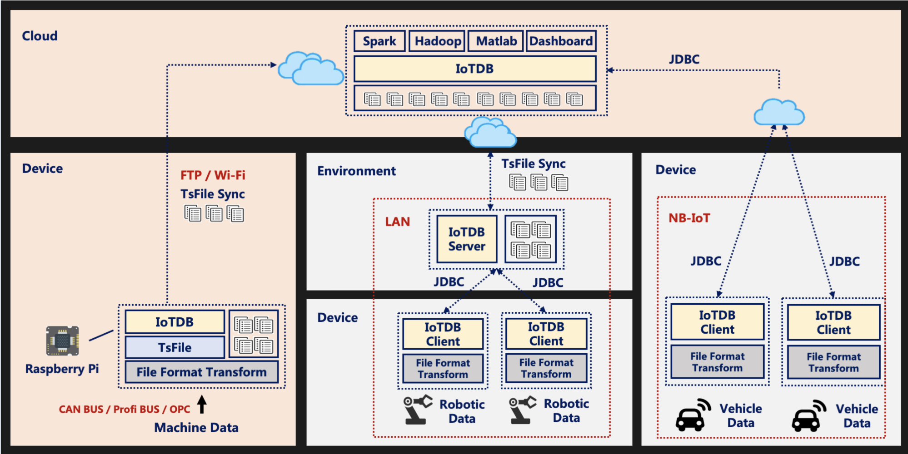
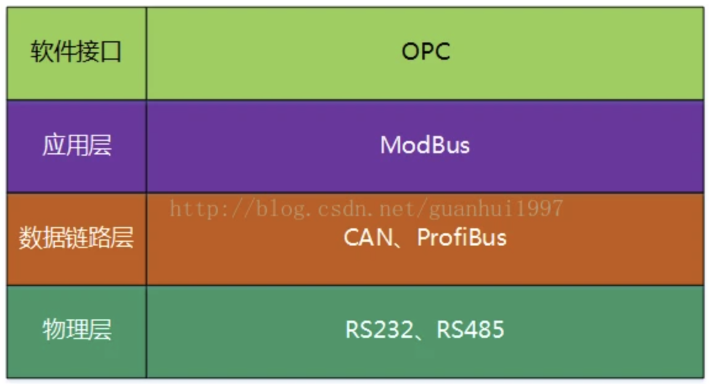

## 编程语言

### C

### C++

C++ 是 C 的扩展，因此它继承了许多相似之处，但偏向于嵌入式软件和大型系统。

### TinyGo

### MicroPython

### 数据库

#### IoTDB

https://iotdb.apache.org/zh/

### 开发工具

#### CLion

## 通信

### OSI参考模型

- RS232、RS485是硬件接口技术，
- CAN、ProBus等是现场总线技术，
- ModBus是工业控制协议，
- OPC是网络数据接口

### BlueTooth

#### 经典蓝牙技术与低功耗蓝牙

|               技术标准               |                         经典蓝牙技术                         |                        蓝牙低功耗技术                        |
| :----------------------------------: | :----------------------------------------------------------: | :----------------------------------------------------------: |
|       距离/范围（理论最大值）        |                       100米（330英尺）                       |                      >100米（>330英尺）                      |
|             空中数据速率             |                          1–3 Mbit/s                          |               125 kbit/s – 1 Mbit/s – 2 Mbit/s               |
|            应用程序吞吐量            |                        0.7–2.1 Mbit/s                        |                         0.27 Mbit/s                          |
|               活跃连接               |                              7                               |                      未定义；取决于实现                      |
|                安全性                |                 56/128位，以及应用层用户定义                 | 使用[Counter Mode CBC-MAC](https://zh.wikipedia.org/w/index.php?title=Counter_Mode_CBC-MAC&action=edit&redlink=1)的128位[AES](https://zh.wikipedia.org/wiki/高级加密标准)，以及应用层用户定义 |
|                健壮性                | 自适应快速跳频扩展，[FEC](https://zh.wikipedia.org/wiki/前向錯誤更正)，快速[ACK](https://zh.wikipedia.org/wiki/確認訊息) |    自适应跳频扩展，Lazy确认，24位CRC，32位消息完整性检查     |
|       潜伏时间（从非连接状态）       |                          典型100 ms                          |                             6 ms                             |
| 发送数据的最小总时间（影响续航时间） |                            100 ms                            |                             3 ms                             |
|               语音能力               |                              是                              |                              否                              |
|               网络拓扑               | [Scatternet](https://zh.wikipedia.org/w/index.php?title=Scatternet&action=edit&redlink=1) |                          Scatternet                          |
|                 功耗                 |                          参考值1 W                           |                0.01至0.5 W（取决于使用情况）                 |
|             峰值电流消耗             |                            <30 mA                            |                            <15 mA                            |
|               服务发现               |                              是                              |                              是                              |
|               规范概念               |                              是                              |                              是                              |
|               主要用途               | 移动电话、游戏、耳机、立体声音频流、智能家居、可穿戴设备、汽车、个人电脑、安防、接近传感、医疗保健、运动健身等。 | 移动电话、游戏、耳机、立体声音频流、智能家居、可穿戴设备、汽车、个人电脑、安防、接近传感、医疗保健、运动健身、工业等。 |

#### BLE低功耗蓝牙

#### 协议栈

- **PHY****层**（Physical layer物理层）。PHY层用来指定BLE所用的无线频段，调制解调方式和方法等。PHY层做得好不好，直接决定整个BLE芯片的功耗，灵敏度以及selectivity等射频指标。
- **LL****层**（Link Layer链路层）。LL层是整个BLE协议栈的核心，也是BLE协议栈的难点和重点。像Nordic的BLE协议栈能同时支持20个link（连接），就是LL层的功劳。LL层要做的事情非常多，比如具体选择哪个射频通道进行通信，怎么识别空中数据包，具体在哪个时间点把数据包发送出去，怎么保证数据的完整性，ACK如何接收，如何进行重传，以及如何对链路进行管理和控制等等。LL层只负责把数据发出去或者收回来，对数据进行怎样的解析则交给上面的GAP或者GATT。
- HCI（Host controller interface）。HCI是可选的（[具体请参考文章： 三种蓝牙架构实现方案（蓝牙协议栈方案）](http://www.cnblogs.com/iini/p/8834970.html)），HCI主要用于2颗芯片实现BLE协议栈的场合，用来规范两者之间的通信协议和通信命令等。
- **GAP****层**（Generic access profile）。GAP是对LL层payload（有效数据包）如何进行解析的两种方式中的一种，而且是最简单的那一种。GAP简单的对LL payload进行一些规范和定义，因此GAP能实现的功能极其有限。GAP目前主要用来进行广播，扫描和发起连接等。
- **L2CAP****层**（Logic link control and adaptation protocol）。L2CAP对LL进行了一次简单封装，LL只关心传输的数据本身，L2CAP就要区分是加密通道还是普通通道，同时还要对连接间隔进行管理。
- **SMP**（Secure manager protocol）。SMP用来管理BLE连接的加密和安全的，如何保证连接的安全性，同时不影响用户的体验，这些都是SMP要考虑的工作。
- **ATT**（Attribute protocol）。简单来说，ATT层用来定义用户命令及命令操作的数据，比如读取某个数据或者写某个数据。BLE协议栈中，开发者接触最多的就是ATT。**BLE引入了attribute概念，用来描述一条一条的数据**。Attribute除了定义数据，同时定义该数据可以使用的ATT命令，因此这一层被称为ATT层。
- **GATT**（Generic attribute profile ）。GATT用来规范attribute中的数据内容，并运用group（分组）的概念对attribute进行分类管理。没有GATT，BLE协议栈也能跑，但互联互通就会出问题，也正是因为有了GATT和各种各样的应用profile，BLE摆脱了ZigBee等无线协议的兼容性困境，成了出货量最大的2.4G无线通信产品。

#### 与其它协议对比

### 数据链路层协议

#### CAN

#### ProfiBus

### 应用层协议

#### OPC UA

### 物理层协议

#### RS232

#### RS485

### Apache PLC4X

**愿景：“我们的目标是创建一组库，允许统一访问任何类型的PLC”**

总的来说，这个项目正在努力实现OPC-UA（大名鼎鼎的通用工控通信协议）试图解决的相同目标，但PLC4X试图通过走一条完全不同的路径来实现这一目标。

**OPC-UA的痛点**

使用OPC-UA时，每个设备都必须进行“改造”，工程师们通过修改程序让PLC们能够“说出”新协议（OPC-UA），并使用通用客户端与这些设备对话。整个改造无疑是复杂而艰巨的，并且由于存在风险，通常是客户难以接受的。

**PLC4X的新方法**

PLC4X项目致力于提供统一的API，这些API实现与大多数PLC通过其原生通信协议进行通信的驱动程序。这些驱动程序中的每一个都是根据规范或逆向工程协议实现的（合法的），以便完全获得Apache 2.0许可。

**三、优点**

从我们的观点来看，PLC4X相对于OPC-UA的主要优点是：

- - 无需修改现有硬件上的软件
  - 不增加硬件计算负担（在现有PLC上激活OPC-UA支持会大大增加PLC的负载）
  - 无需支付激活OPC-UA支持的许可证

#### CoAP

#### MQTT

#### OPC-UA

#### ModBus

#### WIFI

## 操作系统及软件

### 指令集

#### RISC-V

#### ARM Cortex-M0/M3/M4/M7

### 操作系统

#### FreeRTOS

#### ROS 

https://www.ros.org/ 公众号Nao

ROS（Robot Operating System，下文简称“ROS”）是一个适用于机器人的开源的元操作系统。 它提供了操作系统应有的服务，包括硬件抽象，底层设备控制，常用函数的实现，进程间消息传递，以及包管理。 它也提供用于获取、编译、编写、和跨计算机运行代码所需的工具和库函数。ROS设计者将ROS表述为“ROS = Plumbing + Tools + Capabilities + Ecosystem”，即ROS是通讯机制、工具软件包、机器人高层技能以及机器人生态系统的集合体。

##### 开发套件

- rospy http://wiki.ros.org/rospy/Tutorials
- 硬件 https://www.turtlebot.com/
- 社区 https://www.ros.org/blog/community/

##### 相关生态

**Rviz**：超强大的3D可视化工具，可以显示机器人模型、3D电影、各种文字图标、也可以很方便二次开发；

除了ROS本身之外，世界上已经有很多非常优秀的机器人开源项目，但是ROS正逐渐将它们一一囊括在自己的范畴里，所以你可以在ROS里面很容易的使用这些开源项目：

**OROCOS**：这个开源项目主要侧重于机器人底层控制器的设计，包括用于计算串联机械臂运动学数值解的KDL、贝叶斯滤波、实时控制等功能。

**OpenRave**：这是在ROS之前最多人用来做运动规划的平台，ROS已经将其中的ikfast（计算串联机械臂运动学解析解）等功能吸收。

**Player**：一款优秀的二维仿真平台，可以用于平面移动机器人的仿真，现在在ROS里可以直接使用。

**OpenCV**：大名鼎鼎的机器视觉开源项目，ROS提供了cv_bridge，可以将OpenCV的图片与ROS的图片格式相互转换。

**OMPL**：现在最著名的运动规划开源项目，已经成了MoveIt的一部分。

**Visp**：一个开源视觉伺服项目，已经跟ROS完美整合。

**Gazebo**：一款优秀的开源仿真平台，可以实现动力学仿真、传感器仿真等，也已被ROS吸收。

**MoveIt**：这个是专注于移动机械臂运动规划的模块，运动规划。

**Localization**：基于扩展卡尔曼滤波（EKF）和无迹卡尔曼滤波（UKF）的机器人定位算法，可以融合各种传感器的定位信息，获得较为准确的定位效果。

**Navigation**：基于Dijkstra、A*算法（全局规划器）和动态窗口法DWA（局部规划器）的移动机器人路径规划模块，可以在二维地图上实现机器人导航。

**micro-ROS**

micro-ROS，是基于ROS2进行优化的一套轻量级ROS系统，它提供了完全部署的ROS 2生态系统的大多数吸引人的工具和功能，并具有入式和低资源设备的卓越能力，可以运行在MCU硬件平台。

传统上，即使机器人包含许多ROS，ROS仍停留在微控制器边界。它们通常通过串行协议与旧版ROS中的ROS-serial之类的工具集成在一起。

#### UBoot

Das U-Boot ("the Universal Boot Loader" or U-Boot) is **an open-source bootloader that can be used on ST boards to initialize the platform and load the Linux® kernel**.

#### Huawei LiteOS

源码 https://github.com/LiteOS/LiteOS

#### μClinux[百科](https://baike.baidu.com/item/uclinux/2955901)

uClinux本身并没有关注实时问题，它并不是为了Linux的实时性而提出的。另外有一种Linux--Rt-linux关注实时问题。Rt-linux执行管理器把普通Linux的[内核](https://baike.baidu.com/item/内核)当成一个任务运行，同时还管理了实时进程。而非实时进程则交给普通Linux内核处理。这种方法已经应用于很多的操作系统用于增强操作系统的实时性，包括一些商用版UNIX系统，Windows NT等等。这种方法优点之一是实现简单，且实时性能容易检验。优点之二是由于非实时进程运行于标准Linux系统，同其它Linux商用版本之间保持了很大的兼容性。优点之三是可以支持硬[实时时钟](https://baike.baidu.com/item/实时时钟)的应用。uClinux可以使用Rt-linux的patch，从而增强uClinux的实时性，使得uClinux可以应用于工业控制、进程控制等一些实时要求较高的应用。

#### MiniGUI

MiniGUI 为嵌入式 Linux 系统提供了完整的图形系统支持，是全球针对嵌入式 Linux仅有的两个商用嵌入式GUI系统之一。MiniGUI为嵌入式Linux 系统提供了完整的多进程支持；可以 MiniGUI-Processes、MiniGUI-Threads或者MiniGUI-Standalone 三种运行模式运行。

经过十几年的发展， MiniGUI 已经支持Linux/uClinux、eCos、 uC/OS-II、VxWorks、ThreadX、Nucleus 、pSOS、OSE 等操作系统和数十种 SoC 芯片，已验证的硬件平台包括 ARM-based SoCs 、MIPS based SoCs 、IA-based SoCs 、PowerPC、M68K(DragonBall /ColdFire)、Intel x86 等，广泛应用于通讯、医疗、工控、电力、机顶盒、多媒体终端等领域。

### SLAM导航系统

#### SLAM分类

**激光SLAM**

激光SLAM采用2D或3D激光雷达（也叫单线或多线激光雷达），2D激光雷达一般用于室内机器人上（如扫地机器人），而3D激光雷达一般使用于无人驾驶领域。激光雷达的出现和普及使得测量更快更准，信息更丰富。激光雷达采集到的物体信息呈现出一系列分散的、具有准确角度和距离信息的点，被称为点云。通常，激光SLAM系统通过对不同时刻两片点云的匹配与比对，计算激光雷达相对运动的距离和姿态的改变，也就完成了对机器人自身的定位。

激光雷达测距比较准确，误差模型简单，在强光直射以外的环境中运行稳定，点云的处理也比较容易。同时，点云信息本身包含直接的几何关系，使得机器人的路径规划和导航变得直观。激光SLAM理论研究也相对成熟，落地产品更丰富。

**视觉SLAM**

视觉SLAM从环境中获取海量的、富于冗余的纹理信息，拥有超强的场景辨识能力。早期的视觉SLAM基于滤波理论，其非线性的误差模型和巨大的计算量成为了它实用落地的障碍。近年来，随着具有稀疏性的非线性优化理论(Bundle Adjustment)以及相机技术、计算性能的进步，实时运行的视觉SLAM已经不再是梦想。

视觉SLAM的优点是它所利用的丰富纹理信息。例如两块尺寸相同内容却不同的广告牌，基于点云的激光SLAM算法无法区别他们，而视觉则可以轻易分辨。这带来了重定位、场景分类上无可比拟的巨大优势。同时，视觉信息可以较为容易的被用来跟踪和预测场景中的动态目标，如行人、车辆等，对于在复杂动态场景中的应用这是至关重要的。

通过对比发现，激光SLAM和视觉SLAM各擅胜场，单独使用都有其局限性，而融合使用则可能具有巨大的取长补短的潜力。例如，视觉在纹理丰富的动态环境中稳定工作，并能为激光SLAM提供非常准确的点云匹配，而激光雷达提供的精确方向和距离信息在正确匹配的点云上会发挥更大的威力。而在光照严重不足或纹理缺失的环境中，激光SLAM的定位工作使得视觉可以借助不多的信息进行场景记录。

### 端侧AI

#### 机器视觉

#### 目标检测

yolov5

## 控制器

### MCU

#### 8051

51单片机是对所有兼容Intel8031指令系统的单片机的统称，这一系列的单片机的始祖是Intel的8031单片机，后来随着flash ROM技术的发展，8031单片机取得了长足的进展成为了应用最广泛的8bit单片机之一，他的代表型号就是ATMEL公司的AT89系列。

#### PIC

#### Atmel AVR单片机

#### STM32

STM32单片机则是ST（意法半导体）公司使用arm公司的cortex-M3为核心生产的32bit系列的单片机，他的内部资源（寄存器和外设功能）较8051、AVR和PIC都要多的多，基本上接近于计算机的CPU了，适用于手机、路由器等等。

https://www.st.com/content/st_com/zh.html

#### ESP32

ESP32是一系列低成本，低功耗的单片机微控制器，集成了Wi-Fi和双模蓝牙。 ESP32系列采用Tensilica Xtensa LX6微处理器，包括双核心和单核变体，内置天线开关，RF变换器，功率放大器，低噪声接收放大器，滤波器和电源管理模块。 

### FPGA

现场可编程逻辑门阵列，它以PAL、GAL、CPLD等可编程逻辑器件为技术基础发展而成。作为特殊应用集成电路中的一种半定制电路，它既弥补全定制电路不足，又克服原有可编程逻辑控制器门电路数有限的缺点。

VHDL，全称超高速集成电路硬件描述语言，在基于复杂可编程逻辑器件、现场可编程逻辑门阵列和专用集成电路的数字系统设计中有着广泛的应用。

FPGA相比通用CPU，有较高的实时性能，如：视频加速卡（转码或AI识别）。

#### 开源项目

- http://www.pynq.io/

  > PYNQ 就是python+ZYNQ的意思，简单来说就是使用python在Xilinx 的ZYNQ平台上进行开发。是Xilinx开发的一个新的开源框架，使嵌入式编程人员能够在无需设计可编程逻辑电路的情况下即可充分发挥 Xilinx Zynq All Programmable SoC（APSoC）的功能。

### PLC

可编程逻辑控制器，一种具有微处理器的数字电子设备，用于自动化控制的数字逻辑控制器，可以将控制指令随时加载存储器内存储与执行。可编程控制器由内部CPU，指令及资料存储器、输入输出单元、电源模块、数字模拟等单元所模块化组合成。PLC可接收及发送多种类型的电气或电子信号，并使用他们来控制或监督几乎所有种类的机械与电气系统。

### 开发版

#### 树莓派Pico

## 理论基础

### 力学基础

### 力反馈

应力

微积分

## 机械及部件

### 驱动电机

#### 无刷电机

#### 步进电机

#### 伺服电机

#### 减速电机

减速电机是指减速机和电机马达的集成体。这种集成体通常也可称为齿轮马达或齿轮电机。通常由专业的减速机生产厂，进行集成组装好后，与电机一体成套供货。

### 传感器

#### 激光雷达

#### 测距雷达

#### 温度传感器

#### 湿度传感器

#### 红外传感器

### 陀螺仪

### 舵机

舵机是指在自动驾驶仪中操纵飞机舵面（操纵面）转动的一种执行部件。 分有：①电动舵机，由电动机、传动部件和离合器组成。 接受自动驾驶仪的指令信号而工作，当人工驾驶飞机时，由于离合器保持脱开而传动部件不发生作用。 ②液压舵机，由液压作动器和旁通活门组成。

### 拾音器

驻体式：https://detail.1688.com/offer/648391835349.html

电容：https://detail.1688.com/offer/650831881817.html

### 导线

#### 漆包线

https://detail.1688.com/offer/658616192953.html

## 电子电路

## 开发及仿真工具

### 嵌入式开发

#### PlatformIO

与通常与厂商绑定的嵌入式开发工具不同，PlatformIO支持多种嵌入式平台，例如STM32、STM8、ESP32、Amtel AVR、ESP8266、8051等。

PlatformIO的核心组件是称为“PIO Core”的命令行工具，基于Python编写，它可以独立于集成开发环境与文本编辑器使用。PlatformIO也为许多集成开发环境与文本编辑器开发了插件，包括Atom、Eclipse、Emacs、NetBeans、Vim、Visual Studio与Visual Studio Code。

PlatformIO支持单元测试与远程开发功能，还附带了简易的串口调试工具。[4]PlatformIO为不同的嵌入式平台提供不同的框架，开发者可以选用厂商提供的或者跨平台的SDK，比如Arduino框架[5]；同时PlatformIO也提供第三方代码库的引用与管理功能，能够直接在IDE内安装这些第三方库。

#### CLion

### 机器人编程与仿真

#### RoboDK

https://robodk.com/

### 电路设计

#### AD

主要设计工具

#### Eagle

转换一些开源的eagle格式PCB文档

#### fritzing

EDA软件，也可以用作矢量风格说明软件

### 3D打印

#### STL文件格式

STL文件格式（stereolithography，光固化立体造型术的缩写）是由3D SYSTEMS 公司于1988 年制定的一个接口协议，是一种为快速原型制造技术服务的三维图形文件格式。 STL 文件由多个三角形面片的定义组成，每个三角形面片的定义包括三角形各个定点的三维坐标及三角形面片的法矢量。

STL 文件格式已成为快速原型制造行业的事实标准数据传输格式，是与 Quickparts 交互所需的格式。此格式近似具有三角形的实体模型的曲面。对于一个简单的模型，如图 1 中所示的方框，其表面可以用 12 个三角形近似，如图 2 中所示。表面越复杂，产生的三角形越多，如图 3 中所示。

几乎如今所有的 CAD 系统都能够生成 STL 文件。对于用户而言，该过程通常与依次选择“文件”、“另存为”和 STL 一样简单。下面是从许多如今领先的 CAD 系统生成高质量 STL 文件的步骤。在所有情况下，将 STL 文件导出为二进制文件。这可节省时间和文件大小。

#### KeyShot

3D建模，物理仿真。

Keyshot plugin with fusion360

#### Fusion360  

支持CAD、PCB、CAM、CAE、机械模拟

#### 资源站

https://www.thingiverse.com/

https://pinshape.com/

https://www.3dzyk.cn/ 中文

#### 材质

尼龙、亚克力、金属

## 杂七杂八

### 学习资料

#### 机器人学导论

#### 开源项目

| 名称       | github地址                                 |
| ---------- | ------------------------------------------ |
| DummyRobot | https://github.com/peng-zhihui/Dummy-Robot |
|            |                                            |

### 开发板

#### EAIDK 兼容树莓派国产

#### 华硕Tinkerboard

http://www.eaidk.com/

#### 树莓派

https://detail.1688.com/offer/544418454541.html

https://turingpi.com/ 树莓派集群

Compute module 4  计算核心板CM4

#### Lattepanda

x86架构微型电脑

#### Nvidia Jetson

etson TX2 是一款人工智能超级计算机模块采用 NVIDIA Pascal™ 架构。

#### WebThings Gateway

https://iot.mozilla.org/gateway/

### 主机

#### 工控机

https://detail.tmall.com/item.htm?id=597907245999&skuId=4801013968317

https://item.jd.com/20609040321.html

### 智能家居

https://www.home-assistant.io/

https://kodi.tv/ 开源媒体中心

### 万能淘宝

电机：https://shop108869903.taobao.com/index.htm
漆包线

泽茂电子：https://www.mouser.cn/

### 物联云平台

机智云：https://www.gizwits.com/

### 网络

https://freefrp.net/

### 机器人品牌

#### 优傲机器人

https://cobot.universal-robots.cn/

致力于为全球各种规模的企业生产安全、灵活和易于使用的 6 轴工业机械臂。优傲开发的协作式机器人，帮助用户实现自动化，简化重复性工业。为企业的员工赋能，将他们从低附加值劳动中解放出来，从而为公司创造更多价值。

#### 内网穿透&VPN

#### Zerotier 创建VPN

https://www.zerotier.com/

