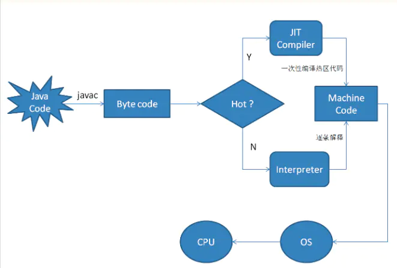

## 架构设计思想

### 领域驱动设计

#### 为什么要DDD

领域驱动设计是一种以业务为导向的软件设计方法和思路。我们在开发前，通常需要进行大量的业务知识梳理，而后到达软件设计的层面，最后才是开发。而在业务知识梳理的过程中，我们必然会形成某个领域知识，根据领域知识来一步步驱动软件设计，就是领域驱动设计的基本概念。而领域驱动设计的核心就在于建立正确的领域驱动模型。

微服务盛行的今天，多层SOA架构已经完全不能满足微服务架构应用的需求，它存在这么一些问题：

1. 臃肿的servcie
2. 三层分层后文件的随意组装方式
3. 技术导向分层，导致业务分离，不能快速定位。

#### DDD分层架构介绍

- 分层

DDD 分层架构包含用户接口层、应用层、领域层和基础层。通过这些层次划分，我们可以明确微服务各层的职能，划定各领域对象的边界，确定各领域对象的协作方式。DDD的分层架构如图：从上到下依次是：用户接口层、应用层、领域层和基础层。


- 各层次之间的调用关系


- 特别说明

  > 1. 用户接口层负责向用户显示信息和解释用户指令，并将数据传递给 Application 层。数据的组装、数据传输格式以及 Facade 接口等代码都会放在这一层目录里。这里的用户可能是：用户、程序、自动化测试和批处理脚本等等。
  > 2. 应用层是很薄的一层，理论上不应该有业务规则或逻辑，主要面向用例和流程相关的操作。但应用层又位于领域层之上，因为领域层包含多个聚合，所以它可以协调多个聚合的服务和领域对象完成服务编排和组合，协作完成业务操作。
  > 3. 应用层也是微服务之间交互的通道，它可以调用其它微服务的应用服务，完成微服务之间的服务组合和编排。
  > 4. 实现领域的核心业务逻辑。这一层聚集了领域模型的聚合、聚合根、实体、值对象、领域服务和事件等领域对象，以及它们组合所形成的业务能力。
  > 5. 基础层是贯穿所有层的，它的作用就是为其它各层提供通用的技术和基础服务，包括第三方工具、驱动、消息中间件、网关、文件、缓存以及数据库等。比较常见的功能还是提供数据库持久化。

- 参考阅读：https://blog.csdn.net/w1lgy/article/details/111566243

#### 聚合根、实体、值对象


#### 充血模型和失血模型

贫血模型：是指领域对象里只有get和set方法，或者包含少量的CRUD方法，所有的业务逻辑都不包含在内而是放在Business Logic层。

> 好处
>
> 1. 每个贫血对象职责单一，所以模块解藕程度很高，有利于错误的隔离。
> 2. 非常重要的是，这种模型非常适合于软件外包和大规模软件团队的协作。每个编程个体只需要负责单一职责的小对象模块编写，不会互相影响。
>
> 坏处
>
> 1. 由于对象状态和行为分离，所以一个完整的业务逻辑的描述不能够在一个类当中完成，而是一组互相协作的类共同完成的。因此可复用的颗粒度比较小，代码量膨胀的很厉害，最重要的是业务逻辑的描述能力比较差，一个稍微复杂的业务逻辑，就需要太多类和太多代码去表达。
> 2. 对象协作依赖于外部容器的组装，因此裸写代码是不可能的了，必须借助于外部的IoC容器。 

充血模型：层次结构和上面的差不多，不过大多业务逻辑和持久化放在Domain Object里面，Business Logic（业务逻辑层）只是简单封装部分业务逻辑以及控制事务、权限等。

> 好处
>
> 1. 对象自洽程度很高，表达能力很强，因此非常适合于复杂的企业业务逻辑的实现，以及可复用程度比较高。
> 2. 不必依赖外部容器的组装，所以RoR没有IoC的概念。
>
> 坏处
>
> 1. 对象高度自洽的结果是不利于大规模团队分工协作。一个编程个体至少要完成一个完整业务逻辑的功能。对于单个完整业务逻辑，无法再细分下去了。
> 2. 随着业务逻辑的变动，领域模型可能会处于比较频繁的变动状态中，领域模型不够稳定也会带来web层代码频繁变动。

#### 说说VO、PO、DO、DTO这些概念

VO（View Object）： 视图对象，用于展示层，它的作用是把某个指定页面（或组件）的所有数据封装起来。

DTO（Data Transfer Object）： 数据传输对象，这个概念来源于J2EE的设计模式，原来的目的是为了EJB的分布式应用提供粗粒度的数据实体，以减少分布式调用的次数，从而提高分布式调用的性能和降低网络负载，但在这里，我泛指用于展示层与服务层之间的数据传输对象。

DO（Domain Object）： 领域对象，就是从现实世界中抽象出来的有形或无形的业务实体。

PO（Persistent Object）： 持久化对象，它跟持久层（通常是关系型数据库）的数据结构形成一一对应的映射关系，如果持久层是关系型数据库，那么，数据表中的每个字段（或若干个）就对应PO的一个（或若干个）属性。


### 分布式

#### BASE理论是什么？

#### CAP定理是什么？

#### 为什么要做幂等性设计？

**我们实际系统中有很多操作，是不管做多少次，都应该产生一样的效果或返回一样的结果。 例如：** 

1. 前端重复提交选中的数据，应该后台只产生对应这个数据的一个反应结果。 
2. 我们发起一笔付款请求，应该只扣用户账户一次钱，当遇到网络重发或系统bug重发，也应该只扣一次钱； 
3. 发送消息，也应该只发一次，同样的短信发给用户，用户会哭的； 
4. 创建业务订单，一次业务请求只能创建一个，创建多个就会出大问题。 

幂等（idempotent、idempotence）是一个数学与计算机学概念，常见于抽象代数中。 在编程中，一个幂等操作的特点是其任意多次执行所产生的影响均与一次执行的影响相同。幂等函数，或幂等方法，是指可以使用相同参数重复执行，并能获得相同结果的函数。这些函数不会影响系统状态，也不用担心重复执行会对系统造成改变。例如，“getUsername()和setTrue()”函数就是一个幂等函数. 

#### 设计微服务时需要遵循什么原则？

#### 如何维护微服务间共享的Interface和DTO

#### 介绍一下RMI

DTO是微服务间的**通信契约**，与Feign/Dubbo的Interface放在一起。此处，我们使用一个公共包`bootstrap-api`来维护。

#### 什么是分布式一致性算法

- Paxos
- Raft
- ZAB
- Gossip

### 状态机

#### AC自动机

#### 有限状态机

### 设计模式

## 云原生

### 基本概念

#### 为什么要云原生

1. 声明式定义环境
2. 标准化
3. 弹性扩容
4. 业务开发可以直接

### CRD

### Helm

## Java基础

### JVM内存分区

#### 内存分区相关参数有哪些

| 参数名称                        | 可选值     | 说明         |
| ------------------------------- | ---------- | ------------ |
| -XX:StringTableSize=4901        | 要求为素数 | 字符串池大小 |
| -XX:+PrintStringTableStatistics | -          |              |

#### 常量池有哪几种，在什么内存区

1. class文件常量池（方法区，多个）
   java的源代码`.java`文件在编译之后会生成`.class`文件，class文件需要严格遵循JVM规范才能被JVM正常加载，它是一个二进制字节流文件，里面包含了class文件常量池的内容。

   **每个class的字节码文件中都有一个常量池**，里面是编译后即知的该class会用到的字面量与符号引用，这就是class文件常量池。JVM加载class，会将其类信息，包括class文件常量池置于方法区中。

   class类信息及其class文件常量池是字节码的二进制流，它代表的是一个类的静态存储结构。

2. 运行时常量池（方法区，）

   JVM加载类时，需要将其转换为方法区中的java.lang.Class类的对象实例；同时，会**将class文件常量池中的内容导入运行时常量池**。

   运行时常量池中的常量对应的内容只是**字面量**，比如一个"字符串"，它还**不是String对象**；当Java程序在运行时执行到这个"字符串"字面量时，会去字符串常量池里找该字面量的对象引用是否存在，存在则直接返回该引用，**不存在则在Java堆里创建该字面量对应的String对象，并将其引用置于字符串常量池中，然后返回该引用**。

3. 字符串常量池（逻辑上属于永久代的方法区，JDK1.7开始挪到了堆区）

   字符串常量池，是JVM用来维护字符串实例的一个引用表。在HotSpot虚拟机中，它被实现为一个全局的StringTable，底层是一个c++的hashtable。它将字符串的字面量作为key，实际堆中创建的String对象的引用作为value。

   String的字面量被导入JVM的运行时常量池时，并不会马上试图在字符串常量池加入对应String的引用，而是等到程序实际运行时，要用到这个字面量对应的String对象时，才会去字符串常量池试图获取或者加入String对象的引用。因此它是懒加载的。

4. 基本类型包装类常量池（堆）
   Java的基本数据类型中，除了两个浮点数类型，其他的基本数据类型都在各自内部实现了常量池，但都在[-128~127]这个范围内。

#### 字符串常量池会被GC吗？

Before Java 7, the JVM placed the Java String Pool in the PermGen space, which has a fixed size — it can't be expanded at runtime and is not eligible for garbage collection.

The risk of interning Strings in the PermGen (instead of the Heap) is that we can get an OutOfMemory error from the JVM if we intern too many Strings.

From Java 7 onwards, the Java String Pool is stored in the Heap space, which is garbage collected by the JVM. The advantage of this approach is the reduced risk of OutOfMemory error because unreferenced Strings will be removed from the pool, thereby releasing memory.

#### String s=new String("abc")创建了几个对象?

2个，堆中一个，常量池一个。

String s = new String("abc")实际上是"abc"本身就是**字符串池**中的一个对象，在运行 new String()时，把字符串池的字符串"abc"复制到堆中，并把这个对象的应用交给s，所以创建了两个String对象，一个在字符串池中，一个在堆中。(注：我们假设的是字符串池中默认是没有abc字符串的，如果之前已存在的话，则该题的答案就是一个对象了)

字符串常量池

#### String name=new String("java"+"hello");创建了几个对象？

解一（错误）：

1. "java"创建了一个对象，存于String常量池
2. "hello"创建了一个对象，存于String常量池
3. "java"+"hello",创建了一个对象，存于常量池（基于字符串的+操作，如带有引用的，将在堆中创建对象，否则值会存于字符常量池）
4. new将会创建一个对象，将字符常量池中的"javahello"复制到堆中，一共创建四个对象

解二（正确）：

1. "java"+"hello"，java在编译期间会自己先优化的，会合并成一个对象"javahello"的，然后在字符串池中保留
2. 创建了两个对象，一个javahello的对象在字符串池中，一个new出的对象在堆上

#### java.lang.String.intern()

运行时常量池相对于CLass文件常量池的另外一个重要特征是**具备动态性**，Java语言并不要求常量一定只有编译期才能产生，也就是并非预置入CLass文件中常量池的内容才能进入方法区运行时常量池，运行期间也可能将新的常量放入池中，这种特性被开发人员利用比较多的就是**String类的intern()**方法。

String的intern()方法会查找在常量池中是否存在一份equal相等的字符串,如果有则返回该字符串的引用,如果没有则添加自己的字符串进入常量池。

https://tech.meituan.com/2014/03/06/in-depth-understanding-string-intern.html

#### 字符串常量池创建字符串有几种方式?

创建字符串有两种方式：两种内存区域（字符串池，堆）

1. " " 引号创建的字符串在字符串池中

2. new，new创建字符串时首先查看池中是否有相同值的字符串，如果有，则拷贝一份到堆中，然后返回堆中的地址；如果池中没有，则在堆中创建一份，然后返回堆中的地址（注意，此时不需要从堆中复制到池中，否则导致浪费池的空间）

3. 另外，对字符串进行赋值时，如果右操作数含有一个或一个以上的字符串引用时，则在堆中再建立一个字符串对象，返回引用；如String str2=str1+ "abc"; 

   比较两个已经存在于字符串池中字符串对象可以用"=="进行，拥有比equals操作符更快的速度。

#### 常量池的好处

常量池是为了避免频繁的创建和销毁对象而影响系统性能，其实现了对象的共享。例如字符串常量池，在编译阶段就把所有的字符串文字放到一个常量池中。
 （1）节省内存空间：常量池中所有相同的字符串常量被合并，只占用一个空间。
 （2）节省运行时间：比较字符串时，==比equals()快。对于两个引用变量，只用==判断引用是否相等，也就可以判断实际值是否相等。

#### 常量池在Integer类型中的应用

1. `Integer i1=40；`Java在编译的时候会直接将代码封装成`Integer i1=Integer.valueOf(40);`，从而使用常量池中的对象。
2. `Integer i1 = new Integer(40);`这种情况下会创建新的对象。
3. 除Integer和String类型，Byte,Short,Long,Character,Boolean也使用了常量池技术，值得注意的是`Double`和`Float`两种浮点类型没有使用常量池。

```java
  Integer i1 = 40;
  Integer i2 = new Integer(40);
	Integer i3 = 40;
  System.out.println(i1==i2);//输出false
  System.out.println(i1==i3);//输出true
```


### JVM执行引擎

#### 什么是解释器（Interpreter），什么是 JIT 编译器？

解释器： 当 Java 虚拟机启动时会根据预定义的规范对字节码采用逐行解释的方式执行，将每条字节码中的内容“翻译”为对应平台的本地机器指令执行。

JIT ( Just In Time Compiler) 编译器： 就是虚拟机将源代码直接编译成和本地机器平台相关的机器语言。

#### 为什么说 Java 语言是半编译半解释型语言？

Java是一个半解释半编译型语言，早期java是通过解释器来执行，效率低下；后期进行优化，解释器在原本的c++字节码解释器基础上，扩充了模板解释器，效率有了明显提升；后来又加入了JIT（即时编译），效率就更加得到了提升。

解释器：当程序需要迅速启动和执行的时候，解释器可以首先发挥作用，省去编译的时间，立即执行。

编译器：在程序运行后，随着时间的推移，编译器逐渐发挥作用，把越来越多的代码编译成本地代码之后，可以获取更高的执行效率。

两者的协作：在程序运行环境中内存资源限制较大时，可以使用解释执行节约内存，反之可以使用编译执行来提升效率。当通过编译器优化时，发现并没有起到优化作用，，可以通过逆优化退回到解释状态继续执行。



### 数据类型

#### 为什么字符串是不可变的

1. 引入常量池
   The *String* is the most widely used data structure. Caching the *String* literals and reusing them saves a lot of heap space because different *String* variables refer to the same object in the *String* pool. *String* intern pool serves exactly this purpose.

   Java String Pool is **the special memory region where \*Strings\* are stored by the JVM**. Since *Strings* are immutable in Java, the JVM optimizes the amount of memory allocated for them by storing only one copy of each literal *String* in the pool. This process is called interning

2. 安全性
   **If \*Strings\* were mutable, then by the time we execute the update, we can't be sure that the \*String\* we received, even after performing security checks, would be safe.** The untrustworthy caller method still has the reference and can change the *String* between integrity checks. Thus making our query prone to SQL injections in this case. So mutable *Strings* could lead to degradation of security over time.

   It could also happen that the *String* *userName* is visible to another thread, which could then change its value after the integrity check.

   In general, immutability comes to our rescue in this case because it's easier to operate with sensitive code when values don't change because there are fewer interleavings of operations that might affect the result.

3. 并发
   Being immutable automatically makes the *String* thread safe since they won't be changed when accessed from multiple threads.

   Hence **immutable objects, in general, can be shared across multiple threads running simultaneously. They're also thread-safe** because if a thread changes the value, then instead of modifying the same, a new *String* would be created in the *String* pool. Hence, *Strings* are safe for multi-threading.

4. Hashcode缓存

   Since *String* objects are abundantly used as a data structure, they are also widely used in hash implementations like *HashMap*, *HashTable*, *HashSet*, etc. When operating upon these hash implementations, *hashCode()* method is called quite frequently for bucketing.

   The immutability guarantees *Strings* that their value won’t change. So **the \*hashCode()\* method is overridden in \*String\* class to facilitate caching, such that the hash is calculated and cached during the first \*hashCode()\* call and the same value is returned ever since.**

   **This, in turn, improves the performance of collections that uses hash implementations when operated with \*String\* objects.**

   On the other hand, mutable *Strings* would produce two different hashcodes at the time of insertion and retrieval if contents of *String* was modified after the operation, potentially losing the value object in the *Map*.

5. 性能

   As we saw previously, *String* pool exists because *Strings* are immutable. In turn, it enhances the performance by saving heap memory and faster access of hash implementations when operated with *Strings.*

   Since *String* is the most widely used data structure, improving the performance of *String* have a considerable effect on improving the performance of the whole application in general.

https://www.baeldung.com/java-string-immutable

#### 8大基本类型

| 数据类型 | 长度  | 位数 | 默认值 |
| -------- | ----- | ---- | ------ |
| byte     | 1Byte | 8    | 0      |
| short    | 2Byte | 16   | 0      |
| int      | 4Byte | 32   | 0      |
| long     | 8Byte | 64   | 0      |
| float    | 4Byte | 32   | 0.0f   |
| double   | 8Byte | 64   | 0.0d   |
| boolean  | -     | -    | false  |

#### boolean基本类型占几个字节

JVM虚拟机规范中没有针对boolean的指令集，这只是 Java 虚拟机的建议。

- HotSop中boolean 类型被编译成 int 类型来使用，占 4 个 byte 
- boolean 数组被编译成 byte 数组类型，每个 boolean 数组成员占 1 个 byte 
- 在 Java 虚拟机里，1 表示 true ，0 表示 false 
- 可以肯定的是，肯定不是占1个比特

#### String、StringBuilder和StringBuffer

#### 为什么Integer128==128返回false

When you compile a number literal in Java and assign it to a Integer (capital `I`) the compiler emits:

```java
Integer b2 = Integer.valueOf(127)
```

This line of code is also generated when you use autoboxing.

`valueOf` is implemented such that certain numbers are "pooled", and it returns the same instance for values smaller than 128.

From the java 1.6 source code, line 621:

```java
public static Integer valueOf(int i) {
    if(i >= -128 && i <= IntegerCache.high)
        return IntegerCache.cache[i + 128];
    else
        return new Integer(i);
}
```

#### Integer缓冲池IntegerCache

Integer中有个静态内部类IntegerCache，里面有个cache[],也就是**Integer常量池**，常量池的大小为一个字节（-128~127）。

所有整数类型都有类似的缓存机制，其目的是节省内存、提高性能等特性。

The value of `high` can be configured to another value, with the system property.

> -Djava.lang.Integer.IntegerCache.high=999

### 语法

#### equals和==区别(null哪个能用)

### 反射

### 注解

### 异常

### 泛型

### IO

### 集合框架

#### JDK1.7之前的HashMap是如何实现的

#### JDK1.8中HashMap是如何实现的

### SPI机制

#### 如果在catch里return了，finally中的代码还会被执行吗？

#### 双等号==的含义

基本数据类型之间应用双等号，比较的是他们的数值。
复合数据类型(类)之间应用双等号，比较的是他们在内存中的存放地址。

#### i++ 是线程安全的吗？

每个线程都有自己的工作内存，每个线程需要对共享变量操作时必须先把共享变量从主内存 load 到自己的工作内存，等完成对共享变量的操作时再 save 到主内存。

问题就出在这了，如果一个线程运算完后还没刷到主内存，此时这个共享变量的值被另外一个线程从主内存读取到了，这个时候读取的数据就是脏数据了，它会覆盖其他线程计算完的值。

**这也是经典的内存不可见问题，那么把 count 加上 volatile 让内存可见是否能解决这个问题呢？** 答案是：不能。因为 volatile 只能保证可见性，不能保证原子性。多个线程同时读取这个共享变量的值，就算保证其他线程修改的可见性，也不能保证线程之间读取到同样的值然后相互覆盖对方的值的情况。

解决方案：

1、对 i++ 操作的方法加同步锁，同时只能有一个线程执行 i++ 操作；

2、使用支持原子性操作的类，如 `java.util.concurrent.atomic.AtomicInteger`，它使用的是 CAS 算法，效率优于第 1 种；

#### IO

#### Collections

## Java进阶

### JVM

#### 对象模型 OOP-Klass

### GC

#### JVM的内存管理有哪些问题

1. Java 对象存储密度低。一个只包含 boolean 属性的对象占用了16个字节内存：对象头占了8个，boolean 属性占了1个，对齐填充占了7个。而实际上只需要一个bit（1/8字节）就够了。
2. Full GC 会极大地影响性能，尤其是为了处理更大数据而开了很大内存空间的JVM来说，GC 会达到秒级甚至分钟级。
3. OOM 问题影响稳定性。OutOfMemoryError是分布式计算框架经常会遇到的问题，当JVM中所有对象大小超过分配给JVM的内存大小时，就会发生OutOfMemoryError错误，导致JVM崩溃，分布式框架的健壮性和性能都会受到影响。

#### GC调优有哪些参数？

| 参数名称           | 可选值 | 说明                     |
| ------------------ | ------ | ------------------------ |
| -XX:MaxPermSize=1G |        | JDK1.7之前设置永久代大小 |


#### 线上系统GC问题如何快速定位与分析?

#### 解释下三色标记算法算法思想?

https://juejin.cn/post/6859931488352370702

### JMM

#### Volatile底层的内存屏障是如何实现的?

内存屏障是CPU指令。如果你的字段是volatile，Java内存模型将在写操作后插入一个写屏障指令，在读操作前插入一个读屏障指令。

下面是基于保守策略的JMM内存屏障插入策略：1）在每个volatile写操作的前面插入一个StoreStore屏障；2）在每个volatile写操作的后面插入一个StoreLoad屏障；3）在每个volatile读操作的前面插入一个LoadLoad屏障；4）在每个volatile读操作的后面插入一个LoadStore屏障。

#### 说下JVM内存模型与]ava线程内存模型的区别?

#### GC执行时机是任何时候都可以吗?安全点知道吗?

#### CMS垃圾收集器的并发更新失败是怎么回事?如何优化?

#### 高并发系统为何建议选择G1垃圾收集器?

#### 阿里巴巴Arthas实现原理能大概说下吗?

#### 单机几十万并发的系统JVM如何优化?

#### 单例模式的双检锁为什么要用volatile修饰，为什么要锁类？

```java
public class Singleton {  
    private volatile static Singleton singleton;  // volatile 内存屏障
    private Singleton (){}  
    public static Singleton getSingleton() {  
    if (singleton == null) {  
        synchronized (Singleton.class) {         // 类锁是所有线程共享的，所以要锁类
          if (singleton == null) {  
              singleton = new Singleton();  
          }  
        }  
    }  
    return singleton;  
   }  
}
```

### JUC

#### 什么是可重入锁

可重入锁，也叫做递归锁，是指在一个线程中可以多次获取同一把锁，比如：一个线程在执行一个带锁的方法，该方法中又调用了另一个需要相同锁的方法，则该线程可以直接执行调用的方法【即可重入】，而无需重新获得锁。

实现原理：**加锁时**，需要判断锁是否已经被获取。如果已经被获取，则判断获取锁的线程是否是当前线程。如果是当前线程，则给获取次数加1。如果不是当前线程，则需要等待。**释放锁时**，需要给锁的获取次数减1，然后判断，次数是否为0了。如果次数为0了，则需要调用锁的唤醒方法，让锁上阻塞的其他线程得到执行的机会。

Java中ReentrantLock和synchronized都是可重入锁，可重入锁的一个优点是可一定程度避免死锁。

#### synchronized 和 ReentrantLock 区别

#### synchronized实现原理

synchronized是悲观锁，在操作同步资源之前需要给同步资源先加锁，这把锁就是存在Java对象头里。首先为什么Synchronized能实现线程同步？在回答这个问题之前我们需要了解两个重要的概念：“Java对象头”、“Monitor”。

- Java对象头

  > synchronized是悲观锁，在操作同步资源之前需要给同步资源先加锁，这把锁就是存在Java对象头里的，而Java对象头又是什么呢？
  >
  > 我们以Hotspot虚拟机为例，Hotspot的对象头主要包括两部分数据：Mark Word（标记字段）、Klass Pointer（类型指针）。
  >
  > **Mark Word**：默认存储对象的HashCode，分代年龄和锁标志位信息。这些信息都是与对象自身定义无关的数据，所以Mark Word被设计成一个非固定的数据结构以便在极小的空间内存存储尽量多的数据。它会根据对象的状态复用自己的存储空间，也就是说在运行期间Mark Word里存储的数据会随着锁标志位的变化而变化。
  >
  > **Klass Point**：对象指向它的类元数据的指针，虚拟机通过这个指针来确定这个对象是哪个类的实例。
  >
  > 

- Monitor

  > Monitor可以理解为一个同步工具或一种同步机制，通常被描述为一个对象。每一个Java对象就有一把看不见的锁，称为内部锁或者Monitor锁。
  >
  > Monitor是线程私有的数据结构，每一个线程都有一个可用monitor record列表，同时还有一个全局的可用列表。每一个被锁住的对象都会和一个monitor关联，同时monitor中有一个Owner字段存放拥有该锁的线程的唯一标识，表示该锁被这个线程占用。
  >
  > 现在话题回到synchronized，synchronized通过Monitor来实现线程同步，Monitor是依赖于底层的操作系统的Mutex Lock（互斥锁）来实现的线程同步。
  >
  > 如同我们在自旋锁中提到的“阻塞或唤醒一个Java线程需要操作系统切换CPU状态来完成，这种状态转换需要耗费处理器时间。如果同步代码块中的内容过于简单，状态转换消耗的时间有可能比用户代码执行的时间还要长”。这种方式就是synchronized最初实现同步的方式，这就是JDK 6之前synchronized效率低的原因。这种依赖于操作系统Mutex Lock所实现的锁我们称之为“重量级锁”，JDK 6中为了减少获得锁和释放锁带来的性能消耗，引入了“偏向锁”和“轻量级锁”。

所以目前锁一共有4种状态，级别从低到高依次是：无锁、偏向锁、轻量级锁和重量级锁，**锁状态只能升级不能降级**。

通过上面的介绍，我们对synchronized的加锁机制以及相关知识有了一个了解，那么下面我们给出四种锁状态对应的的Mark Word内容，然后再分别讲解四种锁状态的思路以及特点：

| 锁状态   | 存储内容                                                | 存储内容 |
| :------- | :------------------------------------------------------ | :------- |
| 无锁     | 对象的hashCode、对象分代年龄、是否是偏向锁（0）         | 01       |
| 偏向锁   | 偏向线程ID、偏向时间戳、对象分代年龄、是否是偏向锁（1） | 01       |
| 轻量级锁 | 指向栈中锁记录的指针                                    | 00       |
| 重量级锁 | 指向互斥量（重量级锁）的指针                            | 10       |

**无锁**

无锁没有对资源进行锁定，所有的线程都能访问并修改同一个资源，但同时只有一个线程能修改成功。

无锁的特点就是修改操作在循环内进行，线程会不断的尝试修改共享资源。如果没有冲突就修改成功并退出，否则就会继续循环尝试。如果有多个线程修改同一个值，必定会有一个线程能修改成功，而其他修改失败的线程会不断重试直到修改成功。上面我们介绍的CAS原理及应用即是无锁的实现。无锁无法全面代替有锁，但无锁在某些场合下的性能是非常高的。

**偏向锁**

偏向锁是指一段同步代码一直被一个线程所访问，那么该线程会自动获取锁，降低获取锁的代价。

在大多数情况下，锁总是由同一线程多次获得，不存在多线程竞争，所以出现了偏向锁。其目标就是在只有一个线程执行同步代码块时能够提高性能。

当一个线程访问同步代码块并获取锁时，会在Mark Word里存储锁偏向的线程ID。在线程进入和退出同步块时不再通过CAS操作来加锁和解锁，而是检测Mark Word里是否存储着指向当前线程的偏向锁。引入偏向锁是为了在无多线程竞争的情况下尽量减少不必要的轻量级锁执行路径，因为轻量级锁的获取及释放依赖多次CAS原子指令，而偏向锁只需要在置换ThreadID的时候依赖一次CAS原子指令即可。

偏向锁只有遇到其他线程尝试竞争偏向锁时，持有偏向锁的线程才会释放锁，线程不会主动释放偏向锁。偏向锁的撤销，需要等待全局安全点（在这个时间点上没有字节码正在执行），它会首先暂停拥有偏向锁的线程，判断锁对象是否处于被锁定状态。撤销偏向锁后恢复到无锁（标志位为“01”）或轻量级锁（标志位为“00”）的状态。

偏向锁在JDK 6及以后的JVM里是默认启用的。可以通过JVM参数关闭偏向锁：-XX:-UseBiasedLocking=false，关闭之后程序默认会进入轻量级锁状态。

**轻量级锁**

是指当锁是偏向锁的时候，被另外的线程所访问，偏向锁就会升级为轻量级锁，其他线程会通过自旋的形式尝试获取锁，不会阻塞，从而提高性能。

在代码进入同步块的时候，如果同步对象锁状态为无锁状态（锁标志位为“01”状态，是否为偏向锁为“0”），虚拟机首先将在当前线程的栈帧中建立一个名为锁记录（Lock Record）的空间，用于存储锁对象目前的Mark Word的拷贝，然后拷贝对象头中的Mark Word复制到锁记录中。

拷贝成功后，虚拟机将使用CAS操作尝试将对象的Mark Word更新为指向Lock Record的指针，并将Lock Record里的owner指针指向对象的Mark Word。

如果这个更新动作成功了，那么这个线程就拥有了该对象的锁，并且对象Mark Word的锁标志位设置为“00”，表示此对象处于轻量级锁定状态。

如果轻量级锁的更新操作失败了，虚拟机首先会检查对象的Mark Word是否指向当前线程的栈帧，如果是就说明当前线程已经拥有了这个对象的锁，那就可以直接进入同步块继续执行，否则说明多个线程竞争锁。

若当前只有一个等待线程，则该线程通过自旋进行等待。但是当自旋超过一定的次数，或者一个线程在持有锁，一个在自旋，又有第三个来访时，轻量级锁升级为重量级锁。

**重量级锁**

升级为重量级锁时，锁标志的状态值变为“10”，此时Mark Word中存储的是指向重量级锁的指针，此时等待锁的线程都会进入阻塞状态。

整体的锁状态升级流程如下：


综上，偏向锁通过对比Mark Word解决加锁问题，避免执行CAS操作。而轻量级锁是通过用CAS操作和自旋来解决加锁问题，避免线程阻塞和唤醒而影响性能。重量级锁是将除了拥有锁的线程以外的线程都阻塞。

#### 公平锁与非公平锁

#### 类锁和对象锁的区别

- 使用对象锁（只有多个线程调用同一实例是才受影响）

  > 1. 锁住非静态变量
  > 2. 锁住this
  > 3. 锁非静态方法

- 使用类锁的方式（类锁是所有线程共享的锁，只能有一个线程使用加了锁的方法或方法体，不管是不是同一个实例）

  > 1. 锁住静态变量
  > 2. 在静态方法上加锁
  > 3. 锁住Foo.class

#### 死锁的四个条件，如何避免死锁？

#### 手写一个死锁

#### Semaphore

#### CountDownLatch

#### ReadWriteLock

#### ReentrantLock和Condition

#### LockSupport

`LockSupport`是一个线程阻塞工具类，所有的方法都是静态方法，可以让线程在任意位置阻塞，当然阻塞之后肯定得有唤醒的方法。

```java
public static void park(Object blocker); // 暂停当前线程
public static void parkNanos(Object blocker, long nanos); // 暂停当前线程，不过有超时时间的限制
public static void parkUntil(Object blocker, long deadline); // 暂停当前线程，直到某个时间
public static void park(); // 无期限暂停当前线程
public static void parkNanos(long nanos); // 暂停当前线程，不过有超时时间的限制
public static void parkUntil(long deadline); // 暂停当前线程，直到某个时间
public static void unpark(Thread thread); // 恢复当前线程
public static Object getBlocker(Thread t);
```

原理介绍：https://juejin.cn/post/6844903729380982797

#### 什么是对象锁，如何使用

### 进程

### 多线程

#### 进程和线程之间有什么区别

Both processes and threads are units of concurrency, but they have a fundamental difference: processes do not share a common memory, while threads do.

From the operating system's point of view, a process is an independent piece of software that runs in its own virtual memory space. Any multitasking operating system (which means almost any modern operating system) has to separate processes in memory so that one failing process wouldn't drag all other processes down by scrambling common memory.

The processes are thus usually isolated, and they cooperate by the means of inter-process communication which is defined by the operating system as a kind of intermediate API.

On the contrary, a thread is a part of an application that shares a common memory with other threads of the same application. Using common memory allows to shave off lots of overhead, design the threads to cooperate and exchange data between them much faster.

#### 什么是死锁？产生死锁的条件是什么？

#### 如何创建一个线程并运行它

To create an instance of a thread, you have two options. First, pass a *Runnable* instance to its constructor and call *start()*. *Runnable* is a functional interface, so it can be passed as a lambda expression:

```java
Thread thread1 = new Thread(() ->
  System.out.println("Hello World from Runnable!"));
thread1.start();
```

Thread also implements *Runnable*, so another way of starting a thread is to create an anonymous subclass, override its *run()* method, and then call *start()*:

```java
Thread thread2 = new Thread() {
    @Override
    public void run() {
        System.out.println("Hello World from subclass!");
    }
};
thread2.start();
```

#### 介绍一下线程的状态，以及状态在什么时候会发生变化

The state of a *Thread* can be checked using the *Thread.getState()* method. Different states of a *Thread* are described in the *Thread.State* enum. They are:

- ***NEW\*** — a new *Thread* instance that was not yet started via *Thread.start()*
- ***RUNNABLE\*** — a running thread. It is called runnable because at any given time it could be either running or waiting for the next quantum of time from the thread scheduler. A *NEW* thread enters the *RUNNABLE* state when you call *Thread.start()* on it
- ***BLOCKED\*** — a running thread becomes blocked if it needs to enter a synchronized section but cannot do that due to another thread holding the monitor of this section
- ***WAITING\*** — a thread enters this state if it waits for another thread to perform a particular action. For instance, a thread enters this state upon calling the *Object.wait()* method on a monitor it holds, or the *Thread.join()* method on another thread
- ***TIMED_WAITING\*** — same as the above, but a thread enters this state after calling timed versions of *Thread.sleep()*, *Object.wait()*, *Thread.join()* and some other methods
- ***TERMINATED\*** — a thread has completed the execution of its *Runnable.run()* method and terminated


#### Callable和Runable接口有什么区别，如何使用

The *Runnable* interface has a single *run* method. It represents a unit of computation that has to be run in a separate thread. The *Runnable* interface does not allow this method to return value or to throw unchecked exceptions.

The *Callable* interface has a single *call* method and represents a task that has a value. That's why the *call* method returns a value. It can also throw exceptions. *Callable* is generally used in *ExecutorService* instances to start an asynchronous task and then call the returned *Future* instance to get its value.

#### 什么是守护线程，如何创建守护线程

A daemon thread is a thread that does not prevent JVM from exiting. When all non-daemon threads are terminated, the JVM simply abandons all remaining daemon threads. Daemon threads are usually used to carry out some supportive or service tasks for other threads, but you should take into account that they may be abandoned at any time.

To start a thread as a daemon, you should use the *setDaemon()* method before calling *start()*:

```java
Thread daemon = new Thread(()
  -System.out.println("Hello from daemon!"));
daemon.setDaemon(true);
daemon.start();
```

Curiously, if you run this as a part of the *main()* method, the message might not get printed. This could happen if the *main()* thread would terminate before the daemon would get to the point of printing the message. You generally should not do any I/O in daemon threads, as they won't even be able to execute their *finally* blocks and close the resources if abandoned.

#### 什么是线程中断标志，它与InterruptException有何关联

The interrupt flag, or interrupt status, is an internal *Thread* flag that is set when the thread is interrupted. To set it, simply call *thread.interrupt()* on the thread object*.*

If a thread is currently inside one of the methods that throw *InterruptedException* (*wait*, *join*, *sleep* etc.), then this method immediately throws InterruptedException. The thread is free to process this exception according to its own logic.

If a thread is not inside such method and *thread.interrupt()* is called, nothing special happens. It is thread's responsibility to periodically check the interrupt status using *static Thread.interrupted()* or instance *isInterrupted()* method. The difference between these methods is that the *static Thread.interrupted()* clears the interrupt flag, while *isInterrupted()* does not.

#### Executor和ExecutorService这两个接口有什么区别？

*Executor* and *ExecutorService* are two related interfaces of *java.util.concurrent* framework. *Executor* is a very simple interface with a single *execute* method accepting *Runnable* instances for execution. In most cases, this is the interface that your task-executing code should depend on.

*ExecutorService* extends the *Executor* interface with multiple methods for handling and checking the lifecycle of a concurrent task execution service (termination of tasks in case of shutdown) and methods for more complex asynchronous task handling including *Futures*.

#### ExecutorService在标准库中有哪些实现

The *ExecutorService* interface has three standard implementations:

- ***ThreadPoolExecutor\*** — for executing tasks using a pool of threads. Once a thread is finished executing the task, it goes back into the pool. If all threads in the pool are busy, then the task has to wait for its turn.

- ***ScheduledThreadPoolExecutor\*** allows to schedule task execution instead of running it immediately when a thread is available. It can also schedule tasks with fixed rate or fixed delay.

- ***ForkJoinPool\*** is a special *ExecutorService* for dealing with recursive algorithms tasks. If you use a regular *ThreadPoolExecutor* for a recursive algorithm, you will quickly find all your threads are busy waiting for the lower levels of recursion to finish. The *ForkJoinPool* implements the so-called work-stealing algorithm that allows it to use available threads more efficiently.

#### 什么是JMM，说一下他的用途

Java Memory Model is a part of Java language specification described in [Chapter 17.4](https://docs.oracle.com/javase/specs/jls/se8/html/jls-17.html#jls-17.4). It specifies how multiple threads access common memory in a concurrent Java application, and how data changes by one thread are made visible to other threads. While being quite short and concise, JMM may be hard to grasp without strong mathematical background.

The need for memory model arises from the fact that the way your Java code is accessing data is not how it actually happens on the lower levels. Memory writes and reads may be reordered or optimized by the Java compiler, JIT compiler, and even CPU, as long as the observable result of these reads and writes is the same.

This can lead to counter-intuitive results when your application is scaled to multiple threads because most of these optimizations take into account a single thread of execution (the cross-thread optimizers are still extremely hard to implement). Another huge problem is that the memory in modern systems is multilayered: multiple cores of a processor may keep some non-flushed data in their caches or read/write buffers, which also affects the state of the memory observed from other cores.

To make things worse, the existence of different memory access architectures would break the Java's promise of “write once, run everywhere”. Happily for the programmers, the JMM specifies some guarantees that you may rely upon when designing multithreaded applications. Sticking to these guarantees helps a programmer to write multithreaded code that is stable and portable between various architectures.

The main notions of JMM are:

- **Actions**, these are inter-thread actions that can be executed by one thread and detected by another thread, like reading or writing variables, locking/unlocking monitors and so on

- **Synchronization actions**, a certain subset of actions, like reading/writing a *volatile* variable, or locking/unlocking a monitor

- **Program Order** (PO), the observable total order of actions inside a single thread

- **Synchronization Order** (SO), the total order between all synchronization actions — it has to be consistent with Program Order, that is, if two synchronization actions come one before another in PO, they occur in the same order in SO

- **synchronizes-with** (SW) relation between certain synchronization actions, like unlocking of monitor and locking of the same monitor (in another or the same thread)

- **Happens-before Order** — combines PO with SW (this is called *transitive closure* in set theory) to create a partial ordering of all actions between threads. If one action *happens-before* another, then the results of the first action are observable by the second action (for instance, write of a variable in one thread and read in another)

- **Happens-before consistency** — a set of actions is HB-consistent if every read observes either the last write to that location in the happens-before order, or some other write via data race

- **Execution** — a certain set of ordered actions and consistency rules between them

For a given program, we can observe multiple different executions with various outcomes. But if a program is **correctly synchronized**, then all of its executions appear to be **sequentially consistent**, meaning you can reason about the multithreaded program as a set of actions occurring in some sequential order. This saves you the trouble of thinking about under-the-hood reorderings, optimizations or data caching.

#### 什么是volatile关键字，JMM如何确保它的作用

A *volatile* field has special properties according to the Java Memory Model (see Q9). The reads and writes of a *volatile* variable are synchronization actions, meaning that they have a total ordering (all threads will observe a consistent order of these actions). A read of a volatile variable is guaranteed to observe the last write to this variable, according to this order.

If you have a field that is accessed from multiple threads, with at least one thread writing to it, then you should consider making it *volatile*, or else there is a little guarantee to what a certain thread would read from this field.

Another guarantee for *volatile* is atomicity of writing and reading 64-bit values (*long* and *double*). Without a volatile modifier, a read of such field could observe a value partly written by another thread.

#### 下列哪些是原子操作

- writing to a non-*volatile* *int*;
- writing to a *volatile int*;
- writing to a non-*volatile long*;
- writing to a *volatile long*;
- incrementing a *volatile long*?

A write to an *int* (32-bit) variable is guaranteed to be atomic, whether it is *volatile* or not. A *long* (64-bit) variable could be written in two separate steps, for example, on 32-bit architectures, so by default, there is no atomicity guarantee. However, if you specify the *volatile* modifier, a *long* variable is guaranteed to be accessed atomically.

The increment operation is usually done in multiple steps (retrieving a value, changing it and writing back), so it is never guaranteed to be atomic, wether the variable is *volatile* or not. If you need to implement atomic increment of a value, you should use classes *AtomicInteger*, *AtomicLong* etc.

#### What Special Guarantees Does the Jmm Hold for Final Fields of a Class?

  JVM basically guarantees that *final* fields of a class will be initialized before any thread gets hold of the object. Without this guarantee, a reference to an object may be published, i.e. become visible, to another thread before all the fields of this object are initialized, due to reorderings or other optimizations. This could cause racy access to these fields.

  This is why, when creating an immutable object, you should always make all its fields *final*, even if they are not accessible via getter methods.

#### What Is the Meaning of a Synchronized Keyword in the Definition of a Method? of a Static Method? Before a Block?

  The *synchronized* keyword before a block means that any thread entering this block has to acquire the monitor (the object in brackets). If the monitor is already acquired by another thread, the former thread will enter the *BLOCKED* state and wait until the monitor is released.

  ```java
synchronized(object) {
    // ...
}
  ```

  A *synchronized* instance method has the same semantics, but the instance itself acts as a monitor.

  ```java
synchronized void instanceMethod() {
    // ...
}
  ```

  For a *static synchronized* method, the monitor is the *Class* object representing the declaring class.

  ```java
static synchronized void staticMethod() {
    // ...
}
  ```

#### If Two Threads Call a Synchronized Method on Different Object Instances Simultaneously, Could One of These Threads Block? What If the Method Is Static?

  If the method is an instance method, then the instance acts as a monitor for the method. Two threads calling the method on different instances acquire different monitors, so none of them gets blocked.

  If the method is *static*, then the monitor is the *Class* object. For both threads, the monitor is the same, so one of them will probably block and wait for another to exit the *synchronized* method.

#### What Is the Purpose of the Wait, Notify and Notifyall Methods of the Object Class?**

  A thread that owns the object's monitor (for instance, a thread that has entered a *synchronized* section guarded by the object) may call *object.wait()* to temporarily release the monitor and give other threads a chance to acquire the monitor. This may be done, for instance, to wait for a certain condition.

  When another thread that acquired the monitor fulfills the condition, it may call *object.notify()* or *object.notifyAll()* and release the monitor. The *notify* method awakes a single thread in the waiting state, and the *notifyAll* method awakes all threads that wait for this monitor, and they all compete for re-acquiring the lock.

  The following *BlockingQueue* implementation shows how multiple threads work together via the *wait-notify* pattern. If we *put* an element into an empty queue, all threads that were waiting in the *take* method wake up and try to receive the value. If we *put* an element into a full queue, the *put* method *wait*s for the call to the *get* method. The *get* method removes an element and notifies the threads waiting in the *put* method that the queue has an empty place for a new item.

  ```java
public class BlockingQueue<T{

    private List<Tqueue = new LinkedList<T>();

    private int limit = 10;

    public synchronized void put(T item) {
        while (queue.size() == limit) {
            try {
                wait();
            } catch (InterruptedException e) {}
        }
        if (queue.isEmpty()) {
            notifyAll();
        }
        queue.add(item);
    }

    public synchronized T take() throws InterruptedException {
        while (queue.isEmpty()) {
            try {
                wait();
            } catch (InterruptedException e) {}
        }
        if (queue.size() == limit) {
            notifyAll();
        }
        return queue.remove(0);
    }
    
}
  ```

#### Describe the Conditions of Deadlock, Livelock, and Starvation. Describe the Possible Causes of These Conditions.**

  **Deadlock** is a condition within a group of threads that cannot make progress because every thread in the group has to acquire some resource that is already acquired by another thread in the group. The most simple case is when two threads need to lock both of two resources to progress, the first resource is already locked by one thread, and the second by another. These threads will never acquire a lock to both resources and thus will never progress.

  **Livelock** is a case of multiple threads reacting to conditions, or events, generated by themselves. An event occurs in one thread and has to be processed by another thread. During this processing, a new event occurs which has to be processed in the first thread, and so on. Such threads are alive and not blocked, but still, do not make any progress because they overwhelm each other with useless work.

  **Starvation** is a case of a thread unable to acquire resource because other thread (or threads) occupy it for too long or have higher priority. A thread cannot make progress and thus is unable to fulfill useful work.

#### Describe the Purpose and Use-Cases of the Fork/Join Framework.**

  The fork/join framework allows parallelizing recursive algorithms. The main problem with parallelizing recursion using something like *ThreadPoolExecutor* is that you may quickly run out of threads because each recursive step would require its own thread, while the threads up the stack would be idle and waiting.

  The fork/join framework entry point is the *ForkJoinPool* class which is an implementation of *ExecutorService*. It implements the work-stealing algorithm, where idle threads try to “steal” work from busy threads. This allows to spread the calculations between different threads and make progress while using fewer threads than it would require with a usual thread pool.

  More information and code samples for the fork/join framework may be found in the article [“Guide to the Fork/Join Framework in Java”](https://www.baeldung.com/java-fork-join).

#### 有没有一种一定能保证线程安全的代码写法？（偷偷告诉你，真的有！）

#### 多个线程如何保持A1B2C3等顺序交替输出？

#### synchronized volatile的CPU原语是如何实现的？

#### 无锁、偏向锁、轻量级锁、重量级锁有什么差别？

#### 如何正确的启动和停止一个线程？

#### 线程和纤程的区别的是什么？为什么纤程比较轻量级？

#### ThreadLocal有没有内存泄漏的问题？为什么？

#### 下列三种业务，应该如何使用线程池

A高并发、任务执行时间短/B并发不高、任务执行时间长/C并发高、业务执行时间长

#### 线程池遇到异常会发生什么，怎么处理？

## 开发框架

### Spring

#### Spring的AOP的底层实现原理

#### Spring的事务是如何回滚的? 

#### 谈谈你对循环依赖的理解 

#### 谈一下对Spring事务传播特性的理解

#### AOP是怎么实现的？它和IOC是什么关系

BeanPostProcessor，AOP是IOC的一个扩展功能

动态代理

#### JDK动态代理和Cglib实现方式

#### 调用aware接口的方法有什么意义

InvokeAwareMethod

#### BeanPostProcessor里的before究竟是什么？

#### 你能分清Bean的实例化和初始化吗？

实例化：在堆中开辟一块空间，对象属性值时默认值

初始化：给对象属性赋值，调用初始化方法

#### BeanFactory是什么？

用于访问Spring Bean容器的根接口

#### BeanFactoryPostProcessor和BeanPostProcessor区别？

针对不同的操作对象（后置处理器，增强器），分别是BeanFactory和Bean

#### PostProcessor是什么？

用于增强Bean的功能

#### @Configuration低层原理

#### Bean的生命周期

#### 如何修改Bean的加载顺序

1. 使用DependsOn注解

2. 使用@AutoConfigureOrder注解

   > 作用于`spring.factories`中的AutoConfiguration的顺序
   >
   > ```java
   > @AutoConfigureOrder(Ordered.HIGHEST_PRECEDENCE) # 值越小优先级越高
   > ```

3. 使用@Order注解

4. BeanPostProcessor接口

5. @Lazy注解延迟加载Bean：使用到Bean时才初始化

6. @AutoConfigureAfter：作用范围同@AutoConfigureOrder

7. @AutoConfigureBefore：作用范围同@AutoConfigureOrder

#### Bean的作用域

#### 初始化前、初始化、初始化后

#### 你会如何设计一个框架？

扩展性

#### 谈谈你对SpringlOC的理解

#### 谈谈你的Bean的理解

#### 描述下Spring Bean的生命周期 

#### BeanFactory和FactoryBean有什么区别

#### Spring中用到哪些设计模式

#### BeanFactory和ApplicationContext的区别 

#### Spring中Filter和Interceptor的区别

#### 说说SmartInitializingSingleton接口的作用

#### 说说ApplicationContextAware接口的作用

#### BeanPostProcessorChecker的作用

#### Filter和Interceptor

- Interceptor：拦截用户请求，进行处理，比如判断用户登录情况、权限验证，只要针对Controller请求进行处理，是通过**HandlerInterceptor**，Interceptor分两种情况，

  > - 一种是对会话的拦截，实现spring的HandlerInterceptor接口并注册到mvc的拦截队列中，其中**preHandle()\**方法在调用Handler之前进行拦截。**postHandle()\**方法在视图渲染之前调用，**afterCompletion()**方法在返回相应之前执行；
  > - 另一种是对方法的拦截，需要使用@Aspect注解，在每次调用指定方法的前、后进行拦截。 

- Filter：基于Servlet容器，过滤字符编码、做一些业务逻辑判断，主要用于对用户请求进行预处理，同时也可进行逻辑判断。Filter在请求进入servlet容器执行service()方法之前就会经过filter过滤，依赖于servlet。Filter启动是随WEB应用的启动而启动，只需要初始化一次，以后都可以进行拦截。

- 二者的区别

  > 1. Filter是基于函数回调（doFilter()方法）的，而Interceptor则是基于Java反射的（AOP思想）。
  > 2. Filter依赖于Servlet容器，而Interceptor不依赖于Servlet容器。
  > 3. Filter对几乎所有的请求起作用，而Interceptor只能对action请求起作用。
  > 4. Interceptor可以访问Action的上下文，值栈里的对象，而Filter不能。
  > 5. 在action的生命周期里，Interceptor可以被多次调用，而Filter只能在容器初始化时调用一次。
  > 6. Filter在过滤是只能对request和response进行操作，而interceptor可以对request、response、handler、modelAndView、exception进行操作。

#### SpringMVC响应流程


上图是一个Spring MVC从接收请求到返回响应的完整流程。我理解对于SpringBoot的RestController来说，在第四步没有返回ModelAndView，而是直接返回了Json，并通过@ResponseBody将Json直接写到了响应Body，略过了第5步和第6步。

#### 说一下Spring里的动态代理，和静态代理有什么区别

### Netty

#### BIO、NIO 和 AIO 的区别？ 

BIO：一个连接一个线程，客户端有连接请求时服务器端就需要启动一个线程进行处理。线程 开销大。 伪异步 IO：将请求连接放入线程池，一对多，但线程还是很宝贵的资源。 NIO：一个请求一个线程，但客户端发送的连接请求都会注册到多路复用器上，多路复用器轮询到连接有 I/O 请求时才启动一个线程进行处理。 AIO：一个有效请求一个线程，客户端的 I/O 请求都是由 OS 先完成了再通知服务器应用去启动线程进行处理， BIO是面向流的，NIO 是面向缓冲区的；BIO 的各种流是阻塞的。而NIO是非阻塞的;BIO的 Stream 是单向的，而NIO的channel 是双向的。 NIO 的特点：事件驱动模型、单线程处理多任务、非阻塞 I/O， I/O 读写不再阻塞，而是返回 0、基于 block 的传输比基于流的传输更高效、更高级的 IO 函数 zero-copy、 IO 多路复用大大提高了 Java 网络应用的可伸缩性和实用性。基于 Reactor 线程模型。 在 Reactor 模式中，事件分发器等待某个事件或者可应用或个操作的状态发生，事件分发器就把这个事件传给事先注册的事件处理函数或者回调函数，由后者来做实际的读写操作。如在 Reactor 中实现读：注册读就绪事件和相应的事件处理器、事件分发器等待事件、事件到来，激活分发器，分发器调用事件对应的处理器、事件处理器完成实际的读操作，处理读到的数据，注册新的事件，然后返还控制权。

#### NIO 的组成？ 

Buffer：与 Channel 进行交互，数据是从 Channel 读入缓冲区，从缓冲区写入 Channel 中的 flip 方法 ： 反转此缓冲区，将 position 给 limit，然后将 position 置为 0，其实就是切换读写模式 clear 方法 ：清除此缓冲区，将 position 置为 0，把 capacity 的值给 limit。 rewind 方法 ： 重绕此缓冲区，将 position 置为0,DirectByteBuffer 可减少一次系统空间到用户空间的拷贝。但 Buffer 创建和销毁的成本更高，不可控，通常会用内存池来提高性能。直接缓冲区主要分配给那些易受基础系统的本机 I/O 操作影响的大型、持久的缓冲区。如果数据量比较小的中小应用情况下，可以考虑使用 heapBuffer，由 JVM 进行管理。 Channel：表示 IO 源与目标打开的连接，是双向的，但不能直接访问数据，只能与 Buffer进行交互。通过源码可知， FileChannel 的 read 方法和 write 方法都导致数据复制了两次！ Selector 可使一个单独的线程管理多个 Channel， open 方法可创建 Selector， register 方法向多路复用器器注册通道，可以监听的事件类型：读、写、连接、 accept。注册事件后会产生一个 SelectionKey：它表示 SelectableChannel 和 Selector 之间的注册关系， wakeup 方 法：使尚未返回的第一个选择操作立即返回，唤醒的原因是：注册了新的 channel 或者事件； channel 关闭，取消注册；优先级更高的事件触发（如定时器事件），希望及时处理。 Selector 在 Linux 的实现类是 EPollSelectorImpl，委托给 EPollArrayWrapper 实现，其中三个native 方法是对 epoll 的封装，而 EPollSelectorImpl. implRegister 方法，通过调用 epoll_ctl向 epoll 实例中注册事件，还将注册的文件描述符(fd)与 SelectionKey 的对应关系添加到fdToKey 中，这个 map 维护了文件描述符与 SelectionKey 的映射。 fdToKey 有时会变得非常大，因为注册到 Selector 上的 Channel 非常多（百万连接）；过期或失效的 Channel 没有及时关闭。 fdToKey 总是串行读取的，而读取是在 select 方法中进行的，该方法是非线程安全的。 Pipe：两个线程之间的单向数据连接，数据会被写到 sink 通道，从 source 通道读取 NIO 的服务端建立过程： Selector.open()：打开一个 Selector； ServerSocketChannel.open()：创建服务端的 Channel； bind()：绑定到某个端口上。并配置非阻塞模式； register()：注册Channel 和关注的事件到 Selector 上； select()轮询拿到已经就绪的事件

#### Netty 的特点？ 

一个高性能、异步事件驱动的 NIO 框架，它提供了对 TCP、 UDP 和文件传输的支持使用更高效的 socket 底层，对 epoll 空轮询引起的 cpu 占用飙升在内部进行了处理，避免了直接使用 NIO 的陷阱，简化了 NIO 的处理方式。采用多种 decoder/encoder 支持，对 TCP 粘包/分包进行自动化处理 可使用接受/处理线程池，提高连接效率，对重连、心跳检测的简单支持可配置 IO 线程数、 TCP 参数， TCP 接收和发送缓冲区使用直接内存代替堆内存，通过内存池的方式循环利用 ByteBuf通过引用计数器及时申请释放不再引用的对象，降低了 GC 频率使用单线程串行化的方式，高效的 Reactor 线程模型大量使用了 volitale、使用了 CAS 和原子类、线程安全类的使用、读写锁的使用

#### Netty 的线程模型？

Netty 通过 Reactor 模型基于多路复用器接收并处理用户请求，内部实现了两个线程池，boss 线程池和 work 线程池，其中 boss 线程池的线程负责处理请求的 accept 事件，当接收到 accept 事件的请求时，把对应的 socket 封装到一个 NioSocketChannel 中，并交给 work线程池，其中 work 线程池负责请求的 read 和 write 事件，由对应的 Handler 处理。 单线程模型：所有 I/O 操作都由一个线程完成，即多路复用、事件分发和处理都是在一个Reactor 线程上完成的。既要接收客户端的连接请求,向服务端发起连接，又要发送/读取请求或应答/响应消息。一个 NIO 线程同时处理成百上千的链路，性能上无法支撑，速度慢，若线程进入死循环，整个程序不可用，对于高负载、大并发的应用场景不合适。 多线程模型：有一个 NIO 线程（ Acceptor） 只负责监听服务端，接收客户端的 TCP 连接请求； NIO 线程池负责网络 IO 的操作，即消息的读取、解码、编码和发送； 1 个 NIO 线程可以同时处理 N 条链路，但是 1 个链路只对应 1 个 NIO 线程，这是为了防止发生并发操作问题。但在并发百万客户端连接或需要安全认证时，一个 Acceptor 线程可能会存在性能不足问题。 主从多线程模型： Acceptor 线程用于绑定监听端口，接收客户端连接，将 SocketChannel从主线程池的 Reactor 线程的多路复用器上移除，重新注册到 Sub 线程池的线程上，用于处理 I/O 的读写等操作，从而保证 mainReactor 只负责接入认证、握手等操作；

#### TCP 粘包/拆包的原因及解决方法？ 

TCP 是以流的方式来处理数据，一个完整的包可能会被 TCP 拆分成多个包进行发送，也可能把小的封装成一个大的数据包发送。 TCP 粘包/分包的原因： 应用程序写入的字节大小大于套接字发送缓冲区的大小，会发生拆包现象，而应用程序写入数据小于套接字缓冲区大小，网卡将应用多次写入的数据发送到网络上，这将会发生粘包现象； 进行 MSS 大小的 TCP 分段，当 TCP 报文长度-TCP 头部长度>MSS 的时候将发生拆包以太网帧的 payload（净荷）大于 MTU（ 1500 字节）进行 ip 分片。 解决方法 消息定长： FixedLengthFrameDecoder 类包尾增加特殊字符分割：行分隔符类： LineBasedFrameDecoder 或自定义分隔符类 ： DelimiterBasedFrameDecoder将消息分为消息头和消息体： LengthFieldBasedFrameDecoder 类。分为有头部的拆包与粘包、长度字段在前且有头部的拆包与粘包、多扩展头部的拆包与粘包。

#### 了解哪几种序列化协议？ 

序列化（编码）是将对象序列化为二进制形式（字节数组），主要用于网络传输、数据持久化等；而反序列化（解码）则是将从网络、磁盘等读取的字节数组还原成原始对象，主要用于网络传输对象的解码，以便完成远程调用。 影响序列化性能的关键因素：序列化后的码流大小（网络带宽的占用）、序列化的性能（ CPU 资源占用）；是否支持跨语言（异构系统的对接和开发语言切换）。 Java 默认提供的序列化：无法跨语言、序列化后的码流太大、序列化的性能差XML， 优点：人机可读性好，可指定元素或特性的名称。 缺点：序列化数据只包含数据本身以及类的结构，不包括类型标识和程序集信息；只能序列化公共属性和字段；不能序列化方法；文件庞大，文件格式复杂，传输占带宽。 适用场景：当做配置文件存储数据，实时数据转换。

JSON，是一种轻量级的数据交换格式 优点：兼容性高、数据格式比较简单，易于读写、序列化后数据较小，可扩展性好，兼容性好、与 XML 相比，其协议比较简单，解析速度比较快。 缺点：数据的描述性比 XML 差、不适合性能要求为 ms 级别的情况、额外空间开销比较大。 适用场景（可替代ＸＭＬ）：跨防火墙访问、可调式性要求高、基于 Webbrowser 的 Ajax 请求、传输数据量相对小，实时性要求相对低（例如秒级别）的服务。***

Fastjson，采用一种“假定有序快速匹配”的算法。 优点：接口简单易用、目前 java 语言中最快的 json 库。 缺点：过于注重快，而偏离了“标准”及功能性、代码质量不高，文档不全。 适用场景：协议交互、 Web 输出、 Android 客户端

Thrift，不仅是序列化协议，还是一个 RPC 框架。 优点：序列化后的体积小, 速度快、支持多种语言和丰富的数据类型、对于数据字段的增删具有较强的兼容性、支持二进制压缩编码。 缺点：使用者较少、跨防火墙访问时，不安全、不具有可读性，调试代码时相对困难、不能与其他传输层协议共同使用（例如 HTTP）、无法支持向持久层直接读写数据，即不适合做数据持久化序列化协议。 适用场景：分布式系统的 RPC 解决方案

Avro， Hadoop 的一个子项目，解决了 JSON 的冗长和没有 IDL 的问题。 优点：支持丰富的数据类型、简单的动态语言结合功能、具有自我描述属性、提高了数据解析速度、快速可压缩的二进制数据形式、可以实现远程过程调用 RPC、支持跨编程语言实现。 缺点：对于习惯于静态类型语言的用户不直观。 适用场景：在 Hadoop 中做 Hive、 Pig 和 MapReduce的持久化数据格式。

Protobuf，将数据结构以.proto 文件进行描述，通过代码生成工具可以生成对应数据结构的POJO 对象和 Protobuf 相关的方法和属性。 优点：序列化后码流小，性能高、结构化数据存储格式（ XML JSON 等）、通过标识字段的顺序，可以实现协议的前向兼容、结构化的文档更容易管理和维护。 缺点：需要依赖于工具生成代码、支持的语言相对较少，官方只支持Java 、 C++ 、 python。 适用场景：对性能要求高的 RPC 调用、具有良好的跨防火墙的访问属性、适合应用层对象的持久化

其它 protostuff 基于 protobuf 协议，但不需要配置 proto 文件，直接导包即可 Jboss marshaling 可以直接序列化 java 类， 无须实java.io.Serializable 接口 Message pack 一个高效的二进制序列化格式 Hessian 采用二进制协议的轻量级 remoting onhttp 工具 kryo 基于 protobuf 协议，只支持 java 语言,需要注册（ Registration），然后序列化（ Output），反序列化（ Input）

#### 如何选择序列化协议？ 

具体场景 对于公司间的系统调用，如果性能要求在 100ms 以上的服务，基于 XML 的 SOAP 协议是一个值得考虑的方案。 基于 Web browser 的 Ajax，以及 Mobile app 与服务端之间的通讯， JSON 协议是首选。对于性能要求不太高，或者以动态类型语言为主，或者传输数据载荷很小的的运用场景， JSON也是非常不错的选择。 对于调试环境比较恶劣的场景，采用 JSON 或 XML 能够极大的提高调试效率，降低系统开发成本。 当对性能和简洁性有极高要求的场景， Protobuf， Thrift， Avro 之间具有一定的竞争关系。 对于 T 级别的数据的持久化应用场景， Protobuf 和 Avro 是首要选择。如果持久化后的数据存储在 hadoop 子项目里， Avro 会是更好的选择。 对于持久层非 Hadoop 项目，以静态类型语言为主的应用场景， Protobuf 会更符合静态类型语言工程师的开发习惯。 由于 Avro 的设计理念偏向于动态类型语言，对于动态语言为主的应用场景， Avro 是更好的选择。 如果需要提供一个完整的 RPC 解决方案， Thrift 是一个好的选择。 如果序列化之后需要支持不同的传输层协议，或者需要跨防火墙访问的高性能场景，Protobuf 可以优先考虑。 protobuf 的数据类型有多种： bool、 double、 float、 int32、 int64、 string、 bytes、 enum、message。 protobuf 的限定符： required: 必须赋值，不能为空、 optional:字段可以赋值，也可以不赋值、 repeated: 该字段可以重复任意次数（包括 0 次）、枚举；只能用指定的常量集中的一个值作为其值； protobuf 的基本规则：每个消息中必须至少留有一个 required 类型的字段、包含 0 个或多个 optional 类型的字段； repeated 表示的字段可以包含 0 个或多个数据； [1,15]之内的标识号在编码的时候会占用一个字节（常用）， [16,2047]之内的标识号则占用 2 个字节，标识号一定不能重复、使用消息类型，也可以将消息嵌套任意多层，可用嵌套消息类型来代替组。 protobuf 的消息升级原则：不要更改任何已有的字段的数值标识；不能移除已经存在的required 字段， optional 和 repeated 类型的字段可以被移除，但要保留标号不能被重用。新添加的字段必须是 optional 或 repeated。因为旧版本程序无法读取或写入新增的 required 限定符的字段。编译器为每一个消息类型生成了一个.java 文件，以及一个特殊的 Builder 类（该类是用来创建消息类接口的）。如：UserProto.User.Builder builder =UserProto.User.newBuilder();builder.build()；Netty 中的使用： ProtobufVarint32FrameDecoder 是用于处理半包消息的解码类； ProtobufDecoder(UserProto.User.getDefaultInstance())这是创建的 UserProto.java 文件中的解码类； ProtobufVarint32LengthFieldPrepender 对 protobuf 协议的消息头上加上一个长度为32 的整形字段，用于标志这个消息的长度的类； ProtobufEncoder 是编码类将 StringBuilder 转换为 ByteBuf 类型： copiedBuffer()方法

#### Netty 的零拷贝实现？

Netty 的接收和发送 ByteBuffer 采用 DIRECT BUFFERS，使用堆外直接内存进行 Socket 读写，不需要进行字节缓冲区的二次拷贝。堆内存多了一次内存拷贝， JVM 会将堆内存Buffer 拷贝一份到直接内存中，然后才写入 Socket 中。 ByteBuffer 由 ChannelConfig 分配，而 ChannelConfig 创建 ByteBufAllocator 默认使用 Direct BufferCompositeByteBuf 类可以将多个 ByteBuf 合并为一个逻辑上的 ByteBuf, 避免了传统通过内存拷贝的方式将几个小 Buffer 合并成一个大的 Buffer。 addComponents 方法将 header与 body 合并为一个逻辑上的 ByteBuf, 这两个 ByteBuf 在 CompositeByteBuf 内部都是单独存在的, CompositeByteBuf 只是逻辑上是一个整体通过 FileRegion 包装的 FileChannel.tranferTo 方法 实现文件传输, 可以直接将文件缓冲区的数据发送到目标 Channel，避免了传统通过循环 write 方式导致的内存拷贝问题。通过 wrap 方法, 我们可以将 byte[] 数组、 ByteBuf、 ByteBuffer 等包装成一个 NettyByteBuf 对象, 进而避免了拷贝操作。Selector BUG：若 Selector 的轮询结果为空，也没有 wakeup 或新消息处理，则发生空轮询， CPU 使用率 100%； Netty 的解决办法：对 Selector 的 select 操作周期进行统计，每完成一次空的 select 操作进行一次计数，若在某个周期内连续发生 N 次空轮询，则触发了 epoll 死循环 bug。重建Selector，判断是否是其他线程发起的重建请求，若不是则将原 SocketChannel 从旧的Selector 上去除注册，重新注册到新的 Selector 上，并将原来的 Selector 关闭。

#### Netty 的高性能表现在哪些方面？ 

心跳，对服务端：会定时清除闲置会话 inactive(netty5)，对客户端:用来检测会话是否断开，是否重来，检测网络延迟，其中 idleStateHandler 类 用来检测会话状态 串行无锁化设计，即消息的处理尽可能在同一个线程内完成，期间不进行线程切换，这样就避免了多线程竞争和同步锁。表面上看，串行化设计似乎 CPU 利用率不高，并发程度不够。但是，通过调整 NIO 线程池的线程参数，可以同时启动多个串行化的线程并行运行，这种局部无锁化的串行线程设计相比一个队列-多个工作线程模型性能更优。 可靠性，链路有效性检测：链路空闲检测机制，读/写空闲超时机制；内存保护机制：通过内存池重用 ByteBuf;ByteBuf 的解码保护；优雅停机：不再接收新消息、退出前的预处理操作、资源的释放操作。 Netty 安全性：支持的安全协议： SSL V2 和 V3， TLS， SSL 单向认证、双向认证和第三方 CA认证。 高效并发编程的体现： volatile 的大量、正确使用； CAS 和原子类的广泛使用；线程安全容器的使用；通过读写锁提升并发性能。 IO 通信性能三原则：传输（ AIO）、协议（ Http）、线程（主从多线程） 流量整型的作用（变压器）：防止由于上下游网元性能不均衡导致下游网元被压垮，业务流中断；防止由于通信模块接受消息过快，后端业务线程处理不及时导致撑死问题。 TCP 参数配置： SO_RCVBUF 和 SO_SNDBUF：通常建议值为 128K 或者 256K； SO_TCPNODELAY： NAGLE 算法通过将缓冲区内的小封包自动相连，组成较大的封包，阻止大量小封包的发送阻塞网络，从而提高网络应用效率。但是对于时延敏感的应用场景需要关闭该优化算法；

#### NIOEventLoopGroup 源码？

NioEventLoopGroup(其实是 MultithreadEventExecutorGroup) 内部维护一个类型为EventExecutor children [], 默认大小是处理器核数 * 2, 这样就构成了一个线程池，初始化EventExecutor 时 NioEventLoopGroup 重载 newChild 方法，所以 children 元素的实际类型为NioEventLoop。 线程启动时调用 SingleThreadEventExecutor 的构造方法，执行 NioEventLoop 类的 run 方法，首先会调用 hasTasks()方法判断当前 taskQueue 是否有元素。如果 taskQueue 中有元素，执行 selectNow() 方法，最终执行 selector.selectNow()，该方法会立即返回。如果 taskQueue 没有元素，执行 select(oldWakenUp) 方法select ( oldWakenUp) 方法解决了 Nio 中的 bug， selectCnt 用来记录selector.select 方法的执行次数和标识是否执行过 selector.selectNow()，若触发了 epoll 的空轮询 bug，则会反复执行selector.select(timeoutMillis)，变量 selectCnt 会逐渐变大，当 selectCnt 达到阈值（默认 512），则执行 rebuildSelector 方法，进行 selector 重建，解决 cpu 占用 100%的 bug。rebuildSelector 方法先通过 openSelector 方法创建一个新的 selector。然后将 old selector 的selectionKey 执行 cancel。最后将 old selector 的 channel 重新注册到新的 selector 中。rebuild 后，需要重新执行方法 selectNow，检查是否有已 ready 的 selectionKey。 接下来调用 processSelectedKeys 方法（处理 I/O 任务），当 selectedKeys != null 时，调用processSelectedKeysOptimized 方法，迭代 selectedKeys 获取就绪的 IO 事件的 selectkey 存放在数组 selectedKeys 中, 然后为每个事件都调用 processSelectedKey 来处理它，processSelectedKey 中分别处理 OP_READ； OP_WRITE； OP_CONNECT 事件。 最后调用 runAllTasks 方法（非 IO 任务），该方法首先会调用 fetchFromScheduledTaskQueue方法，把 scheduledTaskQueue 中已经超过延迟执行时间的任务移到 taskQueue 中等待被执行，然后依次从 taskQueue 中取任务执行，每执行 64 个任务，进行耗时检查，如果已执行时间超过预先设定的执行时间，则停止执行非 IO 任务，避免非 IO 任务太多，影响 IO 任务的执行。 每个 NioEventLoop 对应一个线程和一个 Selector， NioServerSocketChannel 会主动注册到某一个 NioEventLoop 的 Selector 上， NioEventLoop 负责事件轮询。Outbound 事件都是请求事件, 发起者是 Channel，处理者是 unsafe，通过 Outbound 事件进行通知，传播方向是 tail 到 head。 Inbound 事件发起者是 unsafe，事件的处理者是Channel, 是通知事件，传播方向是从头到尾。 内存管理机制，首先会预申请一大块内存 Arena， Arena 由许多 Chunk 组成，而每个 Chunk默认由 2048 个 page 组成。 Chunk 通过 AVL 树的形式组织 Page，每个叶子节点表示一个Page，而中间节点表示内存区域，节点自己记录它在整个 Arena 中的偏移地址。当区域被分配出去后，中间节点上的标记位会被标记，这样就表示这个中间节点以下的所有节点都已被分配了。大于 8k 的内存分配在 poolChunkList 中，而 PoolSubpage 用于分配小于 8k 的内存，它会把一个 page 分割成多段，进行内存分配。 ByteBuf 的特点：支持自动扩容（ 4M），保证 put 方法不会抛出异常、通过内置的复合缓冲类型，实现零拷贝（ zero-copy）；不需要调用 flip()来切换读/写模式，读取和写入索引分开；方法链；引用计数基于 AtomicIntegerFieldUpdater 用于内存回收； PooledByteBuf 采用二叉树来实现一个内存池，集中管理内存的分配和释放，不用每次使用都新建一个缓冲区对象。 UnpooledHeapByteBuf 每次都会新建一个缓冲区对象。

### Mybatis

### JDBC

#### JDBC和ODBC之间有什么区别

1. jdbc是java通过网络访问db的url连接的方式；odbc是本地建立连接后再使用的方式。或者说：前者是数据库官方版本，后者是符合规范的通用版本。

2. 驱动不同：JDBC的驱动程序由数据库厂商提供，ODBC驱动程序由微软提供。

3. java中一般采用JDBC连接 或JDBC-ODBC桥连接；java不直接调用ODBC API的原因是 ODBC采用C语言编写， 在移植性、安全性方面有欠缺。

4. JDBC-ODBC桥连接 一般用于本地学习或者局域网内使用；而JDBC方式可实现跨平台移植，适用范围广。

5. JDBC-ODBC桥连接一般用在JDK 5 以前。由于在JDK 5 以前，服务器厂商没有提供JDBC驱动程序，只能采用ODBC桥连接。

### Guava

### Tomcat

## 开发工具

### Maven

### Git

### IDEA

### Debugging有哪些快捷键

使用f7 调试的时候遇到方法体的时候会进入到方法体内部  每个方法依次执行

使用f8 调试的时候 遇到方法体不会进入方法内部 只会依次执行

使用f9 调试的时候 只会执行 打断点的地方 

## 分布式

#### RPC调用原理？

#### 如何实现幂等性设计？

1. 查询操作：查一次和查多次是天然幂等的

2. 删除操作：也是天然幂等的，一个资源不会被删除多次

3. 唯一索引约束：适用于唯一的情况，例如：每个人只有一个身份证号码

4. Token机制

   > 适用场景：网络原因或重复点击导致的请求重发
   >
   > 处理流程：数据提交前向服务器申请Token->服务器校验Token处理业务的同时删除Token（只生效一次）
   >
   > Token存储：jvm、redis（可以限流）

5. 悲观锁

   > 获取数据的时候加锁获取 select * from table_xxx where id='xxx' for update; 
   > **注意：id字段一定是主键或者唯一索引，不然是锁表**，会死人的；悲观锁使用时一般伴随事务一起使用，数据锁定时间可能会很长，根据实际情况选用。

6. 乐观锁

   > 乐观锁只是在更新数据那一刻锁表，其他时间不锁表，所以相对于悲观锁，效率更高。 
   >
   > 乐观锁的实现方式多种多样可以通过version或者其他状态条件： 
   > 1）. 通过版本号实现 
   > update table_xxx set name=#name#,version=version+1 where version=#version# 
   > 如下图(来自网上)： 
   >
   >  
   >
   > 2）. 通过条件限制 
   > update table_xxx set avai_amount=avai_amount-#subAmount# where avai_amount-#subAmount# >= 0 
   > 要求：quality-#subQuality# >= ，这个情景适合不用版本号，只更新是做数据安全校验，适合库存模型，扣份额和回滚份额，性能更高 
   >
   > **注意：乐观锁的更新操作，最好用主键或者唯一索引来更新,这样是行锁，否则更新时会锁表，上面两个sql改成下面的两个更好 
   > update table_xxx set name=#name#,version=version+1 where id=#id# and version=#version# 
   > update table_xxx set avai_amount=avai_amount-#subAmount# where id=#id# and avai_amount-#subAmount# >= 0** 

7. 分布式锁

   > 还是拿插入数据的例子，如果是分布是系统，构建全局唯一索引比较困难，例如唯一性的字段没法确定，这时候可以引入分布式锁，通过第三方的系统(redis或zookeeper)，在业务系统插入数据或者更新数据，获取分布式锁，然后做操作，之后释放锁，这样其实是把多线程并发的锁的思路，引入多多个系统，也就是分布式系统中得解决思路。 
   >
   > **要点：某个长流程处理过程要求不能并发执行，可以在流程执行之前根据某个标志(用户ID+后缀等)获取分布式锁，其他流程执行时获取锁就会失败，也就是同一时间该流程只能有一个能执行成功，执行完成后，释放分布式锁(分布式锁要第三方系统提供)** 

8. select + insert

   > 并发不高的后台系统，或者一些任务JOB，为了支持幂等，支持重复执行，简单的处理方法是，先查询下一些关键数据，判断是否已经执行过，在进行业务处理，就可以了。**注意：核心高并发流程不要用这种方法** 

9. 状态机幂等

   > 在设计单据相关的业务，或者是任务相关的业务，肯定会涉及到状态机(状态变更图)，就是业务单据上面有个状态，状态在不同的情况下会发生变更，一般情况下存在有限状态机，这时候，如果状态机已经处于下一个状态，这时候来了一个上一个状态的变更，理论上是不能够变更的，这样的话，保证了有限状态机的幂等。 
   >
   > **订单等单据类业务，存在很长的状态流转，一定要深刻理解状态机，对业务系统设计能力提高有很大帮助** 

10. 对外API的幂等

    > 如银联提供的付款接口：需要接入商户提交付款请求时附带source来源和seq序列号，source+seq在数据库里面做唯一索引，防止多次付款。
    >
    > 对外提供接口为了支持幂等调用，接口有两个字段必须传，一个是来源source，一个是来源方序列号seq，这个两个字段在提供方系统里面做联合唯一索引，这样当第三方调用时，先在本方系统里面查询一下，是否已经处理过，返回相应处理结果；没有处理过，进行相应处理，返回结果。
    >
    > 注意，为了幂等友好，一定要先查询一下，是否处理过该笔业务，不查询直接插入业务系统，会报错，但实际已经处理了。

#### 对外提供的API如何保证幂等
#### 什么是幂等性？幂等有哪些技术解决方案

### 分布式锁

#### MySQL如何实现分布式锁？
#### Zookeeper和Redis做分布式锁的区别是什么？
#### 基于Zookeeper分布式锁实现的原理是什么？
#### Redis如何做分布式锁？什么时候会发生死锁，如何解决？
#### 分布式锁在项目中有哪些应用场景？

### 分布式事务

#### 如何解决TCC中的悬挂问题？
#### 如何解决TCC幂等的问题
#### TCC空回滚是解决什么问题的？
#### TCC解决方案是什么？
#### 2PC和3PC的区别是什么？
#### 2PC、3PC提交协议是什么？
#### 2PC提交协议有什么缺点？
#### 计数器算法是什么？
#### 令牌桶限流算法是什么？
#### 漏桶限流算法是什么？
#### 雪花算法生成的ID有哪些部分组成？
#### 分布式ID生成方案有哪些？

### 消息

#### 最大努力通知方案的关键是什么？
#### 可靠消息服务方案是什么？

### APM

### Spring Cloud

#### @RefreshScope注解的实现原理

### Dubbo

#### Dubbo 支持哪些协议，每种协议的应用场景，优缺点？

dubbo： 单一长连接和 NIO 异步通讯，适合大并发小数据量的服务调用，以及消费者远大于提供者。传输协议 TCP，异步， Hessian 序列化；

rmi： 采用 JDK 标准的 rmi 协议实现，传输参数和返回参数对象需要实现Serializable 接口，使用 java 标准序列化机制，使用阻塞式短连接，传输数据包大小混合，消费者和提供者个数差不多，可传文件，传输协议 TCP。多个短连接， TCP 协议传输，同步传输，适用常规的远程服务调用和 rmi 互操作。在依赖低版本的 Common-Collections 包， java 序列化存在安全漏洞；

http： 基于 Http 表单提交的远程调用协议，使用 Spring 的 HttpInvoke 实现。多个短连接，传输协议 HTTP，传入参数大小混合，提供者个数多于消费者，需要给应用程序和浏览器 JS 调用；

webservice： 基于 WebService 的远程调用协议，集成 CXF 实现，提供和原生 WebService 的互操作。多个短连接，基于 HTTP 传输，同步传输，适用系统集成和跨语言调用；

hessian： 集成 Hessian 服务，基于 HTTP 通讯，采用 Servlet 暴露服务，Dubbo 内嵌 Jetty 作为服务器时默认实现，提供与 Hession 服务互操作。多个短连接，同步 HTTP 传输， Hessian 序列化，传入参数较大，提供者大于消费者，提供者压力较大，可传文件；

Redis： 基于 Redis 实现的 RPC 协议

#### Dubbo 超时时间怎样设置？Dubbo 超时时间设置有两种方式：

服务提供者端设置超时时间，在 Dubbo 的用户文档中，推荐如果能服务端多配置就尽量多配置，因为服务提供者比消费者更清楚自己提供的服务特性。

服务消费者端设置超时时间，如果在消费者端设置了超时时间，以消费者端为主，即优先级更高。因为服务调用方设置超时时间控制性更灵活。如果消费方超时，服务端线程不会定制，会产生警R告。

 

#### Dubbo 有些哪些注册中心？

Multicast 注册中心： Multicast 注册中心不需要任何中心节点，只要广播地址，就能进行服务注册和发现。基于网络中组播传输实现；

Zookeeper 注册中心： 基于分布式协调系统 Zookeeper 实现，采用Zookeeper 的 watch 机制实现数据变更；

redis 注册中心： 基于 redis 实现，采用 key/Map 存储，住 key 存储服务名和类型， Map 中 key 存储服务 URL， value 服务过期时间。基于 redis 的发布/订阅模式通知数据变更；

Simple 注册中心

#### Dubbo 集群的负载均衡有哪些策略?Dubbo 提供了常见的集群策略实现，并预扩展点予以自行实现。

Random LoadBalance: 随机选取提供者策略，有利于动态调整提供者权重。截面碰撞率高，调用次数越多，分布越均匀；RoundRobin LoadBalance: 轮循选取提供者策略，平均分布，但是存在请求累积的问题；

LeastActive LoadBalance: 最少活跃调用策略，解决慢提供者接收更少的请求；

ConstantHash LoadBalance: 一致性 Hash 策略，使相同参数请求总是发到同一提供者，一台机器宕机，可以基于虚拟节点，分摊至其他提供者，避免引起提供者的剧烈变动；

#### Dubbo 是什么？

Dubbo 是一个分布式、高性能、透明化的 RPC 服务框架，提供服务自动注册、自动发现等高效服务治理方案， 可以和Spring 框架无缝集成

#### Dubbo 的主要应用场景？

· 透明化的远程方法调用，就像调用本地方法一样调用远程方法，只需简单配置，没有任何 API 侵入。

· 软负载均衡及容错机制，可在内网替代 F5 等硬件负载均衡器，降低成本，减少单点。

· 服务自动注册与发现，不再需要写死服务提供方地址，注册中心基于接口名查询服务提供者的 IP 地址，并且能够平滑添加或删除服务提供者。

 

#### 7. Dubbo 的核心功能？主要就是如下 3 个核心功能：

Remoting： 网络通信框架，提供对多种 NIO 框架抽象封装，包括“同步转异步”和“请求-响应”模式的信息交换方式。

Cluster：服务框架，提供基于接口方法的透明远程过程调用，包括多协议支持，以及软负载均衡，失败容错，地址路由，动态配置等集群支持。

Registry：服务注册，基于注册中心目录服务，使服务消费方能动态的查找服务提供方，使地址透明，使服务提供方可以平滑增加或减少机器。

 

#### Dubbo 服务注册与发现的流程？

流程说明：


· Provider(提供者)绑定指定端口并启动服务

· 指供者连接注册中心，并发本机 IP、端口、应用信息和提供服务信息发送至注册中心存储

· Consumer(消费者），连接注册中心 ，并发送应用信息、所求服务信息至注册中心

· 注册中心根据 消费 者所求服务信息匹配对应的提供者列表发送至Consumer 应用缓存。

· Consumer 在发起远程调用时基于缓存的消费者列表择其一发起调用。

· Provider 状态变更会实时通知注册中心、在由注册中心实时推送至Consumer 设计的原因：

· Consumer 与 Provider 解偶，双方都可以横向增减节点数。

· 注册中心对本身可做对等集群，可动态增减节点，并且任意一台宕掉后，将自动切换到另一台

· 去中心化，双方不直接依懒注册中心，即使注册中心全部宕机短时间内也不会影响服务的调用

· 服务提供者无状态，任意一台宕掉后，不影响使用

#### Dubbo 的架构设计

 

Dubbo 框架设计一共划分了 10 个层：

· 服务接口层（ Service） ：该层是与实际业务逻辑相关的，根据服务提供方和服务消费方的业务设计对应的接口和实现。

· 配置层（ Config） ：对外配置接口，以 ServiceConfig 和ReferenceConfig 为中心。

· 服务代理层（ Proxy）：服务接口透明代理，生成服务的客户端 Stub和服务器端 Skeleton

· 服务注册层（ Registry） ：封装服务地址的注册与发现，以服务 URL为中心。

· 集群层（ Cluster） ：封装多个提供者的路由及负载均衡，并桥接注册中心，以 Invoker 为中心。

· 监控层（ Monitor） ： RPC 调用次数和调用时间监控。

· 远程调用层（ Protocol） ：封将 RPC 调用，以 Invocation 和 Result为中心，扩展接口为 Protocol、 Invoker 和 Exporter。

· 信息交换层（ Exchange） ：封装请求响应模式，同步转异步，以Request 和 Response 为中心。

· 网络传输层（ Transport） ：抽象 mina 和 netty 为统一接口，以Message 为中心。


####  Dubbo 的服务调用流程？


#### Dubbo 的核心组件？


#### 12. Dubbo 支持哪些协议，每种协议的应用场景，优缺点？

dubbo： 单一长连接和 NIO 异步通讯，适合大并发小数据量的服务调用，以及消费者远大于提供者。传输协议 TCP，异步， Hessian 序列化；
rmi： 采用 JDK 标准的 rmi 协议实现，传输参数和返回参数对象需要实现 Serializable 接口，使用 java 标准序列化机制，使用阻塞式短连接，传输数据包大小混合，消费者和提供者个数差不多，可传文件，传输协议 TCP。 多个短连接， TCP 协议传输，同步传输，适用常规的远程服务调用和rmi 互操作。在依赖低版本的 Common-Collections包， java 序列化存在安全漏洞；
webservice： 基于 WebService 的远程调用协议，集成 CXF 实现，提供和原生 WebService 的互操作。多个短连接，基于 HTTP 传输，同步传输，适用系统集成和跨语言调用；
http： 基于 Http 表单提交的远程调用协议，使用 Spring 的HttpInvoke 实现。多个短连接，传输协议 HTTP，传入参数大小混合，提供者个数多于消费者，需要给应用程序和浏览器 JS 调用；
hessian： 集成 Hessian 服务，基于 HTTP 通讯，采用 Servlet 暴露服务， Dubbo 内嵌 Jetty 作为服务器时默认实现，提供与 Hession 服务互操作。多个短连接，同步 HTTP 传输， Hessian 序列化，传入参数较大，提供者大于消费者，提供者压力较大，可传文件；
memcache： 基于 memcached 实现的 RPC 协议
redis： 基于 redis 实现的 RPC 协议

#### 13. dubbo 推荐用什么协议？

默认使用 dubbo 协议

#### 14. Dubbo 有些哪些注册中心？

Multicast 注册中心： Multicast 注册中心不需要任何中心节点，只要广播地址，就能进行服务注册和发现。基于网络中组播传输实现；§ Zookeeper 注册中心： 基于分布式协调系统 Zookeeper 实现，采用Zookeeper 的 watch 机制实现数据变更；

redis 注册中心： 基于 redis 实现，采用 key/Map 存储，住 key 存储服务名和类型， Map 中 key 存储服务 URL， value 服务过期时间。基于 redis 的发布/订阅模式通知数据变更；

Simple 注册中心

#### Dubbo 默认采用注册中心？

采用 Zookeeper

#### 为什么需要服务治理？


· 过多的服务 URL 配置困难

· 负载均衡分配节点压力过大的情况下也需要部署集群§ 服务依赖混乱，启动顺序不清晰

· 过多服务导致性能指标分析难度较大，需要监控

 

#### Dubbo 的注册中心集群挂掉，发布者和订阅者之间还能通信么？

可以的，启动 dubbo 时，消费者会从 zookeeper 拉取注册的生产者的地址接口等数据，缓存在本地。 每次调用时，按照本地存储的地址进行调用。

 

#### Dubbo 与 Spring 的关系？

Dubbo 采用全 Spring 配置方式，透明化接入应用，对应用没有任何API 侵入，只需用 Spring 加载 Dubbo 的配置即可， Dubbo 基于Spring 的 Schema 扩展进行加载。

#### 19. Dubbo 使用的是什么通信框架?

默认使用 NIO Netty 框架 

#### Dubbo 集群提供了哪些负载均衡策略？

· Random LoadBalance: 随机选取提供者策略，有利于动态调整提供者权重。截面碰撞率高，调用次数越多，分布越均匀；

· RoundRobin LoadBalance: 轮循选取提供者策略，平均分布，但是存在请求累积的问题；§ LeastActive LoadBalance: 最少活跃调用策略，解决慢提供者接收更少的请求；

· ConstantHash LoadBalance: 一致性 Hash 策略，使相同参数请求总是发到同一提供者，一台机器宕机，可以基于虚拟节点，分摊至其他提供者，避免引起提供者的剧烈变动；

· 缺省时为 Random 随机调用

 

####  Dubbo 的集群容错方案有哪些？

Failover Cluster

· 失败自动切换，当出现失败，重试其它服务器。通常用于读操作，但重试会带来更长延迟。

Failfast Cluster

· 快速失败，只发起一次调用，失败立即报错。通常用于非幂等性的写操作，比如新增记录。

Failsafe Cluster

· 失败安全，出现异常时，直接忽略。通常用于写入审计日志等操作。

Failback Cluster

· 失败自动恢复，后台记录失败请求，定时重发。通常用于消息通知操作。

Forking Cluster

· 并行调用多个服务器，只要一个成功即返回。通常用于实时性要求较高的读操作，但需要浪费更多服务资源。可通过 forks="2" 来设置最大并行数。

Broadcast Cluster

· 广播调用所有提供者，逐个调用，任意一台报错则报错 。通常用于通知所有提供者更新缓存或日志等本地资源信息

 

#### 22. Dubbo 的默认集群容错方案？

Failover Cluster

 

#### 23. Dubbo 支持哪些序列化方式？

默认使用 Hessian 序列化，还有 Duddo、 FastJson、 Java 自带序列化。

#### 24. Dubbo 超时时间怎样设置？

Dubbo 超时时间设置有两种方式：

· 服务提供者端设置超时时间，在 Dubbo 的用户文档中，推荐如果能在服务端多配置就尽量多配置，因为服务提供者比消费者更清楚自己提供的服务特性。

· 服务消费者端设置超时时间，如果在消费者端设置了超时时间，以消费者端为主，即优先级更高。因为服务调用方设置超时时间控制性更灵活。如果消费方超时，服务端线程不会定制，会产生警告。

 

####  服务调用超时问题怎么解决？

Dubbo 在调用服务不成功时，默认是会重试两次的。

#### Dubbo 在安全机制方面是如何解决？

Dubbo 通过 Token 令牌防止用户绕过注册中心直连，然后在注册中心上管理授权。 Dubbo 还提供服务黑白名单，来控制服务所允许的调用方。

#### Dubbo 和 Dubbox 之间的区别？

dubbox 基于 dubbo 上做了一些扩展，如加了服务可 restful 调用，更新了开源组件等。

#### 28. Dubbo 和 Spring Cloud 的关系？

Dubbo 是 SOA 时代的产物，它的关注点主要在于服务的调用，流量分发、流量监控和熔断。而 Spring Cloud 诞生于微服务架构时代，考虑的是微服务治理的方方面面，另外由于依托了 Spirng、Spirng Boot 的优势之上，两个框架在开始目标就不一致， Dubbo定位服务治理、 Spirng Cloud 是一个生态。

#### 29. Dubbo 和 Spring Cloud 的区别？

最大的区别： Dubbo 底层是使用 Netty 这样的 NIO 框架，是基于TCP 协议传输的，配合以 Hession 序列化完成 RPC 通信。 而 SpringCloud 是基于 Http 协议+Rest 接口调用远程过程的通信，相对来说， Http 请求会有更大的报文，占的带宽也会更多。但是REST 相比 RPC 更为灵活，服务提供方和调用方的依赖只依靠一纸契约，不存在代码级别的强依赖。

## 消息中间件

### Kafka

### Pulsar

### RabbitMQ

## 数据库

### MySQL-RDBMS

#### 数据库三范式是什么?

第一范式（1NF）：字段具有原子性,不可再分。(所有关系型数据库系统都满足第一范式数据库表中的字段都是单一属性的，不可再分)

第二范式（2NF）是在第一范式（1NF）的基础上建立起来的，即满足第二范式（2NF）必须先满足第一范式（1NF）。要求数据库表中的每个实例或行必须可以被惟一地区分。通常需要为表加上一个列，以存储各个实例的惟一标识。这个惟一属性列被称为主关键字或主键。

满足第三范式（3NF）必须先满足第二范式（2NF）。简而言之，第三范式（3NF）要求一个数据库表中不包含已在其它表中已包含的非主关键字信息。 

所以第三范式具有如下特征：

1. 每一列只有一个值 
2. 每一行都能区分
3. 每一个表都不包含其他表已经包含的非主关键字信息。

#### 有哪些数据库优化方面的经验

1. 用 PreparedStatement， 一般来说比 Statement 性能高：一个 sql发给服务器去执行，涉及步骤：语法检查、语义分析， 编译，缓存。
2. 有外键约束会影响插入和删除性能，如果程序能够保证数据的完整性， 那在设计数据库时就去掉外键。
3.  表中允许适当冗余，譬如，主题帖的回复数量和最后回复时间等
4. UNION ALL 要比 UNION 快很多，所以，如果可以确认合并的两个结果集中不包含重复数据且不需要排序时的话，那么就使用 UNIONALL。 
5. UNION 和 UNION ALL 关键字都是将两个结果集合并为一个，但这两者从使用和效率上来说都有所不同。 
   1. 对重复结果的处理：UNION 在进行表链接后会筛选掉重复的记录，Union All 不会去除重复记录。 
   2. 对排序的处理：Union 将会按照字段的顺序进行排序；UNION ALL 只是简单的将两个结果合并后就返回。

#### MySQL的基础操作命令

1. MySQL 是否处于运行状态:Debian 上运行命令 service mysql status，在 RedHat 上运行命令 service mysqld status

2. 开启或停止 MySQL 服务 :运行命令 service mysqld start 开启服务；运行命令 service mysqld stop 停止服务

3. Shell 登入 MySQL: 运行命令 mysql -u root -p

4. 列出所有数据库:运行命令 show databases;

5. 切换到某个数据库并在上面工作:运行命令 use database**name****;** 进入名为 **database**name 的数据库

6. 列出某个数据库内所有表: show tables;

7. 获取表内所有 Field 对象的名称和类型 :describe table_name;

#### MySQL复制原理以及流程

Mysql 内建的复制功能是构建大型，高性能应用程序的基础。将 Mysql 的数据分布到多个系统上去，这种分布的机制，是通过将 Mysql 的某一台主机的数据复制到其它主机（slaves）上，并重新执行一遍来实现的。 * 复制过程中一个服务器充当主服务器，而一个或多个其它服务器充当从服务器。主服务器将更新写入二进制日志文件，并维护文件的一个索引以跟踪日志循环。这些日志可以记录发送到从服务器的更新。 当一个从服务器连接主服务器时，它通知主服务器在日志中读取的最后一次成功更新的位置。从服务器接收从那时起发生的任何更新，然后封锁并等待主服务器通知新的更新。 过程如下 1. 主服务器把更新记录到二进制日志文件中。 2. 从服务器把主服务器的二进制日志拷贝到自己的中继日志（replay log）中。 3. 从服务器重做中继日志中的时间， 把更新应用到自己的数据库上。

#### mysql支持的复制类型

1. 基于语句的复制： 在主服务器上执行的 SQL 语句，在从服务器上执行同样的语句。MySQL 默认采用基于语句的复制，效率比较高。 一旦发现没法精确复制时，会自动选着基于行的复制。

2. 基于行的复制：把改变的内容复制过去，而不是把命令在从服务器上执行一遍. 从 mysql5.0 开始支持

3. 混合类型的复制: 默认采用基于语句的复制，一旦发现基于语句的无法精确的复制时，就会采用基于行的复制。

#### mysql中myisam与innodb的区别？

1. 事务支持 **MyISAM**：强调的是性能，每次查询具有原子性**,**其执行数度比 **InnoDB** 类型更快，但是不提供事务支持。 **>** InnoDB：提供事务支持事务，外部键等高级数据库功能。 具有事务(commit)、回滚(rollback)和崩溃修复能力(crash recovery capabilities)的事务安全(transaction-safe (ACID compliant))型表。

2. InnoDB 支持行级锁，而 MyISAM 支持表级锁. 
   用户在操作myisam 表时，select，update，delete，insert 语句都会给表自动加锁，如果加锁以后的表满足 insert 并发的情况下，可以在表的尾部插入新的数据。

3. InnoDB 支持 MVCC, 而 MyISAM 不支持

4. InnoDB 支持外键，而 MyISAM 不支持

5. 表主键 **MyISAM**：允许没有任何索引和主键的表存在，索引都是保存行的地址。 **>** InnoDB：如果没有设定主键或者非空唯一索引，就会自动生成一个 6 字节的主键(用户不可见)，数据是主索引的一部分，附加索引保存的是主索引的值。

6. InnoDB 不支持全文索引，而 MyISAM 支持。

7. 可移植性、备份及恢复 **MyISAM**：数据是以文件的形式存储，所以在跨平台的数据转移中会很方便。在备份和恢复时可单独针对某个表进行操作。 **>** InnoDB：免费的方案可以是拷贝数据文件、备份binlog，或者用 mysqldump，在数据量达到几十 G 的时候就相对痛苦了

8. 存储结构 **MyISAM**：每个 **MyISAM** 在磁盘上存储成三个文件。第一个文件的名字以表的名字开始，扩展名指出文件类型。**.frm** 文件存储表定义。数据文件的扩展名为**.MYD** **(MYData)**。索引文件的扩展名是**.MYI (MYIndex)**。 **>** InnoDB：所有的表都保存在同一个数据文件中（也可能是多个文件，或者是独立的表空间文件），InnoDB 表的大小只受限于操作系统文件的大小，一般为 2GB。

#### varchar与char的区别以及varchar(50)中的50代表的涵义？

1. varchar 与 char 的区别: char 是一种固定长度的类型，varchar 则是一种可变长度的类型.

2. varchar(50)中 50 的涵义 : 最多存放 50 个字节

3. int（20）中 20 的涵义: int(M)中的 M indicates the maximum display width (最大显示宽度)for integer types. The maximum legal display width is 255.

#### MySQL中InnoDB支持的四种事务隔离级别名称，以及逐级之间的区别？

1. Read Uncommitted（读取未提交内容）
   在该隔离级别，所有事务都可以看到其他未提交事务的执行结果。本隔离级别很少用于实际应用，因为它的性能也不比其他级别好多少。读取未提交的数据，也被称之为脏读（Dirty Read）。

2. Read Committed（读取提交内容） 
   这是大多数数据库系统的默认隔离级别（但不是 MySQL 默认的）。它满足了隔离的简单定义：一个事务只能看见已经提交事务所做的改变。这种隔离级别也支持所谓的不可重复读（Nonrepeatable Read），因为同一事务的其他实例在该实例处理其间可能会有新的 commit，所以同一 select 可能返回不同结果。

3. Repeatable Read（可重读） 
   这是 MySQL 的默认事务隔离级别，它确保同一事务的多个实例在并发读取数据时，会看到同样的数据行。不过理论上，这会导致另一个棘手的问题：幻读（PhantomRead）。简单的说，幻读指当用户读取某一范围的数据行时，另一个事务又在该范围内插入了新行，当用户再读取该范围的数据行时，会发现有新的“幻影” 行。InnoDB 和 Falcon 存储引擎通过多版本并发控制（MVCC，Multiversion Concurrency Control 间隙锁）机制解决了该问题。注：其实多版本只是解决不可重复读问题，而加上间隙锁（也就是它这里所谓的并发控制）才解决了幻读问题。

4. Serializable（可串行化） 
   这是最高的隔离级别，它通过强制事务排序，使之不可能相互冲突，从而解决幻读问题。简言之，它是在每个读的数据行上加上共享锁。在这个级别，可能导致大量的超时现象和锁竞争。 

   <table<thead<tr<th align="left">隔离级别</th><th align="left">脏读（Dirty Read）</th<th align="left">不可重复读（NonRepeatable Read）</th<th align="left">幻读（Phantom Read）</th</tr</thead<tbody><tr<td align="left"未 提 交 读 （Read uncommitted）</td<td align="left"可 能 </td<td align="left"可 能 </td<td align="left">可能</td</tr<tr<td align="left">已提交读（Read committed）</td<td align="left">不可能</td<td align="left">可能</td<td align="left">可能</td</tr><tr<td align="left">可重复读（Repeatable read）</td<td align="left">不可能</td<td align="left">不可能</td<td align="left">可能</td</tr<tr<td align="left">可串行化（SERIALIZABLE）</td<td align="left">不可能</td<td align="left">不可能</td<td align="left">不可能</td</tr></tbody></table

#### 表中有大字段X（例如：text类型），且字段X不会经常更新，以读为为主，将该字段拆成子表好处是什么？

如果字段里面有大字段（text,blob)类型的，而且这些字段的访问并不多，这时候放在一起就变成缺点了。 

MYSQL 数据库的记录存储是按行存储的，数据块大小又是固定的（16K），每条记录越小，相同的块存储的记录就越多。

此时应该把大字段拆走，这样应付大部分小字段的查询时，就能提高效率。当需要查询大字段时，此时的关联查询是不可避免的，但也是值得的。

拆分开后， 对字段的 UPDAE 就要 UPDATE 多个表了

#### MySQL中InnoDB引擎的行锁是通过加在什么上完成（或称实现） 的？

InnoDB 行锁是通过给索引上的索引项加锁来实现的，这一点 MySQL 与Oracle 不同，后者是通过在数据块中对相应数据行加锁来实现的。

InnoDB 这种行锁实现特点意味着：只有通过索引条件检索数据，InnoDB  才使用行级锁，否则，InnoDB 将使用表锁！

#### MySQL中控制内存分配的全局参数，有哪些？

1. Key**buffer**size： 
   key**buffer**size 指定索引缓冲区的大小， 它决定索引处理的速度，尤其是索引读的速度。通过检查状态值Key**read**requests 和 Key**reads**，可以知道 **key**buffer**size** 设置是否合理。比例 **key**reads /key**read**requests 应该尽可能的低，至少是1:100，1:1000 更好（上述状态值可以使用 SHOW STATUS LIKE ‘key**read%'**获得）。 **>** *** key**buffer**size** 只对 **MyISAM** 表起作用。即使你不使用 **MyISAM** 表，但是内部的临时磁盘表是 **MyISAM** 表，也要使用该值。可以使用检查状态值 **created**tmp**disk**tables 得知详情。对于 1G 内存的机器，如果不使用 MyISAM 表，推荐值是 16M（8#### 64M） * key**buffer**size 设置注意事项 >>>1. 单个 key**buffer** 的大小不能超过 **4G**，如果设置超过 **4G**，就有可能遇到下面 **3** 个**bug: http://bugs.mysql.com/bug.php?id=29446** ](http://bugs.mysql.com/bug.php?id=29446)**<br/http://bugs.mysql.com/bug.php?id=29419** ](http://bugs.mysql.com/bug.php?id=29419)**<br/http://bugs.mysql.com/bug.php?id=5731** ](http://bugs.mysql.com/bug.php?id=5731)**<br/>>****>2.** 建议 **key**buffer 设置为物理内存的 1/4(针对 MyISAM 引擎)，甚至是物理内存的 30%~40%，如果 key**buffer**size 设置太大， 系统就会频繁的换页，降低系统性能。因为 MySQL 使用操作系统的缓存来缓存数据，所以我们得为系统留够足够的内存；在很多情况下数据要比索引大得多。 >>>3. 如果机器性能优越，可以设置多个key**buffer,**分别让不同的 **key**buffer 来缓存专门的索引

2. innodb**buffer**pool_size 
   表示缓冲池字节大小，**InnoDB** 缓存表和索引数据的内存区域。**mysql** 默认的值是 **128M**。最大值与你的**CPU** 体系结构有关，在 **32** 位操作系统，最大值是 **4294967295 (2^32-1****)** ，在 **64** 位操作系统，最大值为**18446744073709551615** **(2^64-1)**。 **>** 在 32 位操作系统中， CPU 和操作系统实用的最大大小低于设置的最大值。如果设定的缓冲池的大小大于 1G，设置 innodb**buffer**pool**instances** 的值大于 **1.** **>** ***** 数据读写在内存中非常快**,** **innodb**buffer**pool**size 减少了对磁盘的读写。 当数据提交或满足检查点条件后才一次性将内存数据刷新到磁盘中。然而内存还有操作系统或数据库其他进程使用, 一般设置 buffer pool 大小为总内存的 3/4 至 4/5。 若设置不当, 内存使用可能浪费或者使用过多。 对于繁忙的服务器, buffer pool 将划分为多个实例以提高系统并发性, 减少线程间读写缓存的争用。buffer pool 的大小首先受 innodb**buffer**pool_instances 影响, 当然影响较小。

3. query**cache**size 
   当 **mysql** 接收到一条 **select** 类型的 **query** 时，**mysql** 会对这条 **query** 进行 **hash** 计算而得到一个 **hash** 值，然后通过该 **hash** 值到 **query** **cache** 中去匹配，如果没有匹配中，则将这个**hash** 值存放在一个 **hash** 链表中，同时将 **query** 的结果集存放进**cache** 中，存放 **hash** 值的链表的每一个 **hash** 节点存放了相应 **query** 结果集在 **cache** 中的地址，以及该 **query** 所涉及到的一些 **table** 的相关信息；如果通过 **hash** 值匹配到了一样的 **query**，则直接将 **cache** 中相应的 **query** 结果集返回给客户端。如果 **mysql** 任何一个表中的任何一条数据发生了变化，便会通知 **query** **cache** 需要与该 **table** 相关的**query** 的 **cache** 全部失效，并释放占用的内存地址。 
   query cache 优缺点
   
   query 语句的 hash 计算和 hash 查找带来的资源消耗。mysql 会对每条接收到的 select 类型的 query 进行 hash 计算然后查找该 query 的 cache 是否存在，虽然 hash 计算和查找的效率已经足够高了，一条 query 所带来的消耗可以忽略，但一旦涉及到高并发，有成千上万条 query 时，hash 计算和查找所带来的开销就的重视了； 
   
   #### query cache 的失效问题。如果表变更比较频繁，则会造成 query cache 的失效率非常高。表变更不仅仅指表中的数据发生变化，还包括结构或者索引的任何变化； 
   #### 对于不同 sql 但同一结果集的 query 都会被缓存，这样便会造成内存资源的过渡消耗。sql 的字符大小写、空格或者注释的不同，缓存都是认为是不同的 sql（因为他们的 hash 值会不同）； 
   ####  相关参数设置不合理会造成大量内存碎片，相关的参数设置会稍后介绍。
   
4. read**buffer**size >是 MySQL 读入缓冲区大小。对表进行顺序扫描的请求将分配一个读入缓冲区，MySQL 会为它分配一段内存缓冲区。read**buffer**size 变量控制这一缓冲区的大小。如果对表的顺序扫描请求非常频繁，并且你认为频繁扫描进行得太慢，可以通过增加该变量值以及内存缓冲区大小提高其性能。

#### 若一张表中只有一个字段VARCHAR(N)类型，utf8编码，则N最大值为多少精确到数量级即可)?

由于 utf8 的每个字符最多占用 3 个字节。而 MySQL 定义行的长度不能超过65535，因此 N 的最大值计算方法为：(65535-1-2)/3。减去 1 的原因是实际存储从第二个字节开始，减去 2 的原因是因为要在列表长度存储实际的字符长度，除以 3 是因为 utf8 限制：每个字符最多占用 3 个字节。

#### [SELECT]和[SELECT全部字段]的2种写法有何优缺点

1. 前者要解析数据字典，后者不需要
2. 结果输出顺序，前者与建表列顺序相同，后者按指定字段顺序。
3. 表字段改名，前者不需要修改，后者需要改
4. 后者可以建立索引进行优化，前者无法优化
5. 后者的可读性比前者要高

#### MySQL自增主键是单调且连续的吗？

AUTO_INCRESEMENT的实现：较早的 MySQL 版本中，它的实现还比较简陋，InnoDB 引擎会在内存中存储一个整数表示下一个被分配到的 ID，当客户端向表中插入数据时会获取 `AUTO_INCREMENT` 值并将其加一。这是一个典型的设计向性能低头的例子。

不连续：

1. 中间的记录被删除
2. 为了提高事务的吞吐量，MySQL 可以处理并发执行的多个事务，但是如果并发执行多个插入新记录的 SQL 语句，可能会导致主键的不连续（插入中间ID的事务被回滚，结束的ID提交）

不单调：

1. 在MySQL5.7之前，因为重启了 MySQL 的实例，所以内存中的 `AUTO_INCREMENT` 计数器会被重置成表中的最大值，当我们再向表中插入新的 `trades` 记录时会重新使用 `10` 作为主键，主键也就不是单调的了。In MySQL 8.0, this behavior is changed. The current maximum auto-increment counter value is written to the redo log each time it changes and is saved to an engine-private system table on each checkpoint. These changes make the current maximum auto-increment counter value persistent across server restarts.

#### HAVNG子句 和WHERE的异同点

1. 语法上：where 用表中列名，having 用 select 结果别名 

2. 影响结果范围：where 从表读出数据的行数，having 返回客户端的行数
3. 索引：where 可以使用索引，having 不能使用索引，只能在临时结果集操作
4. where 后面不能使用聚集函数，having 是专门使用聚集函数的。

#### MySQL当记录不存在时insert,当记录存在时update，语句怎么写？

INSERT INTO table (a,b,c) VALUES (1,2,3) ON DUPLICATE KEY UPDATE c=c+1;  

#### MySQL的insert和update的select语句语法

SQL insert into student (stuid,stuname,deptid) select 10,'xzm',3 from student where stuid 8;

update student a inner join student b on b.stuID=10 set a.stuname=concat(b.stuname, b.stuID) where a.stuID=10 ; 

#### 聚集索引与覆盖索引与索引下推到底是什么?
#### 请简述常用的索引有哪些种类

1. 普通索引: 即针对数据库表创建索引
2. 唯一索引: 与普通索引类似，不同的就是：MySQL 数据库索引列的值必须唯一，但允许有空值
3. 主键索引: 它是一种特殊的唯一索引，不允许有空值。一般是在建表的时候同时创建主键索引
4. 组合索引: 为了进一步榨取 MySQL 的效率，就要考虑建立组合索引。即将数据库表中的多个字段联合起来作为一个组合索引。
5. 聚簇索引（聚集索引）：并不是一种单独的索引类型，而是一种数据存储方式。具体细节取决于不同的实现，InnoDB的聚簇索引其实就是在同一个结构中保存了B-Tree索引(技术上来说是B+Tree)和数据行。
6. 非聚簇索引（辅助索引）：先获取指向主键索引的主键，然后通过主键索引来找到一个完整的行。

#### 为什么官方建议使用自增长主键作为索引？

结合B+Tree的特点，自增主键是连续的，在插入过程中尽量减少页分裂，即使要进行**页分裂**，也只会分裂很少一部分。并且能减少数据的移动，每次插入都是插入到最后。总之就是减少分裂和移动的频率。

#### InnoDB什么是页分裂？为什么会页分裂

B+Tree中的叶子结点之间是通过双向链表关联起来的。

在InnoDB索引的设定中，要求主键索引是递增的，这样在构建索引树的时候才更加方便。你可以脑补一下。如果按1、2、3...递增的顺序给你这些数。是不是很方便的构建一棵树。然后你可以自由自在的在这棵树上玩二分查找。

那假设你自定义了主键索引，而且你自定义的这个主键索引并不一定是自增的。那就有可能出现下面这种情况 如下图：


然后随着你将数据写入。就导致后一个数据页中的所有行并不一定比前一个数据页中的行的id大。这时就会触发页分裂的逻辑。页分裂的目的就是保证：**后一个数据页中的所有行主键值比前一个数据页中主键值大**。经过分裂调整，可以得到下面的这张图。


#### MySQL数据库中索引的工作机制是什么？

数据库索引，是数据库管理系统中一个排序的数据结构，以协助快速查询、更新数据库表中数据 。

#### 能说说Mysql并发支撑底层Buffer Pool机制吗?
#### MySQL的并发控制原理

#### 拼多多:能说下Mysql事务底层实现原理吗?
#### MVCC机制是如何保证事务的隔离性的?
#### 超高并发下使用事务时如何避免死锁?
#### 对线上千万级大表加字段时，性能极慢问题如何处理?

#### 主备复制的工作原理


- MySQL master 将数据变更写入二进制日志( binary log, 其中记录叫做二进制日志事件binary log events，可以通过 show binlog events 进行查看)
- MySQL slave 将 master 的 binary log events 拷贝到它的中继日志(relay log)
- MySQL slave 重放 relay log 中事件，将数据变更反映它自己的数据

#### SQL 中 count(1)，count(*)，count(某列) 的区别;

#### 开窗函数用过吗？有什么作用

#### innodb 是什么索引？

InnoDB索引采用了B-Tree的数据结构，数据存储在叶子节点上，每个叶子节点默认的大小是16KB。当新记录插入到InnoDB聚簇索引中时，如果按顺序插入索引记录（升序或降序），当达到叶子节点最大的容量时，下一条记录就会写到新的的页中。

叶子节点可使用的容量为总容量的15/16，InnoDB会留1/16的空间，以备将来插入和更新索引记录时使用， 如果以随机顺序插入记录，则页面的容量为1/2到15/16之间。你可以设置 innodb_page_size 来调整页的大小，支持 64KB, 32KB, 16KB (默认), 8KB, 和4KB。

#### 简述下InnoDB逻辑存储结构

MySQL表中的所有数据被存储在一个空间内，称之为表空间，表空间内部又可以分为段(segment)、区(extent)、页(page)、行(row),逻辑结构如下图：


- 段(segment)

表空间是由不同的段组成的，常见的段有：数据段，索引段，回滚段等等，在 MySQL中，数据是按照B+树来存储，因此数据即索引，因此数据段即为B+树的叶子节点，索引段为B+树的非叶子节点,回滚段用于存储undo日志，用于事务失败后数据回滚以及在事务未提交之前通过undo日志获取之前版本的数据，在InnoDB1.1版本之前一个InnoDB,只支持一个回滚段，支持1023个并发修改事务同时进行，在InnoDB1.2版本，将回滚段数量提高到了128个，也就是说可以同时进行128*1023个并发修改事务。

- 区(extent)

区是由连续页组成的空间，每个区的固定大小为1MB,为保证区中页的连续性，InnoDB会一次从磁盘中申请4~5个区，在默认不压缩的情况下，一个区可以容纳64个连续的页。但是在开始新建表的时候，空表的默认大小为96KB,是由于为了高效的利用磁盘空间，在开始插入数据时表会先利用32个页大小的碎片页来存储数据，当这些碎片使用完后，表大小才会按照MB倍数来增加。

- 页(page)

页是InnoDB存储引擎的最小管理单位，每页大小默认是16KB，从InnoDB 1.2.x版本开始，可以利用innodb_page_size来改变页size，但是改变只能在初始化InnoDB实例前进行修改，之后便无法进行修改，除非mysqldump导出创建新库，常见的页类型有：数据页、undo页、系统页、事务数据页、插入缓冲位图页、插入缓冲空闲列表页、未压缩的二进制大对象页、压缩的二进制大对象页。

- 行(row)

行对应的是表中的行记录，每页存储最多的行记录也是有硬性规定的最多16KB/2-200,即7992行（16KB是页大小，我也不明白为什么要这么算,据说是内核定义）

#### 索引最左匹配原则知道吗，为什么？

#### MySQL中的聚簇索引（Clustered Index）

聚集索引是指数据库表行中数据的物理顺序与键值的逻辑（索引）顺序相同。一个表只能有一个聚集索引，因为一个表的物理顺序只有一种情况，所以，对应的聚集索引只能有一个。如果某索引是非聚集索引，则表中的行物理顺序与索引顺序不匹配，与非聚集索引相比，聚集索引有着更快的检索速度。

Accessing a row through the clustered index is fast because the index search leads directly to the page that contains the row data. If a table is large, the **clustered index architecture often saves a disk I/O operation **when compared to storage organizations that store row data using a different page from the index record.


在 InnoDB 中，每个表都会有一个**聚簇索引**，在定义了主键（ primary key ）的情况下，主键所在的列会被作为聚簇索引存储。所谓聚簇索引，意思是数据实际上是存储在索引的叶子节点上，「聚簇」的含义就是数据行和相邻的数据紧凑地存储在一起。因为不能（或者不值得）同时把数据行存储在两个不同的位置，所以一个表只能有一个聚簇索引。

关于 InnoDB 选择哪个列作为聚簇索引存储，大概的优先级为：

1. 如果定义了主键（ primary key ），则使用主键；
2. 如果没有定义主键，则选择第一个不包含 NULL（ NOT NULL ）的 UNIQUE KEY；
3. 如果也没有，则会隐式定义一个主键作为聚簇索引。

#### MySQL默认索引用B+树而不用B树或Hash的原因

- 哈希虽然能够提供 `O(1)` 的单数据行操作性能，但是对于范围查询和排序却无法很好地支持，最终导致全表扫描；
- B 树能够在非叶节点中存储数据，但是这也导致在查询连续数据时可能会带来更多的随机 I/O，而 B+ 树的所有叶节点可以通过指针相互连接，能够减少顺序遍历时产生的额外随机 I/O；
- 如果我们使用 B+ 树作为底层的数据结构，那么所有只会访问或者修改一条数据的 SQL 的时间复杂度都是 `O(log n)`，**N为树的高度**，但是使用哈希却有可能达到 `O(1)` 的时间复杂度，却只适合部分场景。

#### 介绍下MySQL的Hash索引

`InnoDB`存储引擎使用哈希算法来查找字典，冲突机制采用链表，哈希函数采用除法散列。对于缓冲池的哈希表，在缓存池中的每页都有一个`chain`指针，指向相同哈希值的页。对于除法散列，`m`的值为略大于`2`倍缓冲池页数量的质数。如当前`innodb_buffer_pool_size`大小为`10M`，则共有`640个16KB`的页，需要分配`1280`个插槽，而略大于的质数为`1399`，因此会分配`1399`个槽的哈希表，用来哈希查询缓冲池中的页。

而对于将每个页转换为自然数，每个表空间都有一个`space_id`，用户要查询的是空间中某个连续的`16KB`的页，即偏移量`（offset）`，`InnoDB`将`space_id`左移`20`位，再加上`space_id`和`offset`，即`K=space_id<<20+space_id+offset`，然后使用除法散列到各个槽中。

它只对**字典类型的查找非常快速**，而对范围查找等却无能为力。

#### Mysql索引底层B+Tree结构与算法吗?和B-Tree的区别

B+树，由二叉树和双向链表引申出来的一种数据结构。 通常数据库的索引是通过B+Tree来实现的。聚集索引和非聚集索引都是B+Tree的结构。


B-树：多路搜索树，每个结点存储M/2到M个关键字，非叶子结点存储指向关键字范围的子结点；所有关键字在整颗树中出现，且只出现一次，非叶子结点可以命中；

B+树：在B-树基础上，为叶子结点增加链表指针，所有关键字都在叶子结点中出现，非叶子结点作为叶子结点的索引；B+树总是到叶子结点才命中；

可视化演示：https://www.cs.usfca.edu/~galles/visualization/BPlusTree.html

#### 为什么不建议使用UUID作为主键

非主键索引的叶子节点内容是主键的值。在 InnoDB 里，非主键索引也被称为二级索引（secondary index）。

二级索引的叶子节点中存的是主键的值，不是原始的数据，所以二级索引找到主键的值之后，需要用该主键再去主键索引上查找一次，才能获取到最终的数据，这个过程叫做回表，这也是“二级”的含义。二级索引结构如下图所示：


因此：

1. 由于**二级索引中保存了主键值**，所以索引主键值越小越好，以免二级索引占用的空间过大，一般建议使用int的自增列作为主键
2. 避免使用UUID作为聚簇索引，它使得聚簇索引的插入变得完全随机，使得数据没有任何聚集特性

#### ANALYZE/Check/OPTIMIZE TABLE命令

### Redis-KVStore

#### 缓存DB双写一致性问题如何解决？
#### 说一下你对Rehashing的理解

#### Redis为什么这么快

#### Redis为何设计为单线程

#### Redis的持久化机制

#### Redis的内存淘汰机制

#### Redis比Memcache有哪些优势

#### RedisV6.0为何引入多线程

#### Redis过期key的删除策略

#### Redis有哪些数据类型，应用场景有哪些

1. 分布式Session：String或Hash类型

2. 缓存：String类型

3. 限流：int类型incr方法，访问者的ip和其他信息作为key，访问一次增加一次计数，超过次数则返回false

4. 分布式锁：String类型的SETNX指令（值不存在时才能设置成功）

5. 全局ID：int类型INCRBY`incrby intkey 1`；可用于分库分表场景

6. 计数器：int类型INCR，可用于阅读量、点赞数等场景；定时写入数据库

7. 位统计：

   > 特点：可以把 Bitmaps 想象成一个以比特位为单位的数组，数组的每个单元只能存储0和1，数组的下标在 Bitmaps 中叫做偏移量，以16进制表示的bit字符串存储（没有bitmap这种类型）
   >
   > 用途：在线用户统计、留存用户统计、用户签到、布隆过滤器
   >
   > 命令：setbit/getbit/bitcount

8. 购物车：String 或hash类型（所有String可以做的hash都可以做）

9. 用户消息时间线：list，双向链表，直接作为timeline就好了。插入有序

10. 消息队列：

    > List提供了两个阻塞的弹出操作：blpop/brpop，可以设置超时时间
    >
    > blpop：blpop key1 timeout 移除并获取列表的第一个元素，如果列表没有元素会阻塞列表直到等待超时或发现可弹出元素为止。
    >
    > brpop：brpop key1 timeout 移除并获取列表的最后一个元素，如果列表没有元素会阻塞列表直到等待超时或发现可弹出元素为止。
    >
    > 上面的操作。其实就是java的阻塞队列。学习的东西越多。学习成本越低
    >
    > 队列：先进先除：rpush blpop，左头右尾，右边进入队列，左边出队列
    >
    > 栈：先进后出：rpush brpop

11. 抽奖：spop myset 随机弹出

12. 点赞打卡签到

    > 点赞了这条微博：sadd like:t1001 u3001
    >
    > 取消点赞：srem like:t1001 u3001
    >
    > 是否点赞：sismember like:t1001 u3001
    >
    > 点赞的所有用户：smembers like:t1001
    >
    > 点赞数：scard like:t1001

13. 商品标签

    > 用 tags:i5001 来维护商品所有的标签。
    >
    > - sadd tags:i5001 画面清晰细腻
    > - sadd tags:i5001 真彩清晰显示屏
    > - sadd tags:i5001 流程至极

14. 排行榜

    > id 为6001 的新闻点击数加1：zincrby hotNews:20190926 1 n6001
    >
    > 获取今天点击最多的15条：zrevrange hotNews:20190926 0 15 withscores

15. 用户关注、推荐模型

    > follow 关注 fans 粉丝
    >
    > 1. 相互关注：
    >
    > sadd 1:follow 2
    > sadd 2:fans 1
    > sadd 1:fans 2
    > sadd 2:follow 1
    >
    > 2. 我关注的人也关注了他(取交集)：
    >
    > sinter 1:follow 2:fans
    >
    > 3. 可能认识的人：
    >
    > 用户1可能认识的人(差集)：sdiff 2:follow 1:follow
    > 用户2可能认识的人：sdiff 1:follow 2:follow

16. 商品筛选

    > sdiff set1 set2  *// 获取差集*
    >
    > sinter set1 set2  *// 获取交集（intersection ）*
    >
    > sunion set1 set2  *// 获取并集*

#### BigKey和HotKey是什么，如何诊断和解决

业务规划不足、Redis不正确的使用、无效数据的堆积、访问突增等都会产生大Key与热Key。

BigKey：一个STRING类型的Key，它的值为5MB（数据过大），LIST/SET/HASH类型的Key成员数过多（超过10000）

HotKey：单实例接受的特定Key访问次数远远超过其它Key，跟集合类型的成员数量和值的大小也有一定关系

- 导致的场景问题

  > 1. 性能变差，操作单个Key的时候消耗大量的CPU、网络、内存资源
  > 2. 秒杀活动中，请求数超过Redis承载能力导致超卖

- 诊断方法

  > 1. 使用redis-rdb-tools RDB离线分析（BigKey）
  > 2. Redis的monitor命令打印所有请求，包括时间信息、Client信息、命令以及Key信息重定向到文件，因为会占用可观的CPU、内存、网络资源，不建议长时间使用（HotKey）
  > 3. 业务日志的方式，对Redis的请求进行汇总（HotKey）
  > 4. 通过Redis官方客户端redis-cli的bigkeys参数发现大Key，缺点是仅能分析6种数据结构不可定制（BigKey）
  > 5. 4.0版本起提供了hotkeys参数来方便用户进行实例级的热Key，该参数能够返回所有Key的被访问次数，它的缺点同样为不可定制化输出报告，前提条件是将redis-server的maxmemory-policy参数设置为LFU（HotKey）

- 解决方案

  > 1. 读写分离：使用读写分离架构时可以通过不断的增加从节点来降低每个Redis实例中的读请求压力。
  > 2. 使用堆内存：Caffine LRU 
  > 3. 应用层拆分：使用多个Key

#### Redis有哪些架构方式

1. 单机模式

2. 主从模式（读写分离，Master单点故障）

3. 哨兵模式（自动故障转移，比主从多了Sentinel节点）

4. 集群模式（客户端、代理、服务端分片）

   > - 客户端分片
   >
   >   > 无中心
   >
   > - 代理分片
   >
   >   > 代理分片为中心化方案，开源项目：Codis/Twemproxy
   >
   > - 服务端分片
   >
   >   > 官方的Redis Cluster就是采用了服务端分片

#### Redis Cluster Gossip 协议


### MongoDB-DocumentStore

#### 说说Mongo的存储引擎


### ElasticSearch

#### 讲一下对LSM（结构化合并树）的理解

#### ES查询执行过程


## 其它

### 算法题

#### 买卖股票的最佳时机

#### Z字打印二叉树

### 场景题

#### 手写一个API Gateway

#### 手写一个生产者消费者模型

### 智力题


