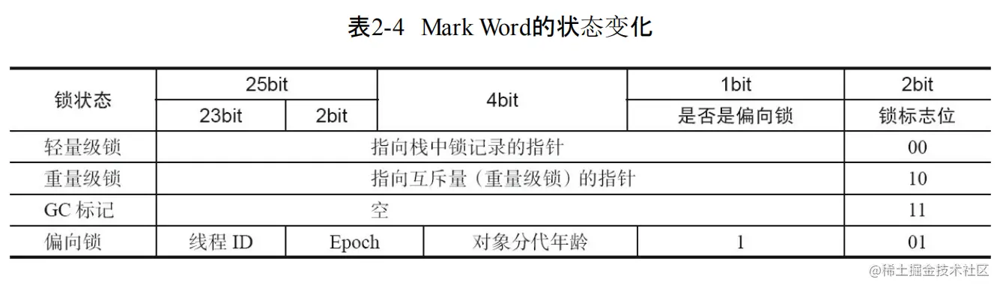
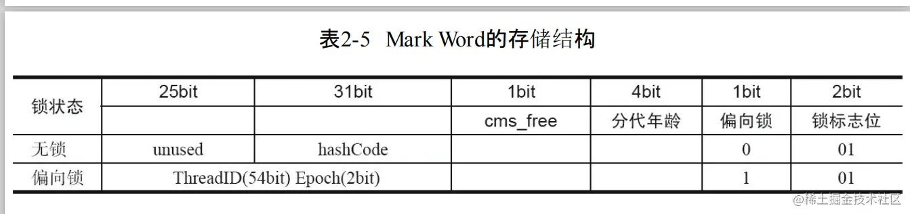
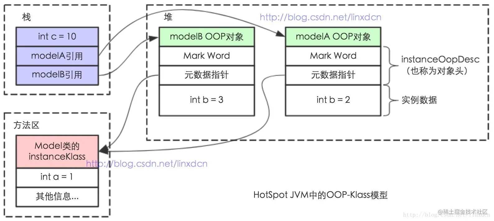
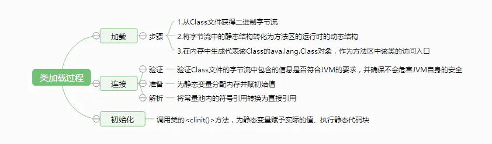
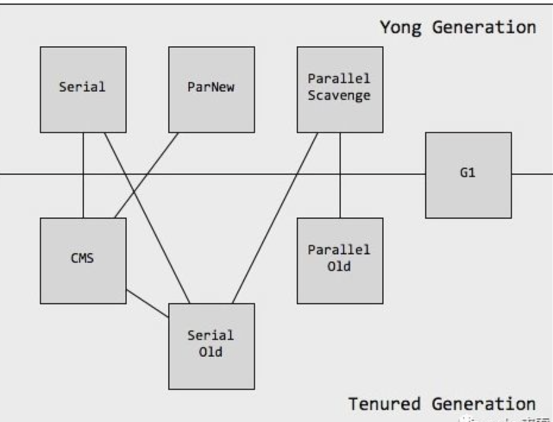
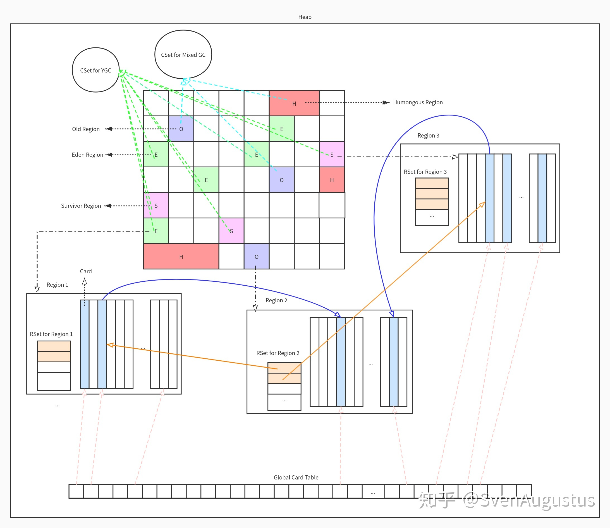
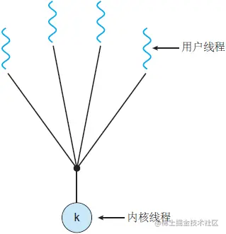

## Java基础

### 数据类型

#### 为什么字符串是不可变的

1. 引入常量池 The *String* is the most widely used data structure. Caching the *String* literals and reusing them saves a lot of heap space because different *String* variables refer to the same object in the *String* pool. *String* intern pool serves exactly this purpose.
   
   Java String Pool is **the special memory region where \*Strings\* are stored by the JVM**. Since *Strings* are immutable in Java, the JVM optimizes the amount of memory allocated for them by storing only one copy of each literal *String* in the pool. This process is called interning

2. 安全性 **If \*Strings\* were mutable, then by the time we execute the update, we can't be sure that the \*String\* we received, even after performing security checks, would be safe.** The untrustworthy caller method still has the reference and can change the *String* between integrity checks. Thus making our query prone to SQL injections in this case. So mutable *Strings* could lead to degradation of security over time.
   
   It could also happen that the *String* *userName* is visible to another thread, which could then change its value after the integrity check.
   
   In general, immutability comes to our rescue in this case because it's easier to operate with sensitive code when values don't change because there are fewer interleavings of operations that might affect the result.

3. 并发 Being immutable automatically makes the *String* thread safe since they won't be changed when accessed from multiple threads.
   
   Hence **immutable objects, in general, can be shared across multiple threads running simultaneously. They're also thread-safe** because if a thread changes the value, then instead of modifying the same, a new *String* would be created in the *String* pool. Hence, *Strings* are safe for multi-threading.

4. Hashcode缓存
   
   Since *String* objects are abundantly used as a data structure, they are also widely used in hash implementations like *HashMap*, *HashTable*, *HashSet*, etc. When operating upon these hash implementations, *hashCode()* method is called quite frequently for bucketing.
   
   The immutability guarantees *Strings* that their value won’t change. So **the \*hashCode()\* method is overridden in \*String\* class to facilitate caching, such that the hash is calculated and cached during the first \*hashCode()\* call and the same value is returned ever since.**
   
   **This, in turn, improves the performance of collections that uses hash implementations when operated with \*String\* objects.**
   
   On the other hand, mutable *Strings* would produce two different hashcodes at the time of insertion and retrieval if contents of *String* was modified after the operation, potentially losing the value object in the *Map*.

5. 性能
   
   As we saw previously, *String* pool exists because *Strings* are immutable. In turn, it enhances the performance by saving heap memory and faster access of hash implementations when operated with *Strings.*
   
   Since *String* is the most widely used data structure, improving the performance of *String* have a considerable effect on improving the performance of the whole application in general.

https://www.baeldung.com/java-string-immutable

#### 8大基本类型

| 数据类型    | 长度    | 位数  | 默认值   |
| ------- | ----- | --- | ----- |
| byte    | 1Byte | 8   | 0     |
| short   | 2Byte | 16  | 0     |
| int     | 4Byte | 32  | 0     |
| long    | 8Byte | 64  | 0     |
| float   | 4Byte | 32  | 0.0f  |
| double  | 8Byte | 64  | 0.0d  |
| boolean | -     | -   | false |

#### boolean基本类型占几个字节

JVM虚拟机规范中没有针对boolean的指令集，这只是 Java 虚拟机的建议。

- HotSop中boolean 类型被编译成 int 类型来使用，占 4 个 byte 
- boolean 数组被编译成 byte 数组类型，每个 boolean 数组成员占 1 个 byte 
- 在 Java 虚拟机里，1 表示 true ，0 表示 false 
- 可以肯定的是，肯定不是占1个比特

#### String、StringBuilder和StringBuffer

#### 为什么Integer128==128返回false

When you compile a number literal in Java and assign it to a Integer (capital `I`) the compiler emits:

```
 Integer b2 = Integer.valueOf(127)
```

This line of code is also generated when you use autoboxing.

`valueOf` is implemented such that certain numbers are "pooled", and it returns the same instance for values smaller than 128.

From the java 1.6 source code, line 621:

```
 public static Integer valueOf(int i) {
     if(i >= -128 && i <= IntegerCache.high)
         return IntegerCache.cache[i + 128];
     else
         return new Integer(i);
 }
```

#### Integer缓冲池IntegerCache

Integer中有个静态内部类IntegerCache，里面有个cache[],也就是**Integer常量池**，常量池的大小为一个字节（-128~127）。

所有整数类型都有类似的缓存机制，其目的是节省内存、提高性能等特性。

The value of `high` can be configured to another value, with the system property.

> -Djava.lang.Integer.IntegerCache.high=999

#### 基本类型的内存分配

字符串的字面量分配到常量池。

包装类在编译阶段自动拆箱。

结合栈上分配、标量替换。

```java
public class DemoTest {
    int y;// 分布在堆上
    public static void main(String[] args) {
      	// 局部变量的基本类型是在栈上分配的。
      	// 栈属于线程私有的空间，局部变量的生命周期和作用域一般都很短，为了提高gc效率，所以没必要放在堆里面。
        int x=1; //分配在栈上
        String name = new String("cat");//数据在堆上，name变量的指针在栈上
        String address = "北京";//数据在常量池，属于堆空间，指针在栈
        Integer price = 4;//包装类型同样是引用类型，编译时会自动装拆箱，所以数据在堆上，指针在栈
    }
}
```

#### 基本类型的包装类

针对各个基本类型的包装类型，如：Integer，Double，Long等，这些属于引用类型，我们直接在局部方法里面使用包装类型赋值，那么数据真正的内存分配还是在堆内存里面，这里有个隐式的拆装箱来自动完成转换，数据的指针是在栈上，包装类型的出现主要是为了基本类型能够用在泛型的设计上和使用null值，而基本类型则拥有更好的计算性能，这一点我们也需要注意。

#### 为什么说Integer是不可变类

值的改变不会影响方法外的引用，这是因为与String类似，所有的包装类都是final类，即不可变类。

Integer类型的HashCode为其值。

#### JDK1.7之前的HashMap是如何实现的

#### JDK1.8中HashMap是如何实现的

### SPI机制

#### 如果在catch里return了，finally中的代码还会被执行吗？

#### 双等号==的含义

基本数据类型之间应用双等号，比较的是他们的数值。 复合数据类型(类)之间应用双等号，比较的是他们在内存中的存放地址。

### 其它

#### 为什么Java不是100%的面向对象语言

Java is not 100% Object-oriented because it makes use of eight primitive data types such as boolean, byte, char, int, float, double, long, short which are not objects.

#### Java中为什么不用指针，还作为优点

为了摒弃指针带来的风险（当然了，也就放弃了指针带来的效率）。

1. C/C++什么有指针？

这个很简单，程序都是在内存中运行的，只要有内存，就有内存地址，有地址，就必然有指针，只是C++对内存地址的访问做了语言的支持，称之为指针。

2. 指针的优点？
   a、效率，指针就是内存的地址访问(虽然不是真正的物理地址，但是通过简单的映射就可以得到)，性能非常好。
   b、[C/C++](https://www.baidu.com/s?wd=C%2FC%2B%2B&tn=SE_PcZhidaonwhc_ngpagmjz&rsv_dl=gh_pc_zhidao)语言的需要，[C/C++](https://www.baidu.com/s?wd=C%2FC%2B%2B&tn=SE_PcZhidaonwhc_ngpagmjz&rsv_dl=gh_pc_zhidao)没有完善的面向对象支持，因此你不能声明一个Object类型的形参来接收所有类型的实参，因此C++只能通过万能指针void*来支持，C++中new出来的对象都是指针类型的(区别于直接声明一个类对象，Java中声明一个类的对象不实例化就是null，C/C++中对象类型可以像基本类型那样直接声明一个)。

3. 指针的缺点？
   a、稳定问题，指针太灵活，不小心就容易出现指针访问越界之类的问题，非常容易出问题。
   b、安全性问题。

4. java有类似指针，在java中称为引用。所谓的引用就是内存地址的值。拿到该引用就相当 于得到了该内存处的对象。

> **内存地址**：“在电脑运算中，内存地址是一种用于软件及硬件等不同层级中的数据概念，用来访问电脑主存中的数据。作用在8086的实模式下，把某一段寄存器左移4位，然后与地址ADDR相加后被直接送到内存总线上，这个相加后的地址就是内存单元的物理地址，而程序中的这个地址就叫逻辑地址（或叫虚地址）。”
>
> 内存地址只是一个编号，代表一个内存空间。那么这个空间是多大呢？原来在计算机中存储器的容量是以字节为基本单位的。也就是说一个**内存地址代表一个字节（8bit）的存储空间**。
>
> 32位的操作系统最多支持4GB的内存空间，也就是说CPU只能寻址2的32次方（4GB），注意这里的4GB是以Byte为单位的，不是bit。也就是说有4G=4*1024M（Byte）=4*1024*1024Kb(Byte)=4*1024*1024*1024Byte(8bit)，即2的32次方个8bit单位（1Byte=8bit）。

#### Unsafe有哪些功能


- 使用堆外内存

  > - 对**垃圾回收停顿的改善**。由于堆外内存是直接受操作系统管理而不是JVM，所以当我们使用堆外内存时，即可保持较小的堆内内存规模。从而在GC时减少回收停顿对于应用的影响。
  > - 提升程序**I/O操作的性能**。通常在I/O通信过程中，会存在堆内内存到堆外内存的数据拷贝操作，对于需要频繁进行内存间数据拷贝且生命周期较短的暂存数据，都建议存储到堆外内存（**减少内存拷贝**）。
  > - 什么是**CAS**? 即比较并替换，实现并发算法时常用到的一种技术。CAS操作包含三个操作数——内存位置、预期原值及新值。执行CAS操作的时候，将内存位置的值与预期原值比较，如果相匹配，那么处理器会自动将该位置值更新为新值，否则，处理器不做任何操作。
  > - 此部分主要提供Class和它的静态字段的操作相关方法，包含静态字段内存定位、定义类、定义匿名类、检验&确保初始化等。
  > - 内存屏障：也称内存栅栏，内存栅障，屏障指令等，是一类同步屏障指令，是CPU或编译器在对内存随机访问的操作中的一个同步点，使得此点之前的所有读写操作都执行后才可以开始执行此点之后的操作），避免代码重排序。
  > - 系统相关：获取系统信息，系统指针大小、内存页大小等

- 典型应用场景

  > | 特性      | 场景                                                         |
  > | --------- | ------------------------------------------------------------ |
  > | 堆外内存  | Netty、Flink                                                 |
  > | CAS       | CAS在java.util.concurrent.atomic相关类、Java AQS、CurrentHashMap |
  > | Class相关 | 从Java 8开始，JDK使用invokedynamic及VM Anonymous Class结合来实现Java语言层面上的Lambda表达式。 |
  > | 内存屏障  | StampedLock提供了一种乐观读锁的实现，这种乐观读锁类似于无锁的操作，完全不会阻塞写线程获取写锁，从而缓解读多写少时写线程“饥饿”现象。 |
  >
  > 

## Java进阶

### 对象模型

#### 对象头

1. 对象头（包含锁状态标志，线程持有的锁等标志）

   > - **markOop _mark**
   >
   > - **union _metadata**
   >   元数据指针，它包含了 2 部分内容，klass 和 _compressed_klass 他们指向了对象所属的类。
   >
   >   ```java
   >   class Model
   >   {
   >       public static int a = 1;
   >       public int b;
   >                       
   >       public Model(int b) {
   >           this.b = b;
   >       }
   >   }
   >   public static void main(String[] args) {
   >       int c = 10;
   >       Model modelA = new Model(2);
   >       Model modelB = new Model(3);
   >   }
   >   ```
   >
   >   上述代码的内存使用情况如下图所示：
   >
   >   
   >
   > - **内存布局工具包**
   >
   >   ```xml
   >   <dependency>
   >       <groupId>org.openjdk.jol</groupId>
   >       <artifactId>jol-core</artifactId>
   >       <version>0.10</version>
   >   </dependency>
   >   # 使用方法
   >   # log.info("{}", VM.current().details());
   >                       
   >   # log.info("{}",ClassLayout.parseClass(String.class).toPrintable());
   >     [main] INFO com.flydean.JolUsage - java.lang.String object internals:
   >        OFFSET  SIZE      TYPE DESCRIPTION               VALUE
   >             0     4           (object header)           01 c2 63 a2 (00000001 11000010 01100011 10100010) (-1570520575)
   >             4     4           (object header)           0c 00 00 00 (00001100 00000000 00000000 00000000) (12)
   >             8     4           (object header)           77 1a 06 00 (01110111 00011010 00000110 00000000) (399991)
   >            12     4    byte[] String.value          [119, 119, 119, 46, 102, 108, 121, 100, 101, 97, 110, 46, 99, 111, 109]
   >            16     4       int String.hash                               0
   >            20     1      byte String.coder                              0
   >            21     1   boolean String.hashIsZero                         false
   >            22     2           (loss due to the next object alignment)
   >       Instance size: 24 bytes
   >       Space losses: 0 bytes internal + 2 bytes external = 2 bytes total
   >                       
   >   # log.info("{}",ClassLayout.parseInstance("www.flydean.com").toPrintable());
   >     [main] INFO com.flydean.JolUsage - java.lang.String object internals:
   >      OFFSET  SIZE      TYPE DESCRIPTION                               VALUE
   >           0     4           (object header)                           01 c2 63 a2 (00000001 11000010 01100011 10100010) (-1570520575)
   >           4     4           (object header)                           0c 00 00 00 (00001100 00000000 00000000 00000000) (12)
   >           8     4           (object header)                           77 1a 06 00 (01110111 00011010 00000110 00000000) (399991)
   >          12     4    byte[] String.value                              [119, 119, 119, 46, 102, 108, 121, 100, 101, 97, 110, 46, 99, 111, 109]
   >          16     4       int String.hash                               0
   >          20     1      byte String.coder                              0
   >          21     1   boolean String.hashIsZero                         false
   >          22     2           (loss due to the next object alignment)
   >     Instance size: 24 bytes
   >     Space losses: 0 bytes internal + 2 bytes external = 2 bytes total
   >   ----
   >   从该对象头中分析加锁信息，MarkWordk为0x00007ff0c80053ea，二进制为0xb00000000 00000000 01111111 11110000 11001000 00000000 01010011 11101010。
   >   倒数第三位为"0"，说明不是偏向锁状态，倒数两位为"10"，因此，是重量级锁状态，那么前面62位就是指向互斥量的指针。
   >   ```

#### 对象模型OOP-Klass Model

OOP-Klass Model（Ordinary Object Point-Klass Model）指的是普通对象指针，用来描述 java 类和对象在 JVM 中的表现形式，OOP 用来表示 java 实例在 JVM 中的表现，Klass 用来表示类在 JVM 中的表现。之所以要一分为二的设计是因为想要避免每个 Java 对象都存在一个虚函数，所以 oop 实例没有虚函数，而 Klass 类有虚函数，虚函数则是实现多态的关键所以 **Java 最终也是通过虚函数来实现多态的**。

> **虚函数** : Java中其实没有虚函数的概念，它的普通函数就相当于C++的虚函数，动态绑定是Java的默认行为。 如果Java中不希望某个函数具有虚函数特性，可以加上final关键字变成非虚函数。 抽象函数或者说是纯虚函数的存在是为了定义接口。 抽象类的存在是因为父类中既包括子类共性函数的具体定义，也包括需要子类各自实现的函数接口。
>
> 抽象函数或者说是纯虚函数的存在是为了定义接口。*C++*中纯虚函数形式为：virtual void print() = 0;Java中纯虚函数形式为：abstract void print();
> *C++*虚函数  *== Java*普通函数
> *C++*纯虚函数 *== Java*抽象函数
> *C++*抽象类  *== Java*抽象类
> *C++*虚基类  *== Java*接口

1. 实例数据
2. 对齐填充

### JVM

#### 类的加载过程



**加载**

> 在加载阶段，JVM需要完成以下3件事情：
>
> 1. 通过一个类的全限定名来获取定义此类的二进制字节流。
> 2. 将这个字节流所代表的静态存储结构转化为方法区的运行时数据结构。
> 3. 在内存中生成一个代表这个类的java.lang.Class对象，作为方法区这个类的各种数据的访问入口。
>
> 注：JVM规范的这3点要求其实并不算具体，因此JVM实现与具体应用的灵活度都是相当大的
>
> 相对于类加载过程的其他阶段，一个非数组类的加载阶段（准确地说，是加载阶段中获取类的二进制字节流的动作）是开发人员可控性最强的，因为加载阶段既可以使用系统提供的引导类加载器来完成，也可以由用户自定义的类加载器区完成，开发人员可以通过定义自己的类加载器去控制字节流的获取方式（即重写一个类加载器的loadClass()方法）。
>
> 对于数组类而言，数组类本身不通过类加载器创建，它是由JVM直接创建的。但数组类与类加载器任然有很密切的关系，因为数组类的元素类型最终是要靠类加载器去创建。
>
> 加载阶段完成后，JVM外部的二进制字节流就按照JVM所需的格式存储在方法区之中，方法区中的数据存储格式由JVM实现自行定义，JVM规范未规定此区域的具体数据结构。然后在内存中实例化一个java.lang.Class类的对象（并没有明确规定是在Java堆中，对于HotSpot VM而言，Class对象比较特殊，它虽然是对象，但是存放在方法区里面），这个对象将作为程序访问方法区中的这些类型数据的外部接口。
>
> 加载阶段与连接阶段的部分内容（如一部分字节码文件格式验证动作）是交叉进行的，加载阶段尚未完成，连接阶段可能已经开始，但这些夹在加载阶段之中进行的动作，仍然属于连接阶段的内容，这两个阶段的开始时间仍然保持着固定的先后顺序。

**验证**

>  验证是连接阶段的第一步，这一阶段的目的是为了确保Class文件的字节流中包含的信息符合当前JVM的要求，并且不会危害JVM自身的安全。比如验证“魔数”是否为`0xCAFEBABE`、Class文件编译版本号是否符合当前JVM等。
>
> Java语言本身是相对安全的语言，使用纯粹的Java代码无法做到注入访问数组边界意外的数据、将一个对象转型为它并未实现的类型、跳转到不存在的代码行之类的事情，如果这样做了，编译器将拒绝编译。
>
> 但前面已经说过，Class文件并不一定要求用Java源码编译而来，可以使用任何途径产生，甚至包括用十六进制编辑器直接编写来产生Class文件。在字节码语言层面上，上述Java代码无法做到的事情都是可以实现的，至少语义上是可以表达出来的。
>
> JVM如果不检查输入的字节流，对其完全信任的话，很可能会因为载入了有害的字节流而导致系统崩溃，所以验证是JVM对自身保护的一项重要工作。

**准备**

>  准备阶段将为静态变量申请内存，并赋予初始值（基本类型为其默认值，引用类型为`null`），假设有如下代码：
>
> ```csharp
> public static int value = 123;
> ```
>
> 在该阶段`value`的值将根据其类型`int`初始化为 `0`。而将 `value` 赋值为`123`的动作在初始化阶段才会执行（调用`<clinit()>`方法，执行`putstatic`指令）。

**解析**

> 解析阶段是JVM将常量池内的符号引用替换为直接引用的过程。

**初始化**

> 在初始化阶段会调用类的初始化方法`<clinit()>`为静态变量赋予实际的值（例如将`value`赋值为`123`）、执行静态代码块。在 JVM 规范中没有强制约束加载的时机，不过对于初始化JVM规范严格规定了有且只有5种情况必须立即对类进行初始化：
>
> 1. 遇到`new、getstatic、putstatic、invokestatic`这四条字节码指令时，如果类还没有进行过初始化，则需要先触发其初始化。生成这四条指令最常见的Java代码场景是：使用`new`关键字实例化对象时、读取或设置一个类的静态字段（`static`）时（被static修饰又被`final`修饰的，已在编译期把结果放入常量池的静态字段除外）、以及调用一个类的静态方法时。
> 2. 使用Java.lang.refect包的方法对类进行反射调用时，如果类还没有进行过初始化，则需要先触发其初始化。
> 3. 当初始化一个类的时候，如果发现其父类还没有进行初始化，则需要先触发其父类的初始化。
> 4. 当JVM启动时，需要指定一个主类（即包含`public static void main(String[] args)` 方法的类），JVM会对该主类触发初始化。
> 5. 当使用JDK1.5支持时，如果一个`java.lang.invoke.MethodHandle`实例最后的解析结果REF_getStatic、REF_putStatic、REF_invokeStatic的方法句柄，并且这个方法句柄所对应的类没有进行过初始化，则需要先触发其初始化。

 

#### 什么是解释器，什么是 JIT 编译器？

**解释器**： 当 Java 虚拟机启动时会根据预定义的规范对字节码采用逐行解释的方式执行，将每条字节码中的内容“翻译”为对应平台的本地机器指令执行。

**编译器**：

> 1、*动态编译*（dynamic compilation）指的是“在运行时进行编译”；与之相对的是事前编译（ahead-of-time compilation，简称AOT），也叫*静态编译*（static compilation）。
> 2、*JIT*编译（just-in-time compilation）狭义来说是当某段代码即将第一次被执行时进行编译，因而叫“即时编译”。*JIT编译是动态编译的一种特例*。JIT编译一词后来被*泛化*，时常与动态编译等价；但要注意广义与狭义的JIT编译所指的区别。
> 3、*自适应动态编译*（adaptive dynamic compilation）也是一种动态编译，但它通常执行的时机比JIT编译迟，先让程序“以某种式”先运行起来，收集一些信息之后再做动态编译。这样的编译可以更加优化。

解释器的执行，抽象的看是这样的：
输入的代码 -> [ 解释器 解释执行 ] -> 执行结果
而要JIT编译然后再执行的话，抽象的看则是：
输入的代码 -> [ 编译器 编译 ] -> 编译后的代码 -> [ 执行 ] -> 执行结果
说JIT比解释快，其实说的是**“执行编译后的代码”比“解释器解释执行”要快**，并不是说“编译”这个动作比“解释”这个动作快。

**为什么不全部编译**: 对一般的Java方法而言，编译后代码的大小相对于字节码的大小，膨胀比达到10x是很正常的。同上面说的时间开销一样，这里的空间开销也是，只有对执行频繁的代码才值得编译，如果把所有代码都编译则会显著增加代码所占空间，导致“代码爆炸”。

#### 触发JIT的条件是什么

1. JVM是依据**方法的调用次数**以及**循环回边的执行次数**来触发JIT的
2. JVM将在0层、2层和3层执行状态时进行profiling，其中包括方法的调用次数和循环回边的执行次数
   - 循环回边是一个控制流程图中的概念，在字节码中，可以简单理解为**往回跳**的指令
   - 在即时编译过程中，JVM会识别循环的头部和尾部，**循环尾部到循环头部的控制流就是真正意义上的循环回边**
   - C1将在**循环回边**插入**循环回边计数器**的代码
   - 解释执行和C1代码中增加循环回边计数的**位置**并不相同，但这不会对程序造成影响
   - JVM不会对这些**计数器**进行**同步**操作，因此收集到的执行次数也**不是精确值**
   - 只要该数值**足够大**，就能表示对应的方法包含热点代码
3. 在不启动分层编译时，当方法的调用次数和循环回边的次数的和超过-XX:CompileThreshold，便会触发JIT
   - 使用**C1**时，该值为**1500**
   - 使用**C2**时，该值为**10000**
4. 当启用分层编译时，阈值大小是动态调整的
   - **阈值 \* 系数**

#### 为什么HotSopt有Server和Client两种编译器

HotSpot虚拟机中内置了两个即时编译器：Client Complier和Server Complier，简称为C1、C2编译器，分别用在客户端和服务端。目前主流的HotSpot虚拟机中默认是采用解释器与其中一个编译器直接配合的方式工作。程序使用哪个编译器，取决于虚拟机运行的模式。HotSpot虚拟机会根据自身版本与宿主机器的硬件性能自动选择运行模式，用户也可以使用“-client”或“-server”参数去强制指定虚拟机运行在Client模式或Server模式。

用Client Complier获取更高的*编译速度*，用Server Complier 来获取更好的*编译质量*。为什么提供多个即时编译器与为什么提供多个垃圾收集器类似，都是为了适应不同的应用场景。

编译路径（分层编译）：


1. 1层和4层是

   终止状态

   - 当一个**方法**被**终止状态**编译后，如果**编译后的代码没有失效**，那么JVM**不会再次发出该方法的编译请求**

2. 通常情况下，热点方法会被3层的C1编译，然后再被4层的C2编译

3. 如果方法的字节码数目较少（如getter/setter），并且3层的profiling没有可收集的数据

   - JVM会断定**该方法对于C1和C2的执行效率相同**
   - JVM会在3层的C1编译后，**直接选用1层的C1编译**
   - 由于1层是**终止状态**，JVM不会继续用4层的C2编译

4. 在C1忙碌的情况下，JVM在**解释执行过程**中对程序进行**profiling**，而后直接由4层的C2编译

5. 在C2忙碌的情况下，方法会被2层的C1编译，然后再被3层的C1编译，以减少方法在3层的执行时间

#### 为什么说 Java 语言是半编译半解释型语言？

Java是一个半解释半编译型语言，早期java是通过解释器来执行，效率低下；后期进行优化，解释器在原本的c++字节码解释器基础上，扩充了模板解释器，效率有了明显提升；后来又加入了JIT（即时编译），效率就更加得到了提升。

解释器：当程序需要迅速启动和执行的时候，解释器可以首先发挥作用，省去编译的时间，立即执行。

编译器：在程序运行后，随着时间的推移，编译器逐渐发挥作用，把越来越多的代码编译成本地代码之后，可以获取更高的执行效率。

两者的协作：在程序运行环境中内存资源限制较大时，可以使用解释执行节约内存，反之可以使用编译执行来提升效率。当通过编译器优化时，发现并没有起到优化作用，，可以通过逆优化退回到解释状态继续执行。


#### JVM类的加载机制

#### 内存分区相关参数有哪些

| 参数名称                        | 可选值     | 说明             |
| ------------------------------- | ---------- | ---------------- |
| -XX:StringTableSize=4901        | 要求为素数 | 字符串池大小     |
| -XX:+PrintStringTableStatistics | -          |                  |
| -XX:-UseCompressedOops          |            | 默认开启指针压缩 |

#### JVM堆的新生代、老年代

Xms 用来指定初始堆内存，**默认占系统内存1/64**,java应用启动后jvm会向操作系统申请内存，在申请的内存到达Xms之前，所有申请的内存不用了会还给操作系统，当申请的内存达到Xms，那么Xms之前的内存只会清空不会还给操作系统，而申请超过初始内存小于最大内存这些内存也会归还给操作系统，如果程序启动默认就会申请很多内存，建议把Xmx和Xms设置成一样。

Xmx 用来指定最大堆大小，**默认占系统内存1/4**，当申请的内存超过最大堆内存就会造成堆OutOfMemoryError，导致程序直接挂掉。

Xmn指定年轻代大小，Xmx=Xmn+老年代（不包含PermSize或MetaSpace）

当垃圾收集器触发GC的时候会对堆内存长时间没用的对象分代进行回收，**新生代和老年代内存占比为1:2**。

|        | 新生代                                                       | 老年代                                                       |
| ------ | ------------------------------------------------------------ | ------------------------------------------------------------ |
| GC     | G1  jdk9<br />ParallelGC jdk1.8**                            | CMS<br />G1                                                  |
| 比例   | 分为Eden区，s1，s0三个区域，分别内存占比8:1:1                | sun官方建议为整个堆的3/8                                     |
| GC步骤 | 当新创建一个对象，这个对象首先会到Eden区，如果Eden区放满了，会产生一次young GC 这次GC会把Eden区没有用到的对象回收掉，并把可用对象复制到Survival 区，并记录这些对象一次GC年龄。<br />当Eden区内存满了后，GC收集器会触发复制算法，将Eden区的存活对象复制到s0或者s1,s0和s1始终保持有一个空的区域，当s1或s0其中一个满了，也会触发一次GC并把可用对象赋值到另一个空区域，当GC到一定次数后依然存活的对象会进入老年代。<br />当 YGC 发生时候，由于 To 区太小，存活的对象直接进入到老年代,老年代占用量逐渐变大。 | 当经过多次GC的对象年龄达到一个阈值而没有被回收或者比较大的对象，会直接进入老年代，当老年代内存满了，会触发full GC这个时候会清理整个堆内存未被使用的对象，GC时老年代采用的是标记整理算法。 |

- 堆内存使用情况 jmap -heap <pid>
- 查看堆中的对象 jmap -histo <pid>
- 统计GC发生情况 jstat -gcutil <pid>
- 是否使用CMS jinfo -flag UseConcMarkSweepGC <pid>

#### JVM有哪些参数？

标准参数（-），所有的JVM实现都必须实现这些参数的功能，而且向后兼容；
非标准参数（-X），默认jvm实现这些参数的功能，但是并不保证所有jvm实现都满足，且不保证向后兼容；
非Stable参数（-XX），此类参数各个jvm实现会有所不同，将来可能会随时取消，需要慎重使用；

| JDK  | 参数名称                       | 可选值  | 说明                                                         | 分类 |
| ---- | ------------------------------ | ------- | ------------------------------------------------------------ | ---- |
| 1.7  | -XX:MaxPermSize                | 1g/512m | JDK1.7之前设置永久代大小                                     | 内存 |
|      | -XX:+PrintGCDateStamps         | -/+     |                                                              | 内存 |
|      | -XX:+PrintGCDetails            | -/+     |                                                              | 内存 |
|      | -XX:+PrintHeapAtGC             | -/+     |                                                              | 内存 |
|      | -XX:+PrintTenuringDistribution | -/+     |                                                              | 内存 |
|      | -XX:+UseAdaptiveSizePolicy     | -/+     |                                                              | 内存 |
|      | -XX:+UseConcMarkSweepGC        | -/+     | 使用CMS                                                      | 内存 |
|      | -XX:SurvivorRatio              |         | 生还者池的大小,默认是2                                       | 内存 |
|      | -Xss                           |         | 每个线程的Stack大小<br />而最佳值应该是128K,默认值好像是512k.<br />设置过小会导致应用启动失败 | 内存 |
|      | -verbose:gc / -XX:+PrintGC     | -/+     |                                                              | 内存 |
|      | -Xloggc:gc.log                 |         | 指定垃圾收集日志文件                                         | 内存 |
|      | -ea                            | -/+     | -ea就是中的ea就是enable assertion的意思，即 “启用断言”。加了-ea参数后可以使用 `assert <表达式>` 的写法。当然，不加-ea并不是不能写 `assert xxx` ，实际上依然是可以这么写，并且也能通过编译，只是在运行的时候实际是不起作用的。 |      |

#### JVM堆的常见问题及优化方案

| 问题                          | 分析优化                                                     |
| ----------------------------- | ------------------------------------------------------------ |
| 频繁发生FCG，导致应用经常卡顿 | Jstat -gcutil <pid>查看FGC次数<br />1. 新生代SurvivorTo区域太小，对象被分配到老年代，导致老年代对象不断增加（1.8中默认开启AdaptiveSizePolicy，可能会导致该问题）<br />2. 大对象过多，可以尝试对象池 |

#### GC Roots与可达性分析

- 哪些对象可以作为GC Roots

> - 虚拟机栈（栈帧中的本地变量表）中引用的对象
> - 本地方法栈中 JNI（即一般说的 Native 方法）引用的对象
> - 方法区中类静态属性引用的对象
> - 方法区中常量引用的对象
>
> 总结：栈（虚拟机栈、Native栈）、方法区（常量池、静态对象）

- 什么是可达性分析

  > 现代虚拟机基本都是采用可达性分析算法来判断对象是否存活，可达性算法的原理是以一系列叫做  **GC Root** 的对象为起点出发，引出它们指向的下一个节点，再以下个节点为起点，引出此节点指向的下一个结点。这样通过 GC Root 串成的一条线就叫**引用链 Reference Chain**），直到所有的结点都遍历完毕,如果相关对象不在任意一个以 **GC Root** 为起点的引用链中，则这些对象会被判断为垃圾对象,会被 GC 回收。

#### GC垃圾收集器

查看当前支持的垃圾回收器：java -XX:+UnlockDiagnosticVMOptions -XX:+PrintFlagsFinal -version

为方便理解 GC 算法时，需要先介绍一些常见的名词

- mutator，应用程序的线程
- collector，用于进行垃圾回收的线程
- concurrent（并发），指 collector 与 mutator 可以并发执行
- parallel（并行），指 collector 是多线程的，可以利用多核 CPU 工作
- young/old(也称Tenured) 代，根据大多数对象“朝生夕死”的特点，现代 GC 都是分代
- mark标记
- sweep清理
- compact整理（整理内存碎片）
- 一个 gc 算法可以同时具有 concurrent/parallel 的特性，或者只具有一个。
- 

| 垃圾收集器                            | 作用分代 | 算法            | 优点                                                         | 缺点                                                         |
| ------------------------------------- | -------- | --------------- | ------------------------------------------------------------ | ------------------------------------------------------------ |
| -XX:+UseSerialGC                      | Young    | MarkCopy        |                                                              | 单线程，无并发                                               |
| -XX:+UseSerialOldGC                   | Old      | MarkSweep       |                                                              | 单线程，无并发                                               |
|                                       |          |                 |                                                              |                                                              |
| +UseParallelGC<br />+UseParallelOldGC | Old      |                 |                                                              |                                                              |
| +UseConcMarkSweepGC                   | Old      | 三色标记        | 多线程并发标记，停顿短                                       | 没有compact，产生内存碎片<br />CMF问题：剩余空间足够，但没有足够的<br />连续空间存储对象，会降级为SerialGC<br />（G1出来CMS没人维护，所以没有Parallel版本） |
| -XX:+UseG1GC                          |          | 三色标记 + SATB | 多线程并发标记，高吞吐，低延迟；<br />取代CMS具备内存整理功能；可指定期望STW时间；适合大堆； | 最小存储单元为512Byte，浪费内存                              |
| -XX:+UseZGC                           |          |                 |                                                              |                                                              |

- PS/PO

  > UseAdaptiveSizePolicy只在使用UseParallelGC或UseParallelOldGC的时候用它
  >
  > 运行是会STW，所以不存在和mutator线程之间的同步问题
  > 

- CMS Cocurrent-Mark-Sweep

  > CMS并非没有暂停，而是用两次短暂停来替代串行标记整理算法的长暂停，它的收集周期是这样：
  > 初始标记(CMS-initial-mark) -> 并发标记(CMS-concurrent-mark) -> 重新标记(CMS-remark) -> 并发清除(CMS-concurrent-sweep) ->并发重设状态等待下次CMS的触发(CMS-concurrent-reset)。
  >
  > 
  >
  > 1. 解决CMF问题，可以使用下列两个参数，这两个参数缺一不可，第一个表示 old 区占用量超过 60% 时开始执行 CMS，第二个参数禁用掉 JVM 的自适应策略，如果不设置这个 JVM 可能会忽略第一个参数。-XX:CMSInitiatingOccupancyFraction=**60**  -XX:+UseCMSInitiatingOccupancyOnly
  > 2. GC日志中的Promotion failure 一般是由于 heap 内存碎片过多导致检测空间足够，但是真正晋级时却没有足够连续的空间，监控 old 代碎片可以用下面的选项 -XX:+PrintGCDetails -XX:+PrintPromotionFailure -XX:PrintFLSStatistics=1
  > 3. 尽可能提供较大的 old 空间，但是最好不要超过 32G，[超过了就没法用压缩指针了](https://www.elastic.co/guide/en/elasticsearch/guide/current/heap-sizing.html#compressed_oops)。
  > 4. 尽早执行 CMS，即修改 initiating occupancy 参数
  > 5. 应用尽量不要去分配巨型对象
  
- G1

  > **G1的特点：**
  >
  > 1. 面向服务端应用的垃圾收集器
  > 2. 并行与并发：G1能充分利用多CPU、**多核**环境使用多个CPU或CPU核心来缩短`STW`（Stop-The-World）停顿时间。
  > 3. 分代收集：G1物理上不分代，但逻辑上仍然有分代的概念。
  > 4. 空间整合：不会产生内存空间碎片，收集后可提供规整的可用内存，整理空闲空间更快。
  > 5. 可预测的停顿(它可以有计划的避免在整个JAVA堆中进行全区域的垃圾收集)
  > 6. 适用于不需要实现很高吞吐量的场景
  > 7. JAVA堆内存布局与其它收集器存在很大差别，它将整个JAVA堆划分为多个大小相等的独立区域或分区(`Region`)。
  > 8. G1收集器中，虚拟机使用`Remembered Set`来避免全堆扫描。
  >
  > **G1内存模型**
  >
  > 
  >
  > **G1标记阶段**
  >
  > 
  >
  > - Initial Marking（初始标记， STW）
  >
  >   > 它标记了从GC Root开始**直接可达**的对象。
  >   >
  >   > 事实上，当达到IHOP阈值时，G1并不会立即发起并发标记周期，而是等待下一次年轻代收集，利用年轻代收集的STW时间段，完成初始标记，这种方式称为借道(Piggybacking)。
  >
  > - Root region scanning（根分区扫描）
  >
  >   > 在初始标记暂停结束后，年轻代收集也完成的对象复制到Survivor的工作，应用线程开始活跃起来。此时为了保证标记算法的正确性，所有新复制到Survivor分区的对象，都需要被扫描并标记成根，这个过程称为根分区扫描(Root Region Scanning)，同时扫描的[Suvivor分区](https://www.zhihu.com/search?q=Suvivor分区&search_source=Entity&hybrid_search_source=Entity&hybrid_search_extra={"sourceType"%3A"article"%2C"sourceId"%3A"137960179"})也被称为根分区(Root Region)。
  >
  > - Concurrent Marking（并发标记）
  >
  >   > 这个阶段从GC Root开始对heap中的对象标记，标记线程与[应用程序线程](https://www.zhihu.com/search?q=应用程序线程&search_source=Entity&hybrid_search_source=Entity&hybrid_search_extra={"sourceType"%3A"article"%2C"sourceId"%3A"137960179"})并行执行，并且收集各个`Region`的存活对象信息。 和应用线程并发执行，并发标记线程在并发标记阶段启动，由参数`-XX:ConcGCThreads`(默认GC线程数的1/4，即-XX:ParallelGCThreads/4)控制启动数量， 每个线程每次只扫描一个分区`Region`，从而标记出存活对象图。
  >   >
  >   > 所有的标记任务必须在堆满前就完成扫描，如果并发标记耗时很长，那么有可能在并发标记过程中，又经历了几次年轻代收集。 如果堆满前没有完成标记任务，则会触发担保机制，经历一次长时间的串行Full GC。
  >
  > - Remark（ 重新标记，STW）
  >
  >   > 标记那些在并发标记阶段发生变化的对象，将被回收。 这个阶段也是并行执行的，通过参数`-XX:ParallelGCThread`可设置GC暂停时可用的GC线程数。
  >
  > - Cleanup （清理，STW）
  >
  >   > 清除阶段主要执行以下操作：
  >   >
  >   > - `RSet`梳理，启发式算法会根据活跃度和`RSet`尺寸对分区定义不同等级，同时`RSet`数理也有助于发现无用的引用。参数`-XX:+PrintAdaptiveSizePolicy`可以开启打印启发式算法决策细节；
  >   > - 整理堆分区，为混合收集周期识别回收收益高(基于释放空间和暂停目标)的老年代分区集合；
  >   > - 识别所有空闲分区，即发现无存活对象的分区。该分区可在清除阶段直接回收，无需等待下次收集周期。
  >
  > **G1的垃圾回收包括了以下几种：**
  >
  > 1. Concurrent Marking Cycle （并发收集） 类似 `CMS`的并发收集过程。
  >
  >    > 并发标记周期是G1中非常重要的阶段，这个阶段将会为混合收集周期识别垃圾最多的老年代分区。
  >    >
  >    > 整个周期完成根标记、识别所有(可能)存活对象，并计算每个分区的活跃度，从而确定GC效率等级。
  >    >
  >    > 当达到IHOP阈值`-XX:InitiatingHeapOccupancyPercent`(老年代占整堆比，默认45%)时，便会触发并发标记周期。
  >    >
  >    > 整个并发标记周期将由初始标记(Initial Mark)、根分区扫描(Root Region Scanning)、并发标记(Concurrent Marking)、重新标记(Remark)、清除(Cleanup)几个阶段组成。
  >    >
  >    > 其中，初始标记(随年轻代收集一起活动)、重新标记、清除是STW的，**而并发标记如果来不及标记存活对象，则可能在并发标记过程中，G1又触发了几次年轻代收集（`YGC`）。**
  >
  > 2. 年轻代收集 Young Collection /混合收集周期 Mixed Collection Cycle
  >
  >    > 当应用运行开始时，堆内存可用空间还比较大，只会在年轻代满时，触发年轻代收集；
  >    >
  >    > 随着老年代内存增长，当到达IHOP阈值`-XX:InitiatingHeapOccupancyPercent`(老年代占整堆比，默认45%)时，G1开始着手准备收集老年代空间。
  >    >
  >    > 首先经历并发标记周期 `Concurrent Marking Cycle`，识别出高收益的老年代分区，前文已述。
  >    >
  >    > 但随后G1并不会马上开始一次混合收集，而是让应用线程先运行一段时间，等待触发一次年轻代收集。
  >    >
  >    > 在这次STW中，G1将保准整理混合收集周期。接着再次让应用线程运行，当接下来的几次年轻代收集时，将会有老年代分区加入到CSet中，
  >    >
  >    > 即触发混合收集，这些连续多次的混合收集称为混合收集周期(`Mixed Collection Cycle`)。
  >
  > 3. Young Collection （YGC，年轻代收集，`STW`）
  >
  >    > 当G1发起并发标记周期之后，并不会马上开始混合收集。 G1会先等待下一次年轻代收集，然后在该收集阶段中，确定下次混合收集的CSet(Choose CSet)。
  >
  > 3. Mixed Collection Cycle （混合收集，`STW`）
  >
  >    > 混合收集周期 Mixed Collection Cycle, `Mixed GC`
  >    >
  >    > 单次的混合收集与年轻代收集并无二致。
  >    >
  >    > 根据暂停目标，老年代的分区可能不能一次暂停收集中被处理完，G1会发起连续多次的混合收集，称为混合收集周期(Mixed Collection Cycle)。
  >    >
  >    > G1会计算每次加入到CSet中的分区数量、混合收集进行次数，并且在上次的年轻代收集、以及接下来的混合收集中，G1会确定下次加入CSet的分区集(Choose CSet)，并且确定是否结束混合收集周期。
  >
  > 4. Full GC（FGC， `STW`） **JDK10以前FGC是串行回收，JDK10+可以是并行回收。**
  >
  >    > 转移失败的担保机制 `Full GC`
  >    >
  >    > 转移失败(`Evacuation Failure`)是指当G1无法在堆空间中申请新的分区时，G1便会触发担保机制，执行一次`STW`式的、单线程（JDK10支持多线程）的Full GC。
  >    >
  >    > 
  >    >
  >    > Full GC会对整堆做标记清除和压缩，最后将只包含纯粹的存活对象。参数`-XX:G1ReservePercent`(默认10%)可以保留空间，来应对晋升模式下的异常情况，最大占用整堆50%，更大也无意义。
  >    >
  >    > G1在以下场景中会触发Full GC，同时会在日志中记录`to-space exhausted`以及`Evacuation Failure`：
  >    >
  >    > - 从年轻代分区拷贝存活对象时，无法找到可用的空闲分区
  >    > - 从老年代分区转移存活对象时，无法找到可用的空闲分区
  >    > - 分配巨型对象`Humongous Object` 时在老年代无法找到足够的连续分区
  >    >
  >    > ==由于G1的应用场合往往堆内存都比较大，所以Full GC的收集代价非常昂贵，应该避免Full GC的发生。==
  >
  > **G1中的概念解读**
  >
  > - 分区
  >
  >   > G1采用了分区(Region)的思路，将整个堆空间分成若干个大小相等的内存区域，每次分配对象空间将逐段地使用内存。因此，在堆的使用上，G1并不要求对象的存储一定是物理上连续的，只要逻辑上连续即可；每个分区也不会确定地为某个代服务，可以按需在年轻代和老年代之间切换。启动时可以通过参数-XX:G1HeapRegionSize=n可指定分区大小(1MB~32MB，且必须是2的幂)，默认将整堆划分为2048个分区。
  >   >
  >   > Eden、Survivor、Old Generation都可以是单独的分区。
  >
  > - 卡片
  >
  >   > 在每个分区内部又被分成了若干个大小为512 Byte卡片(Card)，标识堆内存最小可用粒度所有分区的卡片将**会记录在全局卡片表(Global Card Table)中**，分配的对象会占用物理上连续的若干个卡片，当查找对分区内对象的引用时便可通过记录卡片来查找该引用对象(见RSet)。每次对内存的回收，都是对指定分区的卡片进行处理。
  >
  > - 堆
  >
  >   > G1同样可以通过-Xms/-Xmx来指定堆空间大小。当发生年轻代收集或混合收集时，通过计算GC与应用的耗费时间比，自动调整堆空间大小。如果GC频率太高，则通过增加堆尺寸，来减少GC频率，相应地GC占用的时间也随之降低；目标参数-XX:GCTimeRatio即为GC与应用的耗费时间比，G1默认为9，而CMS默认为99，因为CMS的设计原则是耗费在GC上的时间尽可能的少。另外，当空间不足，如对象空间分配或转移失败时，G1会首先尝试增加堆空间，如果扩容失败，则发起担保的Full GC。Full GC后，堆尺寸计算结果也会调整堆空间。
  >
  > - 分代模型
  >
  >   > 分代垃圾收集可以将关注点集中在最近被分配的对象上，而无需整堆扫描，避免长命对象的拷贝，同时独立收集有助于降低响应时间。虽然分区使得内存分配不再要求紧凑的内存空间，但G1依然使用了分代的思想。与其他垃圾收集器类似，G1将内存在**逻辑上划分为年轻代和老年代**，其中**年轻代又划分为Eden空间和Survivor空间**。但年轻代空间并不是固定不变的，当现有年轻代分区占满时，JVM会分配新的空闲分区加入到年轻代空间。
  >   >
  >   > 整个年轻代内存会在初始空间-XX:G1NewSizePercent(默认整堆5%)与最大空间-XX:G1MaxNewSizePercent(默认60%)之间动态变化，且由参数目标暂停时间-XX:MaxGCPauseMillis(默认200ms)、需要扩缩容的大小以及分区的已记忆集合(RSet)计算得到。当然，G1依然可以设置固定的年轻代大小(参数-XX:NewRatio、-Xmn)，但同时暂停目标将失去意义。
  >
  > - `Local allocation buffer` (`LAB`) （本地分配缓冲）
  >
  >   > 值得注意的是，由于分区的思想，每个线程均可以"认领"某个分区`Region`用于线程本地的内存分配，而不需要顾及分区是否连续。
  >   >
  >   > 因此，每个应用线程和GC线程都会独立的使用分区，进而减少同步时间，提升GC效率，这个分区`Region`称为本地分配缓冲区(`LAB`)。
  >   >
  >   > - 应用线程本地缓冲区`TLAB`： 应用线程可以独占一个本地缓冲区(`TLAB`)来创建的对象，而大部分都会落入Eden区域(巨型对象或分配失败除外)，因此TLAB的分区属于[Eden空间](https://www.zhihu.com/search?q=Eden空间&search_source=Entity&hybrid_search_source=Entity&hybrid_search_extra={"sourceType"%3A"article"%2C"sourceId"%3A"137960179"})；
  >   > - GC线程本地缓冲区`GCLAB`： 每次垃圾收集时，每个[GC线程](https://www.zhihu.com/search?q=GC线程&search_source=Entity&hybrid_search_source=Entity&hybrid_search_extra={"sourceType"%3A"article"%2C"sourceId"%3A"137960179"})同样可以独占一个本地缓冲区(`GCLAB`)用来转移对象，每次回收会将对象复制到Suvivor空间或[老年代](https://www.zhihu.com/search?q=老年代&search_source=Entity&hybrid_search_source=Entity&hybrid_search_extra={"sourceType"%3A"article"%2C"sourceId"%3A"137960179"})空间；
  >   > - 晋升本地缓冲区`PLAB`： 对于从Eden/Survivor空间晋升(Promotion)到Survivor/老年代空间的对象，同样有GC独占的本地缓冲区进行操作，该部分称为晋升本地缓冲区(`PLAB`)。
  >
  > - SATB Snapshot-At-The-Beginning
  >
  >   > 由字面理解，是GC开始时活着的对象的一个快照。它是通过Root Tracing得到的，作用是维持并发GC的正确性。 那么它是怎么维持并发GC的正确性的呢？根据三色标记算法，我们知道对象存在三种状态： * 白：对象没有被标记到，标记阶段结束后，会被当做垃圾回收掉。 * 灰：对象被标记了，但是它的field还没有被标记或标记完。 * 黑：对象被标记了，且它的所有field也被标记完了。
  >   >
  >   > 由于并发阶段的存在，Mutator和Garbage Collector线程同时对对象进行修改，就会出现白对象漏标的情况，这种情况发生的前提是： Mutator赋予一个黑对象该白对象的引用。 Mutator删除了所有从灰对象到该白对象的直接或者间接引用。
  >   >
  >   > 对于第一个条件，在并发标记阶段，如果该白对象是new出来的，并没有被灰对象持有，那么它会不会被漏标呢？Region中有两个top-at-mark-start（TAMS）指针，分别为prevTAMS和nextTAMS。在TAMS以上的对象是新分配的，这是一种隐式的标记。对于在GC时已经存在的白对象，如果它是活着的，它必然会被另一个对象引用，即条件二中的灰对象。如果灰对象到白对象的直接引用或者间接引用被替换了，或者删除了，白对象就会被漏标，从而导致被回收掉，这是非常严重的错误，所以SATB破坏了第二个条件。也就是说，一个对象的引用被替换时，可以通过write barrier 将旧引用记录下来。
  >
  > - Humongous Object` （巨型对象）
  >
  >   > 一个大小达到甚至超过分区`Region` 50%以上的对象称为巨型对象(`Humongous Object`)。 巨型对象会独占一个、或多个连续分区，其中第一个分区被标记为开始巨型(`StartsHumongous`)，相邻连续分区被标记为连续巨型(`ContinuesHumongous`)。 `Humongous Object` 有以下特点：
  >   >
  >   > - `Humongous Object`直接分配到了 老年代，防止了反复拷贝移动。
  >   >
  >   > > 当线程为巨型分配空间时，不能简单在`TLAB`进行分配，因为巨型对象的移动成本很高，而且有可能一个分区不能容纳巨型对象。 因此，巨型对象会直接在老年代分配，所占用的连续空间称为巨型分区(`Humongous Region`)。
  >   >
  >   > - `Humongous Object` 在 `YGC`阶段， `Global Concurrent Marking` 阶段的 `Cleanup` 和 `FGC` 阶段 回收。
  >   >
  >   > > 由于无法享受`LAB`带来的优化，并且确定一片连续的内存空间需要扫描整堆`Heap`，因此确定巨型对象开始位置的成本非常高，如果可以，应用程序应避免生成巨型对象。
  >   >
  >   > - 在分配`Humongous Object` 之前先检查是否超过 initiating heap occupancy percent （由参数`-XX:InitiatingHeapOccupancyPercent`控制） 和 the marking threshold。 如果超过的话，就启动并发收集周期`Concurrent Marking Cycle` ，为的是提早回收，防止 `Evacuation Failure` 和 `Full GC`。
  >
  > - RSet
  >
  >   > 每个Region初始化时，会初始化一个remembered set（已记忆集合），这个翻译有点拗口，以下简称RSet，该集合用来记录并跟踪其它Region指向该Region中对象的引用，每个Region默认按照512Kb划分成多个Card，所以RSet需要记录的东西应该是 xx Region的 xx Card。
  >   >
  >   > 
  >   >
  >   > Region1和Region3中有对象引用了Region2的对象，则在Region2的Rset中记录了这些引用。有了RSet就可以**避免对整个堆的扫描**。
  >
  > - CSet`（`Collection Set，收集集合）
  >
  >   > 收集集合(`CSet`)代表每次GC暂停时回收的一系列目标分区`Region`。
  >   >
  >   > 在任意一次收集暂停中，`CSet`所有分区都会被释放，内部存活的对象都会被转移到分配的空闲分区中。
  >   >
  >   > 因此无论是年轻代收集，还是混合收集，工作的机制都是一致的。
  >   >
  >   > 年轻代收集（`YGC`）的`CSet`只容纳年轻代分区，而混合收集（`Mixed GC`）会通过启发式算法，在老年代候选回收分区中，筛选出回收收益最高的分区添加到`CSet`中。
  >   >
  >   > 1. 候选老年代分区的`CSet`准入条件，可以通过活跃度阈值`-XX:G1MixedGCLiveThresholdPercent`(默认85%)进行设置，从而拦截那些回收开销巨大的对象；
  >   >
  >   > 2. 同时，每次混合收集可以包含候选老年代分区，可根据`CSet`对堆的总大小占比`-XX:G1OldCSetRegionThresholdPercent`(默认10%)设置数量上限。
  >   >
  >   > 由上述可知，G1的收集都是根据`CSet`进行操作的，年轻代收集（`YGC`）与混合收集（`Mixed GC`）没有明显的不同，最大的区别在于两种收集的触发条件。
  >
  > 

#### 三色标记法与写屏障

三色标记法，主要是为了高效的标记可被回收的内存块。三色标记（Tri-color Marking）作为工具来辅助推导，把遍历对象图过程中遇到的对象，按照“是否访问过”这个条件标记成以下三种颜色：

- 白色：表示对象尚未被垃圾收集器访问过。显然在可达性分析刚刚开始的阶段，所有的对象都是白色的，若在分析结束的阶段，仍然是白色的对象，即代表不可达。
- 黑色：表示对象已经被垃圾收集器访问过，且这个对象的所有引用都已经扫描过。黑色的对象代 表已经扫描过，它是安全存活的，如果有其他对象引用指向了黑色对象，无须重新扫描一遍。黑色对象不可能直接（不经过灰色对象）指向某个白色对象。
- 灰色：表示对象已经被垃圾收集器访问过，但这个对象上至少存在一个引用还没有被扫描过。

**标记过程**

> 
>
> 1. 在 GC 并发开始的时候，所有的对象均为白色；
> 2. 在将所有的 GC Roots 直接应用的对象标记为灰色集合；
> 3. 如果判断灰色集合中的对象不存在子引用，则将其放入黑色集合，若存在子引用对象，则将其所有的子引用对象存放到灰色集合，当前对象放入灰色集合
> 4. 按照此步骤 3 ，依此类推，直至**灰色集合中所有的对象变黑后**，本轮标记完成；白色集合内的对象称为不可达对象，即垃圾对象。
> 5. 标记结束后，为白色的对象为 GC Roots 不可达，可以进行垃圾回收。

**误标**

> 三色标记的过程中，标记线程和用户线程是并发执行的，那么就有可能在我们标记过程中，用户线程修改了引用关系，把原本**应该回收的对象错误标记成了存活**。(简单来说就是GC已经标黑的对象，在并发过程中用户线程引用链断掉，导致实际应该是垃圾的白色对象但却依旧是黑的，也就是浮动垃圾)。这时产生的垃圾怎么办呢？答案是不怎么办，留给下次垃圾回收处理。
>
> 而误标问题，意思就是把本来应该存活的垃圾，标记为了死亡。这就会导致非常严重的错误。那么这类垃圾是怎么产生的呢?
>
> 
>
> 途中对象A被标记为了黑色，此时它所引用的两个对象B,C都在被标记的灰色阶段。此时用户线程把B->D之间的的引用关系删除，并且在A->D之间建立引用。此时B对象依然未扫描结束，而A对象又已经被扫描过了，不会继续接着往下扫描了。因此D对象就会被当做垃圾回收掉。
>
> 什么是误标？当下面两个条件同时满足，会产生误标：
>
> 1. 赋值器插入了一条或者多条黑色对象到白色对象的引用
> 2. 赋值器删除了全部从灰色对象到白色对象的直接引用或者间接引用

**误标的解决**

> 要解决误标的问题，只需要破坏这两个条件中的任意一种即可，分别有两种解决方案：增量更新（Incremental Update） 和原始快照（Snapshot At The Beginning, STAB）
>
> - 增量更新
>
>   > 增量更新要破坏的是第一个条件，当黑色对象插入新的指向白色对象的引用关系时，就将这个新插入的引用记录下来，等并发扫描结束之后，再将这些记录过的引用关系中的黑色对象为根，重新扫描一次。这可以简化理解为，黑色对象一旦新插入了指向白色对象的引用之后，它就变回灰色对象 了。
>
> - 原始快照 (STAB)
>
>   > 原始快照要破坏的是第二个条件，当灰色对象要删除指向白色对象的引用关系时，就将这个要删 除的引用记录下来，在并发扫描结束之后，再将这些记录过的引用关系中的灰色对象为根，重新扫描 一次。这也可以简化理解为，无论引用关系删除与否，都会**按照刚刚开始扫描那一刻的对象图快照来进行搜索**。

**多标-浮动垃圾**

> 如果标记执行到 E 此刻执行了 `object.E = null`
>
> 
>
> 在这个时候， E/F/G 理论上是可以被回收的。但是由于 E 已经变为了**灰色**了，那么它就会继续执行下去。最终的结果就是不会将他们标记为垃圾对象，在本轮标记中存活。
>
> 在本轮应该被回收的垃圾没有被回收，这部分被称为“浮动垃圾”。浮动垃圾并不会影响程序的正确性，这些“垃圾”只有在下次垃圾回收触发的时候被清理。
>
> 还有在，标记过程中产生的新对象，默认被标记为黑色，但是可能在标记过程中变为“垃圾”。这也算是浮动垃圾的一部分。

**漏标-读写屏障**

> - 写屏障（Store Barrier）
>
>   > 给某个对象的成员变量赋值时，其底层代码大概长这样：
>   >
>   > ```
>   > /**
>   >  * @param field 某个对象的成员属性
>   >  * @param new_value 新值，如：null
>   >  */
>   > void oop_field_store(oop* field, oop new_value) {
>   >     *fieild = new_value // 赋值操作
>   > }
>   > ```
>   >
>   > 所谓写屏障，其实就是在赋值操作前后，加入一些处理的逻辑（类似 AOP 的方式）
>   >
>   > ```
>   > void oop_field_store(oop* field, oop new_value) {
>   >     pre_write_barrier(field); // 写屏障-写前屏障
>   >     *fieild = new_value // 赋值操作 
>   >     pre_write_barrier(field); // 写屏障-写后屏障
>   > }
>   > ```
>
> - 写屏障 + SATB
>
>   > 当对象E的成员变量的引用发生变化时（objE.fieldG = null;），我们可以利用写屏障，将E**原来成员变量的引用**对象G记录下来：
>   >
>   > ```
>   > void pre_write_barrier(oop* field) {
>   >     oop old_value = *field; // 获取旧值
>   >     remark_set.add(old_value); // 记录 原来的引用对象
>   > }
>   > ```
>   >
>   > 【当原来成员变量的引用发生变化之前，记录下原来的引用对象】
>   > 这种做法的思路是：尝试保留开始时的对象图，即原始快照（Snapshot At The Beginning，SATB），当某个时刻 的GC Roots确定后，当时的对象图就已经确定了。
>   >
>   > 比如 当时 D是引用着G的，那后续的标记也应该是按照这个时刻的对象图走（D引用着G）。如果期间发生变化，则可以记录起来，保证标记依然按照原本的视图来。
>   >
>   > 值得一提的是，扫描所有GC Roots 这个操作（即初始标记）通常是需要STW的，否则有可能永远都扫不完，因为并发期间可能增加新的GC Roots。
>   >
>   > SATB破坏了条件一：【灰色对象断开了白色对象的引用】，从而保证了不会漏标。
>   >
>   > 一点小优化：如果不是处于垃圾回收的并发标记阶段，或者已经被标记过了，其实是没必要再记录了，所以可以加个简单的判断：
>   >
>   > ```
>   > void pre_write_barrier(oop* field) {
>   >   // 处于GC并发标记阶段 且 该对象没有被标记（访问）过
>   >   if($gc_phase == GC_CONCURRENT_MARK && !isMarkd(field)) { 
>   >       oop old_value = *field; // 获取旧值
>   >       remark_set.add(old_value); // 记录  原来的引用对象
>   >   }
>   > }
>   > ```
>
> - 写屏障 + 增量更新
>
>   > 当对象D的成员变量的引用发生变化时（objD.fieldG = G;），我们可以利用写屏障，将D**新的成员变量引用**对象G记录下来：
>   >
>   > ```
>   > void post_write_barrier(oop* field, oop new_value) {  
>   >   if($gc_phase == GC_CONCURRENT_MARK && !isMarkd(field)) {
>   >       remark_set.add(new_value); // 记录新引用的对象
>   >   }
>   > }
>   > ```
>   >
>   > 【**当有新引用插入进来时，记录下新的引用对象**】
>   >  这种做法的思路是：不要求保留原始快照，而是**针对新增的引用**，将其记录下来等待遍历，即增量更新（Incremental Update）。
>   >
>   > 增量更新破坏了条件二：【黑色对象 重新引用了该白色对象】，从而保证了不会漏标。
>
> - 读屏障(Load Barrier)
>
>   > ```
>   > oop oop_field_load(oop* field) {
>   >     pre_load_barrier(field); // 读屏障-读取前操作
>   >     return *field;
>   > }
>   > ```
>   >
>   > 读屏障直接针对第一步 `var objF = object.fieldG;`,
>   >
>   > ```
>   > void pre_load_barrier(oop* field, oop old_value) {  
>   >   if($gc_phase == GC_CONCURRENT_MARK && !isMarkd(field)) {
>   >       oop old_value = *field;
>   >       remark_set.add(old_value); // 记录读取到的对象
>   >   }
>   > }
>   > ```
>   >
>   > 这种做法是保守的，但也是安全的。因为条件二中【黑色对象 重新引用了 该白色对象】，重新引用的前提是：得获取到该白色对象，此时已经读屏障就发挥作用了。

#### JVM调优的时机和目标

- 调优时机

> - Heap内存（老年代）持续上涨达到设置的最大内存值；
> - Full GC 次数频繁；
> - GC 停顿时间过长（超过1秒）；
> - 应用出现OutOfMemory 等内存异常；
> - 应用中有使用本地缓存且占用大量内存空间；
> - 系统吞吐量与响应性能不高或下降。

- 调优目标

  > 吞吐量、延迟、内存占用三者类似CAP，构成了一个不可能三角，只能选择其中两个进行调优，不可三者兼得。
  >
  > - 延迟：GC低停顿和GC低频率；
  > - 低内存占用；
  > - 高吞吐量;
  >
  > 选择了其中两个，必然会会以牺牲另一个为代价。下面展示了一些JVM调优的量化目标参考实例：
  >
  > - Heap 内存使用率 <= 70%;
  > - Old generation内存使用率<= 70%;
  > - avgpause <= 1秒;
  > - Full gc 次数0 或 avg pause interval >= 24小时 ;
  >
  > 注意：不同应用的JVM调优量化目标是不一样的。

#### 常量池有哪几种，在什么内存区

1. class文件常量池（方法区，多个） java的源代码`.java`文件在编译之后会生成`.class`文件，class文件需要严格遵循JVM规范才能被JVM正常加载，它是一个二进制字节流文件，里面包含了class文件常量池的内容。
   
   **每个class的字节码文件中都有一个常量池**，里面是编译后即知的该class会用到的字面量与符号引用，这就是class文件常量池。JVM加载class，会将其类信息，包括class文件常量池置于方法区中。
   
   class类信息及其class文件常量池是字节码的二进制流，它代表的是一个类的静态存储结构。

2. 运行时常量池（方法区）
   
   JVM加载类时，需要将其转换为方法区中的java.lang.Class类的对象实例；同时，会**将class文件常量池中的内容导入运行时常量池**。
   
   运行时常量池中的常量对应的内容只是**字面量**，比如一个"字符串"，它还**不是String对象**；当Java程序在运行时执行到这个"字符串"字面量时，会去字符串常量池里找该字面量的对象引用是否存在，存在则直接返回该引用，**不存在则在Java堆里创建该字面量对应的String对象，并将其引用置于字符串常量池中，然后返回该引用**。

3. 字符串常量池（逻辑上属于永久代的方法区，JDK1.7开始挪到了堆区）
   
   字符串常量池，是JVM用来维护字符串实例的一个引用表。在HotSpot虚拟机中，它被实现为一个全局的StringTable，底层是一个c++的hashtable。它将字符串的字面量作为key，实际堆中创建的String对象的引用作为value。
   
   String的字面量被导入JVM的运行时常量池时，并不会马上试图在字符串常量池加入对应String的引用，而是等到程序实际运行时，要用到这个字面量对应的String对象时，才会去字符串常量池试图获取或者加入String对象的引用。因此它是懒加载的。

4. 基本类型包装类常量池（堆） Java的基本数据类型中，除了两个浮点数类型，其他的基本数据类型都在各自内部实现了常量池，但都在[-128~127]这个范围内。


#### 字符串常量池会被GC吗？

Before Java 7, the JVM placed the Java String Pool in the PermGen space, which has a fixed size — it can't be expanded at runtime and is not eligible for garbage collection.

The risk of interning Strings in the PermGen (instead of the Heap) is that we can get an OutOfMemory error from the JVM if we intern too many Strings.

From Java 7 onwards, the Java String Pool is stored in the Heap space, which is garbage collected by the JVM. The advantage of this approach is the reduced risk of OutOfMemory error because unreferenced Strings will be removed from the pool, thereby releasing memory.

#### String s=new String("abc")创建了几个对象?

2个，堆中一个，常量池一个。

String s = new String("abc")实际上是"abc"本身就是**字符串池**中的一个对象，在运行 new String()时，把字符串池的字符串"abc"复制到堆中，并把这个对象的应用交给s，所以创建了两个String对象，一个在字符串池中，一个在堆中。(注：我们假设的是字符串池中默认是没有abc字符串的，如果之前已存在的话，则该题的答案就是一个对象了)

字符串常量池

#### String name=new String("ja"+"hel")对象数？

解一（错误）：

1. "java"创建了一个对象，存于String常量池
2. "hello"创建了一个对象，存于String常量池
3. "java"+"hello",创建了一个对象，存于常量池（基于字符串的+操作，如带有引用的，将在堆中创建对象，否则值会存于字符常量池）
4. new将会创建一个对象，将字符常量池中的"javahello"复制到堆中，一共创建四个对象

解二（正确）：

1. "java"+"hello"，java在编译期间会自己先优化的，会合并成一个对象"javahello"的，然后在字符串池中保留
2. 创建了两个对象，一个javahello的对象在字符串池中，一个new出的对象在堆上

#### java.lang.String.intern()

运行时常量池相对于CLass文件常量池的另外一个重要特征是**具备动态性**，Java语言并不要求常量一定只有编译期才能产生，也就是并非预置入CLass文件中常量池的内容才能进入方法区运行时常量池，运行期间也可能将新的常量放入池中，这种特性被开发人员利用比较多的就是**String类的intern()**方法。

String的intern()方法会查找在常量池中是否存在一份equal相等的字符串,如果有则返回该字符串的引用,如果没有则添加自己的字符串进入常量池。

https://tech.meituan.com/2014/03/06/in-depth-understanding-string-intern.html

#### 数组总是存储在Heap？

堆区中分配空间后会把每个[数组元素](https://so.csdn.net/so/search?q=数组元素)初始化为0。**array是引用变量，它在栈区占用的空间大小为4bytes**。

- 本质上，数组变量是数组的管理者而非数组本身；

- 数组变量之间的赋值是管理权限的赋予；

- 数组变量之间的比较是判断是否管理同一个数组。

- 数组在java中是对象，因此数据会被

  > 案例一：
  >
  > 创建对象数组：Department[] dept = new Department[100]; dept是引用变量。
  > 内存分配关键在于new。
  > 对象数组的默认初始化全部是null，也就是不指向任何对象。所以想要真正初始化，就要：dept[0] = new Department();
  > 这一内存分配模型也适用于二维数组。
  >
  > 从图中可以看出，对象数组变量其实就是**指针的指针**。
  >
  > -------
  >
  > 案例二：
  >
  > 原始类型的数组例如int[10]，则是把数据存储在堆中。

#### 字符串常量池创建字符串有几种方式?

创建字符串有两种方式：两种内存区域（字符串池，堆）

1. " " 引号创建的字符串在字符串池中

2. new，new创建字符串时首先查看池中是否有相同值的字符串，如果有，则拷贝一份到堆中，然后返回堆中的地址；如果池中没有，则在堆中创建一份，然后返回堆中的地址（注意，此时不需要从堆中复制到池中，否则导致浪费池的空间）

3. 另外，对字符串进行赋值时，如果右操作数含有一个或一个以上的字符串引用时，则在堆中再建立一个字符串对象，返回引用；如String str2=str1+ "abc"; 
   
   比较两个已经存在于字符串池中字符串对象可以用"=="进行，拥有比equals操作符更快的速度。

#### 常量池的好处

常量池是为了避免频繁的创建和销毁对象而影响系统性能，其实现了对象的共享。例如字符串常量池，在编译阶段就把所有的字符串文字放到一个常量池中。 （1）节省内存空间：常量池中所有相同的字符串常量被合并，只占用一个空间。 （2）节省运行时间：比较字符串时，比equals()快。对于两个引用变量，只用判断引用是否相等，也就可以判断实际值是否相等。

#### 常量池在Integer类型中的应用

1. `Integer i1=40；`Java在编译的时候会直接将代码封装成`Integer i1=Integer.valueOf(40);`，从而使用常量池中的对象。
2. `Integer i1 = new Integer(40);`这种情况下会创建新的对象。
3. 除Integer和String类型，Byte,Short,Long,Character,Boolean也使用了常量池技术，值得注意的是`Double`和`Float`两种浮点类型没有使用常量池。

```java
   Integer i1 = 40;
   Integer i2 = new Integer(40);
   Integer i3 = 40;
   System.out.println(i1==i2);//输出false
   System.out.println(i1==i3);//输出true
```

#### JVM逃逸分析、同步消除、标量替换

- 逃逸分析
  
  > JVM通过逃逸分析，那些逃不出方法的对象会在栈上分配。-XX:+DoEscapeAnalysis：启用逃逸分析(默认打开) -XX:-DoEscapeAnalysis：关闭逃逸分析（+号就是开启，-号就是关闭） -XX:+EliminateAllocations：标量替换(默认打开) -XX:+UseTLAB：本地线程分配缓冲(默认打开) -XX:+PrintGC：打出GC日志。
  > 
  > 判断是否发生逃逸：
  > 
  > 1. 任何可以在多个线程间共享的都属于逃逸对象（线程逃逸）
  > 2. 当一个对象在方法中被定义后，对象只在方法内部使用，则认为没有发生逃逸。
  > 3. 当一个对象在方法中被定义后，它被外部方法所引用，则认为发生逃逸。例如作为调用参数传递到其他地方中。
  > 
  > ```java
  >  public class EscapeTest {
  >      public static Object globalVariableObject;
  >      public Object instanceObject;
  >      public void globalVariableEscape(){
  >          globalVariableObject = new Object(); // 静态变量,外部线程可见,发生逃逸
  >      }
  >      public void instanceObjectEscape(){
  >          instanceObject = new Object(); // 赋值给堆中实例字段,外部线程可见,发生逃逸
  >      }
  >      public Object returnObjectEscape(){
  >          return new Object();  // 返回实例,外部线程可见，发生逃逸
  >      }
  >      public void noEscape(){
  >          Object noEscape = new Object();  // 仅创建线程可见,对象无逃逸
  >      }
  >  }
  > ```

- 同步消除
  
  > 线程同步本身就是一个相对耗时的过程，如果逃逸分析能够确定**一个变量不会逃逸出线程**，无法被其他线程访问，那这个变量的读写肯定就不会有竞争，对这个变量实施的同步措施也就可以消除掉。

- 标量替换
  
  > 标量（Scalar)是指一个数据已经无法再分解成更小的数据来表示了，Java虚拟机中的原始数据类型（int、long等数值类型 及reference类型等）都不能再进一步分解，它们就可以被称为标量。相对的，如果一个数据可以继续分解，那它就被称做聚合量（Aggregate), Java中的对象就是最典型的聚合量。
  > 
  > 如果把一个Java对象拆散，根据程序访问的情况，将其使用到的成员变量恢复原始类型来访问就叫做标量替换。如果逃逸分析证明一个对象不会被外部访问，并且这个对象可以被拆散的话，那程序真正执行的时候将可能不创建这个对象，而改为直接创建它的若干个被这个方法使用到的成员变景来代替。将对象拆分后，除了可以让对象的成员变量在栈上（栈上存储的数据，很大机会会被虚拟机分配至物理机器的高速寄存器中存储）分配和读写之外，还可以为后续进一步的优化手段创建条件。
  > 
  > ```
  >  public static void main(String[] args) {
  >   alloc();
  >  }
  >  private static void alloc() {
  >   Point point = new Point（1,2）;
  >   System.out.println("point.x="+point.x+"; point.y="+point.y);
  >  }
  >  class Point{
  >   private int x;
  >   private int y;
  >  }
  > ```
  > 
  > 以上代码中，point对象并没有逃逸出alloc方法，并且point对象是可以拆解成标量的。那么，JIT就会不会直接创建Point对象，而是直接使用两个标量int x ，int y来替代Point对象。经过标量替换后，就会变成：
  > 
  > ```
  >  private static void alloc() {
  >  int x = 1;
  >  int y = 2;
  >  System.out.println("point.x="+x+"; point.y="+y);
  >  }
  > ```
  > 
  > Point这个聚合量经过逃逸分析后，发现他并没有逃逸，就被替换成两个聚合量了。那么标量替换有什么好处呢？就是可以大大减少堆内存的占用。因为一旦不需要创建对象了，那么就不再需要分配堆内存了。

#### 对象一定分配在堆中吗？

EscapeAnalysis，逃逸分析，指的是虚拟机在`运行期`通过计算分析将原本在堆上分配的对象改成在栈中分配，这样的好处是栈上分配的对象随着线程的结束而自动销毁，不依赖于GC，可以降低垃圾收集器运行的频率。

#### JVM中的四种引用

引用的级别由高到低：强引用  >  软引用  >  弱引用  >  虚引用

一个对象的生命周期可以简单的概括为：对象首先被创建，然后初始化，被使用，接着没有其他对象引用它(不可达)，这时候，它可以被垃圾收集器回收，最终被回收掉。其整个生命周期如下图所示，其中，阴影部分便是该对象的`强可达` 阶段。


| 引用类型                   | GC回收时机                                                   | 说明                                                         |
| -------------------------- | ------------------------------------------------------------ | ------------------------------------------------------------ |
| 强引用 (Strong Reference)  | 不会被回收，JVM宁可抛出异常终止程序                          | A a = new A();就是一个强引用。<br />赋值为 null，就是可以被 JVM 回收的 |
| 软引用 (Soft Reference)    | **内存空间足够时**，垃圾回收器不会回收它                     | 内存不足时回收                                               |
| 弱引用 (Weak Reference)    | 垃圾回收线程在扫描整个它所管辖的内存区域的<br />过程中，一旦发现了只具有弱引用对象，不管当前内存空间足够与否，都会回收它的内存。 | 垃圾回收器是一个优先级很低<br />的线程，因此不一定很快的发现那些只具有弱引用的对象。<br />弱引用在很多地方都有用到，比如ThreadLocal、WeakHashMap |
| 虚引用 (Phantom Reference) | 任何时候                                                     | 对对象的存在时间没有任何影响，也无法引用对象实力，唯一的作用就是在该对象被回收时收到一个系统通知<br />无法通过虚引用来获取对一个对象的真实引用，get方法返回null<br />虚引用必须与ReferenceQueue一起使用，当GC准备回收一个对象，如果发现它还有虚引用，就会在回收之前，把这个虚引用加入到与之关联的ReferenceQueue中<br />在NIO中，就运用了虚引用管理堆外内存。 |

#### JVM的内存管理有哪些问题

1. Java 对象存储密度低。一个只包含 boolean 属性的对象占用了16个字节内存：对象头占了8个，boolean 属性占了1个，对齐填充占了7个。而实际上只需要一个bit（1/8字节）就够了。
2. Full GC 会极大地影响性能，尤其是为了处理更大数据而开了很大内存空间的JVM来说，GC 会达到秒级甚至分钟级。
3. OOM 问题影响稳定性。OutOfMemoryError是分布式计算框架经常会遇到的问题，当JVM中所有对象大小超过分配给JVM的内存大小时，就会发生OutOfMemoryError错误，导致JVM崩溃，分布式框架的健壮性和性能都会受到影响。

#### 线上系统GC问题如何快速定位与分析?

#### Unsafe使用直接内存

http://learn.lianglianglee.com/%E6%96%87%E7%AB%A0/Java-%E7%9B%B4%E6%8E%A5%E5%86%85%E5%AD%98%20DirectMemory%20%E8%AF%A6%E8%A7%A3.md

#### TLAB（Thread Local Allocation Buffer）

TLAB是线程的一块私有内存，这块内存在堆中，可以通过JVM参数-XX:+UseTLAB开启。其目的是为了**提高内存分配效率**，**尽量避免从堆上直接分配内存从而避免频繁的锁争用。**

- 在线程启动的时候会在堆中为其申请一块指定大小的内存，这块内存只给当前线程使用，属于线程私有的，如果线程需要为线程内的对象分配内存，就再自己的空间上分配，这样就不存在内存竞争的情况了，大大的提升了分配效率；
- 当TLAB空间容量不足时，就新申请一个TLAB，原来的那个TLAB区里的对象还维持现状，因为对象只能感知到自己在Eden区。
- TLAB空间的内存非常小，默认大小仅有Eden区的1%，也可以通过JVM参数-XX:TLABWasteTargetPercent设置TLAB空间占Eden空间的百分比大小，一般用默认的就可以。

### JMM

#### 什么是JavaMemoryModel

是根据英文Java Memory Model（JMM）翻译过来的的一套规范，不真实存在，主要是解决多线程共享内存通信中可见性，原子性，顺序性的问题而建立的模型。定义了语法集映射到java关键字volatile、synchronized。


#### Volatile底层的内存屏障是如何实现的?

内存屏障是CPU指令。如果你的字段是volatile，Java内存模型将在写操作后插入一个写屏障指令，在读操作前插入一个读屏障指令。

下面是基于保守策略的JMM内存屏障插入策略：1）在每个volatile写操作的前面插入一个StoreStore屏障；2）在每个volatile写操作的后面插入一个StoreLoad屏障；3）在每个volatile读操作的前面插入一个LoadLoad屏障；4）在每个volatile读操作的后面插入一个LoadStore屏障。

#### 说下JVM内存模型与]ava线程内存模型的区别?

#### GC执行时机是任何时候都可以吗?安全点知道吗?

#### CMS垃圾收集器的并发更新失败是怎么回事?如何优化?

#### 高并发系统为何建议选择G1垃圾收集器?

#### 阿里巴巴Arthas实现原理能大概说下吗?

#### 单机几十万并发的系统JVM如何优化?

#### 单例模式的双检锁为什么要用volatile修饰，为什么要锁类？

```java
 public class Singleton {  
     private volatile static Singleton singleton;  // volatile 内存屏障
     private Singleton (){}  
     public static Singleton getSingleton() {  
     if (singleton == null) {  
         synchronized (Singleton.class) {         // 类锁是所有线程共享的，所以要锁类
           if (singleton == null) {  
               singleton = new Singleton();  
           }  
         }  
     }  
     return singleton;  
    }  
 }
```

### 数据结构

#### DelayQueue

#### BlockingQueue

#### HashMap

- 数据结构
  
  > 数组Table+链表

- 负载因子loadFactor
  
  > 负载因子是0.75的时候，空间利用率比较高，而且避免了相当多的Hash冲突，使得底层的链表或者是红黑树的高度比较低，提升了空间效率。**比如说当前的容器容量是16，负载因子是0.75,16\*0.75=12，也就是说，当容量达到了12的时候就会进行扩容操作。**
  > 
  > 扩容resize
  > 
  > > 扩容(resize)就是重新计算容量，向HashMap对象里不停的添加元素，而HashMap对象内部的数组无法装载更多的元素时，对象就需要扩大数组的长度，以便能装入更多的元素。当然Java里的数组是无法自动扩容的，方法是使用一个新的数组代替已有的容量小的数组，就像我们用一个小桶装水，如果想装更多的水，就得换大水桶。
  > 
  > Rehash
  > 
  > PUT操作
  > 
  > > 

https://tech.meituan.com/2016/06/24/java-hashmap.html

### JUC

#### 什么是可重入锁

可重入锁，也叫做递归锁，是指在一个线程中可以多次获取同一把锁，比如：一个线程在执行一个带锁的方法，该方法中又调用了另一个需要相同锁的方法，则该线程可以直接执行调用的方法【即可重入】，而无需重新获得锁。

实现原理：**加锁时**，需要判断锁是否已经被获取。如果已经被获取，则判断获取锁的线程是否是当前线程。如果是当前线程，则给获取次数加1。如果不是当前线程，则需要等待。**释放锁时**，需要给锁的获取次数减1，然后判断，次数是否为0了。如果次数为0了，则需要调用锁的唤醒方法，让锁上阻塞的其他线程得到执行的机会。

Java中ReentrantLock和synchronized都是可重入锁，可重入锁的一个优点是可一定程度避免死锁。

#### synchronized 和 ReentrantLock 区别

#### synchronized实现原理

synchronized是悲观锁，在操作同步资源之前需要给同步资源先加锁，这把锁就是存在Java对象头里。首先为什么Synchronized能实现线程同步？在回答这个问题之前我们需要了解两个重要的概念：“Java对象头”、“Monitor”。

- Java对象头
  
  > synchronized是悲观锁，在操作同步资源之前需要给同步资源先加锁，这把锁就是存在Java对象头里的，而Java对象头又是什么呢？
  > 
  > 我们以Hotspot虚拟机为例，Hotspot的对象头主要包括两部分数据：Mark Word（标记字段）、Klass Pointer（类型指针）。
  > 
  > **Mark Word**：默认存储对象的HashCode，分代年龄和锁标志位信息。这些信息都是与对象自身定义无关的数据，所以Mark Word被设计成一个非固定的数据结构以便在极小的空间内存存储尽量多的数据。它会根据对象的状态复用自己的存储空间，也就是说在运行期间Mark Word里存储的数据会随着锁标志位的变化而变化。
  > 
  > **Klass Point**：对象指向它的类元数据的指针，虚拟机通过这个指针来确定这个对象是哪个类的实例。
  > 
  > 

- Monitor
  
  > Monitor可以理解为一个同步工具或一种同步机制，通常被描述为一个对象。每一个Java对象就有一把看不见的锁，称为内部锁或者Monitor锁。
  > 
  > Monitor是线程私有的数据结构，每一个线程都有一个可用monitor record列表，同时还有一个全局的可用列表。每一个被锁住的对象都会和一个monitor关联，同时monitor中有一个Owner字段存放拥有该锁的线程的唯一标识，表示该锁被这个线程占用。
  > 
  > 现在话题回到synchronized，synchronized通过Monitor来实现线程同步，Monitor是依赖于底层的操作系统的Mutex Lock（互斥锁）来实现的线程同步。
  > 
  > 如同我们在自旋锁中提到的“阻塞或唤醒一个Java线程需要操作系统切换CPU状态来完成，这种状态转换需要耗费处理器时间。如果同步代码块中的内容过于简单，状态转换消耗的时间有可能比用户代码执行的时间还要长”。这种方式就是synchronized最初实现同步的方式，这就是JDK 6之前synchronized效率低的原因。这种依赖于操作系统Mutex Lock所实现的锁我们称之为“重量级锁”，JDK 6中为了减少获得锁和释放锁带来的性能消耗，引入了“偏向锁”和“轻量级锁”。

所以目前锁一共有4种状态，级别从低到高依次是：无锁、偏向锁、轻量级锁和重量级锁，**锁状态只能升级不能降级**。

通过上面的介绍，我们对synchronized的加锁机制以及相关知识有了一个了解，那么下面我们给出四种锁状态对应的的Mark Word内容，然后再分别讲解四种锁状态的思路以及特点：

| 锁状态  | 存储内容                          | 存储内容 |
|:---- |:----------------------------- |:---- |
| 无锁   | 对象的hashCode、对象分代年龄、是否是偏向锁（0）  | 01   |
| 偏向锁  | 偏向线程ID、偏向时间戳、对象分代年龄、是否是偏向锁（1） | 01   |
| 轻量级锁 | 指向栈中锁记录的指针                    | 00   |
| 重量级锁 | 指向互斥量（重量级锁）的指针                | 10   |

**无锁**

无锁没有对资源进行锁定，所有的线程都能访问并修改同一个资源，但同时只有一个线程能修改成功。

无锁的特点就是修改操作在循环内进行，线程会不断的尝试修改共享资源。如果没有冲突就修改成功并退出，否则就会继续循环尝试。如果有多个线程修改同一个值，必定会有一个线程能修改成功，而其他修改失败的线程会不断重试直到修改成功。上面我们介绍的CAS原理及应用即是无锁的实现。无锁无法全面代替有锁，但无锁在某些场合下的性能是非常高的。

**偏向锁**

偏向锁是指一段同步代码一直被一个线程所访问，那么该线程会自动获取锁，降低获取锁的代价。

在大多数情况下，锁总是由同一线程多次获得，不存在多线程竞争，所以出现了偏向锁。其目标就是在只有一个线程执行同步代码块时能够提高性能。

当一个线程访问同步代码块并获取锁时，会在Mark Word里存储锁偏向的线程ID。在线程进入和退出同步块时不再通过CAS操作来加锁和解锁，而是检测Mark Word里是否存储着指向当前线程的偏向锁。引入偏向锁是为了在无多线程竞争的情况下尽量减少不必要的轻量级锁执行路径，因为轻量级锁的获取及释放依赖多次CAS原子指令，而偏向锁只需要在置换ThreadID的时候依赖一次CAS原子指令即可。

偏向锁只有遇到其他线程尝试竞争偏向锁时，持有偏向锁的线程才会释放锁，线程不会主动释放偏向锁。偏向锁的撤销，需要等待全局安全点（在这个时间点上没有字节码正在执行），它会首先暂停拥有偏向锁的线程，判断锁对象是否处于被锁定状态。撤销偏向锁后恢复到无锁（标志位为“01”）或轻量级锁（标志位为“00”）的状态。

偏向锁在JDK 6及以后的JVM里是默认启用的。可以通过JVM参数关闭偏向锁：-XX:-UseBiasedLocking=false，关闭之后程序默认会进入轻量级锁状态。

**轻量级锁**

是指当锁是偏向锁的时候，被另外的线程所访问，偏向锁就会升级为轻量级锁，其他线程会通过自旋的形式尝试获取锁，不会阻塞，从而提高性能。

在代码进入同步块的时候，如果同步对象锁状态为无锁状态（锁标志位为“01”状态，是否为偏向锁为“0”），虚拟机首先将在当前线程的栈帧中建立一个名为锁记录（Lock Record）的空间，用于存储锁对象目前的Mark Word的拷贝，然后拷贝对象头中的Mark Word复制到锁记录中。

拷贝成功后，虚拟机将使用CAS操作尝试将对象的Mark Word更新为指向Lock Record的指针，并将Lock Record里的owner指针指向对象的Mark Word。

如果这个更新动作成功了，那么这个线程就拥有了该对象的锁，并且对象Mark Word的锁标志位设置为“00”，表示此对象处于轻量级锁定状态。

如果轻量级锁的更新操作失败了，虚拟机首先会检查对象的Mark Word是否指向当前线程的栈帧，如果是就说明当前线程已经拥有了这个对象的锁，那就可以直接进入同步块继续执行，否则说明多个线程竞争锁。

若当前只有一个等待线程，则该线程通过自旋进行等待。但是当自旋超过一定的次数，或者一个线程在持有锁，一个在自旋，又有第三个来访时，轻量级锁升级为重量级锁。

**重量级锁**

升级为重量级锁时，锁标志的状态值变为“10”，此时Mark Word中存储的是指向重量级锁的指针，此时等待锁的线程都会进入阻塞状态。

整体的锁状态升级流程如下：


综上，偏向锁通过对比Mark Word解决加锁问题，避免执行CAS操作。而轻量级锁是通过用CAS操作和自旋来解决加锁问题，避免线程阻塞和唤醒而影响性能。重量级锁是将除了拥有锁的线程以外的线程都阻塞。

#### 公平锁与非公平锁

#### 类锁和对象锁的区别

- 使用对象锁（只有多个线程调用同一实例是才受影响）
  
  > 1. 锁住非静态变量
  > 2. 锁住this
  > 3. 锁非静态方法

- 使用类锁的方式（类锁是所有线程共享的锁，只能有一个线程使用加了锁的方法或方法体，不管是不是同一个实例）
  
  > 1. 锁住静态变量
  > 2. 在静态方法上加锁
  > 3. 锁住Foo.class

#### 死锁的四个条件，如何避免死锁？

两个或两个以上的进程在执行过程中，因争夺资源而造成的一种互相等待的现象，若无外力作用，它们都将无法推进下去。

- 产生死锁的四个必要条件
  
  > 1. 互斥条件： 资源是独占的且排他使用，线程互斥使用资源，即任意时刻一个资源只能给一个线程使用，其他线程若申请一个资源，而该资源被另一线程占有时，则申请者等待直到资源被占有者释放。
  > 2. 不可剥夺条件： 线程所获得的资源在未使用完毕之前，不被其他线程强行剥夺，而只能由获得该资源的线程资源释放。
  > 3. 请求和保持条件： 线程每次申请它所需要的资源，在申请新的资源的同时，继续占用已分配到的资源。
  > 4. 循环等待条件： 在发生死锁时必然存在一个线程等待队列{P1,P2,…,Pn},其中P1等待P2占有的资源，P2等待P3占有的资源，…，Pn等待P1占有的资源，形成一个线程等待环路，环路中每一个线程所占有的资源同时被另一个申请，也就是前一个线程占有后一个线程所申请的资源。

- 如何避免死锁
  
  > 1. 破坏4个必要条件中的一个或几个（控制好资源使用顺序）
  > 2. 进程启动拒绝：如果一个进程的请求会导致死锁，则不启动该进程。
  > 3. 资源分配拒绝：如果一个进程增加的资源请求会导致死锁，则不允许此分配(**银行家算法**)。
  > 4. 使用无锁编程

- 银行家算法

#### 死锁检测

遇到死锁问题的时候，我们很容易觉得莫名其妙，而且定位问题也很困难。一般发生死锁时，主要表现为相关线程不再工作，但是并没有抛出异常。死锁检测方法：

> 执行`jps`命令，找到发生死锁的进程
> 
> 执行`jstack -l 108` 108为发生死锁的进程，查看堆栈信息即可发现两个进程互相持有对方的资源，又互相需要对方的资源导致死锁。
> 
> 备注：jvisualvm/jconsole都可以监测死锁

#### 手写一个死锁

```java
 public class MustDeadLockDemo {
     public static void main(String[] args) {
         Object lock1 = new Object();
         Object lock2 = new Object();
         new Thread(new DeadLockTask(lock1, lock2, true), "线程1").start();
         new Thread(new DeadLockTask(lock1, lock2, false), "线程2").start();

     }
     static class DeadLockTask implements Runnable {
         private boolean flag;
         private Object lock1;
         private Object lock2;
         public DeadLockTask(Object lock1, Object lock2, boolean flag) {
             this.lock1 = lock1;
             this.lock2 = lock2;
             this.flag = flag;
         }
         @Override
         public void run() {
             if (flag) {
                 synchronized (lock1) {
                     System.out.println(Thread.currentThread().getName() + "->拿到锁1");
                     try {
                         Thread.sleep(1000);
                     } catch (InterruptedException e) {
                         e.printStackTrace();
                     }
                     System.out.println(Thread.currentThread().getName() + "->等待锁2释放...");
                     synchronized (lock2) { // lock2锁已被另一个线程获得
                         System.out.println(Thread.currentThread().getName() + "->拿到锁2");
                     }
                 }
             }
             if (!flag) {
                 synchronized (lock2) {
                     System.out.println(Thread.currentThread().getName() + "->拿到锁2");
                     try {
                         Thread.sleep(1000);
                     } catch (InterruptedException e) {
                         e.printStackTrace();
                     }
                     System.out.println(Thread.currentThread().getName() + "->等待锁1释放...");
                     synchronized (lock1) { // lock1锁已经被另一个线程获得，并且对方一直不释放
                         System.out.println(Thread.currentThread().getName() + "->拿到锁1");
                     }
                 }
             }
         }
     }
 }
```

#### Semaphore

#### CountDownLatch

基于AQS的计数器，将当前线程阻塞。

#### countDownLatch.await()与thread.join()区别

调用join方法需要等待thread执行完毕才能继续向下执行
CountDownLatch只需要检查计数器的值为零就可以继续向下执行，相比之下，CountDownLatch更加灵活一些，可以实现一些更加复杂的业务场景。

#### ReadWriteLock读写锁

如果有线程正在读，写线程需要等待读线程释放锁后才能获取写锁，即读的过程中不允许写，这是一种悲观的读锁。

读写锁是计算机程序的并发控制的一种同步机制，也称“共享-互斥锁”、多读者-单写者锁。 多读者锁，，“push lock”) 用于解决读写问题。 读操作可并发重入，写操作是互斥的。 读写锁通常用互斥锁、条件变量、信号量实现。

#### ReentrantLock和Condition

`Condition`可以替代`wait`和`notify`；`Condition`对象必须从`Lock`对象获取。和wait、notify一样，Condition的await和signal需要先获取锁才能使用。

Condition是一个多线程间协调通信的工具类,使得某个，或者某些线程一起等待某个条件（Condition）,只有当该条件具备( signal 或者 signalAll方法被带调用)时 ，这些等待线程才会被唤醒，从而重新争夺锁。

#### StampedLock读写锁

https://www.cnblogs.com/tong-yuan/p/StampedLock.html

不可重入。

StampedLock具有三种模式：写模式、读模式、乐观读模式。

ReentrantReadWriteLock中的读和写都是一种悲观锁的体现，StampedLock加入了一种新的模式——乐观读，它是指当乐观读时假定没有其它线程修改数据，读取完成后再检查下版本号有没有变化，没有变化就读取成功了，这种模式更适用于读多写少的场景。

#### LockSupport

`LockSupport`是一个线程阻塞工具类，所有的方法都是静态方法，可以让线程在任意位置阻塞，当然阻塞之后肯定得有唤醒的方法。

```
 public static void park(Object blocker); // 暂停当前线程
 public static void parkNanos(Object blocker, long nanos); // 暂停当前线程，不过有超时时间的限制
 public static void parkUntil(Object blocker, long deadline); // 暂停当前线程，直到某个时间
 public static void park(); // 无期限暂停当前线程
 public static void parkNanos(long nanos); // 暂停当前线程，不过有超时时间的限制
 public static void parkUntil(long deadline); // 暂停当前线程，直到某个时间
 public static void unpark(Thread thread); // 恢复当前线程
 public static Object getBlocker(Thread t);
```

原理介绍：https://juejin.cn/post/6844903729380982797

#### AQS-AbstractQueuedSycronyzer

基于CAS和volatile实现。

未能成功获取共享变量的**线程会被封装成结点放入一个队列中**，然后 自旋的检查自己的状态，看是否能再次去获取state资源，获取成功则退出当前自旋状态，获取失败则找一个安全的点（成功的找到一个状态<0前驱结点，然后将其状态设置为SIGNAL），调用**LockSupport.park()**方法进入waiting状态。然后等待被前驱结点调用release方法（实际上是调用 **LockSupport.unPark()**）或者被中断唤醒。

#### ReentrantReadWriteLock


#### 读写锁与共享锁

独享锁和共享锁同样是一种概念。我们先介绍一下具体的概念，然后通过ReentrantLock和ReentrantReadWriteLock的源码来介绍独享锁和共享锁。

独享锁也叫排他锁，是指该锁一次只能被一个线程锁持有。如果线程T对数据A加上排他锁后，则其他线程不能再对A加任何类型的锁。获得排他锁的线程既能读数据又能修改数据。JDK中的synchronized和JUC中Lock的实现类就是互斥锁。

共享锁是指该锁可被多个线程所持有。如果线程T对数据A加上共享锁后，则其他线程只能对A再加共享锁，不能加排他锁。获得共享锁的线程只能读数据，不能修改数据。

#### 什么是对象锁，如何使用

#### CopyOnWrite写时复制

顾名思义，在计算机中就是当你想要对一块内存进行修改时，我们不在原有内存块中进行`写`操作，而是将内存拷贝一份，在新的内存中进行`写`操作，`写`完之后呢，就将指向原来内存指针指向新的内存，原来的内存就可以被回收掉。

JDK中提供了``CopyOnWriteArrayList`和`CopyOnWriteArraySet`（基于`CopyOnWriteArrayList`） 避免了多线程操作List线程不安全的问题。那么`CopyOnWriteArrayList`是如何解决线程同步问题呢？写时复制+可重入锁（）。

原理，在操作元素时，将老数组复制一份，修改好后再set回去（赋值语句不存在线程安全的问题）。

- 添加元素流程

  > 1. 获得独占锁，将添加功能加锁
  > 2. 获取原来的数组，并得到其长度
  > 3. 创建一个长度为原来数组长度+1的数组，并拷贝原来的元素给新数组
  > 4. 追加元素到新数组末尾
  > 5. 指向新数组
  > 6. 释放锁

- 优缺点

  > 缺点：
  >
  > - 1、耗内存（集合复制）
  > - 2、实时性不高（内存拷贝消耗时间）
  >
  > 优点：
  >
  > - 1、数据一致性完整，为什么？因为加锁了，并发数据不会乱
  > - 2、解决了`像ArrayList`、`Vector`这种集合多线程遍历迭代问题，记住，`Vector`虽然线程安全，只不过是加了`synchronized`关键字，迭代问题完全没有解决！

- 为何推荐使用CopyOnWriteArrayList，而不是Vector

  > Vector扩容时，新数组是原来的两倍，很浪费空间。
  >
  > Vector所有的方法都加了synchronized关键字，导致效率很低
  >
  > 开发中往往读多写少，因此CopyOnWriteArrayList更合适

- 适用场景

  > 1、读多写少（白名单，黑名单，商品类目的访问和更新场景），为什么？因为写的时候会复制新集合
  >
  > 2、集合不大，为什么？因为写的时候会复制新集合
  >
  > 3、实时性要求不高（因为有可能会读取到旧的集合数据）

### AOP

#### 代理模式与AOP

通常，我们会使用代理模式来实现 AOP，这就意味着代理模式可以优雅的解决**侵入性业务**问题。代理是设计模式的一种，代理类为委托类提供消息预处理，消息转发，事后消息处理等功能。Java中的代理分为三种角色： `代理类、委托类、接口`。

Java中的代理按照代理类生成时机不同又分为`静态代理`和`动态代理`：

- **静态代理**：静态代理的特点是, 为每一个业务增强都提供一个代理类, 由代理类来创建代理对象. 下面我们通过静态代理来实现对转账业务进行身份验证.
- **动态代理**：静态代理会为每一个业务增强都提供一个代理类, 由代理类来创建代理对象, 而动态代理并不存在代理类, 代理对象直接由代理生成工具动态生成.

#### JDK动态代理和Cglib代理的区别

| 动态代理         | cglib                                                        | jdk                                                          |
| ---------------- | ------------------------------------------------------------ | ------------------------------------------------------------ |
| 是否提供子类代理 | 是                                                           | 否                                                           |
| 是否提供接口代理 | 是                                                           | 是                                                           |
| 区别             | 必须依赖于CGLib的类库，<br />但是它需要类来实现任何接口代理的是指定的类生成一个子类，覆盖其中的方法 | 实现InvocationHandler，使用<br />Proxy.newProxyInstance产生代理对象，被代理的对象必须要实现接口 |

Jdk动态代理：利用拦截器（必须实现InvocationHandler）加上反射机制生成一个代理接口的匿名类，在调用具体方法前调用InvokeHandler来处理
Cglib动态代理：利用ASM框架，对代理对象类生成的class文件加载进来，通过修改其字节码生成子类来处理

#### Spring如何选择是用JDK还是cglib？

1、当bean实现接口时，会用JDK代理模式
2、当bean没有实现接口，用cglib实现
3、可以强制使用cglib（在spring配置中加入<aop:aspectj-autoproxy proxyt-target-class=”true”/>）

#### Cglib比JDK快吗？

cglib底层是ASM字节码生成框架，但是字节码技术生成代理类，在JDL1.6之前比使用java反射的效率要高
2、在jdk6之后逐步对JDK动态代理进行了优化，在调用次数比较少时效率高于cglib代理效率
3、只有在大量调用的时候cglib的效率高，但是在1.8的时候JDK的效率已高于cglib
4、Cglib不能对声明final的方法进行代理，因为cglib是动态生成代理对象，final关键字修饰的类不可变只能被引用不能被修改

### 多线程

#### **用户态线程和内核态线程有什么区别**？

线程简单理解，就是要执行一段程序。程序不会自发的执行，需要操作系统进行调度。**我们思考这样一个问题，如果有一个用户态的进程，它下面有多个线程。如果这个进程想要执行下面的某一个线程，应该如何做呢**？

这时，比较常见的一种方式，就是将需要执行的程序，让一个内核线程去执行。毕竟，内核线程是真正的线程。因为它会分配到 CPU 的执行资源。

如果一个进程所有的线程都要自己调度，相当于在进程的主线程中实现分时算法调度每一个线程，也就是所有线程都用操作系统分配给主线程的时间片段执行。这种做法，相当于操作系统调度进程的主线程；进程的主线程进行二级调度，调度自己内部的线程。

这样操作劣势非常明显，比如无法利用多核优势，每个线程调度分配到的时间较少，而且这种线程在阻塞场景下会直接交出整个进程的执行权限。

由此可见，**用户态线程创建成本低，问题明显，不可以利用多核。而内核态线程，创建成本高，可以利用多核，切换速度慢**。因此通常我们会在内核中预先创建一些线程，并反复利用这些线程。这样，用户态线程和内核态线程之间就构成了下面 4 种可能的关系：多对多、一对一、多对一、两层设计（多数用户态线程和内核线程是 n 对 m 的关系，少量用户线程可以指定成 1 对 1 的关系）。实际操作中，往往结合两者优势，将用户态线程附着在内核态线程中执行。

- 用户态线程

  > 用户态线程也称作用户级线程（User Level Thread）。操作系统内核并不知道它的存在，它完全是在用户空间中创建。
  >
  > 用户级线程有很多优势，比如。
  >
  > - **管理开销小**：创建、销毁不需要系统调用。
  > - **切换成本低**：用户空间程序可以自己维护，不需要走操作系统调度。
  >
  > 但是这种线程也有很多的缺点。
  >
  > - **与内核协作成本高**：比如这种线程完全是用户空间程序在管理，当它进行 I/O 的时候，无法利用到内核的优势，需要频繁进行用户态到内核态的切换。
  > - **线程间协作成本高**：设想两个线程需要通信，通信需要 I/O，I/O 需要系统调用，因此用户态线程需要支付额外的系统调用成本。
  > - **无法利用多核优势**：比如操作系统调度的仍然是这个线程所属的进程，所以无论每次一个进程有多少用户态的线程，都只能并发执行一个线程，因此一个进程的多个线程无法利用多核的优势。
  > - **操作系统无法针对线程调度进行优化**：当一个进程的一个用户态线程阻塞（Block）了，操作系统无法及时发现和处理阻塞问题，它不会更换执行其他线程，从而造成资源浪费。

- 内核态线程

  > 内核态线程也称作内核级线程（Kernel Level Thread）。这种线程执行在内核态，可以通过系统调用创造一个内核级线程。
  >
  > 内核级线程有很多优势。
  >
  > - **可以利用多核 CPU 优势**：内核拥有较高权限，因此可以在多个 CPU 核心上执行内核线程。
  > - **操作系统级优化**：内核中的线程操作 I/O 不需要进行系统调用；一个内核线程阻塞了，可以立即让另一个执行。
  >
  > 当然内核线程也有一些缺点。
  >
  > - **创建成本高**：创建的时候需要系统调用，也就是切换到内核态。
  > - **扩展性差**：由一个内核程序管理，不可能数量太多。
  > - **切换成本较高**：切换的时候，也同样存在需要内核操作，需要切换内核态。

  

#### Java线程栈跟踪

There are three types of stack trace; Java™ threads, attached native threads and unattached native threads.

https://www.ibm.com/docs/fi/sdk-java-technology/7?topic=tstt-understanding-java-native-thread-details-1

- Java Thread

  > A Java thread runs on a native thread, which means that there are two stack traces for each Java thread. The first stack trace shows the Java methods and the second stack trace shows the native functions. This example is an internal Java thread:
  >
  > ```plaintext
  > 3XMTHREADINFO "Attach API wait loop" J9VMThread:0x23783D00, j9thread_t:0x026958F8, 
  > java/lang/Thread:0x027F0640, state:R, prio=10
  > 3XMJAVALTHREAD (java/lang/Thread getId:0xB, isDaemon:true)
  > 3XMTHREADINFO1 (native thread ID:0x15C, native priority:0xA, native policy:UNKNOWN)
  > 3XMCPUTIME CPU usage total: 0.562500000 secs, user: 0.218750000 secs, system: 0.343750000 secs
  > 3XMHEAPALLOC Heap bytes allocated since last GC cycle=0 (0x0)
  > 3XMTHREADINFO3 Java callstack:
  > 4XESTACKTRACE at com/ibm/tools/attach/javaSE/IPC.waitSemaphore(Native Method)
  > 4XESTACKTRACE at com/ibm/tools/attach/javaSE/CommonDirectory.waitSemaphore(CommonDirectory.java:193)
  > 4XESTACKTRACE at com/ibm/tools/attach/javaSE/AttachHandler$WaitLoop.waitForNotification(AttachHandler.java:337)
  > 4XESTACKTRACE at com/ibm/tools/attach/javaSE/AttachHandler$WaitLoop.run(AttachHandler.java:415)
  > 3XMTHREADINFO3 Native callstack:
  > 4XENATIVESTACK ZwWaitForSingleObject+0x15 (0x7787F8B1 [ntdll+0x1f8b1])
  > 4XENATIVESTACK WaitForSingleObjectEx+0x43 (0x75E11194 [kernel32+0x11194])
  > 4XENATIVESTACK WaitForSingleObject+0x12 (0x75E11148 [kernel32+0x11148])
  > 4XENATIVESTACK j9shsem_wait+0x94 (j9shsem.c:233, 0x7460C394 [J9PRT26+0xc394])
  > 4XENATIVESTACK Java_com_ibm_tools_attach_javaSE_IPC_waitSemaphore+0x48 (attach.c:480, 0x6FA61E58 [jclse7b_26+0x1e58])
  > 4XENATIVESTACK VMprJavaSendNative+0x504 (jnisend.asm:521, 0x709746D4 [j9vm26+0x246d4])
  > 4XENATIVESTACK javaProtectedThreadProc+0x9d (vmthread.c:1868, 0x709A05BD [j9vm26+0x505bd])
  > 4XENATIVESTACK j9sig_protect+0x44 (j9signal.c:150, 0x7460F0A4 [J9PRT26+0xf0a4])
  > 4XENATIVESTACK javaThreadProc+0x39 (vmthread.c:298, 0x709A0F39 [j9vm26+0x50f39])
  > 4XENATIVESTACK thread_wrapper+0xda (j9thread.c:1234, 0x7497464A [J9THR26+0x464a])
  > 4XENATIVESTACK _endthread+0x48 (0x7454C55C [msvcr100+0x5c55c])
  > 4XENATIVESTACK _endthread+0xe8 (0x7454C5FC [msvcr100+0x5c5fc])
  > 4XENATIVESTACK BaseThreadInitThunk+0x12 (0x75E1339A [kernel32+0x1339a])
  > 4XENATIVESTACK RtlInitializeExceptionChain+0x63 (0x77899EF2 [ntdll+0x39ef2])
  > 4XENATIVESTACK RtlInitializeExceptionChain+0x36 (0x77899EC5 [ntdll+0x39ec5])
  > ```
  >
  > The Java stack trace includes information about locks that were taken within that stack by calls to synchronized methods or the use of the synchronized keyword.
  >
  > After each stack frame in which one or more locks were taken, the Java stack trace might include extra lines starting with 5XESTACKTRACE. These lines show the locks that were taken in the method on the previous line in the trace, and a cumulative total of how many times the locks were taken within that stack at that point. This information is useful for determining the locks that are held by a thread, and when those locks will be released.
  >
  > Java locks are re-entrant; they can be entered more than once. Multiple occurrences of the synchronized keyword in a method might result in the same lock being entered more than once in that method. Because of this behavior, the entry counts might increase by more than one, between two method calls in the Java stack, and a lock might be entered at multiple positions in the stack. The lock is not released until the first entry, the one furthest down the stack, is released.
  >
  > Java locks are released when the Object.wait() method is called. Therefore a record of a thread entering a lock in its stack does not guarantee that the thread still holds the lock. The thread might be waiting to be notified about the lock, or it might be blocked while attempting to re-enter the lock after being notified. In particular, if another thread calls the Object.notifyAll() method, all threads that are waiting for that monitor must compete to re-enter it, and some threads will become blocked. You can determine whether a thread is blocked or waiting on a lock by looking at the 3XMTHREADBLOCK line for that thread. For more information see [Blocked thread information](https://www.ibm.com/docs/fi/SSYKE2_7.0.0/com.ibm.java.win.70.doc/diag/tools/javadump_tags_blocked_threads.html). A thread that calls the Object.wait() method releases the lock only for the object that it called the Object.wait() method on. All other locks that the thread entered are still held by that thread.
  >
  > The following lines show an example Java stack trace for a thread that calls java.io.PrintStream methods:
  >
  > ```plaintext
  > 4XESTACKTRACE at java/io/PrintStream.write(PrintStream.java:504(Compiled Code))
  > 5XESTACKTRACE    (entered lock: java/io/PrintStream@0xA1960698, entry count: 3)
  > 4XESTACKTRACE at sun/nio/cs/StreamEncoder.writeBytes(StreamEncoder.java:233(Compiled Code))
  > 4XESTACKTRACE at sun/nio/cs/StreamEncoder.implFlushBuffer(StreamEncoder.java:303(Compiled Code))
  > 4XESTACKTRACE at sun/nio/cs/StreamEncoder.flushBuffer(StreamEncoder.java:116(Compiled Code))
  > 5XESTACKTRACE    (entered lock: java/io/OutputStreamWriter@0xA19612D8, entry count: 1)
  > 4XESTACKTRACE at java/io/OutputStreamWriter.flushBuffer(OutputStreamWriter.java:203(Compiled Code))
  > 4XESTACKTRACE at java/io/PrintStream.write(PrintStream.java:551(Compiled Code))
  > 5XESTACKTRACE    (entered lock: java/io/PrintStream@0xA1960698, entry count: 2)
  > 4XESTACKTRACE at java/io/PrintStream.print(PrintStream.java:693(Compiled Code))
  > 4XESTACKTRACE at java/io/PrintStream.println(PrintStream.java:830(Compiled Code))
  > 5XESTACKTRACE    (entered lock: java/io/PrintStream@0xA1960698, entry count: 1) 
  > ```

- Attached native thread

  > The attached native threads provide the same set of information as a Java and native thread pair, but do not have a Java stack trace. For example:
  >
  > ```plaintext
  > "JIT Compilation Thread" TID:0x01E92300, j9thread_t:0x00295780, state:CW, prio=10
  >             (native thread ID:0x3030, native priority:0xB, native policy:UNKNOWN)
  >            No Java callstack associated with this thread
  >            Native callstack:
  >                KiFastSystemCallRet+0x0 (0x7C82860C [ntdll+0x2860c])
  >                WaitForSingleObject+0x12 (0x77E61C8D [kernel32+0x21c8d])
  >                monitor_wait_original+0x5a0 (j9thread.c:3593, 0x7FFA49F0 [J9THR26+0x49f0])
  >                monitor_wait+0x5f (j9thread.c:3439, 0x7FFA443F [J9THR26+0x443f])
  >                j9thread_monitor_wait+0x14 (j9thread.c:3309, 0x7FFA4354 [J9THR26+0x4354])
  >                TR_J9Monitor::wait+0x13 (monitor.cpp:61, 0x009B5403 [j9jit26+0x585403])
  >                protectedCompilationThreadProc+0x2a4 (compilationthread.cpp:2063, 0x0043A284 
  > [j9jit26+0xa284])
  >                j9sig_protect+0x42 (j9signal.c:144, 0x7FE117B2 [J9PRT26+0x117b2])
  >                compilationThreadProc+0x123 (compilationthread.cpp:1996, 0x00439F93 [j9jit26+0x9f93])
  >                thread_wrapper+0x133 (j9thread.c:975, 0x7FFA1FE3 [J9THR26+0x1fe3])
  >                _threadstart+0x6c (thread.c:196, 0x7C34940F [msvcr71+0x940f])
  >                GetModuleHandleA+0xdf (0x77E6482F [kernel32+0x2482f])
  > ```

- Unattached native thread

  > The unattached native threads do not have meaningful names and provide only minimal information in addition to the stack trace, for example:
  >
  > ```plaintext
  >   Anonymous native thread
  >             (native thread ID:0x229C, native priority: 0x0, native policy:UNKNOWN)
  >            Native callstack:
  >                KiFastSystemCallRet+0x0 (0x7C82860C [ntdll+0x2860c])
  >                WaitForSingleObject+0x12 (0x77E61C8D [kernel32+0x21c8d])
  >                j9thread_sleep_interruptable+0x1a7 (j9thread.c:1475, 0x7FFA24C7 [J9THR26+0x24c7])
  >                samplerThreadProc+0x261 (hookedbythejit.cpp:3227, 0x00449C21 [j9jit26+0x19c21])
  >                thread_wrapper+0x133 (j9thread.c:975, 0x7FFA1FE3 [J9THR26+0x1fe3])
  >                _threadstart+0x6c (thread.c:196, 0x7C34940F [msvcr71+0x940f])
  >                GetModuleHandleA+0xdf (0x77E6482F [kernel32+0x2482f])
  > ```
  >
  > Java dumps are triggered in two distinct ways that influence the structure of the THREADS section:
  >
  > - A general protection fault (GPF) occurs:
  >
  >   The Current thread subsection contains only the thread that generated the GPF. The other threads are shown in the Thread Details subsection.
  >
  > - A user requests a Java dump for an event using, for example, the kill -QUIT command or the com.ibm.jvm.Dump.JavaDump API:
  >
  >   There is no Current thread subsection and all threads are shown in the Thread Details subsection.

#### Java线程模型

在Java中，我们平时所说的并发编程、多线程、共享资源等概念都是与线程相关的，这里所说的线程实际上应该叫作“**用户线程**”，而对应到操作系统，还有另外一种线程叫作“**内核线程**”。

用户线程位于内核之上，它的管理无需内核支持；而内核线程由操作系统来直接支持与管理。几乎所有的现代操作系统，包括 Windows、Linux、Mac OS X 和 Solaris，都支持内核线程。

最终，用户线程和内核线程之间必然存在某种关系，本章我们一起来学习下建立这种关系常见的三种方法：多对一模型、一对一模型和多对多模型。

- 多对一模型

> 
>
> 多对一线程模型，又叫作用户级线程模型，即多个用户线程对应到同一个内核线程上，线程的创建、调度、同步的所有细节全部由进程的用户空间线程库来处理。
>
> **优点：**
>
> - 用户线程的很多操作对内核来说都是透明的，不需要用户态和内核态的频繁切换，使线程的创建、调度、同步等非常快；
>
> **缺点：**
>
> - 由于多个用户线程对应到同一个内核线程，如果其中一个用户线程阻塞，那么该其他用户线程也无法执行；
> - 内核并不知道用户态有哪些线程，无法像内核线程一样实现较完整的调度、优先级等；
>
> 许多语言实现的协程库基本上都属于这种方式，比如python的gevent。

- 一对一模型

  > 
  >
  > 
  >
  > 一对一模型，又叫作内核级线程模型，即一个用户线程对应一个内核线程，内核负责每个线程的调度，可以调度到其他处理器上面。
  >
  > **优点：**
  >
  > - 实现简单；
  >
  > **缺点：**
  >
  > - 对用户线程的大部分操作都会映射到内核线程上，引起用户态和内核态的频繁切换；
  > - 内核为每个线程都映射调度实体，如果系统出现大量线程，会对系统性能有影响；
  >
  > Java使用的就是一对一线程模型，所以在Java中启一个线程要谨慎。

- 多对多模型

  > 
  >
  > 多对多模型，又叫作两级线程模型，它是博采众长之后的产物，充分吸收前两种线程模型的优点且尽量规避它们的缺点。
  >
  > 在此模型下，用户线程与内核线程是多对多（m : n，通常m>=n）的映射模型。
  >
  > 首先，区别于多对一模型，多对多模型中的一个进程可以与多个内核线程关联，于是进程内的多个用户线程可以绑定不同的内核线程，这点和一对一模型相似；
  >
  > 其次，又区别于一对一模型，它的进程里的所有用户线程并不与内核线程一一绑定，而是可以动态绑定内核线程， 当某个内核线程因为其绑定的用户线程的阻塞操作被内核调度让出CPU时，其关联的进程中其余用户线程可以重新与其他内核线程绑定运行。
  >
  > 所以，多对多模型既不是多对一模型那种完全靠自己调度的也不是一对一模型完全靠操作系统调度的，而是中间态（自身调度与系统调度协同工作），因为这种模型的高度复杂性，操作系统内核开发者一般不会使用，所以更多时候是作为第三方库的形式出现。
  >
  > **优点：**
  >
  > - 兼具多对一模型的轻量；
  > - 由于对应了多个内核线程，则一个用户线程阻塞时，其他用户线程仍然可以执行；
  > - 由于对应了多个内核线程，则可以实现较完整的调度、优先级等；
  >
  > **缺点：**
  >
  > - 实现复杂；
  >
  > Go语言中的goroutine调度器就是采用的这种实现方案，在Go语言中一个进程可以启动成千上万个goroutine，这也是其出道以来就自带“高并发”光环的重要原因。

- 总结

  > （1）线程分为用户线程和内核线程；
  >
  > （2）线程模型有多对一模型、一对一模型、多对多模型；
  >
  > （3）操作系统一般只实现到一对一模型；
  >
  > （4）Java使用的是一对一线程模型，所以它的一个线程对应于一个内核线程，调度完全交给操作系统来处理；
  >
  > （5）Go语言使用的是多对多线程模型，这也是其高并发的原因，它的线程模型与Java中的ForkJoinPool非常类似；
  >
  > （6）python的gevent使用的是多对一线程模型；

#### 进程和线程之间有什么区别

Both processes and threads are units of concurrency, but they have a fundamental difference: processes do not share a common memory, while threads do.

From the operating system's point of view, a process is an independent piece of software that runs in its own virtual memory space. Any multitasking operating system (which means almost any modern operating system) has to separate processes in memory so that one failing process wouldn't drag all other processes down by scrambling common memory.

The processes are thus usually isolated, and they cooperate by the means of inter-process communication which is defined by the operating system as a kind of intermediate API.

On the contrary, a thread is a part of an application that shares a common memory with other threads of the same application. Using common memory allows to shave off lots of overhead, design the threads to cooperate and exchange data between them much faster.

#### 什么是死锁？产生死锁的条件是什么？

#### 如何创建一个线程并运行它

To create an instance of a thread, you have two options. First, pass a *Runnable* instance to its constructor and call *start()*. *Runnable* is a functional interface, so it can be passed as a lambda expression:

```
 Thread thread1 = new Thread(() ->
   System.out.println("Hello World from Runnable!"));
 thread1.start();
```

Thread also implements *Runnable*, so another way of starting a thread is to create an anonymous subclass, override its *run()* method, and then call *start()*:

```
 Thread thread2 = new Thread() {
     @Override
     public void run() {
         System.out.println("Hello World from subclass!");
     }
 };
 thread2.start();
```

#### 介绍一下线程的状态，以及状态的变化

The state of a *Thread* can be checked using the *Thread.getState()* method. Different states of a *Thread* are described in the *Thread.State* enum. They are:


| 状态                          | 描述                                                         |
| ----------------------------- | ------------------------------------------------------------ |
| 初始状态(NEW)                 | 实现Runnable接口和继承Thread可以得到一个线程类，new一个实例出来，线程就进入了初始状态。 |
| 就绪状态(RUNNABLE之READY)     | 就绪状态只是说你资格运行，调度程序(**Cpu**)没有挑选到你，你就永远是就绪状态。<br />调用线程的start()方法，此线程进入就绪状态。 当<br />前线程sleep()方法结束，其他线程join()结束，等待用户输入完毕，某个线程拿到对象锁，这些线程也将进入就绪状态。 <br />当前线程时间片用完了，调用当前线程的yield()方法，当前线程进入就绪状态。 <br />锁池里的线程拿到对象锁后，进入就绪状态。 |
| 运行中状态(RUNNABLE之RUNNING) | 线程调度程序从可运行池中选择一个线程作为当前线程时线程所处的状态。<br />这也是线程进入运行状态的唯一的一种方式。 |
| 阻塞状态(BLOCKED)             | 阻塞状态是线程阻塞在进入synchronized关键字修饰的方法或代码块(获取锁)时的状态。 |
| 等待**(WAITING)**             | 处于这种状态的线程不会被分配CPU执行时间，它们要等待被显式地唤醒，否则会处于无限期等待的状态。 |
| 超时等待**(TIMED_WAITING)**   | 处于这种状态的线程不会被分配CPU执行时间，不过无须无限期等待被其他线程显示地唤醒，在达到一定时间后它们会自动唤醒。 |
| 终止状态(TERMINATED)          | 当线程的run()方法完成时，或者主线程的main()方法完成时，我们就认为它终止了。<br />这个线程对象也许是活的，但是它已经不是一个单独执行的线程。<br />线程一旦终止了，就不能复生。<br />在一个终止的线程上调用start()方法，会抛出java.lang.IllegalThreadStateException异常。 |

#### 线程操作的方法比较

| 方法                                                         | 说明                                                         |
| ------------------------------------------------------------ | ------------------------------------------------------------ |
| Thread.sleep(long millis)                                    | **一定是当前线程调用此方法，当前线程进入TIMED_WAITING状态，`但不释放对象锁`，millis后线程自动苏醒进入就绪状态。**作用：给其它线程执行机会的最佳方式。 |
| Thread.yield()                                               | 一定是当前线程调用此方法，当前线程放弃获取的CPU时间片，但不释放锁资源，由运行状态变为就绪状态，让OS再次选择线程。 <br />**作用**：让相同优先级的线程轮流执行，但并不保证一定会轮流执行。实际中无法保证yield()达到让步目的，因为让步的线程还有可能被线程调度程序再次选中。Thread.yield()不会导致阻塞。该方法与sleep()类似，只是不能由用户指定暂停多长时间。 |
| hread.join()<br />thread.join(long millis)                   | 当前线程里调用其它线程t的join方法，当前线程进入WAITING/TIMED_WAITING状态，当前线程不会释放已经持有的对象锁。<br />线程t执行完毕或者millis时间到，当前线程一般情况下进入RUNNABLE状态，也有可能进入BLOCKED状态（因为join是基于wait实现的） |
| Object.wait()                                                | 当前线程调用对象的wait()方法，当前线程释放对象锁，进入等待队列。依靠notify()/notifyAll()唤醒或者wait(long timeout) timeout时间到自动唤醒。 |
| Object.notify()                                              | Object.notify()唤醒在此对象监视器上等待的单个线程，选择是任意性的。notifyAll()唤醒在此对象监视器上等待的所有线程。 |
| LockSupport.park()<br />LockSupport.parkNanos(long nanos)<br />LockSupport.parkUntil(long deadlines) | 当前线程进入WAITING/TIMED_WAITING状态。<br />对比wait方法,不需要获得锁就可以让线程进入WAITING/TIMED_WAITING状态，需要通过LockSupport.unpark(Thread thread)唤醒。 |

#### Callable和Runable接口有什么区别，如何使用

The *Runnable* interface has a single *run* method. It represents a unit of computation that has to be run in a separate thread. The *Runnable* interface does not allow this method to return value or to throw unchecked exceptions.

The *Callable* interface has a single *call* method and represents a task that has a value. That's why the *call* method returns a value. It can also throw exceptions. *Callable* is generally used in *ExecutorService* instances to start an asynchronous task and then call the returned *Future* instance to get its value.

#### 什么是守护线程，如何创建守护线程

A daemon thread is a thread that does not prevent JVM from exiting. When all non-daemon threads are terminated, the JVM simply abandons all remaining daemon threads. Daemon threads are usually used to carry out some supportive or service tasks for other threads, but you should take into account that they may be abandoned at any time.

To start a thread as a daemon, you should use the *setDaemon()* method before calling *start()*:

```
 Thread daemon = new Thread(()
   -System.out.println("Hello from daemon!"));
 daemon.setDaemon(true);
 daemon.start();
```

Curiously, if you run this as a part of the *main()* method, the message might not get printed. This could happen if the *main()* thread would terminate before the daemon would get to the point of printing the message. You generally should not do any I/O in daemon threads, as they won't even be able to execute their *finally* blocks and close the resources if abandoned.

#### 什么是线程中断标志，它与InterruptException有何关联

The interrupt flag, or interrupt status, is an internal *Thread* flag that is set when the thread is interrupted. To set it, simply call *thread.interrupt()* on the thread object*.*

If a thread is currently inside one of the methods that throw *InterruptedException* (*wait*, *join*, *sleep* etc.), then this method immediately throws InterruptedException. The thread is free to process this exception according to its own logic.

If a thread is not inside such method and *thread.interrupt()* is called, nothing special happens. It is thread's responsibility to periodically check the interrupt status using *static Thread.interrupted()* or instance *isInterrupted()* method. The difference between these methods is that the *static Thread.interrupted()* clears the interrupt flag, while *isInterrupted()* does not.

#### Executor和ExecutorService这两个接口有什么区别？

*Executor* and *ExecutorService* are two related interfaces of *java.util.concurrent* framework. *Executor* is a very simple interface with a single *execute* method accepting *Runnable* instances for execution. In most cases, this is the interface that your task-executing code should depend on.

*ExecutorService* extends the *Executor* interface with multiple methods for handling and checking the lifecycle of a concurrent task execution service (termination of tasks in case of shutdown) and methods for more complex asynchronous task handling including *Futures*.

#### ExecutorService在标准库中有哪些实现

The *ExecutorService* interface has three standard implementations:

- ***ThreadPoolExecutor\*** — for executing tasks using a pool of threads. Once a thread is finished executing the task, it goes back into the pool. If all threads in the pool are busy, then the task has to wait for its turn.
- ***ScheduledThreadPoolExecutor\*** allows to schedule task execution instead of running it immediately when a thread is available. It can also schedule tasks with fixed rate or fixed delay.
- ***ForkJoinPool\*** is a special *ExecutorService* for dealing with recursive algorithms tasks. If you use a regular *ThreadPoolExecutor* for a recursive algorithm, you will quickly find all your threads are busy waiting for the lower levels of recursion to finish. The *ForkJoinPool* implements the so-called work-stealing algorithm that allows it to use available threads more efficiently.

#### 什么是JMM，说一下他的用途

Java Memory Model is a part of Java language specification described in [Chapter 17.4](https://docs.oracle.com/javase/specs/jls/se8/html/jls-17.html#jls-17.4). It specifies how multiple threads access common memory in a concurrent Java application, and how data changes by one thread are made visible to other threads. While being quite short and concise, JMM may be hard to grasp without strong mathematical background.

The need for memory model arises from the fact that the way your Java code is accessing data is not how it actually happens on the lower levels. Memory writes and reads may be reordered or optimized by the Java compiler, JIT compiler, and even CPU, as long as the observable result of these reads and writes is the same.

This can lead to counter-intuitive results when your application is scaled to multiple threads because most of these optimizations take into account a single thread of execution (the cross-thread optimizers are still extremely hard to implement). Another huge problem is that the memory in modern systems is multilayered: multiple cores of a processor may keep some non-flushed data in their caches or read/write buffers, which also affects the state of the memory observed from other cores.

To make things worse, the existence of different memory access architectures would break the Java's promise of “write once, run everywhere”. Happily for the programmers, the JMM specifies some guarantees that you may rely upon when designing multithreaded applications. Sticking to these guarantees helps a programmer to write multithreaded code that is stable and portable between various architectures.

The main notions of JMM are:

- **Actions**, these are inter-thread actions that can be executed by one thread and detected by another thread, like reading or writing variables, locking/unlocking monitors and so on
- **Synchronization actions**, a certain subset of actions, like reading/writing a *volatile* variable, or locking/unlocking a monitor
- **Program Order** (PO), the observable total order of actions inside a single thread
- **Synchronization Order** (SO), the total order between all synchronization actions — it has to be consistent with Program Order, that is, if two synchronization actions come one before another in PO, they occur in the same order in SO
- **synchronizes-with** (SW) relation between certain synchronization actions, like unlocking of monitor and locking of the same monitor (in another or the same thread)
- **Happens-before Order** — combines PO with SW (this is called *transitive closure* in set theory) to create a partial ordering of all actions between threads. If one action *happens-before* another, then the results of the first action are observable by the second action (for instance, write of a variable in one thread and read in another)
- **Happens-before consistency** — a set of actions is HB-consistent if every read observes either the last write to that location in the happens-before order, or some other write via data race
- **Execution** — a certain set of ordered actions and consistency rules between them

For a given program, we can observe multiple different executions with various outcomes. But if a program is **correctly synchronized**, then all of its executions appear to be **sequentially consistent**, meaning you can reason about the multithreaded program as a set of actions occurring in some sequential order. This saves you the trouble of thinking about under-the-hood reorderings, optimizations or data caching.

#### 什么是volatile关键字，JMM如何确保它的作用

A *volatile* field has special properties according to the Java Memory Model (see Q9). The reads and writes of a *volatile* variable are synchronization actions, meaning that they have a total ordering (all threads will observe a consistent order of these actions). A read of a volatile variable is guaranteed to observe the last write to this variable, according to this order.

If you have a field that is accessed from multiple threads, with at least one thread writing to it, then you should consider making it *volatile*, or else there is a little guarantee to what a certain thread would read from this field.

Another guarantee for *volatile* is atomicity of writing and reading 64-bit values (*long* and *double*). Without a volatile modifier, a read of such field could observe a value partly written by another thread.

#### 下列哪些是原子操作

- writing to a non-*volatile* *int*;
- writing to a *volatile int*;
- writing to a non-*volatile long*;
- writing to a *volatile long*;
- incrementing a *volatile long*?

A write to an *int* (32-bit) variable is guaranteed to be atomic, whether it is *volatile* or not. A *long* (64-bit) variable could be written in two separate steps, for example, on 32-bit architectures, so by default, there is no atomicity guarantee. However, if you specify the *volatile* modifier, a *long* variable is guaranteed to be accessed atomically.

The increment operation is usually done in multiple steps (retrieving a value, changing it and writing back), so it is never guaranteed to be atomic, wether the variable is *volatile* or not. If you need to implement atomic increment of a value, you should use classes *AtomicInteger*, *AtomicLong* etc.

#### What Special Guarantees Does the Jmm Hold for Final Fields of a Class?

  JVM basically guarantees that *final* fields of a class will be initialized before any thread gets hold of the object. Without this guarantee, a reference to an object may be published, i.e. become visible, to another thread before all the fields of this object are initialized, due to reorderings or other optimizations. This could cause racy access to these fields.

  This is why, when creating an immutable object, you should always make all its fields *final*, even if they are not accessible via getter methods.

#### What Is the Meaning of a Synchronized Keyword in the Definition of a Method? of a Static Method? Before a Block?

  The *synchronized* keyword before a block means that any thread entering this block has to acquire the monitor (the object in brackets). If the monitor is already acquired by another thread, the former thread will enter the *BLOCKED* state and wait until the monitor is released.

```
 synchronized(object) {
     // ...
 }
```

  A *synchronized* instance method has the same semantics, but the instance itself acts as a monitor.

```
 synchronized void instanceMethod() {
     // ...
 }
```

  For a *static synchronized* method, the monitor is the *Class* object representing the declaring class.

```
static synchronized void staticMethod() {
    // ...
}
```

#### If Two Threads Call a Synchronized Method on Different Object Instances Simultaneously, Could One of These Threads Block? What If the Method Is Static?

  If the method is an instance method, then the instance acts as a monitor for the method. Two threads calling the method on different instances acquire different monitors, so none of them gets blocked.

  If the method is *static*, then the monitor is the *Class* object. For both threads, the monitor is the same, so one of them will probably block and wait for another to exit the *synchronized* method.

#### What Is the Purpose of the Wait, Notify and Notifyall Methods of the Object Class?**

  A thread that owns the object's monitor (for instance, a thread that has entered a *synchronized* section guarded by the object) may call *object.wait()* to temporarily release the monitor and give other threads a chance to acquire the monitor. This may be done, for instance, to wait for a certain condition.

  When another thread that acquired the monitor fulfills the condition, it may call *object.notify()* or *object.notifyAll()* and release the monitor. The *notify* method awakes a single thread in the waiting state, and the *notifyAll* method awakes all threads that wait for this monitor, and they all compete for re-acquiring the lock.

  The following *BlockingQueue* implementation shows how multiple threads work together via the *wait-notify* pattern. If we *put* an element into an empty queue, all threads that were waiting in the *take* method wake up and try to receive the value. If we *put* an element into a full queue, the *put* method *wait*s for the call to the *get* method. The *get* method removes an element and notifies the threads waiting in the *put* method that the queue has an empty place for a new item.

```java
 public class BlockingQueue<T{

     private List<Tqueue = new LinkedList<T>();

     private int limit = 10;

     public synchronized void put(T item) {
         while (queue.size() == limit) {
             try {
                 wait();
             } catch (InterruptedException e) {}
         }
         if (queue.isEmpty()) {
             notifyAll();
         }
         queue.add(item);
     }

     public synchronized T take() throws InterruptedException {
         while (queue.isEmpty()) {
             try {
                 wait();
             } catch (InterruptedException e) {}
         }
         if (queue.size() == limit) {
             notifyAll();
         }
         return queue.remove(0);
     }

 }
```

#### Describe the Conditions of Deadlock, Livelock, and Starvation. Describe the Possible Causes of These Conditions.**

  **Deadlock** is a condition within a group of threads that cannot make progress because every thread in the group has to acquire some resource that is already acquired by another thread in the group. The most simple case is when two threads need to lock both of two resources to progress, the first resource is already locked by one thread, and the second by another. These threads will never acquire a lock to both resources and thus will never progress.

  **Livelock** is a case of multiple threads reacting to conditions, or events, generated by themselves. An event occurs in one thread and has to be processed by another thread. During this processing, a new event occurs which has to be processed in the first thread, and so on. Such threads are alive and not blocked, but still, do not make any progress because they overwhelm each other with useless work.

  **Starvation** is a case of a thread unable to acquire resource because other thread (or threads) occupy it for too long or have higher priority. A thread cannot make progress and thus is unable to fulfill useful work.

#### Describe the Purpose and Use-Cases of the Fork/Join Framework.

  The fork/join framework allows parallelizing recursive algorithms. The main problem with parallelizing recursion using something like *ThreadPoolExecutor* is that you may quickly run out of threads because each recursive step would require its own thread, while the threads up the stack would be idle and waiting.

  The fork/join framework entry point is the *ForkJoinPool* class which is an implementation of *ExecutorService*. It implements the work-stealing algorithm, where idle threads try to “steal” work from busy threads. This allows to spread the calculations between different threads and make progress while using fewer threads than it would require with a usual thread pool.

  More information and code samples for the fork/join framework may be found in the article [“Guide to the Fork/Join Framework in Java”](https://www.baeldung.com/java-fork-join).

#### 有没有一种一定能保证线程安全的代码写法？

#### 多个线程如何保持A1B2C3等顺序交替输出？

- 方法1：LockSupport
  
  ```
   public class ThreadUtils {
     static Thread t3 = null;
     static Thread t4 = null;
     public static void main(String[] args) {
       t3 = new Thread() {
         public void run() {
   //        for(int i=97;i<123;i++) {//小写字母
           for (int i = 65; i < 91; i++) {
             System.out.print((char) i);
             LockSupport.unpark(t4);//唤醒t4
             LockSupport.park();//阻塞自己
           }
         }
       };
       t4 = new Thread() {
         public void run() {
           for (int i = 1; i < 27; i++) {
             LockSupport.park();
             System.out.print(i);
             LockSupport.unpark(t3);
           }
         }
       };
        t3.start();
        t4.start();
     }
   }
  ```

- 方法2：对象锁
  
  ```java
   public class ThreadUtils {
     static Thread t1 = null;
     static Thread t2 = null;
     public static void main(String[] args) {
       Object o = new Object();
       t1 = new Thread() {
         public void run() {
           synchronized (o) {
   //          for(int i=97;i<123;i++) {//小写字母
             for (int i = 65; i < 91; i++) {
               System.out.print((char) i);
               try {
                 o.notify();//叫醒t2
                 o.wait();//阻塞自己
               } catch (InterruptedException e) {
                 e.printStackTrace();
               }
             }
             //需要注意，如果不写，会出现一个线程一直阻塞在wait()操作而无法结束，出现输出完成而程序无法结束
             o.notify();
           }
         }
       };
       t2 = new Thread() {
         public void run() {
           synchronized (o) {
             for (int i = 1; i < 27; i++) {
               System.out.print(i + " ");
               try {
                 o.notify();//叫醒t1
                 o.wait();//阻塞自己
               } catch (InterruptedException e) {
                 // TODO Auto-generated catch block
                 e.printStackTrace();
               }
             }
             o.notify();
           }
         }
       };
       t1.start();
       t2.start();
     }
   }
  ```

#### synchronized volatile的CPU原语的？

#### synchronized 锁升级的过程


#### 无锁、偏向锁、轻量级锁、重量级锁的差别？

#### 如何正确的启动和停止一个线程？

#### 线程和纤程的区别的是什么？纤程比较轻量级？

#### ThreadLocal有没有内存泄漏的问题？为什么？

#### 下列三种业务，应该如何使用线程池

A高并发、任务执行时间短/B并发不高、任务执行时间长/C并发高、业务执行时间长

#### 线程池遇到异常会发生什么，怎么处理？

#### 如何用jstack定位性能问题

https://sq.sf.163.com/blog/article/200006580885712896

#### i++ 是线程安全的吗？

每个线程都有自己的工作内存，每个线程需要对共享变量操作时必须先把共享变量从主内存 load 到自己的工作内存，等完成对共享变量的操作时再 save 到主内存。

问题就出在这了，如果一个线程运算完后还没刷到主内存，此时这个共享变量的值被另外一个线程从主内存读取到了，这个时候读取的数据就是脏数据了，它会覆盖其他线程计算完的值。

**这也是经典的内存不可见问题，那么把 count 加上 volatile 让内存可见是否能解决这个问题呢？** 答案是：不能。因为 volatile 只能保证可见性，不能保证原子性。多个线程同时读取这个共享变量的值，就算保证其他线程修改的可见性，也不能保证线程之间读取到同样的值然后相互覆盖对方的值的情况。

解决方案：

1、对 i++ 操作的方法加同步锁，同时只能有一个线程执行 i++ 操作；

2、使用支持原子性操作的类，如 `java.util.concurrent.atomic.AtomicInteger`，它使用的是 CAS 算法，效率优于第 1 种；

#### ThreadPoolExecutor参数说明

在《阿里巴巴java开发手册》中指出了线程资源必须通过线程池提供，不允许在应用中自行显示的创建线程，这样一方面是线程的创建更加规范，可以合理控制开辟线程的数量；另一方面线程的细节管理交给线程池处理，优化了资源的开销。而线程池不允许使用Executors去创建，而要通过ThreadPoolExecutor方式，这一方面是由于jdk中Executor框架虽然提供了如newFixedThreadPool()、newSingleThreadExecutor()、newCachedThreadPool()等创建线程池的方法，但都有其局限性，不够灵活；另外由于前面几种方法内部也是通过ThreadPoolExecutor方式实现，使用ThreadPoolExecutor有助于大家明确线程池的运行规则，创建符合自己的业务场景需要的线程池，避免资源耗尽的风险。线程池ThreadPoolExecutor有以下参数：

```
1、corePoolSize：核心线程数
* 核心线程会一直存活，及时没有任务需要执行
* 当线程数小于核心线程数时，即使有线程空闲，线程池也会优先创建新线程处理
* 设置allowCoreThreadTimeout=true（默认false）时，核心线程会超时关闭

2、queueCapacity：任务队列容量（阻塞队列）
* 当核心线程数达到最大时，新任务会放在队列中排队等待执行

3、maxPoolSize：最大线程数
* 当线程数>=corePoolSize，且任务队列已满时。线程池会创建新线程来处理任务
* 当线程数=maxPoolSize，且任务队列已满时，线程池会拒绝处理任务而抛出异常

4、 keepAliveTime：线程空闲时间
* 当线程空闲时间达到keepAliveTime时，线程会退出，直到线程数量=corePoolSize
* 如果allowCoreThreadTimeout=true，则会直到线程数量=0

5、allowCoreThreadTimeout：允许核心线程超时
6、rejectedExecutionHandler：任务拒绝处理器
* 两种情况会拒绝处理任务：
- 当线程数已经达到maxPoolSize，切队列已满，会拒绝新任务
- 当线程池被调用shutdown()后，会等待线程池里的任务执行完毕，再shutdown。如果在调用shutdown()和线程池真正shutdown之间提交任务，会拒绝新任务
* 线程池会调用rejectedExecutionHandler来处理这个任务。如果没有设置默认是AbortPolicy，会抛出异常
* ThreadPoolExecutor类有几个内部实现类来处理这类情况：
- AbortPolicy 丢弃任务，抛运行时异常
- CallerRunsPolicy 执行任务
- DiscardPolicy 忽视，什么都不会发生
- DiscardOldestPolicy 从队列中踢出最先进入队列（最后一个执行）的任务
* 实现RejectedExecutionHandler接口，可自定义处理器
```

### 错误和异常

#### Java异常体系的层次

所有的异常类是从 java.lang.Exception 类继承的子类。

Exception 类是 Throwable 类的子类。除了Exception类外，Throwable还有一个子类Error 。

Java 程序通常不捕获错误。错误一般发生在严重故障时，它们在Java程序处理的范畴之外。

Error 用来指示运行时环境发生的错误。例如，JVM 内存溢出。一般地，程序不会从错误中恢复。

异常类有两个主要的子类：IOException 类和 RuntimeException 类。


### ByteCode

#### bytecode存在的意义

为了保证WORA（Write-once-run-every），JVM使用Java字节码这种介于Java和机器语言之间的中间语言。**字节码是部署Java代码的最小单位。**

#### 什么是javaagent

javaagent是一种能够在不影响正常编译的情况下，修改字节码。java作为一种强类型的语言，不通过编译就不能能够进行jar包的生成。而有了javaagent技术，就可以在字节码这个层面对类和方法进行修改。同时，也可以把javaagent理解成一种代码注入的方式。但是这种注入比起spring的aop更加的优美。

#### javaagent可以实现哪些功能

可以在加载java文件之前做拦截把字节码做修改

可以在运行期将已经加载的类的字节码做变更，但是这种情况下会有很多的限制，后面会详细说还有其他的一些小众的功能

获取所有已经被加载过的类

获取所有已经被初始化过了的类（执行过了clinit方法，是上面的一个子集）

获取某个对象的大小

将某个jar加入到bootstrapclasspath里作为高优先级被bootstrapClassloader加载

将某个jar加入到classpath里供AppClassload去加载

设置某些native方法的前缀，主要在查找native方法的时候做规则匹配

#### agentjar和普通jar的区别

|                     | 运行时jar         | agent              |
| ------------------- | ----------------- | ------------------ |
| 入口方法名称        | Main              | premain            |
| Maninfe.MF 主要参数 | Main-class        | Premain-Class      |
| 启动参数            | java -jar xxx.jar | -javaagent:xxx.jar |
| 执行顺序            | 后                | 先                 |
| 是否独立启动        | 是                | 否                 |

## 开发框架

### Netty

#### BIO、NIO 和 AIO 的区别？

BIO：一个连接一个线程，客户端有连接请求时服务器端就需要启动一个线程进行处理。线程 开销大。 伪异步 IO：将请求连接放入线程池，一对多，但线程还是很宝贵的资源。 

NIO：一个请求一个线程，但客户端发送的连接请求都会注册到多路复用器上，多路复用器轮询到连接有 I/O 请求时才启动一个线程进行处理。 AIO：一个有效请求一个线程，客户端的 I/O 请求都是由 OS 先完成了再通知服务器应用去启动线程进行处理， BIO是面向流的，NIO 是面向缓冲区的；BIO 的各种流是阻塞的。而NIO是非阻塞的;BIO的 Stream 是单向的，而NIO的channel 是双向的。 NIO 的特点：事件驱动模型、单线程处理多任务、非阻塞 I/O， I/O 读写不再阻塞，而是返回 0、基于 block 的传输比基于流的传输更高效、更高级的 IO 函数 zero-copy、 IO 多路复用大大提高了 Java 网络应用的可伸缩性和实用性。基于 Reactor 线程模型。 在 Reactor 模式中，事件分发器等待某个事件或者可应用或个操作的状态发生，事件分发器就把这个事件传给事先注册的事件处理函数或者回调函数，由后者来做实际的读写操作。如在 Reactor 中实现读：注册读就绪事件和相应的事件处理器、事件分发器等待事件、事件到来，激活分发器，分发器调用事件对应的处理器、事件处理器完成实际的读操作，处理读到的数据，注册新的事件，然后返还控制权。

#### NIO 的组成？

Buffer：与 Channel 进行交互，数据是从 Channel 读入缓冲区，从缓冲区写入 Channel 中的 flip 方法 ： 反转此缓冲区，将 position 给 limit，然后将 position 置为 0，其实就是切换读写模式 clear 方法 ：清除此缓冲区，将 position 置为 0，把 capacity 的值给 limit。 rewind 方法 ： 重绕此缓冲区，将 position 置为0,DirectByteBuffer 可减少一次系统空间到用户空间的拷贝。但 Buffer 创建和销毁的成本更高，不可控，通常会用内存池来提高性能。直接缓冲区主要分配给那些易受基础系统的本机 I/O 操作影响的大型、持久的缓冲区。如果数据量比较小的中小应用情况下，可以考虑使用 heapBuffer，由 JVM 进行管理。 Channel：表示 IO 源与目标打开的连接，是双向的，但不能直接访问数据，只能与 Buffer进行交互。通过源码可知， FileChannel 的 read 方法和 write 方法都导致数据复制了两次！ Selector 可使一个单独的线程管理多个 Channel， open 方法可创建 Selector， register 方法向多路复用器器注册通道，可以监听的事件类型：读、写、连接、 accept。注册事件后会产生一个 SelectionKey：它表示 SelectableChannel 和 Selector 之间的注册关系， wakeup 方 法：使尚未返回的第一个选择操作立即返回，唤醒的原因是：注册了新的 channel 或者事件； channel 关闭，取消注册；优先级更高的事件触发（如定时器事件），希望及时处理。 Selector 在 Linux 的实现类是 EPollSelectorImpl，委托给 EPollArrayWrapper 实现，其中三个native 方法是对 epoll 的封装，而 EPollSelectorImpl. implRegister 方法，通过调用 epoll_ctl向 epoll 实例中注册事件，还将注册的文件描述符(fd)与 SelectionKey 的对应关系添加到fdToKey 中，这个 map 维护了文件描述符与 SelectionKey 的映射。 fdToKey 有时会变得非常大，因为注册到 Selector 上的 Channel 非常多（百万连接）；过期或失效的 Channel 没有及时关闭。 fdToKey 总是串行读取的，而读取是在 select 方法中进行的，该方法是非线程安全的。 Pipe：两个线程之间的单向数据连接，数据会被写到 sink 通道，从 source 通道读取 NIO 的服务端建立过程： Selector.open()：打开一个 Selector； ServerSocketChannel.open()：创建服务端的 Channel； bind()：绑定到某个端口上。并配置非阻塞模式； register()：注册Channel 和关注的事件到 Selector 上； select()轮询拿到已经就绪的事件

#### Netty 的特点？

一个高性能、异步事件驱动的 NIO 框架，它提供了对 TCP、 UDP 和文件传输的支持使用更高效的 socket 底层，对 epoll 空轮询引起的 cpu 占用飙升在内部进行了处理，避免了直接使用 NIO 的陷阱，简化了 NIO 的处理方式。采用多种 decoder/encoder 支持，对 TCP 粘包/分包进行自动化处理 可使用接受/处理线程池，提高连接效率，对重连、心跳检测的简单支持可配置 IO 线程数、 TCP 参数， TCP 接收和发送缓冲区使用直接内存代替堆内存，通过内存池的方式循环利用 ByteBuf通过引用计数器及时申请释放不再引用的对象，降低了 GC 频率使用单线程串行化的方式，高效的 Reactor 线程模型大量使用了 volitale、使用了 CAS 和原子类、线程安全类的使用、读写锁的使用

#### Netty 的线程模型？

Netty 通过 Reactor 模型基于多路复用器接收并处理用户请求，内部实现了两个线程池，boss 线程池和 work 线程池，其中 boss 线程池的线程负责处理请求的 accept 事件，当接收到 accept 事件的请求时，把对应的 socket 封装到一个 NioSocketChannel 中，并交给 work线程池，其中 work 线程池负责请求的 read 和 write 事件，由对应的 Handler 处理。 单线程模型：所有 I/O 操作都由一个线程完成，即多路复用、事件分发和处理都是在一个Reactor 线程上完成的。既要接收客户端的连接请求,向服务端发起连接，又要发送/读取请求或应答/响应消息。一个 NIO 线程同时处理成百上千的链路，性能上无法支撑，速度慢，若线程进入死循环，整个程序不可用，对于高负载、大并发的应用场景不合适。 多线程模型：有一个 NIO 线程（ Acceptor） 只负责监听服务端，接收客户端的 TCP 连接请求； NIO 线程池负责网络 IO 的操作，即消息的读取、解码、编码和发送； 1 个 NIO 线程可以同时处理 N 条链路，但是 1 个链路只对应 1 个 NIO 线程，这是为了防止发生并发操作问题。但在并发百万客户端连接或需要安全认证时，一个 Acceptor 线程可能会存在性能不足问题。 主从多线程模型： Acceptor 线程用于绑定监听端口，接收客户端连接，将 SocketChannel从主线程池的 Reactor 线程的多路复用器上移除，重新注册到 Sub 线程池的线程上，用于处理 I/O 的读写等操作，从而保证 mainReactor 只负责接入认证、握手等操作；

#### TCP 粘包/拆包的原因及解决方法？

TCP 是以流的方式来处理数据，一个完整的包可能会被 TCP 拆分成多个包进行发送，也可能把小的封装成一个大的数据包发送。 TCP 粘包/分包的原因： 应用程序写入的字节大小大于套接字发送缓冲区的大小，会发生拆包现象，而应用程序写入数据小于套接字缓冲区大小，网卡将应用多次写入的数据发送到网络上，这将会发生粘包现象； 进行 MSS 大小的 TCP 分段，当 TCP 报文长度-TCP 头部长度>MSS 的时候将发生拆包以太网帧的 payload（净荷）大于 MTU（ 1500 字节）进行 ip 分片。 解决方法 消息定长： FixedLengthFrameDecoder 类包尾增加特殊字符分割：行分隔符类： LineBasedFrameDecoder 或自定义分隔符类 ： DelimiterBasedFrameDecoder将消息分为消息头和消息体： LengthFieldBasedFrameDecoder 类。分为有头部的拆包与粘包、长度字段在前且有头部的拆包与粘包、多扩展头部的拆包与粘包。

#### 了解哪几种序列化协议？

序列化（编码）是将对象序列化为二进制形式（字节数组），主要用于网络传输、数据持久化等；而反序列化（解码）则是将从网络、磁盘等读取的字节数组还原成原始对象，主要用于网络传输对象的解码，以便完成远程调用。 影响序列化性能的关键因素：序列化后的码流大小（网络带宽的占用）、序列化的性能（ CPU 资源占用）；是否支持跨语言（异构系统的对接和开发语言切换）。 Java 默认提供的序列化：无法跨语言、序列化后的码流太大、序列化的性能差XML， 优点：人机可读性好，可指定元素或特性的名称。 缺点：序列化数据只包含数据本身以及类的结构，不包括类型标识和程序集信息；只能序列化公共属性和字段；不能序列化方法；文件庞大，文件格式复杂，传输占带宽。 适用场景：当做配置文件存储数据，实时数据转换。

JSON，是一种轻量级的数据交换格式 优点：兼容性高、数据格式比较简单，易于读写、序列化后数据较小，可扩展性好，兼容性好、与 XML 相比，其协议比较简单，解析速度比较快。 缺点：数据的描述性比 XML 差、不适合性能要求为 ms 级别的情况、额外空间开销比较大。 适用场景（可替代ＸＭＬ）：跨防火墙访问、可调式性要求高、基于 Webbrowser 的 Ajax 请求、传输数据量相对小，实时性要求相对低（例如秒级别）的服务。***

Fastjson，采用一种“假定有序快速匹配”的算法。 优点：接口简单易用、目前 java 语言中最快的 json 库。 缺点：过于注重快，而偏离了“标准”及功能性、代码质量不高，文档不全。 适用场景：协议交互、 Web 输出、 Android 客户端

Thrift，不仅是序列化协议，还是一个 RPC 框架。 优点：序列化后的体积小, 速度快、支持多种语言和丰富的数据类型、对于数据字段的增删具有较强的兼容性、支持二进制压缩编码。 缺点：使用者较少、跨防火墙访问时，不安全、不具有可读性，调试代码时相对困难、不能与其他传输层协议共同使用（例如 HTTP）、无法支持向持久层直接读写数据，即不适合做数据持久化序列化协议。 适用场景：分布式系统的 RPC 解决方案

Avro， Hadoop 的一个子项目，解决了 JSON 的冗长和没有 IDL 的问题。 优点：支持丰富的数据类型、简单的动态语言结合功能、具有自我描述属性、提高了数据解析速度、快速可压缩的二进制数据形式、可以实现远程过程调用 RPC、支持跨编程语言实现。 缺点：对于习惯于静态类型语言的用户不直观。 适用场景：在 Hadoop 中做 Hive、 Pig 和 MapReduce的持久化数据格式。

Protobuf，将数据结构以.proto 文件进行描述，通过代码生成工具可以生成对应数据结构的POJO 对象和 Protobuf 相关的方法和属性。 优点：序列化后码流小，性能高、结构化数据存储格式（ XML JSON 等）、通过标识字段的顺序，可以实现协议的前向兼容、结构化的文档更容易管理和维护。 缺点：需要依赖于工具生成代码、支持的语言相对较少，官方只支持Java 、 C++ 、 python。 适用场景：对性能要求高的 RPC 调用、具有良好的跨防火墙的访问属性、适合应用层对象的持久化

其它 protostuff 基于 protobuf 协议，但不需要配置 proto 文件，直接导包即可 Jboss marshaling 可以直接序列化 java 类， 无须实java.io.Serializable 接口 Message pack 一个高效的二进制序列化格式 Hessian 采用二进制协议的轻量级 remoting onhttp 工具 kryo 基于 protobuf 协议，只支持 java 语言,需要注册（ Registration），然后序列化（ Output），反序列化（ Input）

#### 如何选择序列化协议？

具体场景 对于公司间的系统调用，如果性能要求在 100ms 以上的服务，基于 XML 的 SOAP 协议是一个值得考虑的方案。 基于 Web browser 的 Ajax，以及 Mobile app 与服务端之间的通讯， JSON 协议是首选。对于性能要求不太高，或者以动态类型语言为主，或者传输数据载荷很小的的运用场景， JSON也是非常不错的选择。 对于调试环境比较恶劣的场景，采用 JSON 或 XML 能够极大的提高调试效率，降低系统开发成本。 当对性能和简洁性有极高要求的场景， Protobuf， Thrift， Avro 之间具有一定的竞争关系。 对于 T 级别的数据的持久化应用场景， Protobuf 和 Avro 是首要选择。如果持久化后的数据存储在 hadoop 子项目里， Avro 会是更好的选择。 对于持久层非 Hadoop 项目，以静态类型语言为主的应用场景， Protobuf 会更符合静态类型语言工程师的开发习惯。 由于 Avro 的设计理念偏向于动态类型语言，对于动态语言为主的应用场景， Avro 是更好的选择。 如果需要提供一个完整的 RPC 解决方案， Thrift 是一个好的选择。 如果序列化之后需要支持不同的传输层协议，或者需要跨防火墙访问的高性能场景，Protobuf 可以优先考虑。 protobuf 的数据类型有多种： bool、 double、 float、 int32、 int64、 string、 bytes、 enum、message。 protobuf 的限定符： required: 必须赋值，不能为空、 optional:字段可以赋值，也可以不赋值、 repeated: 该字段可以重复任意次数（包括 0 次）、枚举；只能用指定的常量集中的一个值作为其值； protobuf 的基本规则：每个消息中必须至少留有一个 required 类型的字段、包含 0 个或多个 optional 类型的字段； repeated 表示的字段可以包含 0 个或多个数据； [1,15]之内的标识号在编码的时候会占用一个字节（常用）， [16,2047]之内的标识号则占用 2 个字节，标识号一定不能重复、使用消息类型，也可以将消息嵌套任意多层，可用嵌套消息类型来代替组。 protobuf 的消息升级原则：不要更改任何已有的字段的数值标识；不能移除已经存在的required 字段， optional 和 repeated 类型的字段可以被移除，但要保留标号不能被重用。新添加的字段必须是 optional 或 repeated。因为旧版本程序无法读取或写入新增的 required 限定符的字段。编译器为每一个消息类型生成了一个.java 文件，以及一个特殊的 Builder 类（该类是用来创建消息类接口的）。如：UserProto.User.Builder builder =UserProto.User.newBuilder();builder.build()；Netty 中的使用： ProtobufVarint32FrameDecoder 是用于处理半包消息的解码类； ProtobufDecoder(UserProto.User.getDefaultInstance())这是创建的 UserProto.java 文件中的解码类； ProtobufVarint32LengthFieldPrepender 对 protobuf 协议的消息头上加上一个长度为32 的整形字段，用于标志这个消息的长度的类； ProtobufEncoder 是编码类将 StringBuilder 转换为 ByteBuf 类型： copiedBuffer()方法

#### Netty 的零拷贝实现？

Netty 的接收和发送 ByteBuffer 采用 DIRECT BUFFERS，使用堆外直接内存进行 Socket 读写，不需要进行字节缓冲区的二次拷贝。堆内存多了一次内存拷贝， JVM 会将堆内存Buffer 拷贝一份到直接内存中，然后才写入 Socket 中。 ByteBuffer 由 ChannelConfig 分配，而 ChannelConfig 创建 ByteBufAllocator 默认使用 Direct BufferCompositeByteBuf 类可以将多个 ByteBuf 合并为一个逻辑上的 ByteBuf, 避免了传统通过内存拷贝的方式将几个小 Buffer 合并成一个大的 Buffer。 addComponents 方法将 header与 body 合并为一个逻辑上的 ByteBuf, 这两个 ByteBuf 在 CompositeByteBuf 内部都是单独存在的, CompositeByteBuf 只是逻辑上是一个整体通过 FileRegion 包装的 FileChannel.tranferTo 方法 实现文件传输, 可以直接将文件缓冲区的数据发送到目标 Channel，避免了传统通过循环 write 方式导致的内存拷贝问题。通过 wrap 方法, 我们可以将 byte[] 数组、 ByteBuf、 ByteBuffer 等包装成一个 NettyByteBuf 对象, 进而避免了拷贝操作。Selector BUG：若 Selector 的轮询结果为空，也没有 wakeup 或新消息处理，则发生空轮询， CPU 使用率 100%； Netty 的解决办法：对 Selector 的 select 操作周期进行统计，每完成一次空的 select 操作进行一次计数，若在某个周期内连续发生 N 次空轮询，则触发了 epoll 死循环 bug。重建Selector，判断是否是其他线程发起的重建请求，若不是则将原 SocketChannel 从旧的Selector 上去除注册，重新注册到新的 Selector 上，并将原来的 Selector 关闭。

#### Netty 的高性能表现在哪些方面？

心跳，对服务端：会定时清除闲置会话 inactive(netty5)，对客户端:用来检测会话是否断开，是否重来，检测网络延迟，其中 idleStateHandler 类 用来检测会话状态 串行无锁化设计，即消息的处理尽可能在同一个线程内完成，期间不进行线程切换，这样就避免了多线程竞争和同步锁。表面上看，串行化设计似乎 CPU 利用率不高，并发程度不够。但是，通过调整 NIO 线程池的线程参数，可以同时启动多个串行化的线程并行运行，这种局部无锁化的串行线程设计相比一个队列-多个工作线程模型性能更优。 可靠性，链路有效性检测：链路空闲检测机制，读/写空闲超时机制；内存保护机制：通过内存池重用 ByteBuf;ByteBuf 的解码保护；优雅停机：不再接收新消息、退出前的预处理操作、资源的释放操作。 Netty 安全性：支持的安全协议： SSL V2 和 V3， TLS， SSL 单向认证、双向认证和第三方 CA认证。 高效并发编程的体现： volatile 的大量、正确使用； CAS 和原子类的广泛使用；线程安全容器的使用；通过读写锁提升并发性能。 IO 通信性能三原则：传输（ AIO）、协议（ Http）、线程（主从多线程） 流量整型的作用（变压器）：防止由于上下游网元性能不均衡导致下游网元被压垮，业务流中断；防止由于通信模块接受消息过快，后端业务线程处理不及时导致撑死问题。 TCP 参数配置： SO_RCVBUF 和 SO_SNDBUF：通常建议值为 128K 或者 256K； SO_TCPNODELAY： NAGLE 算法通过将缓冲区内的小封包自动相连，组成较大的封包，阻止大量小封包的发送阻塞网络，从而提高网络应用效率。但是对于时延敏感的应用场景需要关闭该优化算法；

#### NIOEventLoopGroup 源码？

NioEventLoopGroup(其实是 MultithreadEventExecutorGroup) 内部维护一个类型为EventExecutor children [], 默认大小是处理器核数 * 2, 这样就构成了一个线程池，初始化EventExecutor 时 NioEventLoopGroup 重载 newChild 方法，所以 children 元素的实际类型为NioEventLoop。 线程启动时调用 SingleThreadEventExecutor 的构造方法，执行 NioEventLoop 类的 run 方法，首先会调用 hasTasks()方法判断当前 taskQueue 是否有元素。如果 taskQueue 中有元素，执行 selectNow() 方法，最终执行 selector.selectNow()，该方法会立即返回。如果 taskQueue 没有元素，执行 select(oldWakenUp) 方法select ( oldWakenUp) 方法解决了 Nio 中的 bug， selectCnt 用来记录selector.select 方法的执行次数和标识是否执行过 selector.selectNow()，若触发了 epoll 的空轮询 bug，则会反复执行selector.select(timeoutMillis)，变量 selectCnt 会逐渐变大，当 selectCnt 达到阈值（默认 512），则执行 rebuildSelector 方法，进行 selector 重建，解决 cpu 占用 100%的 bug。rebuildSelector 方法先通过 openSelector 方法创建一个新的 selector。然后将 old selector 的selectionKey 执行 cancel。最后将 old selector 的 channel 重新注册到新的 selector 中。rebuild 后，需要重新执行方法 selectNow，检查是否有已 ready 的 selectionKey。 接下来调用 processSelectedKeys 方法（处理 I/O 任务），当 selectedKeys != null 时，调用processSelectedKeysOptimized 方法，迭代 selectedKeys 获取就绪的 IO 事件的 selectkey 存放在数组 selectedKeys 中, 然后为每个事件都调用 processSelectedKey 来处理它，processSelectedKey 中分别处理 OP_READ； OP_WRITE； OP_CONNECT 事件。 最后调用 runAllTasks 方法（非 IO 任务），该方法首先会调用 fetchFromScheduledTaskQueue方法，把 scheduledTaskQueue 中已经超过延迟执行时间的任务移到 taskQueue 中等待被执行，然后依次从 taskQueue 中取任务执行，每执行 64 个任务，进行耗时检查，如果已执行时间超过预先设定的执行时间，则停止执行非 IO 任务，避免非 IO 任务太多，影响 IO 任务的执行。 每个 NioEventLoop 对应一个线程和一个 Selector， NioServerSocketChannel 会主动注册到某一个 NioEventLoop 的 Selector 上， NioEventLoop 负责事件轮询。Outbound 事件都是请求事件, 发起者是 Channel，处理者是 unsafe，通过 Outbound 事件进行通知，传播方向是 tail 到 head。 Inbound 事件发起者是 unsafe，事件的处理者是Channel, 是通知事件，传播方向是从头到尾。 内存管理机制，首先会预申请一大块内存 Arena， Arena 由许多 Chunk 组成，而每个 Chunk默认由 2048 个 page 组成。 Chunk 通过 AVL 树的形式组织 Page，每个叶子节点表示一个Page，而中间节点表示内存区域，节点自己记录它在整个 Arena 中的偏移地址。当区域被分配出去后，中间节点上的标记位会被标记，这样就表示这个中间节点以下的所有节点都已被分配了。大于 8k 的内存分配在 poolChunkList 中，而 PoolSubpage 用于分配小于 8k 的内存，它会把一个 page 分割成多段，进行内存分配。 ByteBuf 的特点：支持自动扩容（ 4M），保证 put 方法不会抛出异常、通过内置的复合缓冲类型，实现零拷贝（ zero-copy）；不需要调用 flip()来切换读/写模式，读取和写入索引分开；方法链；引用计数基于 AtomicIntegerFieldUpdater 用于内存回收； PooledByteBuf 采用二叉树来实现一个内存池，集中管理内存的分配和释放，不用每次使用都新建一个缓冲区对象。 UnpooledHeapByteBuf 每次都会新建一个缓冲区对象。

### Mybatis

### JDBC

#### JDBC和ODBC之间有什么区别

1. jdbc是java通过网络访问db的url连接的方式；odbc是本地建立连接后再使用的方式。或者说：前者是数据库官方版本，后者是符合规范的通用版本。
2. 驱动不同：JDBC的驱动程序由数据库厂商提供，ODBC驱动程序由微软提供。
3. java中一般采用JDBC连接 或JDBC-ODBC桥连接；java不直接调用ODBC API的原因是 ODBC采用C语言编写， 在移植性、安全性方面有欠缺。
4. JDBC-ODBC桥连接 一般用于本地学习或者局域网内使用；而JDBC方式可实现跨平台移植，适用范围广。
5. JDBC-ODBC桥连接一般用在JDK 5 以前。由于在JDK 5 以前，服务器厂商没有提供JDBC驱动程序，只能采用ODBC桥连接。

### Guava

### Tomcat

### ShardingSphere

## 开发工具

### Maven

### Git

### IDEA

### Debugging有哪些快捷键

使用f7 调试的时候遇到方法体的时候会进入到方法体内部  每个方法依次执行

使用f8 调试的时候 遇到方法体不会进入方法内部 只会依次执行

使用f9 调试的时候 只会执行 打断点的地方 

### JMH微基准测试框架

#### 应用场景

Java的基准测试需要注意的几个点：

- 测试前需要预热。
- 防止无用代码进入测试方法中。
- 并发测试。
- 测试结果呈现。

比较典型的使用场景：

1. 当你已经找出了热点函数，而需要对热点函数进行进一步的优化时，就可以使用 JMH 对优化的效果进行定量的分析。
2. 想定量地知道某个函数需要执行多长时间，以及执行时间和输入 n 的相关性
3. 一个函数有两种不同实现（例如JSON序列化/反序列化有Jackson和Gson实现），不知道哪种实现性能更好

#### 相关注解

- @BenchmarkMode
  
  > 基准测试类型。这里选择的是Throughput也就是吞吐量。根据源码点进去，每种类型后面都有对应的解释，比较好理解，吞吐量会得到单位时间内可以进行的操作数。
  > 
  > - Throughput: 整体吞吐量，例如”1秒内可以执行多少次调用”。
  > - AverageTime: 调用的平均时间，例如”每次调用平均耗时xxx毫秒”。
  > - SampleTime: 随机取样，最后输出取样结果的分布，例如”99%的调用在xxx毫秒以内，99.99%的调用在xxx毫秒以内”
  > - SingleShotTime: 以上模式都是默认一次 iteration 是 1s，唯有 SingleShotTime 是只运行一次。往往同时把 warmup 次数设为0，用于测试冷启动时的性能。
  > - All(“all”, “All benchmark modes”);

- @Warmup
  
  > 上面我们提到了，进行基准测试前需要进行预热。一般我们前几次进行程序测试的时候都会比较慢， 所以要让程序进行几轮预热，保证测试的准确性。其中的参数iterations也就非常好理解了，就是预热轮数。
  > 
  > 为什么需要预热？因为 JVM 的 JIT 机制的存在，如果某个函数被调用多次之后，JVM 会尝试将其编译成为机器码从而提高执行速度。所以为了让 benchmark 的结果更加接近真实情况就需要进行预热。

- @Measurement
  
  > 度量，其实就是一些基本的测试参数。
  > 
  > 1. iterations 进行测试的轮次
  > 2. time 每轮进行的时长
  > 3. timeUnit 时长单位
  > 
  > 都是一些基本的参数，可以根据具体情况调整。一般比较重的东西可以进行大量的测试，放到服务器上运行。

- @Threads
  
  > 每个进程中的测试线程，这个非常好理解，根据具体情况选择，一般为cpu乘以2。

- @Fork
  
  > 进行 fork 的次数。如果 fork 数是2的话，则 JMH 会 fork 出两个进程来进行测试。

- @OutputTimeUnit
  
  > 这个比较简单了，基准测试结果的时间类型。一般选择秒、毫秒、微秒。

- @Benchmark
  
  > 方法级注解，表示该方法是需要进行 benchmark 的对象，用法和 JUnit 的 @Test 类似。

- @Param
  
  > 属性级注解，@Param 可以用来指定某项参数的多种情况。特别适合用来测试一个函数在不同的参数输入的情况下的性能。

- @Setup
  
  > 方法级注解，这个注解的作用就是我们需要在测试之前进行一些准备工作，比如对一些数据的初始化之类的。

- @TearDown
  
  > 方法级注解，这个注解的作用就是我们需要在测试之后进行一些结束工作，比如关闭线程池，数据库连接等的，主要用于资源的回收等。

- @State
  
  > 当使用@Setup参数的时候，必须在类上加这个参数，不然会提示无法运行。
  > 
  > State 用于声明某个类是一个”状态”，然后接受一个 Scope 参数用来表示该状态的共享范围。 因为很多 benchmark 会需要一些表示状态的类，JMH 允许你把这些类以依赖注入的方式注入到 benchmark 函数里。Scope 主要分为三种。
  > 
  > 1. Thread: 该状态为每个线程独享。
  > 2. Group: 该状态为同一个组里面所有线程共享。
  > 3. Benchmark: 该状态在所有线程间共享。
  > 
  > 关于State的用法，官方的 code sample 里有比较好的[例子](http://hg.openjdk.java.net/code-tools/jmh/file/cb9aa824b55a/jmh-samples/src/main/java/org/openjdk/jmh/samples/JMHSample_03_States.java)。

#### 测试案例：自然数求和的串行和并行算法性能测试

```
 @BenchmarkMode(Mode.AverageTime)
 @OutputTimeUnit(TimeUnit.MICROSECONDS)
 @State(Scope.Benchmark)
 public class SecondBenchmark {
     @Param({"10000", "100000", "1000000"})
     private int length;
     private int[] numbers;
     private Calculator singleThreadCalc;
     private Calculator multiThreadCalc;
     public static void main(String[] args) throws Exception {
         Options opt = new OptionsBuilder()
                 .include(SecondBenchmark.class.getSimpleName())
                 .forks(1)
                 .warmupIterations(5)
                 .measurementIterations(2)
                 .build();
         Collection<RunResult> results =  new Runner(opt).run();
         ResultExporter.exportResult("单线程与多线程求和性能", results, "length", "微秒");
     }
     @Benchmark
     public long singleThreadBench() {
         return singleThreadCalc.sum(numbers);
     }
     @Benchmark
     public long multiThreadBench() {
         return multiThreadCalc.sum(numbers);
     }
     @Setup
     public void prepare() {
         numbers = IntStream.rangeClosed(1, length).toArray();
         singleThreadCalc = new SinglethreadCalculator();
         multiThreadCalc = new MultithreadCalculator(Runtime.getRuntime().availableProcessors());
     }
     @TearDown
     public void shutdown() {
         singleThreadCalc.shutdown();
         multiThreadCalc.shutdown();
     }
 }
```

## 问题排查

### JVM

#### Java应用宕机排查步骤

| 命令                                                    | 说明                               |
| ------------------------------------------------------- | ---------------------------------- |
| jps -l                                                  | 查看PID                            |
| jstack [option] <pid>                                   | 打印线程栈信息                     |
| jstack -l pid                                           | 查看死锁相关的信息                 |
| jstack -F <pid>                                         | 进程无响应时，强制打印栈信息       |
| jmap -heap <pid>                                        | 查看堆使用量                       |
| jmap -histo[:live] <pid>                                | 展示堆中对象统计信息               |
| jmap -finalizerinfo <pid>                               | 打印等待终结的对象信息             |
| jmap -dump:<dump-options>                               | 生产转储快照(会导致暂停，线上慎用) |
| top -Hp <pid>                                           | Java线程CPU利用率                  |
| ps -Tp PID                                              | 输出线程                           |
| ps -ef \| grep syslog\|grep -v "grep"\|awk '{print $2}' | 根据线程名获取PID                  |
| pstree -p <pid>                                         | 树形展示 CPID                      |
| jstat -gcutil <pid>                                     | GC次数                             |

#### OutOfMemoryError: Unable to create new native thread

JVM向操作系统申请创建新的 [native](https://so.csdn.net/so/search?q=native&spm=1001.2101.3001.7020) thread(原生线程)时, 就有可能会碰到 *java.lang.OutOfMemoryError: Unable to create new native thread* 错误. 如果底层操作系统创建新的 native thread 失败, JVM就会抛出相应的OutOfMemoryError. 原生线程的数量受到具体环境的限制, 通过一些测试用例可以找出这些限制, 请参考下文的示例. 但总体来说, 导致 *java.lang.OutOfMemoryError: Unable to create new native thread* 错误的场景大多经历以下这些阶段:

1. Java程序向JVM请求创建一个新的Java线程;

2. JVM本地代码(native code)代理该请求, 尝试创建一个操作系统级别的 native thread(原生线程);

3. 操作系统尝试创建一个新的native thread, 需要同时分配一些内存给该线程;

4. 如果操作系统的虚拟内存已耗尽, 或者是受到32位进程的地址空间限制(约2-4GB), OS就会拒绝本地内存分配;

5. JVM抛出 *java.lang.OutOfMemoryError: Unable to create new native thread* 错误。

6. 有时可以修改系统限制来避开 *Unable to create new native thread* 问题。
   假如JVM受到用户空间(user space)文件数量的限制, 像下面这样,就应该想办法增大这个值:

   ```
   [root@dev ~]# ulimit -a
   core file size          (blocks, -c) 0
   ...... 省略部分内容 ......
   max user processes              (-u) 1800
   12345
   ```

   更多的情况, 触发创建 native 线程时的OutOfMemoryError, 表明编程存在BUG. 比如, 程序创建了成千上万的线程, 很可能就是某些地方出大问题了 —— 没有几个程序可以 Hold 住上万个线程的。


