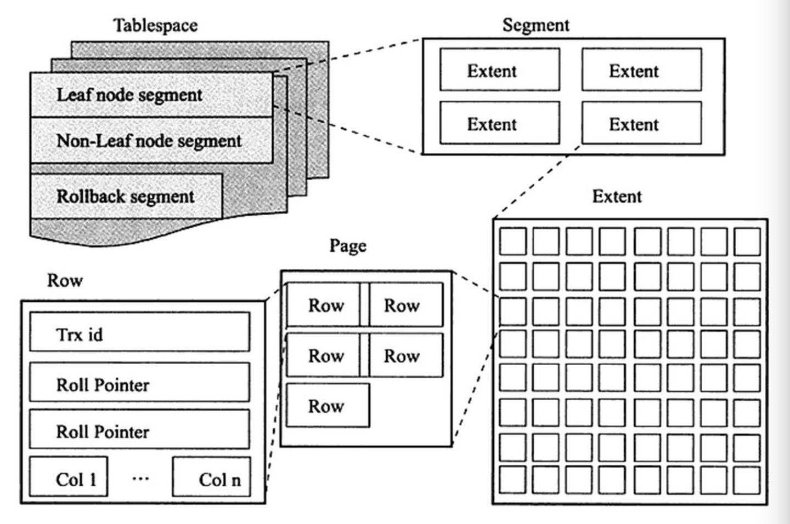
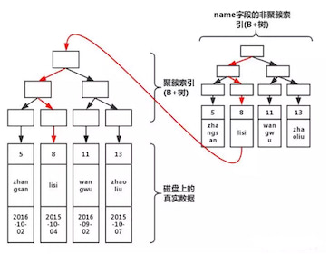
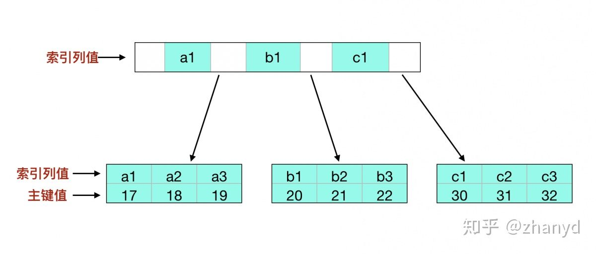

## 基本概念

### 存储

#### 行式存储与列存储

在列式数据库系统中（ClickHouse），数据按如下的顺序存储：


## MySQL-RDBMS

#### 数据库三范式是什么?

第一范式（1NF）：字段具有原子性,不可再分。(所有关系型数据库系统都满足第一范式数据库表中的字段都是单一属性的，不可再分)

第二范式（2NF）是在第一范式（1NF）的基础上建立起来的，即满足第二范式（2NF）必须先满足第一范式（1NF）。要求数据库表中的每个实例或行必须可以被惟一地区分。通常需要为表加上一个列，以存储各个实例的惟一标识。这个惟一属性列被称为主关键字或主键。

满足第三范式（3NF）必须先满足第二范式（2NF）。简而言之，第三范式（3NF）要求一个数据库表中不包含已在其它表中已包含的非主关键字信息。 

所以第三范式具有如下特征：

1. 每一列只有一个值 
2. 每一行都能区分
3. 每一个表都不包含其他表已经包含的非主关键字信息。

#### 有哪些数据库优化方面的经验

1. 用 PreparedStatement， 一般来说比 Statement 性能高：一个 sql发给服务器去执行，涉及步骤：语法检查、语义分析， 编译，缓存。
2. 有外键约束会影响插入和删除性能，如果程序能够保证数据的完整性， 那在设计数据库时就去掉外键。
3. 表中允许适当冗余，譬如，主题帖的回复数量和最后回复时间等
4. UNION ALL 要比 UNION 快很多，所以，如果可以确认合并的两个结果集中不包含重复数据且不需要排序时的话，那么就使用 UNIONALL。 
5. UNION 和 UNION ALL 关键字都是将两个结果集合并为一个，但这两者从使用和效率上来说都有所不同。 
   1. 对重复结果的处理：UNION 在进行表链接后会筛选掉重复的记录，Union All 不会去除重复记录。 
   2. 对排序的处理：Union 将会按照字段的顺序进行排序；UNION ALL 只是简单的将两个结果合并后就返回。

#### MySQL的基础操作命令

1. MySQL 是否处于运行状态:Debian 上运行命令 service mysql status，在 RedHat 上运行命令 service mysqld status

2. 开启或停止 MySQL 服务 :运行命令 service mysqld start 开启服务；运行命令 service mysqld stop 停止服务

3. Shell 登入 MySQL: 运行命令 mysql -u root -p

4. 列出所有数据库:运行命令 show databases;

5. 切换到某个数据库并在上面工作:运行命令 use database**name****;** 进入名为 **database**name 的数据库

6. 列出某个数据库内所有表: show tables;

7. 获取表内所有 Field 对象的名称和类型 :describe table_name;

#### MySQL复制原理以及流程

Mysql 内建的复制功能是构建大型，高性能应用程序的基础。将 Mysql 的数据分布到多个系统上去，这种分布的机制，是通过将 Mysql 的某一台主机的数据复制到其它主机（slaves）上，并重新执行一遍来实现的。 * 复制过程中一个服务器充当主服务器，而一个或多个其它服务器充当从服务器。主服务器将更新写入二进制日志文件，并维护文件的一个索引以跟踪日志循环。这些日志可以记录发送到从服务器的更新。 当一个从服务器连接主服务器时，它通知主服务器在日志中读取的最后一次成功更新的位置。从服务器接收从那时起发生的任何更新，然后封锁并等待主服务器通知新的更新。 过程如下 1. 主服务器把更新记录到二进制日志文件中。 2. 从服务器把主服务器的二进制日志拷贝到自己的中继日志（replay log）中。 3. 从服务器重做中继日志中的时间， 把更新应用到自己的数据库上。

#### mysql支持的复制类型

1. 基于语句的复制： 在主服务器上执行的 SQL 语句，在从服务器上执行同样的语句。MySQL 默认采用基于语句的复制，效率比较高。 一旦发现没法精确复制时，会自动选着基于行的复制。

2. 基于行的复制：把改变的内容复制过去，而不是把命令在从服务器上执行一遍. 从 mysql5.0 开始支持

3. 混合类型的复制: 默认采用基于语句的复制，一旦发现基于语句的无法精确的复制时，就会采用基于行的复制。

#### mysql中myisam与innodb的区别？

1. 事务支持 **MyISAM**：强调的是性能，每次查询具有原子性**,**其执行数度比 **InnoDB** 类型更快，但是不提供事务支持。 **>** InnoDB：提供事务支持事务，外部键等高级数据库功能。 具有事务(commit)、回滚(rollback)和崩溃修复能力(crash recovery capabilities)的事务安全(transaction-safe (ACID compliant))型表。

2. InnoDB 支持行级锁，而 MyISAM 支持表级锁. 
   用户在操作myisam 表时，select，update，delete，insert 语句都会给表自动加锁，如果加锁以后的表满足 insert 并发的情况下，可以在表的尾部插入新的数据。

3. InnoDB 支持 MVCC, 而 MyISAM 不支持

4. InnoDB 支持外键，而 MyISAM 不支持

5. 表主键 **MyISAM**：允许没有任何索引和主键的表存在，索引都是保存行的地址。 **>** InnoDB：如果没有设定主键或者非空唯一索引，就会自动生成一个 6 字节的主键(用户不可见)，数据是主索引的一部分，附加索引保存的是主索引的值。

6. InnoDB 不支持全文索引，而 MyISAM 支持。

7. 可移植性、备份及恢复 **MyISAM**：数据是以文件的形式存储，所以在跨平台的数据转移中会很方便。在备份和恢复时可单独针对某个表进行操作。 **>** InnoDB：免费的方案可以是拷贝数据文件、备份binlog，或者用 mysqldump，在数据量达到几十 G 的时候就相对痛苦了

8. 存储结构 **MyISAM**：每个 **MyISAM** 在磁盘上存储成三个文件。第一个文件的名字以表的名字开始，扩展名指出文件类型。**.frm** 文件存储表定义。数据文件的扩展名为**.MYD** **(MYData)**。索引文件的扩展名是**.MYI (MYIndex)**。 **>** InnoDB：所有的表都保存在同一个数据文件中（也可能是多个文件，或者是独立的表空间文件），InnoDB 表的大小只受限于操作系统文件的大小，一般为 2GB。

#### varchar与char的区别以及varchar(50)中的50代表的涵义？

1. varchar 与 char 的区别: char 是一种固定长度的类型，varchar 则是一种可变长度的类型.

2. varchar(50)中 50 的涵义 : 最多存放 50 个字节

3. int（20）中 20 的涵义: int(M)中的 M indicates the maximum display width (最大显示宽度)for integer types. The maximum legal display width is 255.

#### MySQL中InnoDB支持的四种事务隔离级别及区别？

1. Read Uncommitted（读取未提交内容）
   在该隔离级别，所有事务都可以看到其他未提交事务的执行结果。本隔离级别很少用于实际应用，因为它的性能也不比其他级别好多少。读取未提交的数据，也被称之为脏读（Dirty Read）。

2. Read Committed（读取提交内容） 
   这是大多数数据库系统的默认隔离级别（但不是 MySQL 默认的）。它满足了隔离的简单定义：一个事务只能看见已经提交事务所做的改变。这种隔离级别也支持所谓的不可重复读（Nonrepeatable Read），因为同一事务的其他实例在该实例处理其间可能会有新的 commit，所以同一 select 可能返回不同结果。

3. Repeatable Read（可重读） 
   这是 MySQL 的默认事务隔离级别，它确保同一事务的多个实例在并发读取数据时，会看到同样的数据行。不过理论上，这会导致另一个棘手的问题：幻读（PhantomRead）。简单的说，幻读指当用户读取某一范围的数据行时，另一个事务又在该范围内插入了新行，当用户再读取该范围的数据行时，会发现有新的“幻影” 行。InnoDB 和 Falcon 存储引擎通过多版本并发控制（MVCC，Multiversion Concurrency Control 间隙锁）机制解决了该问题。注：其实多版本只是解决不可重复读问题，而**加上间隙锁（也就是它这里所谓的并发控制）才解决了幻读问题**。

4. Serializable（可串行化） 
   这是最高的隔离级别，它通过强制事务排序，使之不可能相互冲突，从而解决幻读问题。简言之，它是在每个读的数据行上加上共享锁。在这个级别，可能导致大量的超时现象和锁竞争。 
   
   <table><thead></thead><tr><th align="left">隔离级别</th><th align="left">脏读（Dirty Read）</th><th align="left">不可重复读（NonRepeatable Read）</th><th align="left">幻读（Phantom Read）</th></tr></thead><tbody>
     <tr><td align="left">未 提 交 读 （Read uncommitted）</td><td align="left">可 能 </td><td align="left">可 能 </td><td align="left">可能</td></tr>
     <tr><td align="left">已提交读（Read committed）</td><td align="left">不可能</td><td align="left">可能</td><td align="left">可能</td></tr>
     <tr><td align="left">可重复读（Repeatable read）</td><td align="left">不可能</td><td align="left">不可能</td><td align="left">可能</td</tr>
       <tr><td align="left">可串行化（SERIALIZABLE）</td><td align="left">不可能</td><td align="left">不可能</td><td align="left">不可能</td></tr></tbody></table>

#### 表中有大字段X（例如：text类型），且字段X不会经常更新，以读为为主，将该字段拆成子表好处是什么？

如果字段里面有大字段（text,blob)类型的，而且这些字段的访问并不多，这时候放在一起就变成缺点了。 

MYSQL 数据库的记录存储是按行存储的，数据块大小又是固定的（16K），每条记录越小，相同的块存储的记录就越多。

此时应该把大字段拆走，这样应付大部分小字段的查询时，就能提高效率。当需要查询大字段时，此时的关联查询是不可避免的，但也是值得的。

拆分开后， 对字段的 UPDAE 就要 UPDATE 多个表了

#### MySQL中InnoDB引擎的行锁是通过加在什么上完成的？

InnoDB 行锁是通过给索引上的索引项加锁来实现的，这一点 MySQL 与Oracle 不同，后者是通过在数据块中对相应数据行加锁来实现的。

InnoDB 这种行锁实现特点意味着：只有通过索引条件检索数据，InnoDB  才使用行级锁，否则，InnoDB 将使用表锁！

#### MySQL中控制内存分配的全局参数，有哪些？

1. Key**buffer**size： 
   key**buffer**size 指定索引缓冲区的大小， 它决定索引处理的速度，尤其是索引读的速度。通过检查状态值Key**read**requests 和 Key**reads**，可以知道 **key**buffer**size** 设置是否合理。比例 **key**reads /key**read**requests 应该尽可能的低，至少是1:100，1:1000 更好（上述状态值可以使用 SHOW STATUS LIKE ‘key**read%'**获得）。 **>** *** key**buffer**size** 只对 **MyISAM** 表起作用。即使你不使用 **MyISAM** 表，但是内部的临时磁盘表是 **MyISAM** 表，也要使用该值。可以使用检查状态值 **created**tmp**disk**tables 得知详情。对于 1G 内存的机器，如果不使用 MyISAM 表，推荐值是 16M（8#### 64M） * key**buffer**size 设置注意事项 >>>1. 单个 key**buffer** 的大小不能超过 **4G**，如果设置超过 **4G**，就有可能遇到下面 **3** 个**bug: http://bugs.mysql.com/bug.php?id=29446** ](http://bugs.mysql.com/bug.php?id=29446)**<br/http://bugs.mysql.com/bug.php?id=29419** ](http://bugs.mysql.com/bug.php?id=29419)**<br/http://bugs.mysql.com/bug.php?id=5731** ](http://bugs.mysql.com/bug.php?id=5731)**<br/>>****>2.** 建议 **key**buffer 设置为物理内存的 1/4(针对 MyISAM 引擎)，甚至是物理内存的 30%~40%，如果 key**buffer**size 设置太大， 系统就会频繁的换页，降低系统性能。因为 MySQL 使用操作系统的缓存来缓存数据，所以我们得为系统留够足够的内存；在很多情况下数据要比索引大得多。 >>>3. 如果机器性能优越，可以设置多个key**buffer,**分别让不同的 **key**buffer 来缓存专门的索引

2. innodb**buffer**pool_size 
   表示缓冲池字节大小，**InnoDB** 缓存表和索引数据的内存区域。**mysql** 默认的值是 **128M**。最大值与你的**CPU** 体系结构有关，在 **32** 位操作系统，最大值是 **4294967295 (2^32-1****)** ，在 **64** 位操作系统，最大值为**18446744073709551615** **(2^64-1)**。 **>** 在 32 位操作系统中， CPU 和操作系统实用的最大大小低于设置的最大值。如果设定的缓冲池的大小大于 1G，设置 innodb**buffer**pool**instances** 的值大于 **1.** **>** ***** 数据读写在内存中非常快**,** **innodb**buffer**pool**size 减少了对磁盘的读写。 当数据提交或满足检查点条件后才一次性将内存数据刷新到磁盘中。然而内存还有操作系统或数据库其他进程使用, 一般设置 buffer pool 大小为总内存的 3/4 至 4/5。 若设置不当, 内存使用可能浪费或者使用过多。 对于繁忙的服务器, buffer pool 将划分为多个实例以提高系统并发性, 减少线程间读写缓存的争用。buffer pool 的大小首先受 innodb**buffer**pool_instances 影响, 当然影响较小。

3. query**cache**size 
   当 **mysql** 接收到一条 **select** 类型的 **query** 时，**mysql** 会对这条 **query** 进行 **hash** 计算而得到一个 **hash** 值，然后通过该 **hash** 值到 **query** **cache** 中去匹配，如果没有匹配中，则将这个**hash** 值存放在一个 **hash** 链表中，同时将 **query** 的结果集存放进**cache** 中，存放 **hash** 值的链表的每一个 **hash** 节点存放了相应 **query** 结果集在 **cache** 中的地址，以及该 **query** 所涉及到的一些 **table** 的相关信息；如果通过 **hash** 值匹配到了一样的 **query**，则直接将 **cache** 中相应的 **query** 结果集返回给客户端。如果 **mysql** 任何一个表中的任何一条数据发生了变化，便会通知 **query** **cache** 需要与该 **table** 相关的**query** 的 **cache** 全部失效，并释放占用的内存地址。 
   query cache 优缺点
   
   query 语句的 hash 计算和 hash 查找带来的资源消耗。mysql 会对每条接收到的 select 类型的 query 进行 hash 计算然后查找该 query 的 cache 是否存在，虽然 hash 计算和查找的效率已经足够高了，一条 query 所带来的消耗可以忽略，但一旦涉及到高并发，有成千上万条 query 时，hash 计算和查找所带来的开销就的重视了； 
   
   #### query cache 的失效问题。如果表变更比较频繁，则会造成 query cache 的失效率非常高。表变更不仅仅指表中的数据发生变化，还包括结构或者索引的任何变化；
   
   #### 对于不同 sql 但同一结果集的 query 都会被缓存，这样便会造成内存资源的过渡消耗。sql 的字符大小写、空格或者注释的不同，缓存都是认为是不同的 sql（因为他们的 hash 值会不同）；
   
   #### 相关参数设置不合理会造成大量内存碎片，相关的参数设置会稍后介绍。

4. read**buffer**size >是 MySQL 读入缓冲区大小。对表进行顺序扫描的请求将分配一个读入缓冲区，MySQL 会为它分配一段内存缓冲区。read**buffer**size 变量控制这一缓冲区的大小。如果对表的顺序扫描请求非常频繁，并且你认为频繁扫描进行得太慢，可以通过增加该变量值以及内存缓冲区大小提高其性能。

#### 若一张表中只有一个字段VARCHAR(N)类型，utf8编码，则N最大值为多少精确到数量级即可)?

由于 utf8 的每个字符最多占用 3 个字节。而 MySQL 定义行的长度不能超过65535，因此 N 的最大值计算方法为：(65535-1-2)/3。减去 1 的原因是实际存储从第二个字节开始，减去 2 的原因是因为要在列表长度存储实际的字符长度，除以 3 是因为 utf8 限制：每个字符最多占用 3 个字节。

#### [SELECT]和[SELECT全部字段]的2种写法有何优缺点

1. 前者要解析数据字典，后者不需要
2. 结果输出顺序，前者与建表列顺序相同，后者按指定字段顺序。
3. 表字段改名，前者不需要修改，后者需要改
4. 后者可以建立索引进行优化，前者无法优化
5. 后者的可读性比前者要高

#### MySQL自增主键是单调且连续的吗？

AUTO_INCRESEMENT的实现：较早的 MySQL 版本中，它的实现还比较简陋，InnoDB 引擎会在内存中存储一个整数表示下一个被分配到的 ID，当客户端向表中插入数据时会获取 `AUTO_INCREMENT` 值并将其加一。这是一个典型的设计向性能低头的例子。

不连续：

1. 中间的记录被删除
2. 为了提高事务的吞吐量，MySQL 可以处理并发执行的多个事务，但是如果并发执行多个插入新记录的 SQL 语句，可能会导致主键的不连续（插入中间ID的事务被回滚，结束的ID提交）

不单调：

1. 在MySQL5.7之前，因为重启了 MySQL 的实例，所以内存中的 `AUTO_INCREMENT` 计数器会被重置成表中的最大值，当我们再向表中插入新的 `trades` 记录时会重新使用 `10` 作为主键，主键也就不是单调的了。In MySQL 8.0, this behavior is changed. The current maximum auto-increment counter value is written to the redo log each time it changes and is saved to an engine-private system table on each checkpoint. These changes make the current maximum auto-increment counter value persistent across server restarts.

#### HAVNG子句 和WHERE的异同点

1. 语法上：where 用表中列名，having 用 select 结果别名 

2. 影响结果范围：where 从表读出数据的行数，having 返回客户端的行数

3. 索引：where 可以使用索引，having 不能使用索引，只能在临时结果集操作

4. where 后面不能使用聚集函数，having 是专门使用聚集函数的。

#### MySQL当记录不存在时insert,当记录存在时update，语句怎么写？

INSERT INTO table (a,b,c) VALUES (1,2,3) ON DUPLICATE KEY UPDATE c=c+1;  

#### MySQL的insert和update的select语句语法

SQL insert into student (stuid,stuname,deptid) select 10,'xzm',3 from student where stuid 8;

update student a inner join student b on b.stuID=10 set a.stuname=concat(b.stuname, b.stuID) where a.stuID=10 ; 

#### 聚集索引与覆盖索引与索引下推到底是什么?

#### 请简述常用的索引有哪些种类

1. 普通索引: 即针对数据库表创建索引
2. 唯一索引: 与普通索引类似，不同的就是：MySQL 数据库索引列的值必须唯一，但允许有空值
3. 主键索引: 它是一种特殊的唯一索引，不允许有空值。一般是在建表的时候同时创建主键索引
4. 组合索引: 为了进一步榨取 MySQL 的效率，就要考虑建立组合索引。即将数据库表中的多个字段联合起来作为一个组合索引。
5. 聚簇索引（聚集索引）：并不是一种单独的索引类型，而是一种数据存储方式（节点存放了真实的数据）。具体细节取决于不同的实现，InnoDB的聚簇索引其实就是在同一个结构中保存了B-Tree索引(技术上来说是B+Tree)和数据行。
6. 非聚簇索引（辅助索引）：先获取指向主键索引的主键，然后通过主键索引来找到一个完整的行。

#### 为什么官方建议使用自增长主键作为索引？

结合B+Tree的特点，自增主键是连续的，在插入过程中尽量减少页分裂，即使要进行**页分裂**，也只会分裂很少一部分。并且能减少数据的移动，每次插入都是插入到最后。总之就是减少分裂和移动的频率。

#### InnoDB什么是页分裂？为什么会页分裂

B+Tree中的叶子结点之间是通过双向链表关联起来的。

在InnoDB索引的设定中，要求主键索引是递增的，这样在构建索引树的时候才更加方便。你可以脑补一下。如果按1、2、3...递增的顺序给你这些数。是不是很方便的构建一棵树。然后你可以自由自在的在这棵树上玩二分查找。

那假设你自定义了主键索引，而且你自定义的这个主键索引并不一定是自增的。那就有可能出现下面这种情况 如下图：


然后随着你将数据写入。就导致后一个数据页中的所有行并不一定比前一个数据页中的行的id大。这时就会触发页分裂的逻辑。页分裂的目的就是保证：**后一个数据页中的所有行主键值比前一个数据页中主键值大**。经过分裂调整，可以得到下面的这张图。


#### MySQL数据库中索引的工作机制是什么？

数据库索引，是数据库管理系统中一个排序的数据结构，以协助快速查询、更新数据库表中数据 。

#### 能说说Mysql并发支撑底层Buffer Pool机制吗?

#### MySQL的并发控制原理

#### 拼多多:能说下Mysql事务底层实现原理吗?

#### MVCC机制是如何保证事务的隔离性的?

#### 超高并发下使用事务时如何避免死锁?

#### 对线上千万级大表加字段时，性能极慢问题如何处理?

#### MySQL中锁的级别

- 表级锁
  
  > - 表级锁是MySQL中锁定粒度最大的一种锁，表示**对当前操作的整张表加锁**，它实现简单，资源消耗较少，被大部分MySQL引擎支持。最常使用的MYISAM与INNODB都支持表级锁定。**表级锁定分为表共享读锁（共享锁）与表独占写锁（排他锁）**。
  > - 特点
  >   - **开销小，加锁快**；
  >   - 不会出现死锁；
  >   - 锁定粒度大，**发生锁冲突的概率最高，并发度最低**。

- 行级锁

> - 行级锁是Mysql中锁定粒度最细的一种锁，表示**只针对当前操作的行进行加锁**。
> - 行级锁能大大减少数据库操作的冲突。其加锁粒度最小，但**加锁的开销也最大**。行级锁分为 共享锁 和 排他锁。
> - 特点
>   - 开销大，加锁慢；
>   - 会出现死锁；
>   - 锁定粒度最小，**发生锁冲突的概率最低，并发度也最高**。

- 页面锁
  
  > - 页级锁是MySQL中**锁定粒度介于行级锁和表级锁中间的一种锁**。
  > - 表级锁速度快，但冲突多，行级冲突少，但速度慢。所以取了折衷的页级，**一次锁定相邻的一组记录**。
  > - 特点
  >   - 开销和加锁时间界于表锁和行锁之间；
  >   - 会出现死锁；
  >   - 锁定粒度界于表锁和行锁之间，并发度一般
  > 
  > 封锁粒度小：
  > 
  > - 好处：锁定的数据量越少，发生锁争用的可能就越小，系统的并发程度就越高；
  > - 坏处：系统开销大（加锁、释放锁、检查锁的状态都需要消耗资源）

#### MySQL中锁的类型

- 排它锁（Exclusive Lock）/ X锁
  
  > - 排他锁又叫做写锁。 **当用户要进行数据的写入时，对数据加上排他锁**。排他锁只可以加一个，他**和其他的排他锁，共享锁都相斥**。
  > - 事务对数据加上X锁时，只允许此事务读取和修改此数据，并且**其它事务不能对该数据加任何锁**；
  > 
  > ```bash
  > SELECT * FROM table_name WHERE ... FOR UPDATE；   # 排它锁
  > ```

- 共享锁（Shared Lock）/ S锁
  
  > - 共享锁又叫做读锁。 **当用户要进行数据的读取时，对数据加上共享锁。共享锁可以同时加上多个。**
  > - 加了S锁后，该事务只能对数据进行读取而不能修改，并且其它事务只能加S锁，不能加X锁
  > - 场景：相当于对于同一把门，它拥有多个钥匙一样。
  > - 在执行语句后面加上lock in share mode就代表对某些资源加上共享锁了。
  > 
  > ```bash
  > SELECT * FROM table_name WHERE ... LOCK IN SHARE MODE;  # 共享锁
  > ```

- X锁和S锁的兼容性
  
  > |     | X   | S   |
  > | --- | --- | --- |
  > | X   | 不兼容 | 不兼容 |
  > | S   | 不兼容 | 兼容  |

- 意向锁（Intention Locks）
  
  > **意向锁都是表锁。**意向锁的存在是为了允许事务在行级上的锁和表级上的锁同时存在。
  > 
  > 1. 意向共享锁（IS Lock）事务想要在获得表中某些记录的共享锁，需要在表上先加意向共享锁。
  > 2. 意向排他锁（IX Lock）事务想要在获得表中某些记录的互斥锁，需要在表上先加意向互斥锁。
  > 3. 意向锁是有数据引擎维护，无法手动操作意向锁，在为数据行加共享 / 排他锁之前，InooDB 会先获取该数据行所在在数据表的意向锁。
  > 4. 意向锁是一种不与行级锁冲突表级锁
  > 
  > 由于InnoDB存储引擎支持的是行级别的锁，因此意向锁（因为意向锁是表锁）其实不会阻塞除全表扫以外的任何请求。故表级意向锁与行级锁的兼容性如下所示
  > 
  > | 是否兼容当前锁模式 | X   | IX  | S   | IS  |
  > | --------- | --- | --- | --- | --- |
  > | X         | 冲突  | 冲突  | 冲突  | 冲突  |
  > | IX        | 冲突  | 兼容  | 冲突  | 兼容  |
  > | S         | 冲突  | 冲突  | 兼容  | 兼容  |
  > | IS        | 冲突  | 兼容  | 兼容  | 兼容  |
  > 
  > IS/IX 锁之间都是兼容的；
  > 
  > 好处：如果一个事务想要对整个表加X锁，就需要先检测是否有其它事务对该表或者该表中的某一行加了锁，这种检测非常耗时。有了意向锁之后，只需要检测整个表是否存在IX/IS/X/S锁就行了

- 意向锁的作用
  
  > Innodb的**意向锁主要用于解决多粒度的锁并存的情况**。
  > 
  > 比如事务A要在一个表上加S锁，如果表中的一行已被事务B加了X锁，那么该锁的申请也应被阻塞。
  > 
  > 如果表中的数据很多，逐行检查锁标志的开销将很大，系统的性能将会受到影响。
  > 
  > 为了解决这个问题，可以在表级上引入新的锁类型来表示其所属行的加锁情况，这就引出了“意向锁”的概念。
  > 
  > 举个例子，如果表中记录1亿，事务A把其中有几条记录上了行锁了，这时事务B需要给这个表加表级锁，如果没有意向锁的话，那就要去表中查找这一亿条记录是否上锁了。如果存在意向锁，那么假如事务Ａ在更新一条记录之前，先加意向锁，再加Ｘ锁，事务B先检查该表上是否存在意向锁，存在的意向锁是否与自己准备加的锁冲突，如果有冲突，则等待直到事务Ａ释放，而无须逐条记录去检测。事务Ｂ更新表时，其实无须知道到底哪一行被锁了，它只要知道反正有一行被锁了就行了。
  > 
  > **主要作用是处理行锁和表锁之间的矛盾，能够显示“某个事务正在某一行上持有了锁，或者准备去持有锁”**

- 读写锁（SX lock）MySQL8
  
  > 

#### 锁与MVCC的关系

#### 隔离级别与锁的关系

在Read Uncommitted级别下，**读取数据不需要加共享锁**，这样就不会跟被修改的数据上的排他锁冲突

在Read Committed级别下，读操作需要加共享锁，但是在**语句执行完以后释放共享锁**；

在Repeatable Read级别下，读操作需要加共享锁，但是在**事务提交之前并不释放共享锁**，也就是必须等待事务执行完毕以后才释放共享锁。

SERIALIZABLE 是限制性最强的隔离级别，因为该级别**锁定整个范围的键**，并一直持有锁，直到事务完成。

#### MySQL 默认隔离级别是RR，为什么阿里等大厂会改成RC？

- 一致性读
  
  > 一致性读，又称为快照读。快照即当前行数据之前的历史版本。快照读就是使用快照信息显示基于某个时间点的查询结果，而不考虑与此同时运行的其他事务所执行的更改。
  > 
  > 在MySQL 中，只有READ COMMITTED 和 REPEATABLE READ这两种事务隔离级别才会使用一致性读。
  > 
  > **在 RC 中，每次读取都会重新生成一个快照，总是读取行的最新版本。**
  > 
  > **在 RR 中，快照会在事务中第一次SELECT语句执行时生成，只有在本事务中对数据进行更改才会更新快照。**
  > 
  > 在数据库的 **RC 这种隔离级别中，还支持"半一致读"** ，一条update语句，如果 where 条件匹配到的记录已经加锁，那么InnoDB会返回记录最近提交的版本，由MySQL上层判断此是否需要真的加锁。

- 查看隔离级别
  
  > select @@tx_isolation;

- 锁机制
  数据库的锁，在不同的事务隔离级别下，是采用了不同的机制的。在 MySQL 中，有三种类型的锁，分别是Record Lock、Gap Lock和 Next-Key Lock。
  
  > Record Lock表示记录锁，锁的是索引记录。
  > 
  > Gap Lock是间隙锁，锁的是索引记录之间的间隙。
  > 
  > Next-Key Lock是Record Lock和Gap Lock的组合，同时锁索引记录和间隙。他的范围是左开右闭的。
  
  在 RC 中，只会对索引增加Record Lock，不会添加Gap Lock和Next-Key Lock。
  
  在 RR 中，为了解决幻读的问题，在支持Record Lock的同时，还支持Gap Lock和Next-Key Lock；

- **高并发！**
  
  为什么 RC 比 RR 的并发度要好呢？
  
  首先，**RC 在加锁的过程中，是不需要添加Gap Lock和 Next-Key Lock 的，只对要修改的记录添加行级锁就行了。**
  
  这就使得并发度要比 RR 高很多。
  
  另外，**因为 RC 还支持"半一致读"，可以大大的减少了更新语句时行锁的冲突；对于不满足更新条件的记录，可以提前释放锁，提升并发度。**

- **减少死锁**
  因为RR这种事务隔离级别会增加Gap Lock和 Next-Key Lock，这就使得锁的粒度变大，那么就会使得死锁的概率增大。
  
  > 死锁：一个事务锁住了表A，然后又访问表B；另一个事务锁住了表B，然后企图访问表A；这时就会互相等待对方释放锁，就导致了死锁。

#### 主备复制的工作原理


- MySQL master 将数据变更写入二进制日志( binary log, 其中记录叫做二进制日志事件binary log events，可以通过 show binlog events 进行查看)
- MySQL slave 将 master 的 binary log events 拷贝到它的中继日志(relay log)
- MySQL slave 重放 relay log 中事件，将数据变更反映它自己的数据

#### SQL 中 count(1)，count(*)，count(某列) 的区别;

#### 开窗函数用过吗？有什么作用

#### innodb 是什么索引？

InnoDB索引采用了B-Tree的数据结构，数据存储在叶子节点上，每个叶子节点默认的大小是16KB。当新记录插入到InnoDB聚簇索引中时，如果按顺序插入索引记录（升序或降序），当达到叶子节点最大的容量时，下一条记录就会写到新的的页中。

叶子节点可使用的容量为总容量的15/16，InnoDB会留1/16的空间，以备将来插入和更新索引记录时使用， 如果以随机顺序插入记录，则页面的容量为1/2到15/16之间。你可以设置 innodb_page_size 来调整页的大小，支持 64KB, 32KB, 16KB (默认), 8KB, 和4KB。

#### 简述下InnoDB逻辑存储结构

MySQL表中的所有数据被存储在一个空间内，称之为表空间，表空间内部又可以分为段(segment)、区(extent)、页(page)、行(row),逻辑结构如下图：



- 段(segment)

表空间是由不同的段组成的，常见的段有：数据段，索引段，回滚段等等，在 MySQL中，数据是按照B+树来存储，因此数据即索引，因此数据段即为B+树的叶子节点，索引段为B+树的非叶子节点,回滚段用于存储undo日志，用于事务失败后数据回滚以及在事务未提交之前通过undo日志获取之前版本的数据，在InnoDB1.1版本之前一个InnoDB,只支持一个回滚段，支持1023个并发修改事务同时进行，在InnoDB1.2版本，将回滚段数量提高到了128个，也就是说可以同时进行128*1023个并发修改事务。

- 区(extent)

区是由连续页组成的空间，每个区的固定大小为1MB,为保证区中页的连续性，InnoDB会一次从磁盘中申请4~5个区，在默认不压缩的情况下，一个区可以容纳64个连续的页。但是在开始新建表的时候，空表的默认大小为96KB,是由于为了高效的利用磁盘空间，在开始插入数据时表会先利用32个页大小的碎片页来存储数据，当这些碎片使用完后，表大小才会按照MB倍数来增加。

- 页(page)

页是InnoDB存储引擎的最小管理单位，每页大小默认是16KB，从InnoDB 1.2.x版本开始，可以利用innodb_page_size来改变页size，但是改变只能在初始化InnoDB实例前进行修改，之后便无法进行修改，除非mysqldump导出创建新库，常见的页类型有：数据页、undo页、系统页、事务数据页、插入缓冲位图页、插入缓冲空闲列表页、未压缩的二进制大对象页、压缩的二进制大对象页。

- 行(row)

行对应的是表中的行记录，每页存储最多的行记录也是有硬性规定的最多16KB/2-200,即7992行（16KB是页大小，我也不明白为什么要这么算,据说是内核定义）

#### 索引最左匹配原则知道吗，为什么？

#### MySQL中的聚簇索引（Clustered Index）

聚集索引是指数据库表行中数据的物理顺序与键值的逻辑（索引）顺序相同。一个表只能有一个聚集索引，因为一个表的物理顺序只有一种情况，所以，对应的聚集索引只能有一个。如果某索引是非聚集索引，则表中的行物理顺序与索引顺序不匹配，与非聚集索引相比，聚集索引有着更快的检索速度。

Accessing a row through the clustered index is fast because the index search leads directly to the page that contains the row data. If a table is large, the **clustered index architecture often saves a disk I/O operation **when compared to storage organizations that store row data using a different page from the index record.



在 InnoDB 中，每个表都会有一个**聚簇索引**，在定义了主键（ primary key ）的情况下，主键所在的列会被作为聚簇索引存储。所谓聚簇索引，意思是数据实际上是存储在索引的叶子节点上，「聚簇」的含义就是数据行和相邻的数据紧凑地存储在一起。因为不能（或者不值得）同时把数据行存储在两个不同的位置，所以一个表只能有一个聚簇索引。

关于 InnoDB 选择哪个列作为聚簇索引存储，大概的优先级为：

1. 如果定义了主键（ primary key ），则使用主键；
2. 如果没有定义主键，则选择第一个不包含 NULL（ NOT NULL ）的 UNIQUE KEY；
3. 如果也没有，则会隐式定义一个主键作为聚簇索引。

#### MySQL默认索引用B+树而不用B树或Hash的原因

- 哈希虽然能够提供 `O(1)` 的单数据行操作性能，但是对于范围查询和排序却无法很好地支持，最终导致全表扫描；
- B 树能够在非叶节点中存储数据，但是这也导致在查询连续数据时可能会带来更多的随机 I/O，而 B+ 树的所有叶节点可以通过指针相互连接，能够减少顺序遍历时产生的额外随机 I/O；
- 如果我们使用 B+ 树作为底层的数据结构，那么所有只会访问或者修改一条数据的 SQL 的时间复杂度都是 `O(log n)`，**N为树的高度**，但是使用哈希却有可能达到 `O(1)` 的时间复杂度，却只适合部分场景。

#### 介绍下MySQL的Hash索引

`InnoDB`存储引擎使用哈希算法来查找字典，冲突机制采用链表，哈希函数采用除法散列。对于缓冲池的哈希表，在缓存池中的每页都有一个`chain`指针，指向相同哈希值的页。对于除法散列，`m`的值为略大于`2`倍缓冲池页数量的质数。如当前`innodb_buffer_pool_size`大小为`10M`，则共有`640个16KB`的页，需要分配`1280`个插槽，而略大于的质数为`1399`，因此会分配`1399`个槽的哈希表，用来哈希查询缓冲池中的页。

而对于将每个页转换为自然数，每个表空间都有一个`space_id`，用户要查询的是空间中某个连续的`16KB`的页，即偏移量`（offset）`，`InnoDB`将`space_id`左移`20`位，再加上`space_id`和`offset`，即`K=space_id<<20+space_id+offset`，然后使用除法散列到各个槽中。

它只对**字典类型的查找非常快速**，而对范围查找等却无能为力。

#### Mysql索引底层B+Tree结构与算法吗?和B-Tree的区别

B+树，由二叉树和双向链表引申出来的一种数据结构。 通常数据库的索引是通过B+Tree来实现的。聚集索引和非聚集索引都是B+Tree的结构。


B-树：多路搜索树，每个结点存储M/2到M个关键字，非叶子结点存储指向关键字范围的子结点；所有关键字在整颗树中出现，且只出现一次，非叶子结点可以命中；

B+树：在B-树基础上，为叶子结点增加链表指针，所有关键字都在叶子结点中出现，**非叶子结点作为叶子结点的索引**；B+树**总是到叶子结点才命中**；


可视化演示：https://www.cs.usfca.edu/~galles/visualization/BPlusTree.html

#### 为什么不建议使用UUID作为主键

非主键索引的叶子节点内容是主键的值。在 InnoDB 里，非主键索引也被称为二级索引（secondary index）。

二级索引的叶子节点中存的是主键的值，不是原始的数据，所以二级索引找到主键的值之后，需要用该主键再去主键索引上查找一次，才能获取到最终的数据，这个过程叫做回表，这也是“二级”的含义。二级索引结构如下图所示：



因此：

1. 由于**二级索引中保存了主键值**，所以索引主键值越小越好，以免二级索引占用的空间过大，一般建议使用int的自增列作为主键
2. 避免使用UUID作为聚簇索引，它使得聚簇索引的插入变得完全随机，使得数据没有任何聚集特性

#### ANALYZE/Check/OPTIMIZE TABLE命令

#### Online DDL会不会锁表

Online DDL 会不会锁表？要回答这个问题，首先要明确“锁表”的含义。很多 MySQL 用户经常在表无法正常的进行 DML 时就觉得是锁表了，这种说法其实过于宽泛，实际上能够影响 DML 操作的锁至少包括以下几种（默认为 InnoDB 表）：

- MDL 锁
- 表锁
- 行锁
- GAP 锁

其中除了 MDL 锁是在 Server 层加的之外，其它三种都是在 InnoDB 层加的。具体的加锁逻辑不在此进行展开，但是需要明确一点：所有的操作（不管是 DDL 还是 DML 还是查询语句）都需要先拿 Server 层的 MDL 锁，然后再去拿 InnoDB 层的某个需要的锁。一个 DDL 的基本过程是这样的：

1. 首选，在开始进行 DDL 时，需要拿到对应表的 MDL X 锁，然后进行一系列的准备工作；
2. 然后将 MDL X 锁降级为 MDL S 锁，进行真正的 DDL 操作；
3. 最后再次将 MDL S 锁升级为 MDL X 锁，完成 DDL 操作，释放 MDL 锁；

所以在真正执行 DDL 操作期间，确实是不会“锁表”的，但是如果在第一阶段拿 MDL X 锁时无法正常获取，那就可能真的会“锁表了”。

#### INPLACE DDL 需不需要额外的数据空间

MySQL 内部对于 DDL 的 ALGORITHM 有两种选择：INPLACE 和 COPY（8.0 新增了 INSTANT，但是使用范围较小）。COPY 算法理解起来相对简单一点：创建一张临时表，然后将原表的数据拷贝到临时表中，最后再用临时表替换原表。对于上面的步骤，由于需要将原表的数据拷贝到临时表中，所以肯定需要消耗额外的数据空间。

那么对于支持 INPLACE 算法的 DDL，是不是不需要额外的数据空间？答案是：需要。其实之所以会问这个问题，还是因为对 INPLACE 本身的理解出现了偏差。简单来说：INPLACE 描述的是表，而不是数据文件。只要不创建临时表，那么都是 INPLACE 的。

实际上，很多 INPLACE DDL 都会重建表（会创建临时数据文件），所以都会需要额外的数据空间，例如：

- 增加主键
- 重建主键
- 新增列（8.0 支持 INSTANT DDL，不需要）
- 删除列
- 调整列顺序
- 删除列默认值
- 增加列默认值
- 修改表的 ROW_FORMAT
- OPTIMIZE 表

#### MySQL中XA协议的实现

#### MySQL中的日志

- 二进制日志 binlog
  
  > 作用：用于复制，在主从复制中，**从库利用主库上的binlog进行重播**，实现主从同步；用于数据库的**基于时间点的还原**。
  > 
  > Mysql Binlog是二进制格式的日志文件，但是不能把binlog文件等同于OS系统某目录下的具体文件，这是狭隘的。 Binlog是用来记录Mysql内部对数据库的改动（只记录对数据的修改操作），主要用于数据库的主从复制以及增量恢复。
  > 
  > `show binlog events;`
  > 
  > `show variables like '%log_bin%'`查看配置是否起作用
  > 
  > `show variables like '%expire_logs_days%';`查看binlog保留天数
  > 
  > ```ini
  > # my.cnf 中的配置
  > log_bin=ON
  > log_bin_basename=/var/lib/mysql/mysql-bin
  > log_bin_index=/var/lib/mysql/mysql-bin.index
  > # 默认是0，binlog永久保存
  > expire_logs_days = 7
  > # 单个binlog文件大小（如果使用了大事务，会日志会超过这个大小，默认为1G）
  > max_binlog_size = 100M
  > ```

- 重做日志 redo log
  
  > 作用：**确保事务的持久性**。防止在发生故障的时间点，尚有脏页未写入磁盘，在重启mysql服务的时候，根据redo log进行重做，从而达到事务的持久性这一特性。
  > 
  > 通过以下三种方式将innodb日志缓冲区的日志刷新到磁盘
  > 
  > 1. Master Thread 每秒一次执行刷新Innodb_log_buffer到重做日志文件（包括未提交的事务）
  > 2. 每个事务提交时会将重做日志刷新到重做日志文件。
  > 3. 当重做日志缓存可用空间 少于一半时，重做日志缓存被刷新到重做日志文件
  > 
  > 什么时候释放：当对应事务的脏页写入到磁盘之后，redo log的使命也就完成了，重做日志占用的空间就可以重用（被覆盖）
  > 
  > 日志文件：默认情况下，对应的物理文件位于数据库的data目录下的ib_logfile1&ib_logfile2
  > 
  > 相关配置：
  > 
  > 1. innodb_log_group_home_dir 指定日志文件组所在的路径，默认./ ，表示在数据库的数据目录下
  > 2. innodb_log_files_in_group 指定重做日志文件组中文件的数量，默认2
  > 3. innodb_log_file_size 重做日志文件的大小。
  > 4. innodb_mirrored_log_groups 指定了日志镜像文件组的数量，默认1

- 回滚日志 undo log
  
  > 作用：**保存了事务发生之前的数据的一个版本，可以用于回滚**，同时可以提供多版本并发控制下的读（MVCC），也即非锁定读
  > 
  > 内容：逻辑格式的日志，在执行undo的时候，仅仅是将数据从逻辑上恢复至事务之前的状态，而不是从物理页面上操作实现的，这一点是不同于redo log的。
  > 
  > 什么时候产生：事务开始之前，将当前是的版本生成undo log，undo 也会产生 redo 来保证undo log的可靠性
  > 
  > 什么时候释放：当事务提交之后，undo log并不能立马被删除，而是放入待清理的链表，由purge线程判断是否由其他事务在使用undo段中表的上一个事务之前的版本信息，决定是否可以清理undo log的日志空间。
  > 
  > 对应的物理文件：MySQL5.6之前，undo表空间位于共享表空间的回滚段中，共享表空间的默认的名称是ibdata，位于数据文件目录中。MySQL5.6之后，undo表空间可以配置成独立的文件，但是提前需要在配置文件中配置，完成数据库初始化后生效且不可改变undo log文件的个数，如果初始化数据库之前没有进行相关配置，那么就无法配置成独立的表空间了。
  > 　　关于MySQL5.7之后的独立undo 表空间配置参数如下
  > 　　innodb_undo_directory = /data/undospace/ --undo独立表空间的存放目录
  > 　　innodb_undo_logs = 128 --回滚段为128KB
  > 　　innodb_undo_tablespaces = 4 --指定有4个undo log文件
  > 
  > 如果undo使用的共享表空间，这个共享表空间中又不仅仅是存储了undo的信息，共享表空间的默认为与MySQL的数据目录下面，其属性由参数innodb_data_file_path配置。
  > 　　
  > 
  > 其他：undo是在事务开始之前保存的被修改数据的一个版本，产生undo日志的时候，同样会伴随类似于保护事务持久化机制的redolog的产生。
  > 默认情况下undo文件是保持在共享表空间的，也即ibdatafile文件中，当数据库中发生一些大的事务性操作的时候，要生成大量的undo信息，全部保存在共享表空间中的。
  > 因此共享表空间可能会变的很大，默认情况下，也就是undo 日志使用共享表空间的时候，被“撑大”的共享表空间是不会也不能自动收缩的。因此，mysql5.7之后的“独立undo 表空间”的配置就显得很有必要了。

- 一般查询日志 general log

- 中继日志 relay log
  
  > 

- 错误日志 error log

#### Binlog和redolog之间的区别

二进制日志的作用之一是还原数据库的，这与redo log很类似，很多人混淆过，但是两者有本质的不同

1. 作用不同：redo log是保证事务的持久性的，是事务层面的，binlog作为还原的功能，是数据库层面的(当然也可以精确到事务层面的)，虽然都有还原的意思，但是其保护数据的层次是不一样的。
2. 内容不同：redo log是物理日志，是数据页面的修改之后的物理记录，binlog是逻辑日志，可以简单认为记录的就是sql语句
3. 另外，两者日志产生的时间，可以释放的时间，在可释放的情况下清理机制，都是完全不同的。
4. 恢复数据时候的效率，基于物理日志的redo log恢复数据的效率要高于语句逻辑日志的binlog

关于事务提交时，redo log和binlog的写入顺序，为了保证主从复制时候的主从一致(当然也包括使用binlog进行基于时间点还原的情况)，是要严格一致的。

MySQL通过**两阶段提交过程来完成事务的一致性**的，也即redo log和binlog的一致性的，理论上是先写redo log，再写binlog，两个日志都提交成功(刷入磁盘)，事务才算真正的完成。

#### InnoDB表空间（MySQL8.0）

首先来看tablespace的定义：A data file that can hold data for one or more InnoDB tables and associated indexes。假设设置了file-per-table(默认打开),那么每一个表都会有自己的tablespace文件(.ibd).

- Shared tablespace
  
  > 首先来看system tablespace的创建，在InnoDB中每一个tablespace都会有一个uint32类型的id,每一个唯一的id用来表示对应的tablespace,而system tablespace的space id就是0.
  > 
  > ```cpp
  > static const space_id_t TRX_SYS_SPACE = 0;
  > ```
  > 
  > 而由于只有system tablespace和temporary tablespace是共享的，因此他们在InnoDB中有专门的数据结构来表示他们(Tablespace表示所有的shared tablespace的基类).

- 非共享tablespace
  
  > 然后我们来看非共享的tablespace的创建,一般来说每创建一个表都会创建一个新的ibd文件，也就是tablespace. 而这种tablespace以及Redolog/undolog都是属于fil_space_t这个结构体.通过上面的代码我们知道system tablespace最终也是创建一个fil_space_t然后再接入整个系统的tablespace的管理的.
  > 
  > 这里先来看两个特殊的tablespace,也就是REDO log和UNDO log，由于这两个log也都是磁盘上的文件，因此在InnoDB中会讲这两个log文件作为一种特殊的tablespace，来看他们的初始化.
  > 
  > ```cpp
  > static dberr_t create_log_files(char *logfilename, size_t dirnamelen, lsn_t lsn,
  >                              char *&logfile0, lsn_t &checkpoint_lsn) {
  >         ........................
  >  /* Disable the doublewrite buffer for log files. */
  >  fil_space_t *log_space = fil_space_create(
  >      "innodb_redo_log", dict_sys_t::s_log_space_first_id,
  >      fsp_flags_set_page_size(0, univ_page_size), FIL_TYPE_LOG);
  >         .......................
  > }
  > ```
  > 
  > 下面的undo log.
  > 
  > ```cpp
  > static dberr_t srv_undo_tablespace_open(space_id_t space_id) {
  > ....................................
  >  space = fil_space_create(undo_name, space_id, flags, FIL_TYPE_TABLESPACE);
  > ..............
  > }
  > ```

#### 引擎特性 · 基于GTID复制实现的工作原理

GTID (Global Transaction IDentifier) 是全局事务标识。它具有全局唯一性，一个事务对应一个GTID。唯一性不仅限于主服务器，GTID在所有的从服务器上也是唯一的。一个GTID在一个服务器上只执行一次，从而避免重复执行导致数据混乱或主从不一致。

在传统的复制里面，当发生故障需要主从切换时，服务器需要找到binlog和pos点，然后将其设定为新的主节点开启复制。相对来说比较麻烦，也容易出错。在MySQL 5.6里面，MySQL会通过内部机制自动匹配GTID断点，不再寻找binlog和pos点。我们只需要知道主节点的ip，端口，以及账号密码就可以自动复制。

- GTID工作原理
  
  > GTID在所有主从服务器上都是不重复的。所以所有在从服务器上执行的事务都可以在bnlog找到。一旦一个事务提交了，与拥有相同GTID的后续事务都会被忽略。这样可以保证从服务器不会重复执行同一件事务。
  > 
  > 当使用GTID时，从服务器不需要保留任何非本地数据。使用数据都可以从replicate data stream。从DBA和开发者的角度看，从服务器无保留file-offset pairs以决定如何处理主从服务器间的数据流。

- GTID的生成和使用由以下几步组成：
  
  > 1. 主服务器更新数据时，会在事务前产生GTID，一同记录到binlog日志中。
  > 2. binlog传送到从服务器后，被写入到本地的relay log中。从服务器读取GTID，并将其设定为自己的GTID（GTID_NEXT系统）。
  > 3. sql线程从relay log中获取GTID，然后对比从服务器端的binlog是否有记录。
  > 4. 如果有记录，说明该GTID的事务已经执行，从服务器会忽略。
  > 5. 如果没有记录，从服务器就会从relay log中执行该GTID的事务，并记录到binlog。
  > 
  > http://mysql.taobao.org/monthly/2020/05/09/

#### 数据库操作语句类型（DQL、DML、DDL、DCL、TCL）

SQL语言共分为四大类：数据定义语言DDL，数据操纵语言DML，数据查询语言DQL，数据控制语言DCL。

1. 数据查询语言DQL（Data Query Language）
   
   > 数据查询语言DQL基本结构是由SELECT子句，FROM子句，WHERE子句组成的查询块：
   > SELECT <字段名表>
   > FROM <表或视图名>
   > WHERE <查询条件>

2. 数据操纵语言DML（Data Manipulation Language）
   
   > DELETE/UPDATE/INSERT

> 数据操纵语言DML主要有三种形式：
> 
> 1) 插入：INSERT
> 2) 更新：UPDATE
> 3) 删除：DELETE

3. 数据定义语言DDL（Data Definition Language）
   
   > 数据定义语言DDL用来创建数据库中的各种对象-----表、视图、
   > 索引、同义词、聚簇等如：
   > CREATE TABLE/VIEW/INDEX/SYN/CLUSTER

4. 数据控制语言DCL（Data Control Language）
   
   >  数据控制语言DCL用来授予或回收访问数据库的某种特权，并控制数据库操纵事务发生的时间及效果，对数据库实行监视等。如：
   > 
   > 1) GRANT：授权。
   > 
   > 2) REVOKE：取消授权

5. 事务控制语言TCL（Transaction Control Language）
   
   > SAVEPOINT 设置保存点
   > ROLLBACK 回滚
   > SET TRANSACTION

#### 大事务会导致什么问题，如何解决？

什么是大事务：执行时间较长，操作数据比较多

- 发现大事务
  
  > ```sql
  > # 查询所有正在运行的事务及运行时间
  > select t.*,to_seconds(now())-to_seconds(t.trx_started) idle_time from INFORMATION_SCHEMA.INNODB_TRX t
  > # 查询事务锁
  > select * from sys.innodb_lock_waits
  > # 查询所有正在运行的事务（事务的线程ID为trx_mysql_thread_id)
  > SELECT * FROM information_schema.INNODB_TRX
  > ```

- 大事务导致的风险
  
  > 1. 锁定太多的数据，造成大量的阻塞和锁超时，回滚所需要的时间比较长。
  > 2. 执行时间长，容易造成主从延迟。
  > 3. undo log膨胀

- 如何避免大事务
  
  > 1. 在一个事务里面， 避免一次处理太多数据
  > 2. 在一个事务里面，尽量避免不必要的查询
  > 3. 在一个事务里面， 避免耗时太多的操作，造成事务超时。一些非DB的操作，比如rpc调用，消息队列的操作尽量放到事务之外操作
  > 4. MySQL优化：使用行锁且只锁必要的行；限制语句执行最大时长；undo log放在专门的表空间

#### MySQL36条军规

每一条军规背后都是血淋淋的教训

> - 核心军规
>   1. 尽可能简单的使用MySQL，md5() / Order By RAND() 等CPU运算密集型操作放在程序端
>   2. 1年数据量预估，纯INT不超过1000w，含char不超过500w
>   3. 合理分表不超载（使用userID，date，area等字段分表）
>   4. 单库不建议超过300张表
>   5. 表字段少而精，上限控制在20(INT类型)或50(char类型)（DDL快，高并发，修复快）
>   6. 平衡范式和冗余（适当牺牲范式，加入冗余）
>   7. 拒绝3B（Big Batch / Big Transaction / Big SQL）
>   8. 控制单表数据量 1G 500w行
> - 字段类
>   1. TinyInt(1B) ,SMALLINT(2B),MEDIUMINT(3B),INT(4B),BIGINT(8B),FLOAT(4B),DOUBLE(8B) B字节
>   2. 使用数字类型索引：索引占空间小，查询更快（使用无符号INT存储IP）
>   3. 使用ENUM和SET（可能值已知且有限；比较时，加\`反引号）
>   4. 避免使用NULL字段（导致联合索引失效，单列索引需要额外的空间）
>   5. TEXT处理性能远低于varchar（强制生成临时表，浪费空间，VARCHAR(65535)=64K）
>   6. 不在数据库里存图片
> - 索引类
>   1. 尽量少用索引（评估数据分布和密度，索引数不超过字段数的20%，举例：不给性别列加索引）
>   2. 字符串必须建前缀索引（1个字母区分度为26，4字母区分度可以达到26\*26\*26\*26=456976）
>   3. 不在索引列做运算（导致索引无效，全表扫描）
>   4. 由程序保证约束
>   5. 自增列或全局ID做INNODB主键
>   6. 尽量不用外键
> - SQL类
>   1. 大SQL VS 多个简单SQL（1条SQL只能利用1个CPU，大SQL会把MySQL堵死，减少锁时间，缓存命中率高）
>   2. 使用短事务（不破坏一致性，无关的查询放在事务外面）
>   3. 不要使用SELECT *,只返回必要字段
>   4. 统一字段，使用IN替代OR，IN复杂度为O(logn）OR复杂度为O(n)，对于IN，建议n<200
>   5. 不同字段，使用Union替代OR
>   6. 避免%前缀的模糊查询（无法使用索引）
>   7. 减少COUNT(\*)，资源开销大
>   8. LIMIT优化（偏移量越大，查询越慢，使用id过滤条件）
>   9. 使用UNION ALL 而非UNION（去重开销）
>   10. 高并发DB不要用两一个以上的表JOIN（对大表使用IN）
>   11. 尽量使用同种类型的数据比较大小
>   12. 尽量不适用SELEC .. INSERT ..(延迟，同步出错)
>   13. 批量插入（load data 比INSERT快20倍，成批处理比单行处理快）
>   14. 批量更新错开高峰期，白天时间把更新操作打散
>   15. Explain/Show Profile/MySQLsla/Show ProcessList/Show Slow Log
> - 生态类
>   1. 线上连线上，线下连线下
>   2. 子查询：大部分优化情况较差，用JOIN改写
>   3. 不在应用端对数据库显式加锁
>   4. 并发扣款的一致性问题（事务，commit前二次校验）
>   5. 命名规范：全部小写，索引idx_fieldname，库名用缩写2-7字符，避免使用保留字

#### 关键字

- REPLACE INTO
- INSERT IGNORE INTO

#### UNION和UNION ALL的区别

**union**在进行表链接后会筛选掉重复的记录，所以在表链接后会对所产生的结果集进行排序运算，删除重复的记录再返回结果。从效率上说，union all要比union快很多，所以，如果可以确认合并的两个结果集中不包含重复的数据的话，那么就使用union all。

使用UNION关键字时，所有查询中的列数和列的顺序必须相同，数据类型必须兼容。

## Redis-KVStore

#### 缓存DB双写一致性问题如何解决？

#### 说一下你对Rehashing的理解

#### Redis为什么这么快

#### Redis为何设计为单线程

#### Redis的持久化机制

#### Redis的内存淘汰机制

#### Redis比Memcache有哪些优势

#### RedisV6.0为何引入多线程

#### Redis过期key的删除策略

#### Redis有哪些数据类型，应用场景有哪些

1. 分布式Session：String或Hash类型

2. 缓存：String类型

3. 限流：int类型incr方法，访问者的ip和其他信息作为key，访问一次增加一次计数，超过次数则返回false

4. 分布式锁：String类型的SETNX指令（值不存在时才能设置成功）

5. 全局ID：int类型INCRBY`incrby intkey 1`；可用于分库分表场景

6. 计数器：int类型INCR，可用于阅读量、点赞数等场景；定时写入数据库

7. 位统计：
   
   > 特点：可以把 Bitmaps 想象成一个以比特位为单位的数组，数组的每个单元只能存储0和1，数组的下标在 Bitmaps 中叫做偏移量，以16进制表示的bit字符串存储（没有bitmap这种类型）
   > 
   > 用途：在线用户统计、留存用户统计、用户签到、布隆过滤器
   > 
   > 命令：setbit/getbit/bitcount

8. 购物车：String 或hash类型（所有String可以做的hash都可以做）

9. 用户消息时间线：list，双向链表，直接作为timeline就好了。插入有序

10. 消息队列：
    
    > List提供了两个阻塞的弹出操作：blpop/brpop，可以设置超时时间
    > 
    > blpop：blpop key1 timeout 移除并获取列表的第一个元素，如果列表没有元素会阻塞列表直到等待超时或发现可弹出元素为止。
    > 
    > brpop：brpop key1 timeout 移除并获取列表的最后一个元素，如果列表没有元素会阻塞列表直到等待超时或发现可弹出元素为止。
    > 
    > 上面的操作。其实就是java的阻塞队列。学习的东西越多。学习成本越低
    > 
    > 队列：先进先除：rpush blpop，左头右尾，右边进入队列，左边出队列
    > 
    > 栈：先进后出：rpush brpop

11. 抽奖：spop myset 随机弹出

12. 点赞打卡签到
    
    > 点赞了这条微博：sadd like:t1001 u3001
    > 
    > 取消点赞：srem like:t1001 u3001
    > 
    > 是否点赞：sismember like:t1001 u3001
    > 
    > 点赞的所有用户：smembers like:t1001
    > 
    > 点赞数：scard like:t1001

13. 商品标签
    
    > 用 tags:i5001 来维护商品所有的标签。
    > 
    > - sadd tags:i5001 画面清晰细腻
    > - sadd tags:i5001 真彩清晰显示屏
    > - sadd tags:i5001 流程至极

14. 排行榜
    
    > id 为6001 的新闻点击数加1：zincrby hotNews:20190926 1 n6001
    > 
    > 获取今天点击最多的15条：zrevrange hotNews:20190926 0 15 withscores

15. 用户关注、推荐模型
    
    > follow 关注 fans 粉丝
    > 
    > 1. 相互关注：
    > 
    > sadd 1:follow 2
    > sadd 2:fans 1
    > sadd 1:fans 2
    > sadd 2:follow 1
    > 
    > 2. 我关注的人也关注了他(取交集)：
    > 
    > sinter 1:follow 2:fans
    > 
    > 3. 可能认识的人：
    > 
    > 用户1可能认识的人(差集)：sdiff 2:follow 1:follow
    > 用户2可能认识的人：sdiff 1:follow 2:follow

16. 商品筛选
    
    > sdiff set1 set2  *// 获取差集*
    > 
    > sinter set1 set2  *// 获取交集（intersection ）*
    > 
    > sunion set1 set2  *// 获取并集*

#### BigKey和HotKey是什么，如何诊断和解决

业务规划不足、Redis不正确的使用、无效数据的堆积、访问突增等都会产生大Key与热Key。

BigKey：一个STRING类型的Key，它的值为5MB（数据过大），LIST/SET/HASH类型的Key成员数过多（超过10000）

HotKey：单实例接受的特定Key访问次数远远超过其它Key，跟集合类型的成员数量和值的大小也有一定关系

- 导致的场景问题
  
  > 1. 性能变差，操作单个Key的时候消耗大量的CPU、网络、内存资源
  > 2. 秒杀活动中，请求数超过Redis承载能力导致超卖

- 诊断方法
  
  > 1. 使用redis-rdb-tools RDB离线分析（BigKey）
  > 2. Redis的monitor命令打印所有请求，包括时间信息、Client信息、命令以及Key信息重定向到文件，因为会占用可观的CPU、内存、网络资源，不建议长时间使用（HotKey）
  > 3. 业务日志的方式，对Redis的请求进行汇总（HotKey）
  > 4. 通过Redis官方客户端redis-cli的bigkeys参数发现大Key，缺点是仅能分析6种数据结构不可定制（BigKey）
  > 5. 4.0版本起提供了hotkeys参数来方便用户进行实例级的热Key，该参数能够返回所有Key的被访问次数，它的缺点同样为不可定制化输出报告，前提条件是将redis-server的maxmemory-policy参数设置为LFU（HotKey）

- 解决方案
  
  > 1. 读写分离：使用读写分离架构时可以通过不断的增加从节点来降低每个Redis实例中的读请求压力。
  > 2. 使用堆内存：Caffine LRU 
  > 3. 应用层拆分：使用多个Key

#### Redis有哪些架构方式

1. 单机模式

2. 主从模式（读写分离，Master单点故障）

3. 哨兵模式（自动故障转移，比主从多了Sentinel节点）

4. 集群模式（客户端、代理、服务端分片）
   
   > - 客户端分片
   >   
   >   > 无中心
   > 
   > - 代理分片
   >   
   >   > 代理分片为中心化方案，开源项目：Codis/Twemproxy
   > 
   > - 服务端分片
   >   
   >   > 官方的Redis Cluster就是采用了服务端分片

#### Redis Cluster Gossip 协议


#### Redis为什么默认16个数据库？

Redis默认支持16个数据库，可以通过调整Redis的配置文件redis/redis.conf中的databases来修改这一个值，设置完毕后重启Redis便完成配置。

通过SELECT命令可以切换数据库：SELECT 12

在集群模式下只有一个DB0，不支持SELECT命令切换

#### Redis Cluster中Key的计算方法

`CRC16`算法产生的hash值有16bit，该算法可以产生2^16-=65536个值。换句话说，值是分布在0~65535之间。

Key=CRC16(Key)%16384

CRC16(Key)算法有2^16=65536个值，范围0-65535bit之间

也就是根据算法来说：

Key=CRC16(Key)%16384 =>Key=(0-65536)%16384 **key的范围0-16383**

#### Redis Cluster为什么是16384个哈希槽

Redis之间的通讯采用的**Gossip协议**，Redis之间的ping/pong非常的频繁，所以我们在停到集群中的一个节点立马能看到整个集群的不可用。

所以在Redis之间进行数据交换的时候消息头所占空间为CLUSTER_SLOTS/8，

也就是16384÷8÷1024=2kb      公式：1bit=8b(byte)=1024kb

如果是65536的话就会有8kb的数据大小，会占用大量带宽，而且Redis的节点数量不会超过1000个，已经够用了，超过1000个会造成网络拥堵。

#### Redis Cluster集群+HA高可用

A cluster, in Redis Enterprise terms, is a set of cloud instances, virtual machine/container nodes, or bare-metal servers that let you create any number of Redis databases in a memory/storage pool shared across the set. The cluster doesn’t need to scale up/out (or down/in) whenever a new database is created or deleted. A scaling operation is triggered only when one of the predefined limit thresholds has been reached, such as: memory, CPU, network, storage IOPS, etc.

At any given time, a Redis Enterprise cluster node can include between zero and a few hundred Redis databases in one of the following types:

- A simple database, i.e. a single master shard
- A highly available (HA) database, i.e. a pair of master and slave shards
- A clustered database, which contains multiple master shards, each managing a subset of the dataset (or in Redis terms, a different range of “hash-slots”)
- An HA clustered database, i.e. multiple pairs of master/slave shards


#### 循环校验码CRC16算法原理

将数据的第一个字节与CRCIn高8位异或。 判断最高位，若该位为0 左移一位，若为1 左移一位再与多项式Hex码异或。 重复3直至8位全部移位计算结束。 重复将所有输入数据操作完成以上步骤，所得16位数即16位CRC校验码。

按照使用环境不同，主要有以下三种实现：

1. 按位计算
   程序空间十分苛刻但 CRC 计算速度要求不高的微控制器系统
2. 按字节计算
   程序空间较大且 CRC 计算速度要求较高的计算机或微控制器系统，
3. 半字节计算
   程序空间不太大，且 CRC 计算速度又不可以太慢的微控制器系统。

## MongoDB

#### 说说Mongo的存储引擎

## ElasticSearch

#### 讲一下对LSM（结构化合并树）的理解

#### ES查询执行过程

#### ES集群的高可用架构 原理